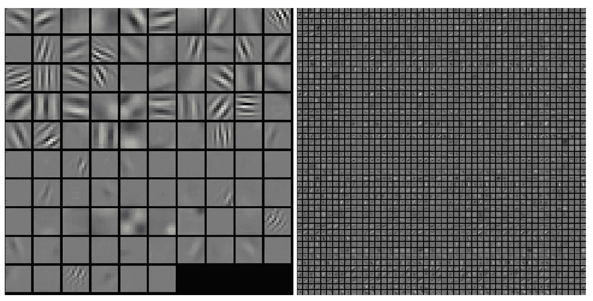
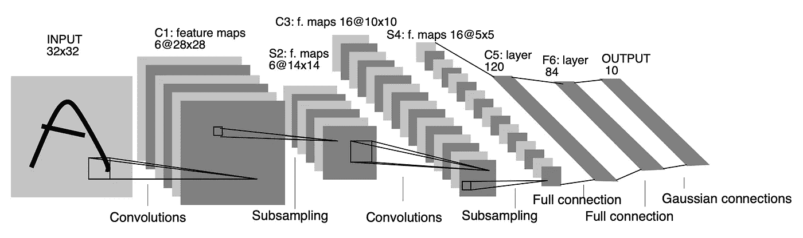

# LeNet-5 述评:如何设计 CNN 的架构

> 原文：<https://towardsdatascience.com/review-of-lenet-5-how-to-design-the-architecture-of-cnn-8ee92ff760ac?source=collection_archive---------51----------------------->

## 整合知识以定制 CNN 的架构

这篇文章是对一篇旧的、困难的、鼓舞人心的论文的评论:**基于梯度的学习应用于文档识别**【1】由 Yann LeCun 作为第一作者。你可以找到这篇论文的许多评论。他们中的大多数只关注卷积神经网络( *CNN* ) LeNet-5 的架构。然而，我想谈谈其他一些有趣的问题:

1.  从反向传播的角度看全局可训练系统的概念
2.  如何在神经网络的设计过程中整合知识

事实上，本文中提到了 2 个网络。第一个是 *CNN* ，名为 LeNet-5，第二个叫图变网络( *GTN* )。在这篇文章中，我只谈论 LeNet-5。

# 1.全球可训练系统

# 什么是全球可培训系统？

一个系统通常包括几个模块。从反向传播的角度来看，如果所有的模块都是可微的，模块之间的连接也是可微的，换句话说，梯度的反向传播可以从末端的损失函数回溯到输入，这是一个全局可训练的系统。有时，我们也称之为机器学习问题的端到端解决方案。

我举个例子:我们想在一个图像中标注所有人脸的性别？第一种解决方案是检测所有人脸的位置，然后用只有一张人脸的子图像进行性别分类。第二种解决方案是创建一个模型，该模型将图像作为输入，输出人脸的定位以及相应的性别。在第一种解决方案中，来自定位的误差影响性别分类的性能。但是如果这两个模块是分开的，我们不能使用性别分类的损失函数来优化定位的性能。在第二种端到端解决方案中，定位和性别检测是全局优化的。

# 全球可培训系统的优势是什么？

如前所述，我们一起优化所有模块。如果我们有足够的数据，相对于非全局可训练系统，该系统可以实现更好的性能。

另一个更重要的优势是:让机器从数据中学习。如果你熟悉 *CNN* ，你大概听说 CNN 的前几个隐层可以学习图像的强局部模式。以下是论文[【2】](https://sheng-fang.github.io/2020-04-19-review_lenet/#2)中的图片 1 中的一些例子。

图 CNN 图层的可视化
一个训练过的 AlexNet 的第一个 CONV 图层(左)和第二个 CONV 图层(右)上的典型滤镜。(来自[https://cs231n.github.io/understanding-cnn/](https://cs231n.github.io/understanding-cnn/)

在传统的解决方案中，我们经常给机器学习模型输入手工设计的特征，如*筛*、*拱*、*等。*借助全球可训练系统，我们可以让数据告诉我们，对于某项任务，哪些是最重要的特征。

# 2.用知识设计 CNN

为了从神经网络中获得自学习特性，我们必须为神经网络设计一个好的结构。Yann LuCun 在他的论文中指出，如果没有关于任务的最少量的先验知识，任何学习技术都不可能成功。….整合知识的一个好方法是根据任务定制架构。现在让我们关注在设计一个 *CNN* 的架构时如何与知识结合。

1962 年，Hubel 和 Wiesel[3]揭示了猫视觉系统中的局部敏感、方向选择性神经元。在局部连接的约束下，神经元可以学习一些基本的视觉特征，这些特征可以在下一个神经元中被重用或分组以形成新的特征。卷积核可以很好地实现感受野的这种约束。

在此之前，我们找到了一个很好的工具——卷积核来模拟局部敏感的方向选择性神经元。那么如何才能克服图像分类的一些常见困难:平移、尺度、畸变不变性。

让我们首先检查人类是如何实现图像分类的。我们可能会这样做:

1.  用一些视觉模式扫描图像，找到一些特征
2.  找出特征之间的关系
3.  在我们大脑的模式数据库中搜索关系模式
4.  找到最相似的一个

为了实现步骤 1，我们可以为同一个特征图固定卷积核的权重，并生成几个特征图。

为了实现步骤 2，我们认为该特征的确切位置不如该特征相对于其他特征的位置重要。因此，我们可以逐步降低空间分辨率(子采样)。然而，当降低图像分辨率时，我们丢失了信息。这就是为什么我们需要增加特征图的数量，尽可能的保留有用的信息。

有了这些知识，我们就有了设计 CNN 的一般原则。

1.  使用卷积核
2.  共享权重
3.  子采样和增加特征图的数量

# 3.LeNet 架构

# 3–1.LeNet-5

图 2:LeNet-5 的架构(来自[http://vision . Stanford . edu/cs 598 _ spring 07/papers/le Cun 98 . pdf](http://vision.stanford.edu/cs598_spring07/papers/Lecun98.pdf))

图 2[1]显示了 *LeNet-5* 的架构。

# 3–2.增强 LeNet-4

*LeNet-4* 是 *LeNet-5* 的简化版。它包含 4 个一级特征图，后面是 16 个子采样图。我们认为 *LeNet-4* 与 *LeNet-5* 相比是一个较弱的分类器。Yann LuCun 将助推技术应用于 *LeNet-4* ，标记为 boosted *LeNet-4* 。boosting 方法达到了比 *LeNet-5* 更好的性能精度。

# 4.其他有趣的地方

在机器学习的研究领域，我们总是提到开发新方法的三个关键方面。Yann LuCun 在他的论文中也提到了这些:

1.  高计算能力的机器成本低
2.  大型数据库可用
3.  强大的机器学习技术是可用的

我们自己的产品也要考虑这些因素。

# 5.结论

在这篇文章中，我分享了我对如何设计神经网络的理解。我相信这对实现和修改一个 *CNN 的实践是有帮助的。*

总而言之:

1.  在开始机器学习项目之前，检查计算能力、可用数据库、技术支持。
2.  一旦项目开始，尽可能多地获取关于项目的先验知识。
3.  利用这些知识来设计您自己的网络。

# 参考

[1] LeCun，Yann and Bottou，Léon and Bengio，Yoshua and Haffner，Patrick *基于梯度的学习应用于文档识别* IEEE，1998

[2] [理解和可视化卷积神经网络](https://cs231n.github.io/understanding-cnn/)

[3] D. H. Hubel，T. N. Wiesel，猫视觉皮层中的感受野、双眼互动和功能结构《生理学杂志》，1962 年