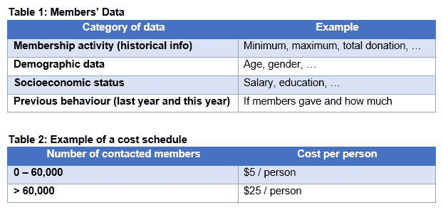
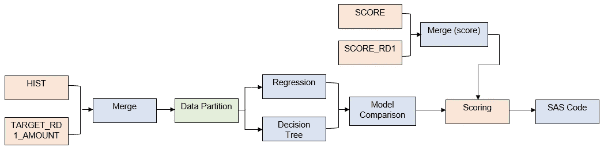
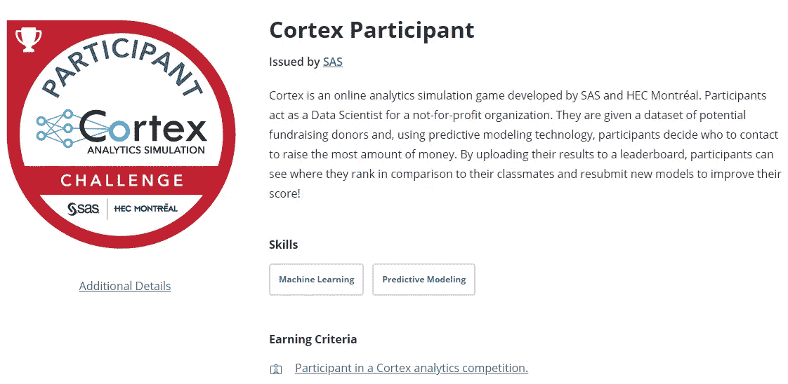

# 回顾:SAS Cortex 分析模拟竞赛

> 原文：<https://towardsdatascience.com/review-sas-cortex-analytics-simulation-competition-ff9f120b8361?source=collection_archive---------39----------------------->

## 借助 SAS Enterprise Miner 了解预测分析

[SAS 和 HEC Montréal 的 Cortex Analytics 模拟](https://www.sas.com/en_au/learn/academic-programs/resources/cortex-analytics-simulation-game.html)

2020 年 4 月底至 5 月初，我参加了由 SAS (ANZ)与 HEC Montréal 合作举办的[Cortex Analytics Simulation](https://www.sas.com/en_au/learn/academic-programs/resources/cortex-analytics-simulation-game.html)竞赛。该比赛面向所有人，特别是学生，他们希望探索预测分析在现实世界中的应用。

我不会对游戏进行过多的描述，因为我不想透露未来比赛的可能答案，但我想说，使用 SAS Enterprise Miner 学习预测分析是一次很好的体验。
如果你遇到了比赛，并想了解更多，这篇文章介绍了游戏场景、说明和我在整个比赛中的个人经历。

## 方案

你正在为一个拥有 100 万会员的非营利慈善组织进行筹款活动。基金会决定在其营销活动清单中增加一项直接联系活动。我们的目标是在给会员打电话的情况下筹集最多的捐款。这将通过使用预测建模软件(SAS Enterprise Miner)来完成，以预测活动中的目标人数和目标人群。

您将获得潜在捐赠者的数据集。您将根据捐赠者以前的行为拟合不同的模型，对捐赠者进行评分以预测今年的捐赠。利用这个结果，决定有多少潜在的捐赠者。上传您的 id 列表，该列表将根据**运营盈余:捐款总额-致电总成本**对提交的 id 进行排名。我创建了一个表格，列出了下面给出的一些信息。

表 1:列出了一些变量，表 2:联系成员的成本

## 每日网络研讨会和说明

由于这是一个介绍性的比赛，参与者将获得详细的游戏说明，并可以参加每天 1 小时的网络研讨会(由 SAS 提供)。
这些网络研讨会包括讲解说明的演示和问答环节。我们有两种不同的建模方法:

1.  **“1 阶段建模”**:一个简单的模型，根据捐赠者的预计捐赠金额对其进行评分。
2.  **“两阶段建模”**:一个更复杂的模型，既考虑了给予的概率(接触与否)又考虑了预测金额。

当然，两阶段建模过程更有效。它通常被称为**提升**建模，其中提升是通过计算预测金额之间的差异来计算的，该差异考虑了联系或不联系某人时的捐赠概率。

我强烈建议您参加这些网络研讨会，因为它们有助于您更好地浏览 SAS Enterprise Miner，学习不同的建模技术，并提出您可能有的任何问题。

## 竞争

竞赛是通过 SAS 虚拟机/实验室完成的。你有总共 20 个小时的时间在 5 天内测试不同的模型并上传你的结果。因为它是在云中的一个虚拟机上，所以你需要预订，这需要大约 25 分钟的启动时间。你提交答案的次数也有限制(大约 30 次)。
在比赛期间，你的目标是测试不同类型的机器学习模型，以预测概率或捐款金额。SAS Enterprise Miner 的布局一开始可能会很吓人，这就是为什么最好按照网上研讨会的说明进行操作。

SAS Enterprise Miner 使用一个简单的拖放系统，您可以添加不同的节点并将它们连接到其他节点。这使得学习如何使用软件和测试新模型变得很容易。图的大部分已经为您完成，您的主要任务是测试不同的模型并调整它们的属性。
一些模型包括决策树、回归、神经网络和梯度推进。他们还拥有高性能(HP)数据挖掘节点，这些节点使用了传统方法中没有使用的几种技术(这些可能需要更长的运行时间)。您将花费大部分时间放置不同的模型，并放置模型比较节点来检查哪个模型执行得最好(平均平方误差最低)。

图表流程(类似于 SAS Enterprise Miner)

上面显示了我在 SAS Enterprise Miner 中创建的一般图表:

1.  *初始数据准备*:合并数据。
2.  *数据分区*:数据被分成训练集和验证集。
3.  *建模*:添加不同的模型，修改其属性(这里我们展示的是回归和决策树)。如果您使用复杂的模型(比如 HP 节点)，这个阶段可能需要几分钟甚至几个小时。
4.  *型号对比*:对比各型号并显示其性能。
5.  *评分数据准备*:根据使用的模型对新数据进行评分。
6.  *SAS 代码*:将预测导出到 Excel 文件。

收到 Excel 文件输出后，您的工作是对数据进行排序，收集您想要使用的 id 数，并提交结果。你会马上看到你提交的潜在捐赠者名单的表现。

我发现特别有用的是，看看竞争中的其他参与者瞄准了多少捐助者，这样你就可以知道你可能收集到多少钱。您大部分时间都在摆弄不同的模型，所以最好添加不同的模型变体来找到性能最佳的模型。例如，您可以使用逻辑回归代替线性回归，或者增加决策树的复杂性。您可以尝试的其他方法是移除或转换变量。

## 结论

最终，我在比赛中获得了第三名，与 1000 澳元的最高奖金失之交臂。我认为，如果您想更多地了解 SAS Enterprise Miner 以及如何将其用于预测分析，参加 SAS Cortex Analytics 模拟竞赛可能是一个很好的开始。尽管你必须付费才能参加比赛，但如果你错过了第一名，你可以在网上(或通过面试)分享你的经验，并在 [Acclaim](https://www.youracclaim.com/) 上展示你的参与者徽章。

我的[皮层参与者](https://www.youracclaim.com/badges/1a7841d1-5932-468b-b2ab-bb9a4408c34c)徽章发出喝彩

感谢阅读！

欢迎在 [LinkedIn](https://www.linkedin.com/in/harryngo19/) 上联系我，或者在 [Medium](https://medium.com/@harryngo) 上关注我。我希望发布更多与数据科学相关的内容。