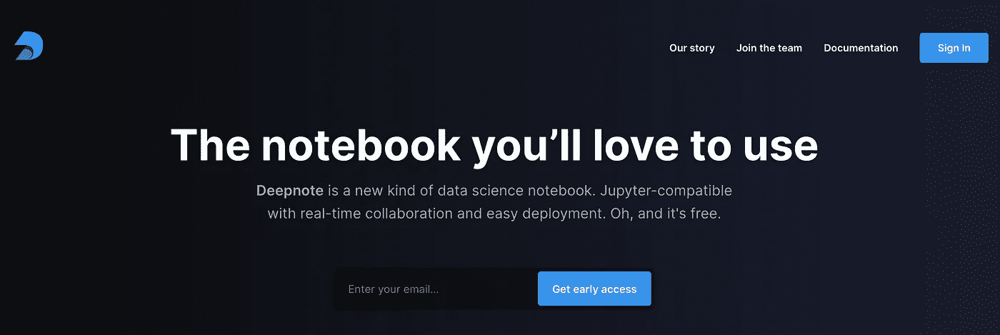
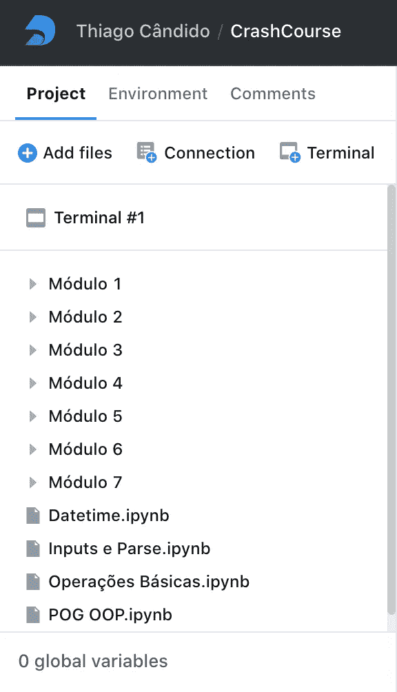
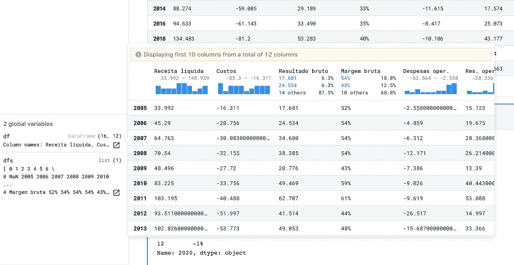
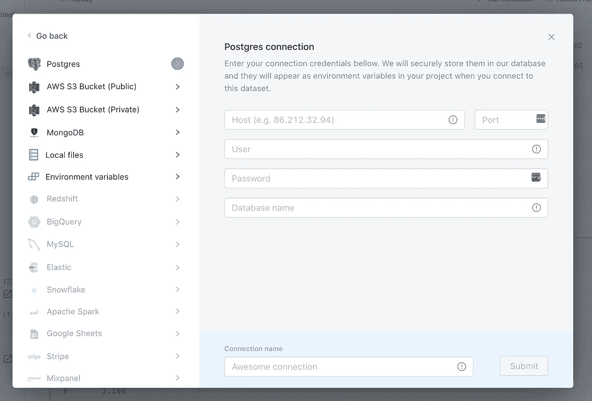
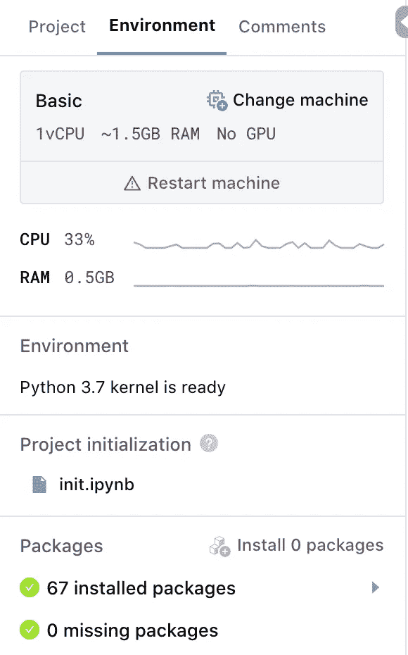
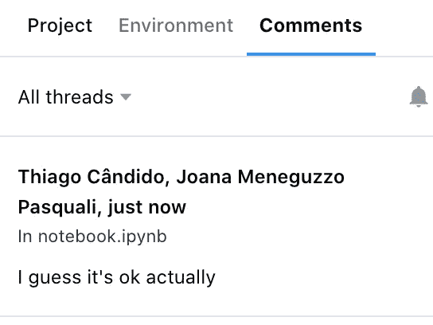
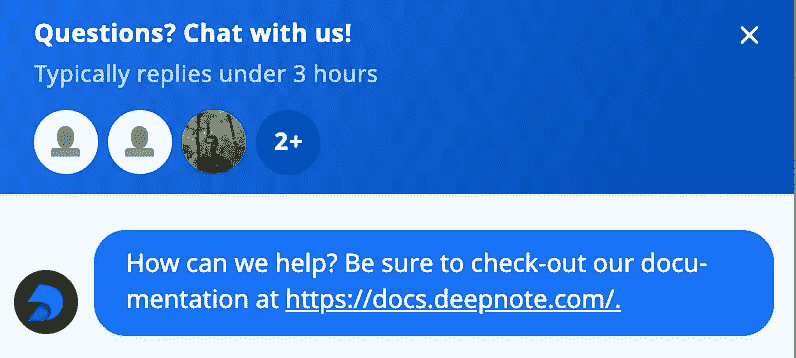

# 回顾 Deepnote——数据科学家的新 IDE

> 原文：<https://towardsdatascience.com/reviewing-deepnote-the-new-ide-for-data-scientists-90c3464ebc5e?source=collection_archive---------28----------------------->

## 使用 Deepnote 开发 Python 课程后的感想

> 声明:我绝不隶属于 Deepnote 或其任何成员。

[Deepnote](https://deepnote.com/) 是一个**的免费在线数据科学笔记本**，主要关注协作(实时、谷歌文档、协作类型)和所有概念的抽象，以及妨碍*工作*的工作——环境和基础设施设置。

这家初创公司最近宣布，它筹集了 380 万美元的种子资金，由 Index Ventures 牵头，包括 Greg Brockman 和 Naval Ravikant 等天使投资人。

看了 TC 的公告后，我很想试一试。我报了内测，耐心站了五个(！)几天后，我收到了邀请函。

我登录了，在平台上折腾了大约一个小时，尝试了一些示例项目，仅此而已。

Deepnote 的示例项目

几个月后，我一位在金融行业工作的好朋友 Rodrigo Tadewald 邀请我共同创建一个主要使用 Python 的在线课程。我很可能会负责本课程的环境设置/编程/性能方面的主题。

我非常高兴地接受了邀请，因为我对金融话题非常感兴趣，而且从未制作过在线课程。然后我有了尝试 Deepnote 的想法，并开始用它开发所有的 Python 课程笔记本。

> 声明:我主要使用了 [Brave 浏览器](http://brave.com/)，仅使用其他浏览器来验证它何时出现一些奇怪的行为(Brave 浏览器运行在 Chromium 引擎上)。在项目开发过程中，我也曾交替使用 OSX、Ubuntu 和 Windows 机器。

# **体验**

为了开始这个项目，我上传了一些我以前在现场课程中用过的旧笔记本，然后开始创建这个项目。Deepnote 还提供了从 [GitHub](https://github.com/) 和 [GitLab](https://gitlab.com/) 导入存储库的选项，使得设置变得非常容易。

随着我对这个平台越来越熟悉，CTRL/⌘ + P 成了我做事的主要方式。

指挥托盘

它可以很好地执行截图中的命令，但它的查询功能并不能让我 100%满意。我在文件夹中查找文件时遇到了一些问题，这真的很痛苦，因为我的项目主要是用文件夹和子文件夹来组织的。

在 ***项目*** 选项卡中可以看到您的项目文件，添加新文件，添加数据连接，以及访问终端。

Deepnote 的侧边导航，带有标签和可变浏览器(以及葡萄牙语的课程迷你剧透:)

**笔记本本身还是挺有意思的，有一些很酷的功能。我真的很高兴看到减价备忘单很容易找到。**

IDE 可以自动检测模块，您可以轻松地动态安装`pip`包。如果您使用`!pip`命令，Deepnote 会将它保存在一个隐藏文件中，并在每次环境启动时安装它。您也可以选择创建一个`requirements.txt`文件，并通过 ***终端*** 与之交互

变量资源管理器是一个很好的特性，它已经集成了一些度量标准，真的给了它一个很好的触感。

变量浏览器中的熊猫数据框

***代码智能*** 特性，比如自动完成和定位定义，在当前的测试版中表现不佳。

> 改进:在我的项目开发过程中，我注意到一件重要的事情，那就是文件浏览器的性能有了显著的提高。由于我上传了很多文件，我需要将它们组织到文件夹中，几周前，在文件夹和子文件夹中移动文件是一种非常落后的体验。自 2020 年 4 月左右球场开始开发以来，这种情况有了很大的改善。不错！

在一些课程模块中，我需要处理数据。不是巨大的数据集，但足够大，如果我不得不重新上传到平台上，我会不高兴。Deepnote 有一些集成的数据集，如 Landsat 8 和 Goodreads books，但对于我的项目，我需要使用我已经准备好的自定义数据集。

**此外，除了从您的本地系统**上传文件之外，还有一种方法可以集成(至少在我的 beta 帐户上) [**AWS S3**](https://aws.amazon.com/pt/s3/) **，**[**MongoDB**](https://www.mongodb.com/)**和**[**Postgres**](https://www.postgresql.org/)**。有很多“灰色”的选项，但我想念 [Azure storage](https://azure.microsoft.com/en-us/services/storage/) 和 [Google Drive](https://www.google.com/intl/en-US_ALL/drive/) 的集成，主要是因为对于 [Google Colab](https://colab.research.google.com/) 用户来说，随便尝试 Deepnote 肯定会少很多麻烦。**

创建与 IDE 的新连接

在设置好数据连接之后，我用 ***终端*** 做了一点小改动，它给了你对机器的完全根访问权限，但是我并不认为这个项目需要它。我想我唯一一次跑到终端是在 Deepnote 内核进入重启循环的时候，我试图用一些 bash 命令修复它。

转到 ***环境*** 标签，你可以选择机器配置，重启它，查看 CPU 和 RAM 的使用情况，检查你的项目所依赖的包。

免费提供的机器配置如下:

*   **基本** —英特尔 Haswell 1vCPU ~1.5GB RAM 无 GPU
*   **Pro** —英特尔 Haswell 2vCPU ~5GB RAM 无 GPU

还有一种**性能**配置，可根据要求提供:

*   **性能** —英特尔 Haswell 4vCPU ~12GB RAM T4 GPU

最后但同样重要的是还有 ***评论*** 标签。Deepnote 上的通信功能非常先进，虽然这个课程主要是一个单独的项目，但有时我会友好地请求一个朋友查看它的一些笔记本，我没有失望。

我们可以进行代码评审的实时会议，并与注释进行异步交互。这为数据科学家在异步或同步时间表上一起远程工作提供了很大的优势。**远胜于我在其他笔记本平台上的任何其他协作体验。**

# 结论

Deepnote 已经解决了成为数据科学团队首选 IDE 的挑战，与一些非常好的和已经建立的替代产品竞争。

它的核心优势是以协作为中心的方法，这种方法脱颖而出，为数据科学家提供了真正的 Google Docs 体验。

我敢肯定“看起来很有趣”的功能目前正在被团队修复，一些功能的实现，如版本控制、团队、仪表板和笔记本的 API 共享，也正在进行中。

如果你对这个平台感兴趣，我建议你尝试一个项目，在这个项目中，协作是关键，也许是和你的一些朋友或同事。这样，你就可以提取平台提供的真正价值。

如果您是 Python 或笔记本环境初学者，Deepnote 是一个非常容易的入门方式。

对于数据科学团队，我会鼓励他们在新项目中使用它，并与 Deepnote 人员保持联系。你可以使用集成的聊天工具与团队交流，这很有帮助(因为它是测试版，所以它有*测试版*的功能:)

> **我会定期更新这个帖子，回顾新的功能，所以实际上我在这里写的很多东西将来都可以改变。**

我希望你喜欢阅读这篇文章。

*如果你有，考虑在*[*Twitter*](https://twitter.com/ogaihtcandido)*上关注我。*

谢谢你的时间。保重，继续编码！