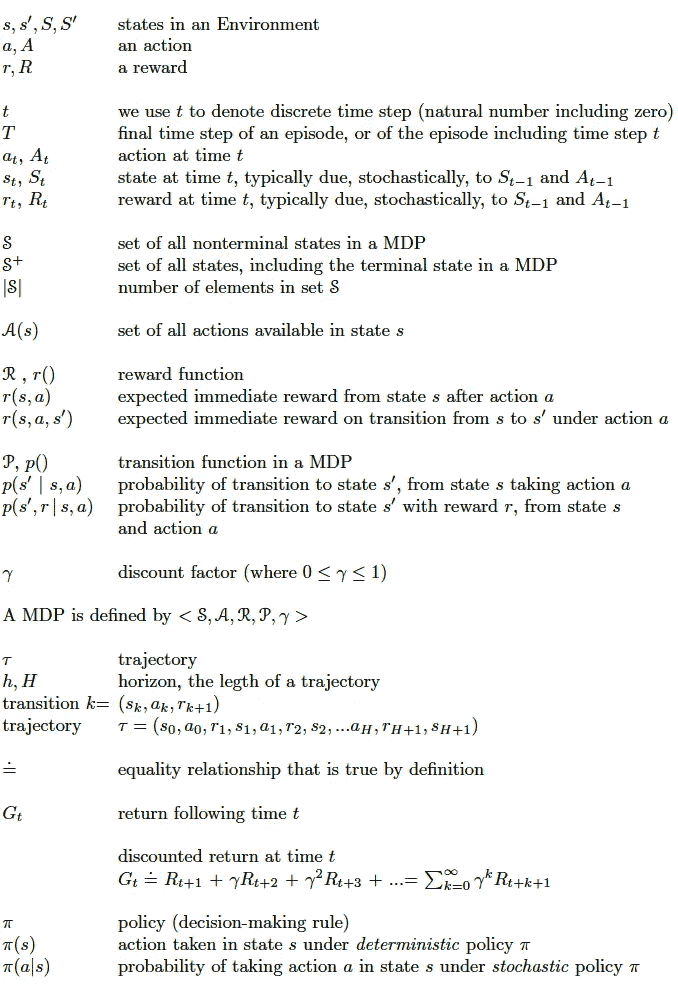
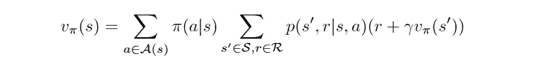
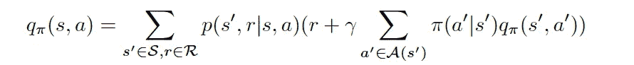
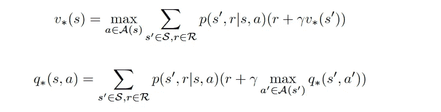

# 复习基本概念

> 原文：<https://towardsdatascience.com/reviewing-essential-concepts-from-part-1-e28234ee7f4f?source=collection_archive---------32----------------------->

## [深度强化学习讲解— 12](https://towardsdatascience.com/tagged/deep-r-l-explained)

## 数学符号已更新

这篇文章是*[*深度强化学习讲解*](/value-iteration-for-q-function-ac9e508d85bd)*系列的新部分的序言，在这里我们将介绍强化学习经典方法的实现，如蒙特卡罗、SARSA 或 Q-learning 等。在本帖中，我们将回顾和更新以前帖子中介绍的数学符号。**

> **[本出版物的西班牙语版本](https://medium.com/aprendizaje-por-refuerzo/3-funciones-de-valor-y-la-ecuaci%C3%B3n-de-bellman-7b0ebfac2be1)**

** [## 3.英勇勋章和贝尔曼勋章

### 访问第 3 页的自由介绍

medium.com](https://medium.com/aprendizaje-por-refuerzo/3-funciones-de-valor-y-la-ecuaci%C3%B3n-de-bellman-7b0ebfac2be1) 

# 数学符号复习

在[帖子 2](/drl-02-formalization-of-a-reinforcement-learning-problem-108b52ebfd9a) 中，我们已经看到，我们可以使用马尔可夫决策过程(MDP)作为我们希望通过强化学习来解决的问题的正式定义。MDP 由 5 个参数 ***< S，A，R，p，γ >，*** 定义，其中每个参数表示:

*   *—一组状态*
*   ****一个*** —一组动作*
*   ****R*** —奖励功能*
*   ****p*** —过渡函数*
*   ****γ*** —贴现因子*

> *请记住，我们倾向于使用理查德·萨顿和安德鲁·g·巴尔托所著的教科书 [**强化学习:导论**](http://www.incompleteideas.net/book/the-book-2nd.html) 中的符号。这本书是一个优秀的强化学习基础介绍的经典文本。*

*我们在以前的文章中介绍的主要定义和数学符号是:*

**

# *连续任务的折扣率*

*在继续之前，让我们简单地补充一下贴现率在一个**连续任务**中的表现，这在以前的帖子中没有涉及。*

## *继续任务示例*

*在本系列的第 1 部分中，我们使用了一个临时任务，即[冰湖](https://gym.openai.com/envs/FrozenLake-v0/)环境，这是一个来自 [OpenAI Gym](https://gym.openai.com/) 的简单网格世界环境，是一个用于开发和比较 RL 算法的工具包。在这一节中，我们将使用另一个环境介绍一个持续的任务，即[车杆平衡问题](https://gym.openai.com/envs/CartPole-v0):*

**

*使用角度和角速度的车杆平衡([来源](https://medium.com/@tuzzer/cart-pole-balancing-with-q-learning-b54c6068d947))*

*如前图所示，一辆手推车沿水平轴放置在无摩擦的轨道上，一根柱子固定在手推车的顶部。目标是通过向左或向右移动小车来防止杆倒下，并且不要从轨道上掉下来。*

*通过对手推车施加+1(左)或-1(右)的力来控制该系统。钟摆开始直立，目标是防止它翻倒。柱子保持直立的每个时间步提供+1 的奖励，包括该集的最后一步。当柱子偏离垂直方向超过 15 度，或者手推车偏离中心超过 2.4 个单位时，该集结束。*

*该环境在每个时间点的观察空间是 4 个数字的阵列。在每个时间步，你可以观察它的位置，速度，角度和角速度。这些是这个世界的可观察状态。您可以在本文档的[中查找这些数字的含义。请注意小车速度和尖端极点速度的最小值(-Inf)和最大值(Inf)。由于数组中对应于每个索引的条目可以是任何实数，这意味着状态空间是无限的！](https://github.com/openai/gym/wiki/CartPole-v0)*

*在任何状态下，小车只有两种可能的动作:*向左移动*或*向右移动*。换句话说，车极点的状态空间有四维连续值，而动作空间有一维两个离散值。*

## *贴现率*

*在我们继续任务的例子中，哪个贴现率会鼓励代理尽可能长时间地保持极点平衡？*

*在任何贴现率 *γ > 0 的情况下，*代理人在极点尚未倒下的每个时间步获得正奖励。因此，代理将尽可能长时间地保持极点平衡。*

*然而，想象一下，奖励信号被修改为仅在一集结束时给代理人奖励。换句话说，除了最后一个时间步，当剧集结束时，每个时间步的奖励都是 0，然后代理人获得+1 的奖励。*

*在这种情况下，如果折扣率为 *γ=* 1，代理人将总是获得+1 的奖励(无论它在该集期间选择什么行动)，因此奖励信号不会向代理人提供任何有用的反馈。*

*如果折扣率为 *γ* < 1，代理将尝试尽快终止该集(通过快速放下杆或离开轨道边缘)。因此，在这种情况下，我们必须重新设计奖励信号！*

*这个问题的解决方案是由策略决定的，这意味着为了追求一个目标，代理需要学习一系列的动作。在下一节中，我们将进一步讨论这个问题解决方案的正式定义。*

# *政策*

***策略**是代理用来基于当前状态确定下一个动作的策略(例如，一些规则集)。一般用**【𝜋(𝑎|𝑠】、**希腊字母 pi 表示，一个策略是决定下一个动作*采取给定状态*。***

***最简单的策略是从环境状态集*到可能动作集*的映射。我们称这种策略为**确定性策略**。但是在第二篇文章中，我们也介绍了𝜋(𝑎|𝑠政策可以被定义为概率，而不是具体的行动。换句话说，这是一个**随机策略**，它对代理在给定状态下可以采取的行动有一个概率分布。*****

***随机策略将允许代理随机选择行动。更正式地说，我们将随机策略定义为接受环境状态*和动作*并返回代理在状态 S:*****

******

***在学习过程中，随着代理获得更多的经验，策略𝜋可能会改变。例如，代理可以从随机策略开始，其中所有动作的概率是一致的；与此同时，代理将有希望学会优化其策略，以达到最优策略。***

***现在我们知道了如何指定一个策略，我们可以采取什么步骤来确保代理的策略是最好的？我们将使用在第二篇文章中已经介绍过的状态值函数和动作值函数。***

## ***价值函数***

*****状态-价值函数**，也被称为**价值函数**，甚至是 **V 函数**，衡量每个状态的好坏，它告诉我们如果我们从那个状态开始，我们未来可以预期的总回报。***

***对于每个状态 ***s*** ，状态值函数告诉我们期望的贴现回报 ***G*** ，如果代理在该状态 s 开始，然后使用策略为所有时间步骤选择其动作。重要的是要注意，状态值函数将总是对应于特定的策略，所以如果我们改变策略，我们改变状态值函数。出于这个原因，我们通常用小写的 ***v*** 来表示函数，在下标中用相应的策略 **𝜋** 来表示，并正式定义为:***

****

**其中𝔼[ ]表示给定代理遵循策略 **𝜋** 时随机变量的期望值，而 *t* 是任意时间步长。正如我们在第 8 篇文章中介绍的，它用于𝔼[.的预期因为环境转移函数可能以随机的方式起作用。**

**同样在 [post 2](/drl-02-formalization-of-a-reinforcement-learning-problem-108b52ebfd9a) 中，我们将状态-值函数的定义扩展到状态-动作对，为每个状态-动作对定义一个值，这被称为**动作-值函数，**也被称为**Q-函数**或简称为 **Q.** 它定义了在一个策略**下，在状态*中采取动作*的值******

******

> ***在整个系列中，我们将交替使用值函数的大写或小写符号:*或 ***v(s)*** 和 ***Q(s，a)*** 或 ***q(s，a)*******

## ****贝尔曼期望方程****

****对于一个一般的 MDP，我们必须根据一个*期望*来工作，因为直接的回报和下一个状态很难被确定地预测。的确，我们在前面的帖子里看到，奖励 *r* 和下一个状态**s’**都是根据 MDP 的单步动态来选择的。在这种情况下，当从(条件)概率分布**p(*s’，r* ∣ *s，a* )** 中得出 *r* 和 *s* 时，**贝尔曼期望方程**根据*期望的*即时报酬和*期望的*来表达任意状态 *s* 的值****

***对于一般情况，当代理的策略 *π* 为**随机**时，代理在状态 *s* 时以概率*π*(*a*∣*s*)选择行动 *a* ，贝尔曼期望方程可以表示为:***

******

***在这种情况下，我们把下一个状态的奖励和贴现值之和(*r*+*γvπ*(*s*’)乘以其对应的概率*π*(*a*∣*s*)*p*(*s【t57’，*r*∣*s*****

**我们还有作用值函数的贝尔曼方程:**

****

## **最优策略**

**代理人的目标是在长期内最大化总的累积报酬。使总累积报酬最大化的策略称为**最优策略**。在第 8 篇文章中，我们介绍了“最优”价值函数。**

**当且仅当对于所有的 *s* ∈S，*vπ*′(*s*)≥*vπ*(*s*)时，策略 *π* 被定义为优于或等于策略 *π* 最优策略肯定存在，但可能不是唯一的。**

**所有最优政策都有相同的状态值函数***v*∑**，称为**最优状态值函数**。最佳状态值函数的更正式的定义可以是:**

****

**对于动作值函数:**

****

**所有最优政策都有相同的行动价值函数***q*∑**，称为**最优行动价值函数**。**

**这种最优行动值对于获得最优策略非常有用。代理通过与环境交互来估计它。一旦代理确定了最优动作值函数*q*∫，它可以通过设置以下参数快速获得最优策略*π*∫:**

****

**正如我们在第 8 篇文章[中看到的，贝尔曼方程用于在算法中找到价值函数的最优值来计算它们。更正式的表达可以是:](/the-bellman-equation-59258a0d3fa7)**

****

# **下一步是什么？**

**我们已经到达这篇文章的结尾了！。[在接下来的](/monte-carlo-methods-9b289f030c2e)这篇文章中，我们将介绍蒙特卡罗方法，这是一种估计价值函数和发现最优策略的学习方法。**

**下期[见](/monte-carlo-methods-9b289f030c2e)！**** 

# **深度强化学习讲解系列**

****由** [**UPC 巴塞罗那理工大学**](https://www.upc.edu/en) **和** [**巴塞罗那超级计算中心**](https://www.bsc.es/)**

**一个轻松的介绍性[系列](https://torres.ai/deep-reinforcement-learning-explained-series/)以一种实用的方式逐渐向读者介绍这项令人兴奋的技术，它是人工智能领域最新突破性进展的真正推动者。**

** [## 深度强化学习解释-乔迪托雷斯。人工智能

### 本系列的内容](https://torres.ai/deep-reinforcement-learning-explained-series/) 

# 关于这个系列

我在五月开始写这个系列，在巴塞罗那的**封锁期。**老实说，由于封锁，在业余时间写这些帖子帮助了我 [**#StayAtHome**](https://twitter.com/hashtag/StayAtHome?src=hashtag_click) 。感谢您当年阅读这份刊物；它证明了我所做的努力。

**免责声明** —这些帖子是在巴塞罗纳封锁期间写的，目的是分散个人注意力和传播科学知识，以防对某人有所帮助，但不是为了成为 DRL 地区的学术参考文献。如果读者需要更严谨的文档，本系列的最后一篇文章提供了大量的学术资源和书籍供读者参考。作者意识到这一系列的帖子可能包含一些错误，如果目的是一个学术文件，则需要对英文文本进行修订以改进它。但是，尽管作者想提高内容的数量和质量，他的职业承诺并没有留给他这样做的自由时间。然而，作者同意提炼所有那些读者可以尽快报告的错误。**