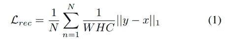

# 深层图像修复的修订与回顾:基于生成式对抗网络的图像修补

> 原文：<https://towardsdatascience.com/revision-for-deep-image-inpainting-and-review-patch-based-image-inpainting-with-generative-4197d29c5468?source=collection_archive---------18----------------------->

欢迎回来的家伙:)今天，我想给一个修订的深层图像修复，我们已经谈到目前为止。还有，想再复习一篇图像修复的论文，巩固深度图像修复的知识。让我们一起学习和享受吧！

# 回忆

在这里，让我们首先简单回顾一下我们从以前的帖子中学到了什么。

**上下文编码器(CE)**【1】是文献中第一个**基于 GAN 的修复算法**。它强调理解整个图像的上下文对于修复任务的**重要性，并且**(通道方式)全连接层**用于实现这样的功能。详情可以点击[此处](https://medium.com/analytics-vidhya/introduction-to-generative-models-for-image-inpainting-and-review-context-encoders-13e48df30244)链接往期帖子。**

**多尺度神经面片合成(MNPS)**【2】可以看作是 CE 的改进版。它由两个网络组成，即内容网络和纹理网络。内容网络是 CE，纹理网络是用于对象分类任务的预训练的 VGG-19。使用纹理网络的想法来自于最近神经风格转移的成功。简单地说，用于高级视觉任务(例如物体分类)的预训练网络中的神经响应包含关于图像风格的信息。通过鼓励缺失区域内外类似的神经反应，我们可以进一步增强生成像素的纹理细节，从而使完成的图像看起来更真实。强烈建议感兴趣的读者在此浏览帖子[了解详情。](https://medium.com/analytics-vidhya/review-high-resolution-image-inpainting-using-multi-scale-neural-patch-synthesis-4bbda21aa5bc)

**全局和局部一致图像补全(GL CIC)**【3】是深度图像修复任务中的一个里程碑。作者采用全卷积网络(FCN)和扩展卷积(DilatedConv)作为他们提出的模型的框架。FCN 允许各种输入大小和 DilatedConv 取代(通道方式)完全连接层，用于了解整个图像的背景。此外，两个鉴别器用于在两个尺度上区分完整图像和真实图像。全局鉴别器查看整个图像，而局部鉴别器关注局部填充的图像块。我强烈推荐读者在这里看一看帖子，尤其是 CNN 中的扩张卷积。

今天，我们将回顾这篇论文，基于生成性对抗网络的图像修补[4]。这可以看作是 GLCIC 的一种变体，因此我们可以对这种典型的网络结构做一些修改。

# 动机

本文作者希望利用剩余连接和 PatchGAN 鉴别器的优势来进一步改善他们的修复效果。

用于图像识别的深度残差学习([ResNet](https://arxiv.org/abs/1512.03385))【5】在深度学习方面取得了显著的成功。通过使用残差块(残差连接)，我们能够训练非常深的网络，许多论文已经表明残差学习对于获得更好的结果是有用的。

PatchGAN [6]在图像到图像的翻译方面也取得了巨大的成功。**与典型 GAN 中的鉴别器相比，PatchGAN 鉴别器(参见下面的图 1)输出一个矩阵(2d 阵列),而不仅仅是单个值。**简单来说，典型 GAN 鉴频器的输出是从 0 到 1 的单一值。这意味着鉴别器查看整个图像并决定这个图像是真的还是假的。如果图像是真实的，它应该给 1。如果图像是假的(即生成的图像)，它应该给 0。这个公式关注于整个图像，因此图像的局部纹理细节可能被忽略。另一方面，PatchGAN 鉴别器的输出是一个矩阵，该矩阵中的每个元素的范围从 0 到 1。注意，每个元素代表输入图像中的一个局部区域，如图 1 所示。因此，这一次，鉴别器查看多个局部图像块，并且必须判断每个块是否是真实的。通过这样做，可以增强生成的图像的局部纹理细节。这就是 PatchGAN 被广泛用于图像生成任务的原因。

图一。PatchGAN 鉴别器。输出是矩阵，矩阵中的每个元素代表输入图像中的局部区域。如果局部区域是真实的，我们应该得到 1，否则 0。摘自[4]

# 介绍

图像修复可以看作是一种图像生成任务。我们希望填充图像中的缺失区域(即生成缺失的像素)，以使图像完整且看起来逼真。

为了生成逼真的图像，GAN 通常用于不同的图像生成任务，包括图像修复。典型的 GAN 鉴别器查看整个图像，仅通过单个值[0，1]来判断输入是否真实。这种 GAN 鉴别器在本文中称为全局 GAN (G-GAN)。

另一方面，PatchGAN 查看输入中的多个局部区域，并独立决定每个局部区域的真实度，如前一节所述。研究人员已经表明，使用 PatchGAN 可以通过关注更多的局部纹理细节来进一步提高生成图像的视觉质量。

# 解决方案(简而言之)

*   在生成器中使用了具有扩展卷积的残差块(**扩展残差块**)。(作者期望通过使用残差学习可以增强修复结果)
*   **patch GAN 和 G-GAN 鉴别器的混合(PGGAN)** 被提出以鼓励输出的完整图像应该是全局和局部逼真的。(与 GLCIC 中的意图相同，使用两个鉴别器，一个全局的，一个局部的)

# 贡献

*   **patch GAN 和 G-GAN 鉴别器的组合(PGGAN)** 其中早期卷积层被共享。他们的实验结果表明，它能进一步增强生成像素的局部纹理细节。
*   **扩张和插值卷积**用于发生器网络。通过使用**膨胀的残余块**，修复结果得到了改善。

# 方法

图二。提出的生成 ResNet 结构和 PGGAN 鉴别器。摘自[4]

图 3。全球土地信息中心的拟议结构。摘自[3]

图 2 和图 3 分别显示了本文和 GLCIC 提出的网络结构。很明显，它们是相似的。两个主要区别在于:I)发生器中使用了膨胀的残差块； **ii)修改 GLCIC 中的全局和局部鉴别器。**

在 GLCIC 中，全局鉴别器将整个图像作为输入，而局部鉴别器将填充区域周围的子图像作为输入。将两个鉴别器的输出连接起来，然后返回一个值，以显示输入是真的还是假的(**一次不利损失**)。从这个角度来看，局部鉴别器将集中在局部填充的图像补片上，因此可以增强填充补片的局部纹理细节。一个主要缺点是**局部鉴别器的输入依赖于缺失区域**并且作者在训练期间假设单一矩形缺失区域。

对于 PGGAN 鉴别器，我们有几个**早期共享卷积层**如图 2 所示。然后，我们有**两个分支**，一个给出单个值作为输出(G-GAN)，一个给出矩阵作为输出(PatchGAN)。请注意，1×256 是 16×16 矩阵的变形版本。如上所述，这也是一种让鉴别器在区分完整图像和真实图像时同时关注全局(整个图像)和局部(局部图像小块)信息的方式。请注意，我们将有两个不利的损失，因为在这种情况下我们有两个分支。

# 扩张的残余阻滞

在我之前的文章中，我已经介绍了 CNN 中的扩张卷积。简单回忆一下，**通过跳过连续的空间位置**，扩大的卷积增加了感受野而没有增加额外的参数。对于忘记这个概念的读者，请随意先重温一下[我之前的帖子](/a-milestone-in-deep-image-inpainting-review-globally-and-locally-consistent-image-completion-505413c300df)。

图 4。剩余块类型。自上而下:标准残余阻滞，先有扩张回旋的扩张残余阻滞，后有扩张回旋的扩张残余阻滞。摘自[4]

图 4 示出了不同类型的残差块。为了便于我们的进一步讨论，我将简要介绍图 4 顶部所示的一个基本残差块。

简单地说，残差块可以公式化为 Y = X + F(X)，其中 Y 是输出，X 是输入，F 是几层的序列。在图 4 的基本剩余块中，F 是 conv-诺姆-雷鲁-Conv。这意味着我们将 X 馈送到一个卷积层，然后是归一化层、ReLU 激活层，最后是另一个卷积层，以获得 F(X)。一个要点是输入 X 直接加到输出 Y 上，这就是我们称之为跳过连接的原因。由于沿此路径没有任何可训练参数，我们可以确保在反向传播期间必须有足够的梯度传递到早期层。因此，我们可以训练非常深的网络，而不会遇到梯度消失的问题。

# 为什么是残块？

你可能想知道使用剩余块的好处。你们有些人可能已经知道答案了。下面我来说说我的看法。

我们来比较一下 Y = X + F(X)和 Y = F(X)。对于 Y = X + F(X)，我们实际学到的是 **F(X) = Y - X，Y 和 X 的差，这就是所谓的剩余学习，X 可以作为剩余学习的参考。**另一方面，对于 Y = F(X)，我们直接学习将输入 X 映射到输出 Y，无需参考。所以，人们认为剩余学习相对容易。更重要的是，很多论文都表明，残差学习可以带来更好的效果！

由于扩展卷积有助于增加感受野，而感受野对于修复任务非常重要，因此作者用扩展卷积层替换了两个标准卷积层中的一个，如图 4 所示。有两种类型的扩张残余阻滞， **i)首先放置扩张的回旋**和 **ii)其次放置扩张的回旋**。在本文中，基于所采用的膨胀的残余块的数量，膨胀率从 1 开始增加两倍。例如，如果有 4 个膨胀的残余块，膨胀率将是 1、2、4、8。

# 插值卷积

为了解决由标准反卷积(即转置卷积)引起的伪影，作者在这项工作中采用了插值卷积。对于插值卷积，首先使用双线性和双三次插值等典型插值方法将输入**调整到所需大小。**然后，应用标准卷积**。下图 5 显示了转置卷积和插值卷积之间的差异。**

图 5。使用转置卷积(上)和插值卷积(下)获得的结果的视觉比较。摘自[4]

在我看来，这两种卷积都有相似的性能。有时候转置卷积更好，有时候插值卷积更好。

# 鉴别器网络

我们已经讨论了本文中使用的 PGGAN 鉴别器。这里，回想一下，鉴别器有两个分支，一个分支给出单个值，就像 global-GAN (G-GAN)一样，另一个分支给出 256 个值，其中每个值表示输入中局部区域的真实度。

> 关注输入中多个局部区域的真实性有助于改善完整图像的局部纹理细节。

# 目标函数

实际上，本文中使用的损失函数(即目标函数)或多或少与我们以前覆盖的论文相同。

**重建损失**:该损失是为了保证逐像素重建精度。对于这种损失，我们通常采用 L1 或 L2(欧几里得)距离。本文使用 **L1 损失**作为它们的重建损失，

*N* 是训练批次中图像的数量。 *W* 、 *H* 和 *C* 是训练图像的宽度、高度和通道。 *x* 和 *y* 是模型给出的地面真实和完整图像。

对抗性损失:我想你们大多数人现在都很熟悉这种典型的对抗性损失。

*x* 是地面真值，所以我们要 *D* ( *x* )返回 1，否则 0。注意 *D* 只是鉴别器的函数形式。

**关节损失**:

等式 3 是它们的联合损失函数。λ1，2，3 用于平衡每个损失的重要性。 *g_adv* 表示全局分支给出的输出，而 *p_adv* 表示 PatchGAN 分支给出的输出。注意，在它们的实验中，λ1、2、3 分别被设置为 0.995、0.0025 和 0.0025。

# 实验结果

在他们的实验中使用了三个数据集。 **i)** **巴黎街景**【7】包含 14900 张训练图像和 100 张测试图像。 **ii)** **谷歌街景**有 62058 张高分辨率图片，分为 10 个部分。第一和第十部分用于测试，第九部分用于验证，其余部分用于训练。总共有 46，200 个训练图像。 **iii)** **地点**由超过 800 万张训练图像组成。该数据集仅用于测试，以显示概化能力。

为了比较典型残余块和扩张残余块的性能，作者训练了两个模型，即 **PGGAN-Res** 和 **PGGAN-DRes** 。对于 **PGGAN-Res，使用了基本残差块和 3 个子采样块**。这意味着输入被下采样 2/3 倍。对于 **PGGAN-DRes，使用了扩张的残差块和 2 个子采样块**。这意味着输入被下采样 2 倍。

图 6。训练具有不同鉴别器结构的相同生成器网络的结果。摘自[4]

图 6 示出了用不同鉴别器结构训练相同生成器网络的修复结果。从图 6 的最后一列可以看出，如果仅使用 G-GAN 鉴别器，则观察到窗口的局部纹理细节较差。与 G-GAN 相比，PatchGAN 提供了更好的窗口局部纹理细节，但窗口的角看起来与全局结构不一致。总的来说，PGGAN 可以提供最佳视觉质量的结果。

表 1。巴黎街景 256x256 图像的定量比较。摘自[4]

表二。巴黎街景 512×512 图像的定量比较。摘自[4]

表 1 和表 2 显示了在 256×256 和 512×512 两种分辨率的巴黎街景数据集上不同方法的定量比较。注意 CE 是上下文编码器[1]，NPS 是多尺度神经补片合成(MNPS) [2]，GLGAN 是全局和局部一致的图像完成(GLCIC) [3]。我们已经在以前的文章中讨论了所有这些方法。

从表 1 和表 2 中可以明显看出，PGGAN 在所有这些指标上都有所改善。但是，请记住，视觉质量比这些客观的评估指标更重要。

图 7。使用不同方法对完整图像的感知比较。摘自[4]

作者对这些方法进行了感知评估，如图 7 所示。要求 12 个投票者对原始图像的自然度和各种方法的修复结果进行评分。每位投票者被随机分配了来自巴黎街景数据集中的 500 张照片。请注意，CE 是在 128×128 图像上训练的，因此它在 256×256 测试图像上的性能很差。其他方法在这种感知评估中具有相似的性能。

图 8。256x256 巴黎街景数据集上的定性比较。摘自[4]

图 9。512x512 巴黎街景数据集上的定性比较。摘自[4]

图 8 和图 9 分别显示了尺寸为 256×256 和 512×512 的图像的修复结果。我建议读者放大以更好地查看结果。在我看来，PGGAN-DRes 和 PGGAN-Res 通常会给出具有更好的局部纹理细节的结果，例如，参见图 8 中的第 4 行和图 9 中的第 3 行。

# 结论

首先，残差学习的概念以扩张残差块的形式嵌入到生成器网络中。从他们的实验结果来看，残差学习有助于提高修复性能。

其次，PatchGAN 鉴别器的概念与传统的 GAN 鉴别器(G-GAN)相结合，以鼓励更好的局部纹理细节和全局结构一致性。

# 外卖食品

和以前一样，我想在这一部分列出一些有用的观点。如果你关注过我以前的帖子，你会发现这个帖子相对简单。

其实文中的大部分东西都和 GLCIC [3]差不多。在网络结构中嵌入了两个新概念，即残差块和 PatchGAN 鉴别器，以进一步增强修复效果。

我希望你能实现这种典型的图像修复网络架构。在后来的修复论文中提出的网络或多或少是相同的。

你还应该注意到，重建损失和对抗损失是图像修复任务的两个基本损失。在后来的修复论文中提出的方法必须包括 L1 损失和对抗性损失。

# 下一步是什么？

这是我的第四篇关于深度图像修复的文章。到目前为止，我们实际上已经涵盖了几乎所有深度图像修复的基础知识，包括图像修复的目标，修复的典型网络架构，损失函数，一般图像修复的困难，以及获得更好修复结果的技术。

从下一篇文章开始，我们将会深入到更多的修复论文中，这些论文为图像修复设计了更具体的技术。假设你们已经知道了基础知识，我可以花更多的时间来解释这些修复技术。尽情享受吧！:)

# 参考

1.  Deepak Pathak，Philipp krhenbüHL，Jeff Donahue，Trevor Darrell 和 Alexei A. Efros，"[上下文编码器:通过修补进行特征学习](https://arxiv.org/pdf/1604.07379.pdf)，" *Proc .计算机视觉与模式识别* ( *CVPR* )，2016 年 6 月 27-30 日。
2.  杨超，吕鑫，林哲，Eli Shechtman，Oliver Wang，和郝力，[使用多尺度神经补片合成的高分辨率图像修复](https://arxiv.org/pdf/1611.09969.pdf)， *Proc .计算机视觉与模式识别* ( *CVPR* )，2017 年 7 月 21-26 日。
3.  饭冢聪、埃德加·西蒙-塞拉和石川宽，“[全球和局部一致的图像完成](http://iizuka.cs.tsukuba.ac.jp/projects/completion/data/completion_sig2017.pdf)、 *ACM Trans。论图形*，第 36 卷第 4 期第 107 条，出版日期:2017 年 7 月。
4.  https://arxiv.org/pdf/1803.07422.pdf，[乌古尔·德米尔和戈兹德·乌纳尔](https://arxiv.org/pdf/1803.07422.pdf)，[基于补丁的图像修复。](https://arxiv.org/pdf/1803.07422.pdf)
5.  、何、、、任、、、[【用于图像识别的深度残差学习】、 *Proc .计算机视觉与模式识别* ( *CVPR* )，2016 年 6 月 27-30 日。](https://arxiv.org/abs/1512.03385)
6.  Phillip Isola，，Tinghui Zhou，和 Alexei A. Efros，《[有条件对抗网络的图像到图像翻译》。计算机视觉与模式识别 ( *CVPR* )，2017 年 7 月 21-26 日。](https://arxiv.org/pdf/1611.07004.pdf%EF%BC%89)
7.  C.Doersch，S. Singh，A. Gupta，J. Sivic 和 A. A. Efros。“是什么让巴黎看起来像巴黎？，" *ACM Trans。关于图形*，第 31 卷第 4 期，第 101 条，出版日期:2012 年 7 月。

感谢您阅读我的帖子！如果您有任何问题，请随时询问或在此留下评论。下次见！:)