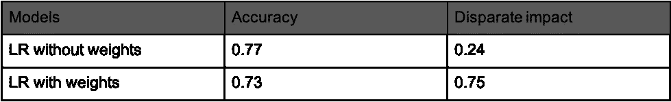

# 重新加权成人数据集，使其“无歧视”

> 原文：<https://towardsdatascience.com/reweighing-the-adult-dataset-to-make-it-discrimination-free-44668c9379e8?source=collection_archive---------15----------------------->

## 预处理阶段偏差缓解的一个例子

由 [Pixabay](https://pixabay.com/vectors/balance-court-equality-female-1302200/) 提供

在之前的[博客](https://medium.com/p/how-to-tackle-ai-bias-ec39313ccacf?source=email-9bfcef3ebec4--writer.postDistributed&sk=0cd7318ea075d7dea801f776fd622cfe)中，我们讨论了如何识别偏见以及减轻偏见的方法的机器学习工作流程。在接下来的几周里，我将会写一系列的文章来更详细地探索这个工作流程。首先，我将详细介绍一些与建模阶段相关的偏差缓解技术。

机器学习(ML)管道中我们可以干预以减少偏差的第一个阶段称为预处理。预处理描述了在应用机器学习算法之前发生的一组数据准备和特征工程步骤。采样、按摩、重新加权和抑制是学术文献中提出的不同预处理偏差缓解技术[1]。

在这篇文章中，我将重点探讨[重新加权](https://core.ac.uk/download/pdf/81728147.pdf)【2】，这是一种为数据分配权重的预处理技术。

这种方法的优点是，它不是修改标签，而是根据受保护属性和结果的类别为示例分配不同的权重，以便从训练数据集中消除偏差。权重基于频率计数。然而，由于这种技术被设计为只与能够处理行级权重的分类器一起工作，这可能会限制您的建模选项。

为了演示这种技术如何减少偏差，我使用了[成人数据集](https://archive.ics.uci.edu/ml/datasets/adult)【3】。该数据集中的二元目标是个人收入是高于还是低于 5 万美元。它包含了几个在美国受法律保护的特征，但是为了简单起见，在这篇文章中，我将把重点放在性上。从下表中可以看出，男性是享有特权的群体，有 31%的概率获得积极结果(> $50k)，而女性群体有 11%的概率获得积极结果。

如下面等式中所描述的，不同的影响度量是数据中的区分度的度量。分数为 1 表示数据集是无歧视的。当计算男性和女性的未加权成人数据集时，得分为 0.36。

使用上表中的频率计数，重新称重技术将按照下式分配重量。例如，对于具有积极结果的特权群体(即收入超过 5 万美元的男性)，权重计算如下:

因此，训练数据中每个类别的权重为:

通过将这些权重应用于计数，对于训练数据，不同的影响度量将变为 1，因此现在是“无歧视的”在预处理阶段对训练数据计算出这些权重后，它们可以用作逻辑回归、SVM 和 XGBoosts 等分类器的输入。

为了评估重新加权技术的效果，我训练了两个逻辑回归模型，一个有权重，另一个没有权重。实验结果表明了重新称重方法在减少歧视方面的有效性，如下表所示:

这种技术对于数据所有者不愿意与数据科学家共享敏感或受保护属性的用例尤其有用。通过为他们提供一个可以将这些权重分配给记录的脚本，数据科学家将能够在不直接访问受保护属性的情况下减少建模过程中的偏差。

与从训练数据中移除敏感属性等简单方法相比，实验表明预处理技术在减少偏差方面更有效。也就是说，平均而言，预处理技术不如处理中技术有效，因为它们不直接参与模型训练过程，并且需要进行一些精度折衷以降低区分度。

# 参考资料:

[1] Kamiran F，Calders T (2009a)无歧视分类。IEEE IC4 计算机、控制和通信国际会议论文集。IEEE 出版社

[2]卡米兰，费萨尔和考尔德斯，图恩。无区别分类的数据预处理技术。知识与信息系统，33(1):1–33，2012

[3]“成人——UCI 机器学习。”5 月 1 日。一九九六年，[http://archive.ics.uci.edu/ml/datasets/Adult](http://archive.ics.uci.edu/ml/datasets/Adult)。