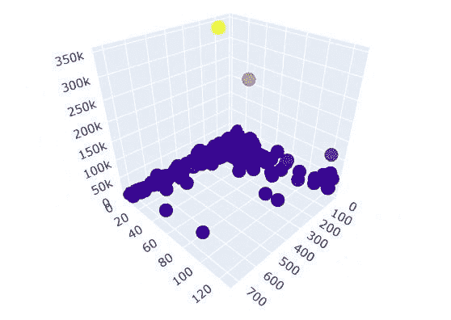
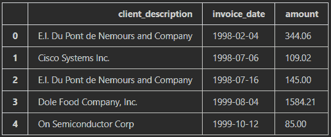
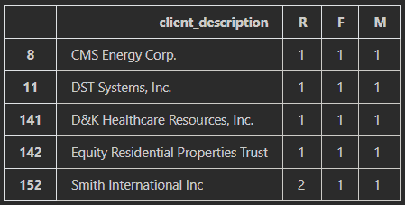
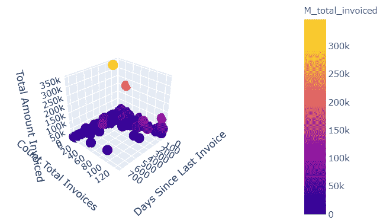

# 利用 RFM 分析进行客户细分

> 原文：<https://towardsdatascience.com/rfm-analysis-f7f958ef736f?source=collection_archive---------47----------------------->

## 最后一个聚类模型，你不必花时间去解释

作者图片

任何优秀的数据科学家都(或者至少应该)擅长采用复杂的数学和统计模型，并以简单明了的方式解释它们。最终，我们的工作是为我们的公司或客户创造价值。即使我们有一个准确率为 99.9999999%的模型，管理层也不太可能用它来做决策，除非他们理解(至少)模型的基础知识。

# 我们的问题

任何业务的很大一部分都是围绕着了解公司的客户，并确保他们的需求和愿望得到满足。这有助于我们确保我们的客户确实在使用我们创造/提供的产品，并确保我们将自己的资源投入到最佳的业务领域。了解我们客户的一个常见方法是将他们分成不同的群体。我们可以把精力集中在代表我们潜在客户的几个不同的群体上，而不是试图为成千上万的个人或公司理解和开发产品。这使我们能够做出更明智、更有针对性的决策，从而产生更大的影响。简而言之，它确保我们看到的是森林而不是树木。

如果你在过去几年中一直在研究机器学习，你的大脑已经自动切换到无监督学习模式，并且你已经在考虑编码一个 k 均值或最近邻模型。我不能否认我通常不在你身边。但是让我们后退一步。有没有更简单的方法？一个几乎不需要向管理层解释的问题？一个计算成本低得多的？

# RFM 来了

RFM 分析始于 90 年代中期，当时公司试图为直邮广告寻找最佳群体。大多数网站 Jan Bult 和 Tom Wansbeek 的文章“直邮的最佳选择”出现在*营销科学，*作为第一个出现的想法。这个想法很简单。

***“RFM”代表近期、频率和货币价值。总之我们要根据:*** 对客户进行分组

1.  他们最近一次交易是多久前？
2.  ***他们多久购买一次？***
3.  他们在我们这里花了多少钱？

上个月购买了三件商品的客户比过去三年购买了两件商品的客户更重要。在我们的产品/服务上花了 10，000 美元的客户比花了 50 美元的客户更重要。正如您所看到的，这种方法几乎不需要(如果有的话)解释。

分析的实现同样简单。对于每一组(R，F，M ),我们将把我们的客户分成 N 个部分。然后，我们将从 1 到 N(1 为最佳)对每个组进行排名。最后，我们可以按原样使用我们的 RFM 分数，或者我们可以使用某种聚合方法为每个客户开发一个超级分数。

# 我们开始吧

首先，我们需要一份我们正在分析的时间段内所有发票的清单。对于每张发票，我们只需要三样东西:

1.  客户名称
2.  发票日期
3.  金额。

对于任何分析师来说，这应该只不过是一个简单的 SQL 查询。

然后，我们将把 SQL 数据放入 pandas 数据帧中。(本例中的数据已被匿名化。)

作者图片

我们现在将创建一个新的数据框架(rfm ),用于存放我们的 RFM 指标。我们的新数据框架将包含每个客户的一行，以及他们各自的 R、F、M 评级。

我们需要一些辅助函数来生成我们的指标。我们可以用熊猫的申请来使用我们的数据。

最后，我们需要最后一点代码来将我们的客户分成 N 组，并分配一个等级。在这个例子中，我选择了 4 个组，并基于简单的四分位数进行划分。

我们的排名现在完成了。现在，我们可以深入分析，找出对管理有用的不同部分。

作者图片

# 最终分析

通过 RFM 分析，我们可以选择许多不同类型的客户群。当然，我们的最佳客户(最近频繁购买，花了很多钱)用 R=1，F=1，M=1 表示，或者更简单地用(1–1–1)表示。以下是其他一些著名团体的名单:

1.  低消费但积极忠诚的客户—(1–1–3 | 4)
2.  我们放过的最佳客户(4–1 | 2–1 | 2)
3.  新的大型消费客户(1–4–1 | 2)
4.  这个清单还在继续。

所有这些部分都可以通过简单的 pandas 过滤器轻松访问。

当然，没有可视化的分析会是什么？RFM 分析的一个小的附带优势是它提供了 3 个维度——使其易于可视化。让我们一起走进它。

作者图片

# 结论

当然，这种分析不像 k-means 或几乎任何真正的机器学习算法那样优雅或激烈——但这不是我们所追求的。我们用优雅换取了轻松和简单。

生成数据、编码解决方案以及审查结果可能只需要你喝一杯咖啡的时间。我们也不需要 GPU…从开发和计算的角度来看，这种分析是成功的。

正如我们在开始时所讨论的，我们的工作是为决策者提供可行的见解。在这里，时间就是金钱。我们方法的简单性节省了我们的时间(因为我们不需要开发 10 页的 PowerPoint 来解释我们的方法)并节省了管理时间(因为他们不需要坐在那里看完你的 PowerPoint)。然而，最终我们提供了可操作的细分市场，可用于整个营销和产品开发。

你会用这些空闲时间做什么？

附言

*   如果您想进一步压缩数据，您可以将 R、F、M 指标相加，产生一个超指标。
*   如果你想得到更精细的结果，使用更多的箱子而不是我上面用的四分位数。
*   如果一个或两个指标比其他指标更重要，将指标与加权和结合起来以反映这一点— a(R) + b(F) + c(M) = y，其中 a+b+c = 1。
*   定制这种简单方法的能力是非常了不起的。

感谢您抽出时间阅读。我真的很感激。完整的代码可以在我的 [GitHub](https://github.com/gbushnell/RFM_Analysis) 上找到。

*原载于 2020 年 10 月 15 日*[*【http://lowhangingfruitanalytics.com】*](https://lowhangingfruitanalytics.com/rfm-analysis/)*。*