# 使用 BigQuery ML 进行 RFM 分析

> 原文：<https://towardsdatascience.com/rfm-analysis-using-bigquery-ml-bfaa51b83086?source=collection_archive---------7----------------------->

## 使用 BigQuery ML 中的 RFM 分析和 Data Studio 中的可视化进行用户细分。

图片由[皮克斯拜](https://pixabay.com/?utm_source=link-attribution&utm_medium=referral&utm_campaign=image&utm_content=1233873)的 Gerd Altmann 提供

假设您想通过使用存储在 BigQuery 中的[谷歌分析数据，基于用户的网站应用活动创建细分市场，从而为用户的转化和重新激活进行再营销。](/send-google-analytics-hit-level-data-to-bigquery-5093e2db481b)

在本指南中，我将展示如何实现一种流行的技术来细分用户，并将结果可视化，以帮助做出重要的营销决策。

我们将经历的技术是 **RFM 分析**。我们将使用 BigQuery ml 来创建分段，并使用 data studio 来可视化结果。这是它的样子。

细分用户的仪表板，作者 Muffaddal

在本指南中，我们将:

首先，**计算用户的最近度、频率、**和**货币**价值。
其次，**使用 k-means 聚类**算法创建 **客户细分。
第三，**在 data studio 中可视化结果**。
第四，将 **RFM 的分析结果导入谷歌分析**进行激活
第五，**自动化 RFM 分析流程**。**

*注意:如果你有兴趣在 GCP 探索更多这样的技术，这里的* [*是一个很好的课程，可以从 Google 的*](https://bit.ly/2NtuqtH) *开始。*

# 什么是 RFM 分析？

客户细分策略之一是使用 RFM 分析创建用户群组。它基于用户过去的活动。它使用三个指标来执行分段:

1.  **最近度**:自上次购买后的天数。
2.  **频率**:用户购买的次数。
3.  **货币**:用户在购买上花费的总金额。

主要用于购买，但 RFM 分析也可以定制用于其他重要的用户活动，如查看的页面数量，而不是购买基于内容的业务的次数，如[medium.com](http://medium.com)。

## 利益

RFM 分析的好处是，由于用户是根据他们过去的活动进行细分的，我们对他们与业务的密切关系有一个很好的了解，因此每个细分市场都可以有针对性。

举个例子，一个经常在网站上购物的用户，他的平均购买量也很高，我们立刻知道这是一个忠实的客户，应该用来传播口碑。而另一方面，可以向最近购买但不经常购买的用户群提供折扣优惠，以帮助他更习惯该产品。

RFM 分析可以有所帮助

*   增加客户**保留率**
*   增加**响应**速率
*   增加**转换率**
*   增加的**收入**
*   增加**电子邮件中心**

data camp 上有一个关于使用 RFM 分析进行用户细分的很好的教程，可以帮助进一步理解这种用户细分技术背后的直觉。如果你有兴趣，一定要去看看。

 [## 使用 RFM 进行客户细分

### 在第一章中，您将了解群组以及如何分析它们。您将创建自己的客户群…

bit.ly](https://bit.ly/2BfqNoI) 

# **计算 RFM 值**

为了计算 RFM 分析，我们需要三个指标，即**用户 id** (在我们的例子中是 GA 客户端 id)**转换事件日期**(在我们的例子中是购买事件日期)，以及**购买事件支付的金额**。

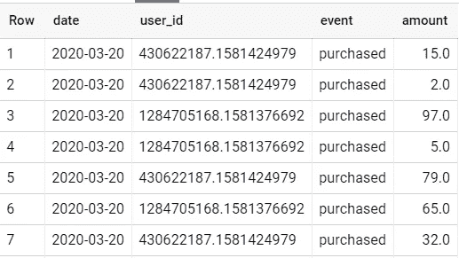

Muffaddal 用于 RFM 分析的主数据集表

**注意:** *我会假设你的数据是上面描述的格式。如果不是，那么你要么转换你的数据为上面的格式，要么修改下面的查询。*

[*需要 RFM 帮忙分析吗？下面我们来连线*](https://bit.ly/3vTZdGH)

首先，我们将使用下面的查询计算每个用户的最近次数、频率和货币值。

使用 SQL 计算用户的近期、频率和货币价值。

用您的数据表名称替换`line 9`上的`<your table >`,运行上面的查询应该会得到您的每个用户的最近值、频率和货币值。姑且称之为`query 1`

该查询的输出将如下所示:

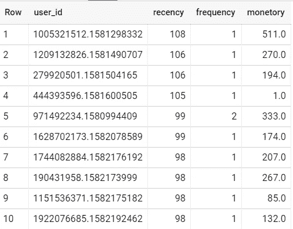

用户的新近性、频率和货币价值

将查询的输出保存为名为`RFM_Values`的大查询数据表，如下所示

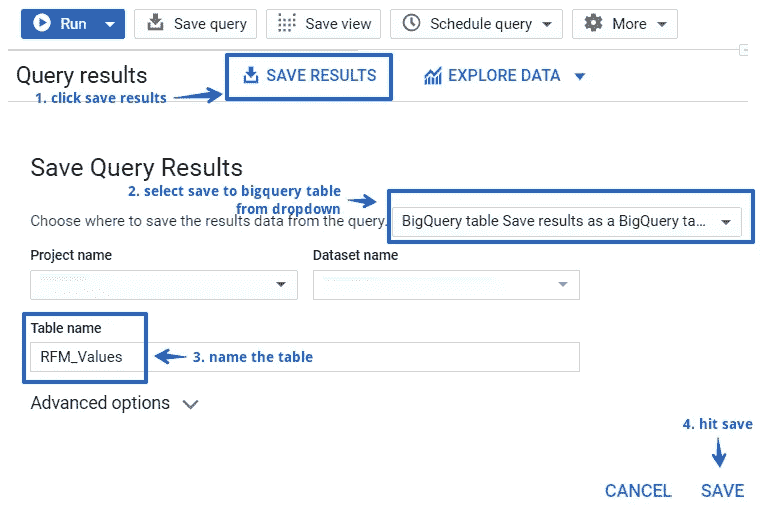

如何用 Muffaddal 将查询结果保存为 BigQuery 表

接下来，我们应用 k-means 聚类，根据用户的 RFM 值对他们进行分组。

# 基于 K 均值聚类的用户细分

使用 BigQuery ml，我们可以将机器学习模型直接应用于 BigQuery 中的数据集。使用 BigQuery ml 进行客户细分也相当简单。

要使用 BigQuery ML 算法，请使用命令`CREATE OR REPLACE MODEL`启动您的 SQL 查询。这告诉 BigQuery 将机器学习算法(在 options 命令中提到)应用于查询的 out。

下面是如何使用 BigQuery ML 对上一次查询得到的结果应用 k-means 聚类:

使用 Biguqery ML 创建 k 均值模型

用您想要存储模型输出的表的名称更新`devtest.Demo.RFM_Model`，并在`line 10`更新项目和数据集值。运行查询，您将在数据集中创建一个新表。我们称之为我们的`query 2`。

导航到模型化表的评估选项卡以查看统计数据。它应该是这样的:

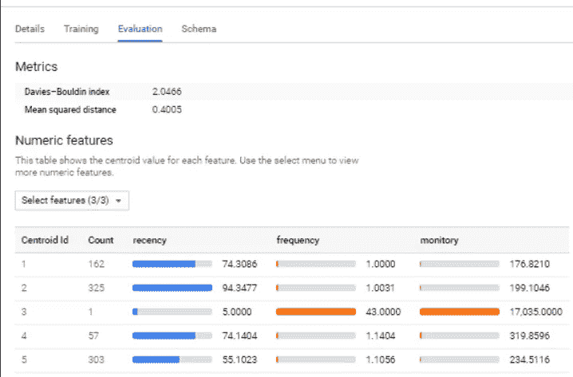

k-均值模型输出，用 Muffaddal 表示

`Centroid id`列，说明模型将我们的用户分组到了哪个细分市场。和 count 展示了每个细分市场中的用户数量。

如果我们把眼光放在最近、频率和货币列上，我们可以检查该模型根据什么对所有用户进行分组。

例如，`Centroid id`列中的第四部分是不经常使用该应用程序的用户，他们最近也不活跃。然而，他们的购买力是其他细分市场中最高的。

另一方面，第一部分用户和第四部分用户一样活跃，但是他们的购买力有点低。

由于这两个用户都已经超过 2 个月(平均 74 天)没有使用我们的网站，他们可能会有所改变，我们应该计划一个营销策略让他们回来。

*注意:假设我的数据模型产生了具有 5 个聚类的最佳片段(参见查询中的* `*line 4*` *)。在您的情况下可能会有所不同，所以检查不同数量的分类的结果，看看哪一个给了您最好的分段。*

一旦我们创建了我们的细分市场，是时候将它连接回 user_id，以便我们可以使用它来重新定位它们。

下面是执行此操作的查询:

查询来生成细分用户的最终表。

注意:我已经在上面的第 15 行将每个细分市场命名为细分市场 1、2 等，但是我将建议给它们一个适当的名称，如忠实用户、潜在用户、流失用户等。

我们将最后一个查询称为`query 3`

结果如下所示:

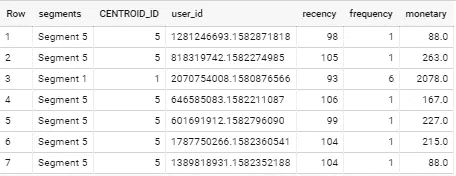

Muffaddal 的分割结果

将其保存为 BigQuery 表`RFM_Final`，用于分析和仪表板。

# 在 Data Studio 中可视化 RFM 分析结果

下一步是将我们的`RFM_Final`表连接到 Data Studio 并可视化结果。接着，[根据我们最终的数据表创建了一个模板](https://datastudio.google.com/u/1/reporting/3be5f079-bee9-4407-ac41-da91d1510c2d/page/GqBTB)仪表盘。

RFM 仪表板，由穆法达尔

它在顶部显示了所有近期、频率和货币值的平均值。理想情况下，平均最近值应该最小，频率和货币值应该最大，这样顶部的 KPI 指标有助于查看应用程序的当前排名。

之后，控制面板将三个指标按细分市场进行细分，以帮助了解它们的分布情况。通过过滤报告，我们可以彻底检查每个细分市场。

Data studio 的混合也可以用于将这些细分市场与用户的其他活动联系起来，以丰富报告并进一步深入行为分析。

最棒的是，每当`RFM_Final` 表更新时，我们的仪表板就会自动更新。我们还将看到如何自动进行 RFM 分析，以及时更新用户群。稍后将详细介绍。

**注意** : *该模板是用 google sheets 而不是 BigQuery 构建的，以避免成本，但它应该也可以与 BigQuery connector 一起重用。*

# 基于 RFM 结果重定向用户

现在你已经将你的用户细分并可视化了。其中一些将是高付费的忠实用户，而一些将是失去的用户，需要大量有针对性地重新激活他们。所以下一步是用不同的活动和促销来推销它们。

但是怎么做呢？

想法是将与每个用户相关的部分发送到谷歌分析，并从那里创建一个观众和目标，因为你喜欢使用谷歌广告。因此，我们必须将丰富的数据发送给谷歌分析。

我们也可以在这里利用 GCP。这样做使得我们所有的数据都在一个平台上。我们必须建立一个数据管道，将数据导入谷歌分析。要设置管道，请在云 shell 中输入以下命令来安装所有必需的依赖项:

`git clone [https://github.com/GoogleCloudPlatform/cloud-for-marketing.git](https://github.com/GoogleCloudPlatform/cloud-for-marketing.git)`

安装完成后，我们所要做的就是将数据从`RMF_Final`表移动到云存储，数据将自动导入 GA！

这里是 [**关于如何设置 GA 导入数据管道**](/automate-data-import-to-google-analytics-471de2c3fc76) **的详细指南。**

数据管道继续监视云存储桶中安装期间提到的文件夹，当它看到任何新的上传文件时，管道会处理它并将其发送到 google analytics。

# 自动化 RFM 分析

运行上面讨论的所有三个查询，将在您需要的任何时候为您的用户群获得更新的细分市场。但是，我们也可以自动执行这一手动流程，以便根据业务需求每月/每季度更新细分市场。

*注意:自动化过程需要一点编程知识，因此您可能需要请团队中的技术人员来实现自动化过程。*

我们有三个查询需要及时运行，以便从用户群中创建细分市场。首先，计算 RFM 值(`Query 1`)。第二，创建模型(`Query 2`)。第三，合并模型输出和用户 RFM 值(`Query 3`)。

想法是链接所有三个查询，以便一个查询的完成执行另一个。

下面是数据流的样子:

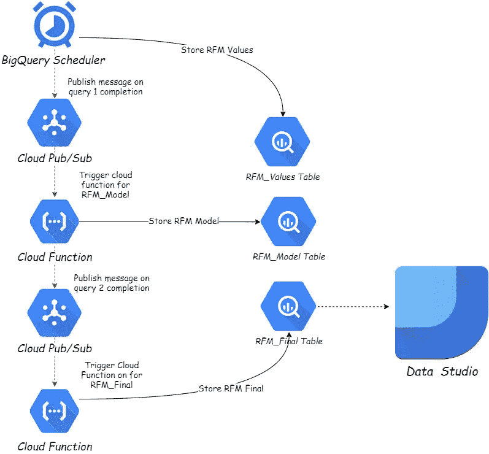

RFM 自动化数据管道，由 Muffaddal

**注意** : *我将假设已经为所有三个查询创建了表，如以上部分所示。*

1-让我们首先创建一个发布/订阅主题，因为在创建 query 1 schedular 时会用到它。我将其命名为`RFM_Model_Topic`，因为它将触发负责执行我们的模型查询(即查询 2)的云函数。

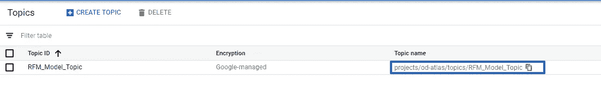

RFM _ 模型`_Topic`发布/订阅主题，作者 Muffaddal

复制主题名称，因为在创建`query 1` schedular 时需要它。

2-接下来，转到 BigQuery，在查询编辑器中粘贴查询 1，它为我们的用户计算 RFM 值，然后单击“Schedule query”按钮创建新的查询 schedular。

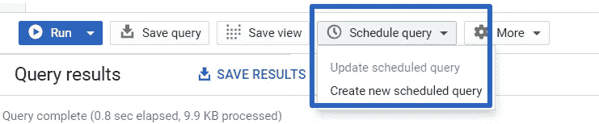

通过 Muffaddal 创建新的计划查询

3-然后，在调度程序创建菜单中输入所需的值来创建调度程序

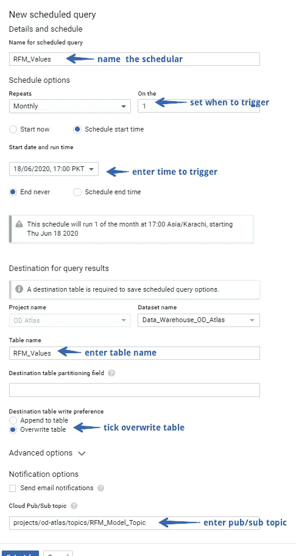

查询日程创建菜单，按 Muffaddal

这个 schedular 将做的是，它将在指定的时间运行，以计算用户的最近、频率和货币值，并存储在上述 BigQuery 表中。一旦调度完成执行查询，它将向我们的`RFM_Model_Topic`发送一条消息，这将触发一个云函数来触发我们的模型查询。所以现在让我们创建一个云函数。

4-进入`RFM_Model_Topic`发布/订阅主题，点击屏幕顶部的“触发云功能”按钮。

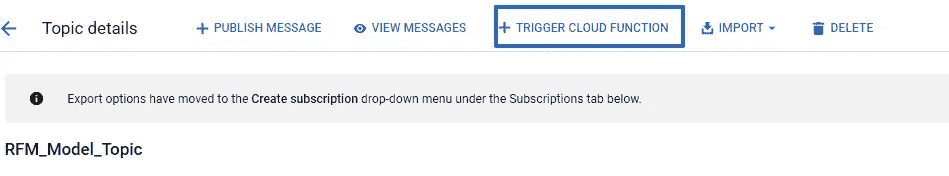

由 Muffaddal 从发布/订阅主题创建云函数

5-进入如下所示的设置，并将云功能命名为`RFM_Model_Function`

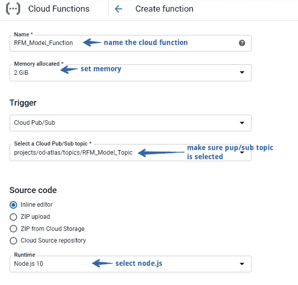

云功能设置，由 Muffaddal

6-将下面的代码粘贴到`index.js` 文件中

运行 RFM 模型查询的云函数

一旦我们的 BigQuery 被执行，我们就向一个名为`RFM_Final`的新发布/订阅主题发送一条发布消息，这触发了负责我们最后一个查询的云函数，该查询将 RFM 值和模型结果组合在一个数据集中。

7-因此，接下来，在发布/订阅中创建`RFM_Model`主题和一个云函数，就像我们在上一步中做的那样。将下面的代码复制粘贴到云函数中，这样它就可以运行我们最后的查询了。

运行 RFM 最终查询的云函数

就是这样！

我们自动化了 RFM 分析流程，该流程将在每个月初自动更新我们的仪表板。

# 摘要

通过个性化营销瞄准细分用户，可以提高留存率、转换率和收入。RFM 分析根据用户在网站/应用程序上的活动创建用户群组。

在本指南中，我们通过利用 BigQuery ML 使用 SQL 查询执行了 RFM 分析，并在 data studio 中可视化了结果。我们还谈到了如何通过向 Google analytics 导入数据来定位细分用户。最后，我们建立了数据管道来自动化整个 RFM 分析过程，这样我们就可以每月获得更新的用户群。

我希望我能够传达这样一个想法，即我们可以毫不费力地从现有的数据中提取出多少信息。以及支持和改进业务的有效性。

# 您喜欢的类似分析阅读:

 [## 根据用户的购买力确定产品的目标用户

### 根据用户的购买行为对其进行细分，从而改进广告活动。

towardsdatascience.com](/user-segmentation-based-on-purchase-history-490c57402d53)  [## 向 BigQuery 发送 Google Analytics 点击量数据

### 如何发送标准的谷歌分析点击量数据到 BigQuery？

towardsdatascience.com](/send-google-analytics-hit-level-data-to-bigquery-5093e2db481b)  [## 将细分的用户数据发送到 Google Analytics 进行重新激活。

### 建立一个数据管道，使用 Google Cloud Platfrom 将数据导入 google analytics。

towardsdatascience.com](/automate-data-import-to-google-analytics-471de2c3fc76)  [## 通过个性化推荐增强用户体验

### 本指南将详细介绍基于项目的推荐系统的工作原理以及如何在实际工作中实现它…

towardsdatascience.com](/comprehensive-guide-on-item-based-recommendation-systems-d67e40e2b75d)