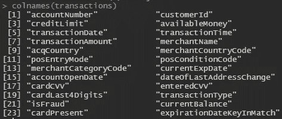
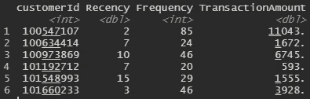
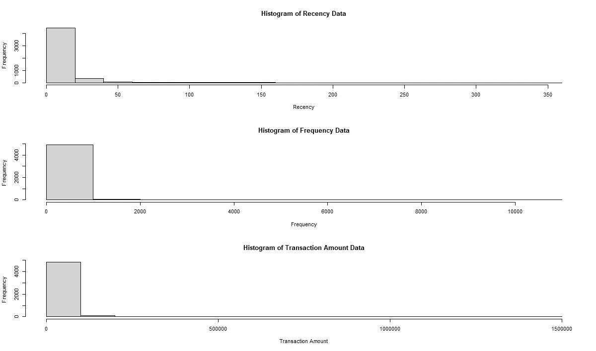
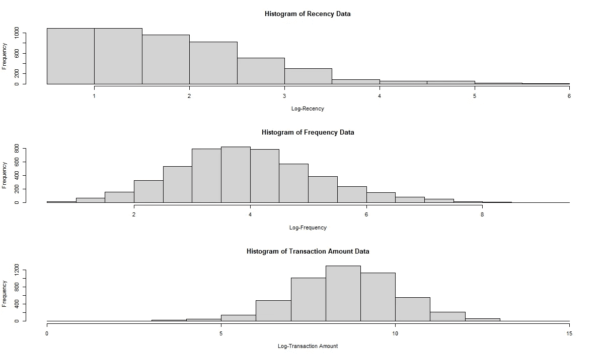
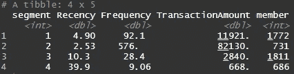

# 信用卡客户的 RFM 聚类

> 原文：<https://towardsdatascience.com/rfm-clustering-on-credit-card-customers-cdec560281c0?source=collection_archive---------32----------------------->

## 客户信用卡交易数据的新近性、频率和货币值(RFM)的 K 均值聚类案例研究

在 [Unsplash](https://unsplash.com/s/photos/marketing-analytics?utm_source=unsplash&utm_medium=referral&utm_content=creditCopyText) 上由 [Adeolu Eletu](https://unsplash.com/@adeolueletu?utm_source=unsplash&utm_medium=referral&utm_content=creditCopyText) 拍摄的照片

> **新近、频率、&货币(RFM)** 是可用于客户细分的技术之一，也是长期使用的常规细分方法之一。

1.  **最近**是指*客户最近一次使用我们的产品*进行交易的时间
2.  **频率**指*客户使用我们的产品进行交易的频率*
3.  **货币价值**是指*顾客在我们的产品上花了多少钱*

**RFM** 方法简单明了；我们只需将我们的数据(通常以交易数据的形式)转换成由三个变量组成的数据框架: ***、最近交易、*** 和 ***交易金额(货币值)。***

交易数据本身是记录或捕获客户所做的每一笔交易的数据。通常，交易数据包括交易时间、交易地点、客户消费金额、交易发生在哪个商家，以及交易发生时可以记录的每一个细节。

让我们看看稍后将用作我们的研究案例的事务性数据集。我们的数据集是 2016 年每个客户的信用卡交易数据。交易数据集由 24 个特征组成，记录了客户进行的每一笔交易。即使我们的数据集中有许多特征；我们不会使用所有这些特征，而是仅使用少量的特征，这些特征可以转换成 ***新近度、频率、*** 和 ***货币值*** 。

链接到数据集:[https://www . ka ggle . com/derykurniawan/信用卡交易](https://www.kaggle.com/derykurniawan/credit-card-transaction)

图一。交易数据特征

如果我们回到我们对 **RFM** 特征的描述；我们只需保留 *customerId、transactionDate、*和 *transactionAmount* 即可在由 *customerId* 特征分组的新数据帧中创建**新近度、频率、**和**交易金额**特征。

对于 ***Recency*** 特性，我们可以用 transactionDate(最新交易)的最大值减去当前日期。由于我们的数据集仅包含 2016 年的交易数据，因此我们将 2017 年 1 月 1 日设置为当前日期。

对于 ***Frequency*** 特性，我们使用 r 中的 **n()** 函数计算每个客户进行了多少次交易

对于**交易金额**功能，我们计算每个客户的交易金额总和。

将事务数据导入并转换为 RFM 数据

图二。RFM 数据集的前六行

现在我们有三个 RFM 分割的主要特征。这与任何其他数据分析情况类似，我们必须做的第一步是探索我们的数据集，在这种情况下，我们将使用 r 中的 **hist()** 函数使用直方图来检查每个特征分布。

图 3 RFM 特征数据直方图

我们的 RFM 数据集是如此右偏，这在 K-Means 聚类方法中将是一个灾难性的问题，因为该方法使用点之间的距离作为其计算之一来确定哪个聚类是最适合的点。 **Log 变换**可以用来处理这种倾斜的数据，由于我们在数据中有 **0** (零值)，我们将使用 log(n + 1)来变换我们的数据，而不是普通的 Log 变换。

对数变换和直方图

图 4。RFM 要素数据的直方图-对数标度

对数变换为 K-Means 方法提供了更好的数据，通过去除 RFM 数据集中的大量倾斜数据，为我们的数据计算和找到最佳聚类。

## k 均值聚类

根据定义，K-Means 聚类方法是一种无监督学习，用于根据相似性将未标记的数据定义为组。

在 R 中，K-Means 聚类可以使用 **kmeans()** 函数快速完成。但是，在创建 K-Means 模型之前，我们必须找到聚类的数量。有很多方法可以找到要分配的最佳组数，其中一种是通过使用我们的商业感觉并直接分配数量，或者我们也可以使用数学感觉来计算每个点之间的相似性。

在本例中，我们将使用组内平方和来衡量每个组内观察值的可变性。我们将在 1 到 10 的范围内迭代计算每个聚类的类内平方和，并选择具有最低值且值没有进一步显著变化的组作为其下一个聚类，或者我们通常称之为 ***肘方法*** 。

R 中的肘法

图 5 数据集肘方法可视化(N = 4)

使用肘方法，我们将分配**四个组**作为我们的组数。使用 R 中的 **kmeans()** 函数，我们只需将聚类数放入 **centers** 参数中，并将聚类结果分配到我们的数据集中。

k 均值模型和细分汇总

图六。添加段后的数据集

现在，我们已经在细分功能中将每个客户 ID 分配到他们的组中。在下一步中，我们将通过根据段号对 **RFM** 特征的平均值进行分组来检查每个段的基本 **RFM** 轮廓。

图七。每个细分市场的 RFM 汇总

因此，我们有四组，让我们讨论每组的细节:

1.  **Segment-1(白银):**交易频率和消费金额位居第二的中产阶级客户。
2.  **Segment-2 (Gold):** 消费金额最大、交易次数最多的最有价值客户
3.  **细分市场-3(青铜级):**交易频率低、消费金额低的普通客户。但是，这个细分市场拥有最多的客户。
4.  **细分-4(不活跃):**不活跃/不太活跃的客户，最近的交易发生在一个多月前。该细分市场的客户数量、交易频率和交易金额最低。

现在，我们有四组顾客，每组都有详细的 RFM 行为。通常，这些信息可用于安排针对具有相似行为的客户的营销策略。 ***新近性、频率、*** 和 ***货币价值*** 细分很简单，但对于更好地了解您的客户以及制定高效和最佳的营销策略非常有用。