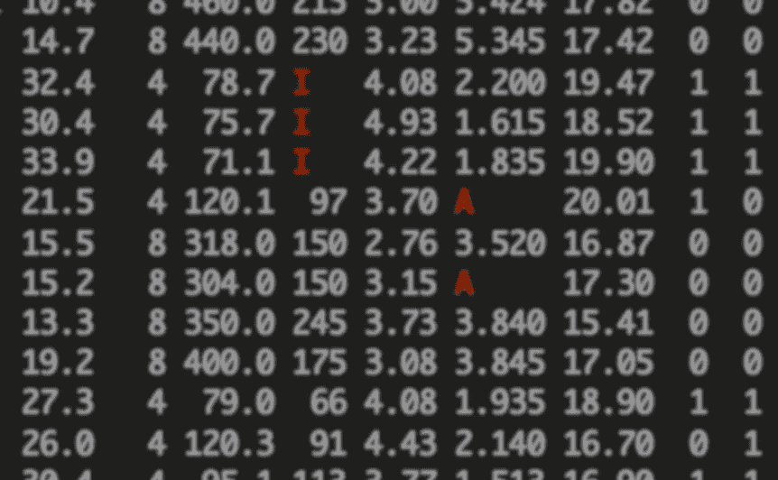

# 更丰富的缺失值

> 原文：<https://towardsdatascience.com/richer-missing-values-dea7377f5541?source=collection_archive---------46----------------------->

## 探索更强大、更灵活、更安全的数据框架

(图片由作者提供)

我的工作职责之一是维护调查数据的收集。起初这是一个简单的项目。通过一个简短的脚本，我可以将第一波数据编译成一个组织良好的数据框架，以几种不同的方式对其进行总结，然后发送一份报告。但是，一名参与者没有回应就离开了研究。另外几个参与者答错了一个问题。后来，在已经收集了几十个回答之后，我们在调查中添加了一个新问题。随着每一个新问题的出现，数据变得越来越难以维护。

每次数据丢失时，不管原因和后果如何，它都会被替换为相同的值`NA`。这种过度简化导致了各种各样的问题。丢失的值*看起来*一样，所以更容易预测我可能在数据集中遇到什么值。但是它们以不同的方式影响计算，我发现很难验证操作是否安全地处理它们。我寻找方法来表现`NA`背后的真实故事，但是我找到的解决方法冗长而复杂。`NA`的简单性让我的代码变得更加复杂。

改进`NA`最有用的方法是将它分成两个值:一个适用的缺失值和一个不适用的值。考虑一个新的调查问题的例子，它是在收集了一半的回答后添加的。没有回答可能有两个原因:要么有人跳过了这个问题，要么根本没人问过他们。第一种是适用的；第二种不是。如果您正在取平均值，您可以安全地删除不适用的值。但是忽略适用的缺失值是不安全的，因为了解它们的真实值(或估算它们)会改变您的结果。

不幸的是，大多数编程语言，包括 R 和 python，都很难表示这些信息。在 R 中，`NA`被视为未知但适用的值。如果你试图用什么东西把它加上，就会导致另一个`NA`。但是没有办法表示另一种不同的缺失值。由于您无法区分不同类型的`NA`，您必须自己检测并处理它们。

在实践中，人们使用许多不同的方法来解决这个问题。一种选择是使用插补方法处理所有适用的缺失值，然后大胆使用大多数算术和统计函数中可用的`na.rm = TRUE`选项。这将所有的`NA`视为不适用，允许您在不删除缺失值的情况下进行求和或求平均值。但是盲目地删除丢失的值可能是不安全的。在`NA`可能适用的情况下，我们几乎总是希望总和缺失，因为这有助于我们解释结果。缺少结果意味着还有一个缺少的值需要处理。一个真实的值保证我们完成了。

为了避免`na.rm = TRUE`，您可以创建指示记录是否适用的变量。这看起来更安全，但是会变得冗长。你开始积累像`sum(variable[isApplicable])`这样的表达式，而不是简单的`sum(variable)`，数据变得越复杂，就越难记住如何写`isApplicable`。你将需要多个指标变量，每一个都代表你想确定某件事是否适用的一种方式。而且数据结构也不能告诉你哪个指标变量对应哪个数据变量，你必须自己去跟踪它们。这可能会导致一系列完全不同的错误。

第三个也是最好的策略是将数据分割成更小的`data.frame`，这种方法可以消除任何有问题的缺失值。为此，您将具有相同缺失值的记录分组，这样它们根本不需要缺失列。目标是删除所有不适用的值，这样每个`NA`都可以被明确地视为适用的，前面的解决方法都没有必要。缺点是一些数据集需要大量的表，跨不同的表工作比在一个表内工作更困难。尽管这种方法比其他两种方法干净得多，但它仍然增加了复杂性，并增加了工作量。

# 关系数据库理论的启示

1986 年，E.F. Codd 写了一篇名为“关系数据库中缺失信息(适用和不适用)”的论文几年前，Codd 开发了关系数据库的理论，这是一个非常流行的模型，它和矩阵一起启发了数据框架的设计。(事实上，Hadley Wickham 著名的“整齐”数据概念是[明确基于](https://vita.had.co.nz/papers/tidy-data.pdf) Codd 的第三范式)。在 1986 年的论文中，Codd 探讨了缺失数据，并回答了在关系数据库中如何处理缺失数据的问题。当时最流行的方法是选择值，比如-99，来表示不同类型的缺失。这给用户带来了正确解析值以操作数据的负担。这是一种有缺陷且不安全的方法。

Codd 提出了一个 A 标志和 I 标志系统，其中 A 适用于缺失，I 不适用。他的论文描述了数据库如何处理，而不仅仅是表示两种缺失的信息，这样就不再需要特殊的值或额外的变量。在[后来的一篇论文](https://doi.org/10.1145/382274.382401)中，Gessert 讨论了它如何优于删除所有不适用的值的拆分表的解决方案，这给程序员和用户带来了许多不必要的工作。因为数据库可以理解丢失的值，所以它可以适当地处理它们，从而避免用户采取变通办法。

在他的论文中，Codd 概述了在计算中组合时如何处理值、缺失值和不适用值的建议。他说 I 标记应该被认为比 A 标记更强，A 标记应该比值更强，并且组合不同类型的运算应该返回更强的值。比如 A + 2 = A:和是未知的，因为 A 的值是未知的。类似地，A + I = I，这是合适的，因为 A + I 的和是无意义的；它不能适用于任何事情。同样的规则适用于所有算术运算，以及其他运算，如连接。

当运算是逻辑运算时，例如相等或比较，规则会更复杂。Codd 给出了一个简单的例子:像“出生日期> 1–1–66”这样的语句的值是多少？生日有了就是真的假的，其他的就不得而知了。所以，Codd 提出了一个三值逻辑，包括真、假、可能。

三值逻辑今天被广泛使用。在 R 中，MAYBE 表示为逻辑“NA”。逻辑运算比只有真和假更复杂，因为也许不能解释为一个具体的逻辑值。相反，也许是一个暂时的占位符，反映了我们目前对其真实价值的不确定性。例如，在 R 中，`NA | TRUE`的计算结果为`TRUE`，因为无论左侧发生什么情况，它都为真。然而，`NA | FALSE`就是`NA`，因为不学习缺失的信息，我们无法确定真实的价值。AND 运算的逻辑是相似的。`NA & TRUE`是`NA`，因为我们分不清它是什么，而`NA & FALSE`明明是`FALSE`。否定是最简单的运算:`!FALSE`是`TRUE`，`!NA`是`NA`。三值逻辑起初可能是违反直觉的，但所有规则都源于`NA`的中心原则:它不是一个值，而是一种不确定的状态。

虽然三值逻辑是处理缺失数据的最简单方法，但 Codd 很快意识到这是不够的。在第二年的一篇[后续文章](https://doi.org/10.1145/24820.24823)中，他提出了一个四值逻辑，就像他的 A 分和 I 分一样，区分了适用的也许和不适用的也许。有趣的是，Codd 写道，他不认为实现这种逻辑值得付出努力，但指出它比三值逻辑更精确。他期望它以后会被集成(事实并非如此)。

四值逻辑扩展三值逻辑，就像 A 标记和 I 标记扩展缺失值一样。就像 I-marks，I-MAYBE 比 A-MAYBE 强，所以 A-MAYBE & I-MAYBE 就是我-MAYBE。在 AND 运算的情况下，最强的值是 false，因为无论另一端的值是什么，结果肯定是 FALSE。类似地，带有 TRUE 的 OR 将始终为 TRUE。最复杂的表达是 I-MAYBE | A-MAYBE，也就是 A-MAYBE。这是因为-MAYBE 是一个逻辑值的占位符，如果该值为真，表达式总体上也将是有意义的——它将为真。表示一个潜在的真实但未知的值的最好方法是一个也许。

Codd 对四值逻辑喜忧参半，认为它可能太复杂而不值得。他认为关系数据库的用户更喜欢简单的系统，而不是复杂的系统，因为复杂的系统需要太长的学习时间。但是，尽管三值逻辑比四值逻辑简单，但它的表达能力却远不如四值逻辑。ge sert[后来为四值逻辑](https://doi.org/10.1145/382274.382401)辩护，给出了一个欠下费用的简单例子。关键是要知道费用是因为还不知道而缺失，还是因为不适用而缺失。Gessert 说，将数据库限制为三值逻辑会阻止用户充分利用这一区别。他建议添加能够处理新的缺失值的新操作符，并指出这些操作符对于用户来说很容易学习，这样他们就会完全理解新的逻辑。

A-marks、I-marks 和四值逻辑都在简单和强大之间呈现相同的选择。这些特性无疑增加了数据和管理数据的系统的复杂性，但是它们也增加了表现力。如果我们能区分数据中适用的和不适用的信息，我们就能更有效地操作数据，更安全地进行计算。当适用的缺失值可能掩盖错误或使我们的结果有偏差时，这种区别就至关重要。

# 数据框架的含义

Codd 和 Gessert 探索的理论很重要，因为数据框架与关系数据库具有相同的语义。在 R 的 dplyr 包中，许多函数是以它们的 SQL 等价物命名的:`select()`、`*_join()`、`coalesce()`，还有更多函数的行为与它们在 SQL 中的行为完全一样。在 R 中，`NA`相当于 SQL `NULL`。和 SQL 一样，R 不实现任何类似 Codd 的 A 标记和 I 标记的东西。仅限于三值逻辑，其中 maybe 值表示为`NA` ( `NA_logical_`)。

如果这些数据结构能够区分适用的和不适用的缺失值，计算将变得更加简单。我们将放弃所有不适用的值，而不是使用当前的选项之一——依赖于`na.rm = TRUE`,或者选择记录的子集，或者拆分表。例如，如果我们想要添加一个包含美元值的变量，我们可以安全地丢弃任何不适用的条目。但是，如果有一个适用的缺失值，我们将传播这种不确定性，我们的结果将是“适用的缺失”这比任意丢弃所有缺失的值要安全得多，并且不需要我们编写额外的代码来选择适用的记录。它比只有一个`NA`更安全、更高效。

A 标记和 I 标记的系统也使得数据的结构更加灵活。例如，从同一组个体的多次观察中收集数据是很常见的。你可能有一些你在每次观察中收集的变量，还有一些描述个体的变量。问题是，一个人的变量只有在你从他们那里收集到至少一个观察结果时才会显示出来。如果没有观察到，该个人将被删除。I 标志使这变得更容易。我们为每个个体添加至少一行，并包含描述变量；但是每当个人没有数据时，我们将所有数据字段标记为不适用。理论上，同样的方法可以用来表示任何形状的数据，或者组合任何数量的表，而不会丢失信息。

Codd 提出的这个系统已经很强大了，但是还可以进一步扩展。我们可以有额外的标记来记录在某些操作或其他条件下的适用性。我们可以将标记扩展到已知的值，这样已知的值也可以由于不适用而从某些计算中删除，并且我们可以将它们用作分组数据的方法。标记可以通过多种方式进行扩展，将简单的数据结构与混乱的现实环境相匹配。

# 在 R 中实现一个丰富的缺失值系统

R 中最近的发展使得实际实现这些想法成为可能，因此有必要简要地探讨一下这是如何工作的。历史上，我们一直局限于原子的，基本的 R 向量。原子向量中的每个值都是相同的类型。在 double vector 中，每个值都必须是 double 或`NA_real_`。但是 [vctrs](https://github.com/r-lib/vctrs) 包提供了一种方法来实现行为类似向量的对象。它的工作方式是为所有的 base R 函数提供替换，包括构造函数、造型、用`[`和`[[`设置子集、算术和其他计算，以及用`format`进行可视化输出。因为对象比原子向量更灵活，它们可以建模适用和不适用的类型。

一种可能的提议是使用记录结构来表示 A 标记和 I 标记，该记录结构具有一个用于数据的字段和一个用于标记的字段。缺失值可以在数据字段中表示为`NA`，在标记字段中表示为`A`或`I`。通过在新类型的向量上实现基 R 函数，我们可以实现我们想要的行为。

一旦我们实现了数据结构，我们就可以为它编写更好的函数。首先，我们可以默认丢弃不适用的遗漏。这尤其与`sum()`、`mean()`、`quantile()`、`%in%`、`Reduce()`(或`purrr::reduce()`)等功能相关。其次，我们可以实现二元操作符，使它们符合 Codd 的算术规则。特别是表达式`A + A`应该是`A`，`I + I`应该是`I`，`A + I`应该是`I`。最后，我们可以实现四值逻辑，扩展 base R 的三值逻辑来考虑适用和不适用的结果。这将导致 A 和 I 标记系统的完整实现，并且是我计划探索的项目。

# 简单的代价

因为数据集是复杂的，所以拥有有用的数据表示是非常有价值的。数据集的理论计划可能会很快因现实世界的问题而偏离轨道，如不完整、损坏或丢失的数据。尤其是丢失的数据变得难以解释，并且执行计算变得更加困难。这在操作简单的结构和复杂但能以更细微差别表示数据的结构之间产生了矛盾。

毫无疑问，学习如何处理包含适用和不适用缺失值的数据集需要付出额外的努力。`NA`本身就足够令人困惑了(首先，实际上有五种不同的`NA`)。两个缺失值的存在改变了所有常规操作的工作方式，虽然它们的行为受一组核心原则的指导，但人们需要时间来学习如何有效地使用它们而不出错。当用户不完全理解复杂的工具时，它们可能是危险的。

但是额外的复杂性通常是合理的。当我们使用只有一个缺失值的数据结构时，我们被迫编写代码来选择我们想要操作的记录，或者将我们的数据拆分到不同的表中。因为我们的数据过于简单，我们被迫使我们的代码更加复杂。而且因为我们的代码比较复杂，会容易出错，很难维护。相比之下，更强大的缺失值表示可以提供更简单、更可靠的方法来操作数据。

自从第一个关系数据库出现以来，用户和开发人员一直选择简单的设计，以便于学习和使用。但是有时候一个听起来很复杂的想法和现实世界的混乱是绝配。

## 笔记

一个 R 基函数有一个有趣的行为:`%in%`。默认情况下，它实际上会丢弃丢失的值。我们期望`4 %in% 1:3`是`FALSE`，但是我们也期望`4 %in% c(1:3, NA)`是`NA`，因为我们不能排除最后一个值是`4`。这种实现反映了大多数人用`%in%`和用`sum()`思考缺失值的方式不同，但这显然与其他逻辑运算不一致。通过区分适用的和不适用的缺失值，我们可以用一种既正确又直观的方式重新实现它。

`NA`是一个[逻辑值](https://stat.ethz.ch/R-manual/R-devel/library/base/html/NA.html)，放在任何非逻辑向量中都是非法的。相反，R 为整数向量定义了`NA_integer_`，为双精度数定义了`NA_real_`，为复数定义了`NA_complex_`，为字符串定义了`NA_character_`。通过`c()`的工作方式和 R 打印出向量的方式，这些对用户是隐藏的。