# 搭车还是开车:比较拼车和汽车所有权的金融模型

> 原文：<https://towardsdatascience.com/ride-or-drive-a-financial-model-comparing-ridesharing-to-car-ownership-a0e53d660bb?source=collection_archive---------30----------------------->

## 拼车真的能取代汽车吗？数据显示，如果你的驾驶里程不到 10，000 英里，也许可以。

随着加州 AB5 的实施和随后前期定价的下降，乘车共享市场最近经历了一些变化。Lyft 和优步一直在不断平衡其商业模式的动态性，同时应对日益增加的监管审查和对乘客安全的担忧。然而，两家公司都继续表示，拼车总有一天会完全取代汽车所有权。

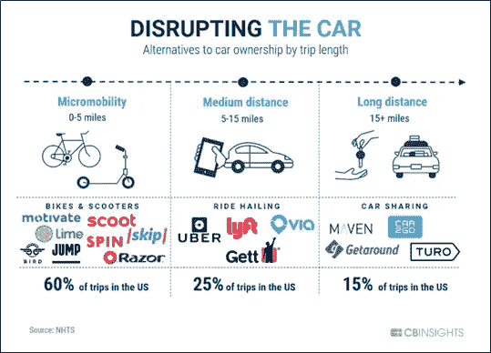

来源: [CB Insights](https://www.cbinsights.com/research/disrupting-cars-car-sharing-scooters-ebikes/)

大约 6 个月前，我从肯塔基州的路易斯维尔搬到了洛杉矶。我在两个不同的办公室工作，一个在洛杉矶西部，一个在市中心。我不开车，一直依赖公共交通、自行车和拼车应用。所以，我的问题是:优步和 Lyft 是对的吗？**拼车能取代汽车所有权吗，尤其是在世界上最臭名昭著的驾车城市之一？**

优步/ Lyft 定价模型很难预测，因为市场算法消耗了大量的输入数据。内置了无数的变量，这些变量不断地接收实时事件，例如驾驶员位置、乘车次数[请求](https://conferences.oreilly.com/strata/strata-ca-2019/public/schedule/detail/72805)以及一天中的时间等

在本文中，我首先考察了四种不同车型每年的汽车拥有成本，包括直接成本和间接成本。然后，我结合优步和 Lyft 过去几个月的数据，将拼车作为一个广阔的市场进行研究，建立三个回归模型，以获得拼车的大致成本结构，最终回答一个非常重要的问题:

我们是骑车还是开车？

# **每年拥有汽车的成本**

为了进行这项分析，我从 2019 年 AAA 驾驶成本报告中提取了 4 种不同类型汽车的数据:(1)中型轿车，(2)电动轿车，(3)混合动力轿车，以及(4)中型 SUV。这些似乎是洛杉矶最实用的车，也是最常上路的车。如果你对自己的[计算](https://www.aaa.com/AAA/common/AAR/files/AAA-Your-Driving-Costs.pdf)感兴趣，AAA 有一些基线指标可以提供。

***直接费用***

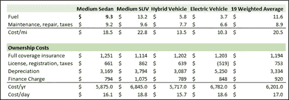

来源: [AAA](https://www.aaa.com/AAA/common/AAR/files/AAA-Your-Driving-Costs.pdf)

这些车的年费用都差不多，从 5700 美元到 6800 美元不等。根据 [AAA](https://www.aaa.com/AAA/common/AAR/files/AAA-Your-Driving-Costs.pdf) 的数据，2019 年拥有一辆中型轿车的平均成本为 8643 美元(假设每年行驶 15k 英里)。这包括保险、执照和注册、税收、折旧和融资费用。你开得越多，由于折旧、燃料成本等的增加，汽车就越贵。

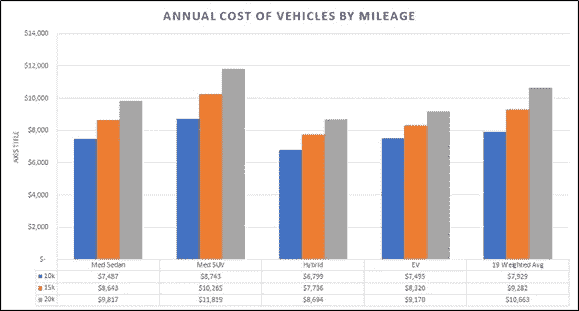

我在分析中还包括了加州的汽车成本。在这里拥有一辆汽车更贵，因为生活费用过高。例如，一辆中型轿车平均每英里多 0.3 美元。

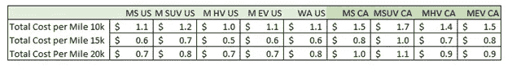

然而，**一辆汽车伴随的成本不仅仅是直接成本**。这就是分析变得有点棘手的地方，因为其中一些变量可能是主观的，我将讨论这一点。还有额外的“间接”成本，包括罚单、停车费和机会成本。

***间接费用***

*   **交通罚单(146.34 美元+增加的保险费)**

2018 年，超过 60 亿美元的交通罚单被开给了 4100 万人。平均每人的交通罚单成本是 146.34 美元。这还不包括你拿到机票后增加的保险费，如下所述，这是一笔可观的费用。加州的一张票可以提高 1/3 的保险费，第二张票可以翻倍。如果一名司机每年收到一张罚单，那将导致 150 美元的罚单费用+850 美元的保费增长——仅仅一张罚单，汽车成本每年就会增加 1000 美元。我假设在汽车的使用寿命期间，至少有一张罚单。

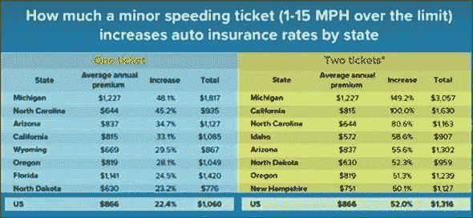

来源:[纽约超速罚款](https://newyorkspeedingfines.com/)

*   **停车费(4100 美元)**

平均来说，美国人每年在停车场的花费超过 1000 美元。纽约的消费额最高，为 2243 美元，西雅图位居第五，为 1205 美元。这甚至还没有考虑到寻找停车位的机会成本——纽约人在 2018 年花了 107 个小时寻找停车位。那就是每年 4.45 天，光是找地方停车。

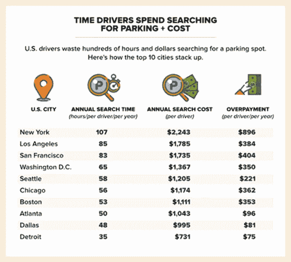

来源:[租车](https://www.carrentals.com/blog/parking-tickets-cost-americans/)

根据 INRIX 的数据，停车是车主最大的一项支出。纽约是最贵的城市，因为纽约人往往更频繁地支付停车费，每次停车都要付更多的钱。洛杉矶位居第二，搜索和超额支付总计 2139 美元。

公寓和办公楼通常收取月费，根据位置不同，月费在 50-150 美元之间。我将计算停车和搜索时间(带缓冲区)的年总成本约为 4100 美元，即搜索时间的总成本和停车的总成本。

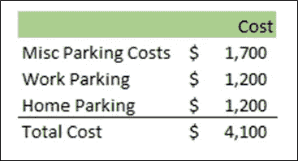

*   **机会成本(1648 美元)**

然后，有驾驶花费的总机会成本。我在乘车分享的后面打了一些这篇文章——当你不在方向盘后面时，更容易有效率。根据美国人口普查局的数据，2018 年平均通勤时间增加到 27.1 分钟。也就是每天 54.2 分钟，一周 4.51 小时，一个月 19.42 小时，一年 233.06 小时。

根据劳工统计局的数据，2019 年的平均工资为 28.29 美元。将平均工资乘以平均通勤时间得出的结果是生产力和工作时间损失 6593 美元。即使我们只有 25%的时间是在开车而不是做其他事情上，这仍然是每年 1648 美元的损失。

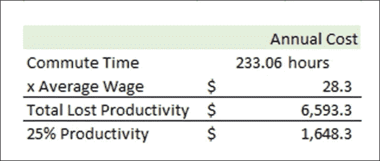

时间的估值是极其主观的，这里有很大的修改空间。正如上面的计算所示，有些人不重视他们的时间，而有些人比平均工资更重视他们的时间。都是相对的。

*   **总间接成本= 6748 美元**

因此，无论一辆车的成本是多少，加上间接成本，每年的额外成本就是 6748 美元。如果你驾驶的是香草冰淇淋的家庭轿车，那么你每年拥有汽车的成本估计为 15391 美元。

# **拼车市场的动态定价**

很难找到 ride 股票背后的定价结构。很多定价源于位置、时间和交通。这些公司似乎也经常修改他们的定价模式，已经有多篇文章发表在拼车定价市场上频繁发生的变化。随着加州 AB5 的变化，现在这一切都不确定了。根据优步的说法:

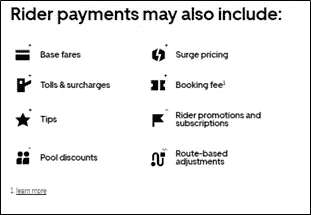

来源:[优步](https://help.uber.com/riders/article/booking-fee?nodeId=ab5837e4-8f55-442c-9894-15c1d4131fe9&state=6Cg9ZeB8DMdSMKwikFoN0EYHMeQBILt7focpl_9rBMk%3D&_csid=9BfSrwHCDyMsZBAwZZZoOw#_)

根据拼车司机的细分(这可能有点简单，但出于说明目的很重要)，估计每英里的成本为 0.80 美元，每分钟的成本为 0.20 美元至 0.28 美元，具体取决于优步的类型。预订费因城市而异，但我估计预订费为 2.30 美元。

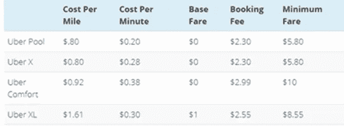

来源:[顺风车共享司机](https://www.ridesharingdriver.com/how-much-does-uber-cost-uber-fare-estimator/)

为了简单起见，我们可以假设等式为:

***Assumed _ Fare =****Base _ Fare+(英里驱动 x 每英里成本)+(分钟驱动 x 每分钟成本)*

***cost _ Uber =***2.30+(0.80 *英里 _ 驱动)+ (0.24 *分钟 _ 驱动)

# **美国拼车的成本**

平均通勤时间为 27.1 分钟。根据 FHWA 的数据，美国人平均每年驾车旅行超过 13476 英里。根据美国汽车协会 2016 年的美国驾驶调查，美国人平均每天出行 2.13 次，每年共计 777.45 次。

假设乘客刚刚使用了 rideshares，预订费用的总成本将为 1788 美元，乘以每次乘坐的预订费用 2.30 美元，每年有 777 次乘坐。每英里的年费用为 0.8 美元* 13，476 英里或 10，781 美元。每年每分钟的总成本为 5899 美元，等于每年 777 次旅行，乘以平均通勤时间 27.1，成本为 0.24 美元。

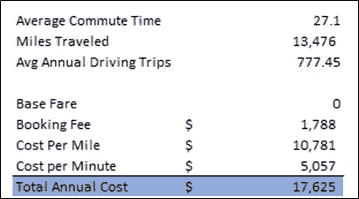

这导致骑优步或其他拼车平台的总年成本为 17，625 美元。我想在基本模型之外验证这一点，所以我收集了自己的数据。

# **凯拉的拼车数据**

我六个月前从肯塔基州搬到了洛杉矶。我把我心爱的斯巴鲁 Outback 交给了我的弟弟，并决定穿越洛杉矶——这是大多数洛杉矶人的罪过。

我在西洛杉矶工作，住得离办公室很近。我早上很早就去上班，一开始，我从家走到办公室。被人追了之后，我开始骑自行车。然而，在洛杉矶骑自行车是有风险的，没有多少回报。

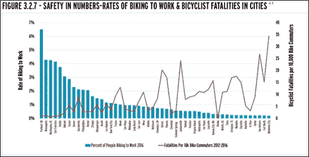

来源:[美国街头博客](https://usa.streetsblog.org/2019/02/11/walking-and-biking-are-hurt-by-lack-of-national-leadership-report/)

我也开始在市中心的办公室工作，每周有三天在市中心和洛杉矶西部之间往返。我通常在下午三点左右离开西洛杉矶前往市中心，并在晚上晚些时候返回西部。所以，如果我选择在清晨乘车，我有三个不同的通勤时间，都有不同的价格压力和动力。值得注意的是，我的大部分交通都是在典型的高峰时间之外，因此下面的分析可能会因此而有所偏差。

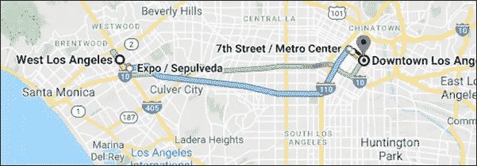

来源:[谷歌地图](https://www.google.com/maps/dir/West+Los+Angeles,+Los+Angeles,+CA/Downtown+Los+Angeles,+Los+Angeles,+CA/@34.0336533,-118.4880277,11z/data=!4m14!4m13!1m5!1m1!1s0x80c2bb774ba0772d:0x29f7b87911891dde!2m2!1d-118.442596!2d34.0412085!1m5!1m1!1s0x80c2c634253dfd01:0x26fe52df19a5a920!2m2!1d-118.2467693!2d34.040713!5i1)

从西洛杉矶到市中心大约有 12 英里的路程，我不能骑自行车。我曾经骑自行车到世博线，把自行车停在外面，但有人给我的轮胎放气，我的头在线路上被抚摸了不止一次(欢迎使用洛杉矶公共交通)，所以在过去的几个月里，我一直避免使用所有的公共系统。

我几乎每天都乘坐优步或 Lyft，通常会打开这两个应用程序来比较两者之间的成本。

由于我的工作安排，我避免了高峰时段的大部分价格上涨，下图中用红色标出。如堆叠区域所示，我经常在傍晚和晚上骑车。我收到的平均价格可能会更低，因为我倾向于避免“激增定价”。

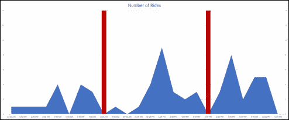

下图详细描述了我的拼车习惯。我更多的时候是与人合租，而不是独自乘车，主要是为了安全，也是为了省钱和保护环境(至少是一种尝试)。如果我需要快速到达某个地方，我会使用 UberX 或 Lyft，这是 Lyft 的非共享乘车。如果我漠不关心，我会用共享。合租通常便宜 5-7 美元。我通常后悔采取优步池，因为它可以添加多达四个额外的人，这可能是极其痛苦的。

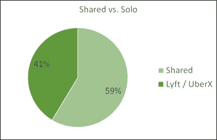

我在优步旅行的平均时间比 Lyft 多 4.5 分钟，我的平均时间要低得多。这可能意味着我的优步司机效率更高，或者 Lyft 在长途旅行中更便宜，所以我更经常选择它。我 61%的乘车是从西区到市中心，更大比例的优步是带我去市中心以外的地方。21%的时间我使用优步去市中心，另外 40%的时间我使用 Lyft。

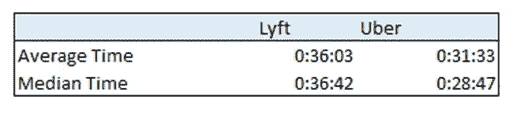

在过去的四个月里，我已经走了 580 英里。这使得我的估计年里程数为 1738，这是非常低的(老实说，有点悲伤)。如果我有自己的车，我想象这将增加至少 25%，因为我可以在周末自由旅行，逃离洛杉矶。

## **检查数据**

这是我的三个主要乘车共享变量，费用，秒数和距离之间的相关图。这种分析的目的是预测拼车的费用。我将把我的数据外推至数千英里，这意味着我假设这种关系将保持不变。

为了说明外推的问题，考虑一下罗伯特·奇拉曾经说过的关于苹果公司估值的话:

> “如果你对未来进行足够远的推断，为了保持这种增长，苹果将不得不向地球上的每个男人、女人、孩子、动物和岩石出售 iPhone。

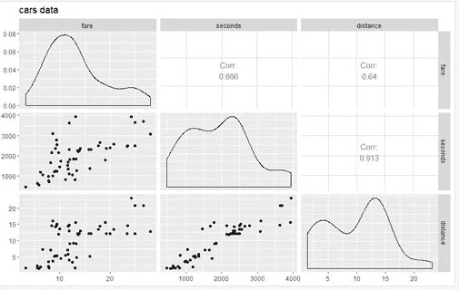

## **模式一:用秒和距离预测车费**

我在 R 中运行了一个基本的线性回归，以查看秒和距离在确定票价方面的预测能力，因为这是大多数拼车模型所基于的，包括前面提到的拼车司机模型，以及[凯尔·希尔 2014 年的模型](https://medium.com/@kaleazy/a-financial-model-comparing-car-ownership-with-uberx-los-angeles-b7becd917095)。

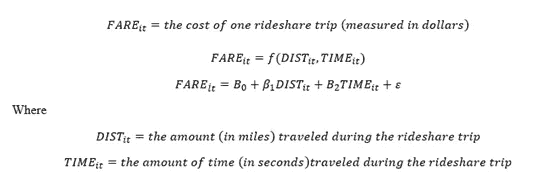

从回归中提取数据，然后模型变成:

这意味着每增加一英里和第二次旅行，票价将分别增加 0.204 美元和 0.003 美元。此模型的问题是距离和秒之间的相关性为 91%，从而产生多重共线性问题。有几种方法可以解决这个问题，包括创建一个工具变量来消除处理距离的时间部分。

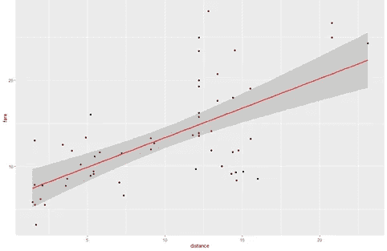

## **模型 2:包括高峰时间的虚拟变量**

我决定修改等式，加入一个虚拟变量来确定我们是否处于高峰时间。高峰时间(在洛杉矶)是早上 6 点到 9 点和下午 3 点到 7 点。窗外的任何时间都是非高峰时间。我有 40 次乘坐在高峰时间之外，18 次在高峰时间规格之内。

该模型现在变成了:

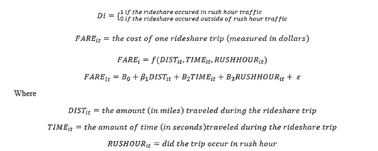

从回归中提取数据，这变成:

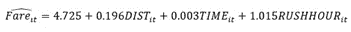

这意味着每增加一英里和第二次旅行，票价将分别增加 0.196 美元和 0.003 美元。如果你在高峰时间开车，你的价格会增加 1.015 美元。

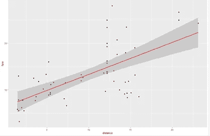

## 模型 3:减少秒数，在距离和高峰时间之间产生交互项

通过在距离和高峰时间之间添加一个交互项，我假设距离对票价的影响在高峰时间和非高峰时间是不同的，这是有道理的。你可以在下午 5 点在加州行驶 1 英里，可能需要 30 美元，因为有几个用户需要这项服务，而在凌晨 4 点同样的乘车只需要 3 美元——根据供求规律，一天中的时间将影响你为拼车支付的费用。根据是否是高峰时间，费用会有所不同。这基本上是激增定价的代理。

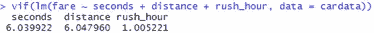

我把秒从这个模型中去掉是因为距离和秒的相关度是 0.913，这是极高的，在模型 1 的分析中提到过。两者之间的 VIF 没有 10 那么高，但仍然相对较高。从模型中剔除秒数并没有显著降低 R 平方，我将在下面讨论。

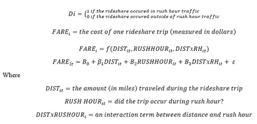

这个模型就变成了

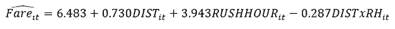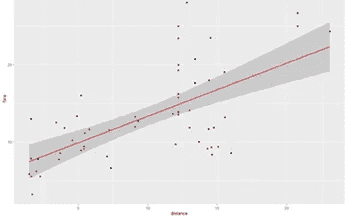

## 比较模型

*(文字输出请不要嫌弃我)。*

从上面的输出可以看出，尽管变量发生了变化，但模型之间的 R 平方并没有太大的变化。不幸的是，R 平方不是很高。增加更多的变量和数据将会改善这种情况。

## 模型 4:线性与稳健线性模型与分位数回归

我想让这个分析尽可能简洁明了，但是我也想确保我提到了这样一个事实，即我还可以使用其他几种回归方法。线性回归是最著名的方法，因此也是我在整个分析中使用的方法。稳健的线性模型简单地控制了异常值，这在我的数据集中不是一个大问题。

分位数回归模型不像线性模型那样取平均值，而是使用条件中值函数进行估计。这也可以控制异常值。深入探讨这个问题超出了本次分析的范围，尤其是因为样本量相对较小，但是我想把它作为一个警告包括进来。优步实际上在 2016 年写了一篇关于 quantreg 的文章，以解释他们与[和](https://eng.uber.com/analyzing-experiment-outcomes/)交易的各种定价动态。

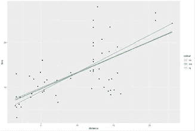

# 结论:如果你开车少于 10，000 英里，扔掉你的车

我在前两个模型的分析中保持秒不变，并在输出中包括了高峰时间。我把高峰时间包括在内，因为这将为日益拥堵的城市和普通人的通勤时间表提供最可靠的分析。对于美国的分析，我将间接成本设置为 3000 美元，以梳理出加州的生活成本。

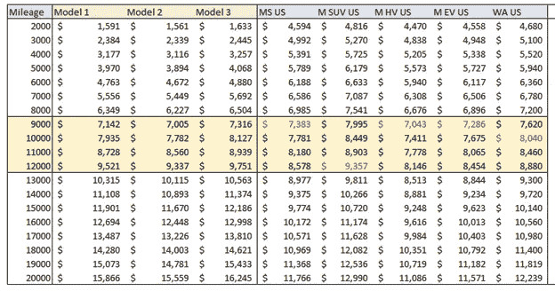

我对每一个都进行了颜色编码，以显示哪一点更适合你驾驶。对于大多数车型，交叉点在 9000-12000 英里之间。如果你有一辆混合动力、电动或中型轿车，你会得到最大的回报。拼车公司只能在最高 9000 英里的价格上竞争。SUV 是最昂贵的车辆，其交叉点约为 12，000 英里。

如果你在加州拥有一辆车，那你就是在浪费钱。在大多数情况下，使用 rideshare 要便宜得多。我将间接成本设定为 6000 美元，以说明加州生活成本的提高。

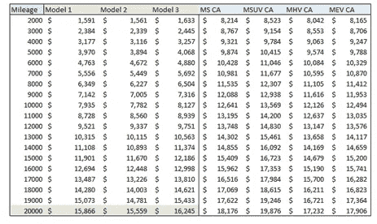

有很多原因可以说明这个数据，包括我如何给汽车定价和我的个人拼车数据。**然而，根据这项分析，与开车相比，拼车对于低里程用户来说是更好的选择。**

珍惜时间有不同的方式，这可能会影响你对拼车和开车的评价。但是你有更多的自由驾驶汽车，不必担心其他乘客、司机或无法控制车辆。此外，这个数据没有考虑到加州 AB5 的变化，这可能会从根本上改变所有的模型，这是非常可悲的。

总的来说，驾驶体验相当主观。从数量的角度来看，有时搭车会更便宜。定性来说，这完全取决于你看重什么。

** *免责声明:这些都不是投资建议，我与任何拼车公司都没有关联*