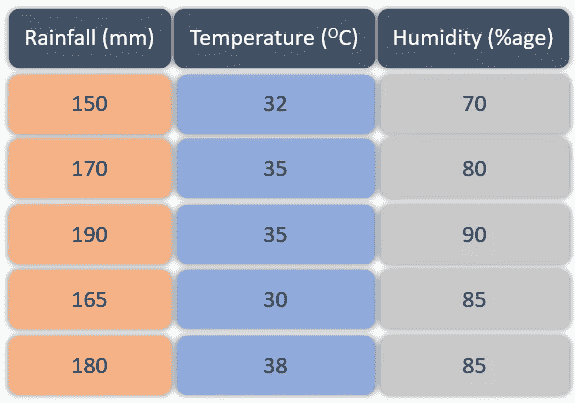
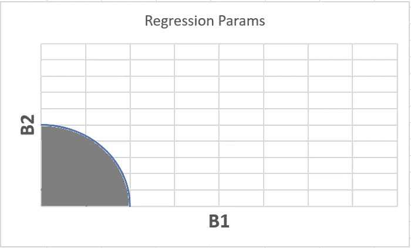
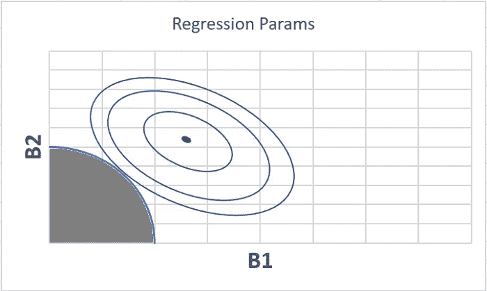

# 岭回归——两个概念的图解故事

> 原文：<https://towardsdatascience.com/ridge-regression-a-graphical-tale-of-two-concepts-8fac90e6f8e1?source=collection_archive---------34----------------------->

*照片由* [亚伯拉罕·奥索里奥](https://unsplash.com/@abeosorio?utm_source=unsplash&utm_medium=referral&utm_content=creditCopyText) *于* [Unsplash](https://unsplash.com/s/photos/ridge?utm_source=unsplash&utm_medium=referral&utm_content=creditCopyText)

回归很可能是人们学习的第一个机器学习算法。它是基本的、简单的，同时也是非常有用的工具，可以解决很多机器学习问题。本文是关于岭回归的，对 [**线性回归**](https://en.wikipedia.org/wiki/Linear_regression) 进行了修改，使其更适合**特征选择**。整个故事分为四个同等重要的部分，如下所述:

1.  **线性回归:**说明线性回归中普通最小二乘法的基本思想。
2.  **特征选择:**阐述了什么是机器学习中的特征选择，以及它的重要性。
3.  **参数计算:**用图形表示的线性回归计算哪些参数。
4.  **岭回归:**最后一节，结合以上概念来解释岭回归。

为了理解这个概念，请仔细阅读所有四个部分。现在，让我们开始:

1.  **线性回归**

假设给我们一个二维数据集，如下图所示，我们打算将一个线性模型放入其中。图表中的黑点显示了左侧表格中显示的数据点。蓝线是拟合到数据中的线性模型&红色箭头显示预测值和实际因变量值(Y)的差异。

在线性回归模型中，以 d1^2 + d2^2 + d3^2 + d4^2 + d5^2 最小化的方式将一条线拟合到数据中，即残差的平方(实际值和预测值之间的差异)最小化。在更一般的形式中，它可以表示如下:

这个量叫做残差平方和(RSS)，这里 yi 代表因变量的预测值。用这种方法求线性模型的方法称为普通最小二乘法。拟合模型的形式如下:

上式中的 **Bo** 为截距， **B1** 为模型的斜率， **X** 和 **Y** 分别为自变量和因变量。

**2。功能选择**

在任何机器学习问题中，我们都有预测器，也称为特征或自变量，根据提供的数据，我们需要了解这些变量与响应变量(也称为因变量)的关系。简单来说，我们需要找出以下关系:

我们将 **y** 作为响应变量，将 **p** 作为预测变量(x1，x2，… xp)，上面的等式代表了两者之间的实际函数关系。在机器学习中，我们需要尽可能准确地找到这种关系。对模型的研究带来了许多挑战，如数据不足或缺失、缺失预测因子、无关预测因子、预测因子之间的相关性、数据格式错误等。我们在机器学习中面临的所有挑战都可以通过不同的方法来缓解。我们将在这个主题中解决的挑战是“不相关的预测”。我将用一个例子来说明这个问题。

考虑了解降雨量与温度、湿度、地理位置和该地区人们的发色之间的关系。直觉表明，降雨的发生可能与前三个预测因素有关，但降雨与人的头发颜色之间似乎没有逻辑联系。给定数据集，如果我们试图拟合一个回归模型，该模型也会根据头发颜色数据进行自我调整，这是错误的。理想情况下，我们的模型训练方法应该消除不必要的预测，或者至少给它们较小的权重。类似地，如果预测因子之间存在相关性(如湿度与地理位置相关，沿海地区更潮湿等)。)，模特也要学那个。消除或减少不必要预测因子权重的过程称为特征选择。这个概念在当前场景中很重要，因为岭回归直接处理它。

**3。回归中的参数计算**

虽然回归中的最小二乘法的过程已经讨论过了，但是现在是用图形来理解这个概念的时候了。考虑下面给出的数据集。降雨量与温度和湿度的系统由数据表示:

如果我们希望通过回归拟合上述数据中的模型，我们需要拟合类型为 **Y = Bo + B1 X1 + B2 X2** 的线性方程，或者更简单地说，我们需要计算 **Bo** 、 **B1** 和 **B2** 。这里 **X1** 是温度 **X2** 是湿度 **Y** 是降雨量。让我们暂时忘记**波**(截距)，为 **B1** 和 **B2** 选择任意值，比如说**B1**= 1&**B2**= 2。这些并不是我们想要的值，而是为了理解一个概念而随机选择的。还有，我们把 **Bo** 的值取为零。现在，我们有了参数值，让我们预测降雨量值并计算 RSS(误差平方和)。下表显示了所需的计算:

由上表可见，对于 **B1** = 1 和 **B2** =2，RSS 值为 3743。在这里总结任何东西之前，让我们假设一个不同的回归参数值集。设 B1 = 3.407，B2 = 1，我们继续忽略 **Bo** 。如果我们再次进行预测计算&也计算 RSS，你会发现它会再次出来是 3743(几乎)。这里我想说的一点是，对于残差平方和为常数的回归参数，有不同的值。如果绘制这些点，将生成如下所示的图:

上图针对的是两个预测因子的系统，预测因子的数量越多，上图的尺寸就越大。我们最初假设 **Bo** 为零，但是对于 **Bo** 的任何值，曲线仍然相同，只是根据 **Bo** 的符号&大小向上或向下移动。

上述图称为**回归的成本等值线图**。每个轮廓或循环绘制在参数 **B1** 和 **B2** 之间，代表一个恒定的 RSS 值。在回归中，我们的目标是找出由中心点表示的值，该值既唯一又代表最小 RSS。

**4。岭回归**

岭回归是对最小二乘回归的改进，使其更适合特征选择。在岭回归中，我们不仅试图最小化残差平方和，还试图最小化等于回归参数平方和乘以调整参数的另一项。换句话说，在岭回归中，我们试图最小化以下数量:

上述表达式中的第一项是残差平方和，第二项是岭回归中特别添加的内容。因为这是岭回归中引入的一个特殊术语，所以让我们试着进一步理解它。对于有两个预测器的数据集，它将是 *a* (B1^ 2+ B2^ 2)，其中 *a* 是调整参数。它也被称为惩罚项，因为它对回归的最小二乘法施加了约束。在寻求最小化它的过程中，它被限制到一个特定的值，由下面的等式描述:

仔细看上面的方程，是一个阴影圆的方程，半径的平方等于 ***s/a*** *(约束)*，其中一部分如下图所示:

将上述图表与成本分布图结合起来，将得到如下所示的图表:

上图给出了岭回归的思想。这是最小二乘条件满足参数约束或惩罚条件的地方。代表约束的圆的半径直接取决于调谐参数( *a* )。调谐参数值越大，圆越小，惩罚越高。你可以借助上图直接想象一下。调谐参数的值越大，圆越小，两个图形的交点越靠近原点，因此回归参数的值越小。

**结论:**

在岭回归中，寻找对应于最小残差平方和的参数不是所寻求的。对参数施加约束以检查它们，因此不允许它们增长。这个条件确保不同的参数被赋予不同的权重，因此成为特征选择的重要工具。请注意，在岭回归中，任何预测值的参数都不会为零，但参数权重是变化的

这就是岭回归的全部内容。请发表您的评论/建议。关于这个话题的任何疑问，你可以通过 [**LinkedIn**](https://www.linkedin.com/in/tanvirhurra/) 联系我。

**进一步阅读:**

*   [拉索**回归**拉索](https://en.wikipedia.org/wiki/Lasso_(statistics))
*   [**子集选择**](https://en.wikipedia.org/wiki/Feature_selection)

谢谢，

祝你玩得愉快😊

*原载于 2020 年 4 月 17 日 https://www.wildregressor.com**[*。*](https://www.wildregressor.com/2020/04/ridge-regression-graphical-tale-of-two.html)*