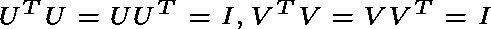
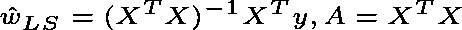
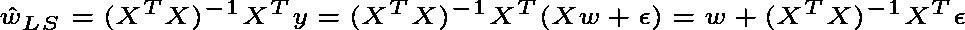
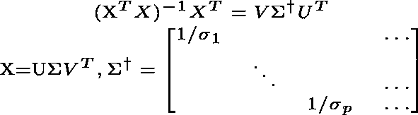
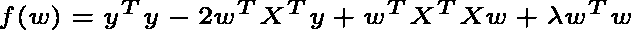
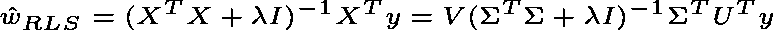
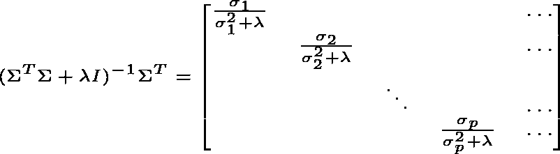
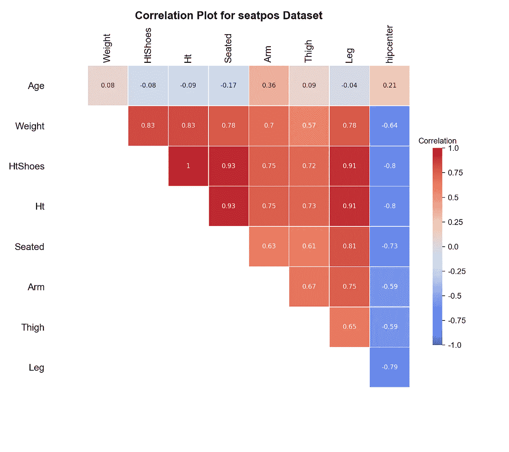
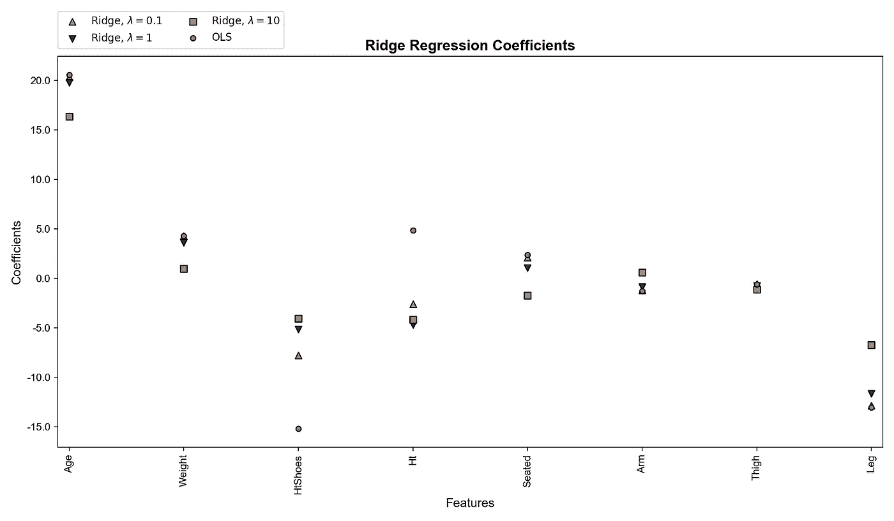

# 机器学习中的奇异值分解:岭回归和多重共线性

> 原文：<https://towardsdatascience.com/ridge-regression-and-multicollinearity-d8a3e06efce8?source=collection_archive---------10----------------------->

## 了解什么是多重共线性，它如何影响最小二乘法，以及经典岭回归如何有所帮助


来源:[苏珊·尤泽勒](https://pixabay.com/users/suju-165106/?utm_source=link-attribution&utm_medium=referral&utm_campaign=image&utm_content=4727668)来自[皮克斯拜](https://pixabay.com/?utm_source=link-attribution&utm_medium=referral&utm_campaign=image&utm_content=4727668)

本文从[奇异值分解](https://www.wikiwand.com/en/Singular_value_decomposition) (SVD)的角度讨论了什么是多重共线性，它如何影响最小二乘法，以及岭回归如何帮助避免这种情况。它在很大程度上基于 Rebecca Willet 教授的课程机器学习的数学基础，并假设了线性代数的基础知识。

在本节中，我们将研究多重共线性以及它如何影响最小二乘法。

# 多重共线性

考虑一个形状为 *n* × *p* 的矩阵**X。对于其列 *X₁* ， *X₂* ，…， *Xₚ* ∈ ℝⁿ，我们说它们是**线性无关**当且仅当 *∑αᵢXᵢ* = 0 对于 *i* = 1，2，…， *p* 。**直观上**，在 *X* 中没有一列可以写成其他的加权和。反过来，如果某些列不是这种情况，我们称它们为**线性相关**。假设 rank( *X* ) = *r* ，那么 *X* 的( *p* — *r* )列是线性相关的。**

**多重共线性**在回归术语中，指的是多元回归模型中的一个预测因子可以从其他预测因子中以相当高的准确度进行线性预测的现象。换句话说，预测值近似是其他预测值的线性组合。完美的多重共线性表示特征矩阵中的线性相关性。**直觉上**，这意味着我们的特征中存在冗余，其中一些特征无法为回归提供唯一和/或独立的信息。

多重共线性不仅在理论上很重要，在实践中也很重要。系数估计值可能会随着模型或数据的微小变化而不规则地变化，而它们本身根本没有意义。为什么会这样？我们将从奇异值分解的角度来看。在此之前，下面是对奇异值分解的快速回顾。

# 奇异值分解

对于矩阵 *X，t* 这里总是存在矩阵*，***σ***， ***V*** 这样:*

**

*当 *U* 和 *V* 正交时:*

**

**σ*是对角线:*

**

**σ*的对角元素称为奇异值(*σ₁*≥*σ₂*≥…≥*σₚ*≥0)。非零奇异值的个数是矩阵 *X* 的秩，*σ*的列是 *X* 的行的基础。*

# *多重共线性最小二乘*

*回想一下，对于特征矩阵 *X* 和目标变量 ***y*** ，最小二乘法试图通过最小化残差的平方和来近似线性系统 *y* = *Xw* 的解。权重向量可以用 [**法方程**](http://mlwiki.org/index.php/Normal_Equation#Normal_Equation) 写出:*

**

*请注意，A 是可逆的当且仅当 *n* ≥ *p* 并且秩( *X* ) = p。现在不难看出为什么完美多重共线性是最小二乘的一个主要问题:它意味着特征矩阵不是满秩的，因此我们无法找到一组适当的系数来最小化残差平方和。*

*然而，为什么多重共线性，或者具体来说是强多重共线性，也是有问题的呢？让我们从 SVD 的角度来了解一下。*

*考虑到真实权重 ***w*** ，我们知道*y*=*xw*+*ϵ*，其中 ***ϵ*** 是一些可忽略的噪声或误差:*

**

*我们可以看到，最小二乘系数通过 *ϵ* 乘以某个通货膨胀项而偏离真实权重。仔细看看本文末尾链接的前一篇文章中的通货膨胀术语:*

**

*如果 x 的所有列线性无关，我们仍然有 *p* 奇异值和*σ₁*≥*σ₂*≥…≥*σₚ>*0。**但是，**随着多重共线性的存在，一些 *σᵢ* ， *σₚ* 等将接近于零。那么对角元素 1/ *σₚ* 将是巨大的，导致真正大的膨胀项，因此最小二乘权重与真实权重有很大的偏差。**直觉上**，多重共线性会损害最小二乘法，因为它会导致较小的奇异值。系数的估计误差由于这些奇异值的倒数而增大，因此变得太大而不能忽略。*

*如何才能避免这种情况？一种可能是**岭回归**。*

*在本节中，我们将了解岭回归如何通过正式推导来帮助避免线性回归中多重共线性所导致的问题。*

# *里脊回归*

*岭回归通过在成本函数中添加正则化项来建立在最小二乘法的基础上，因此它变成∩*y-Xw*∩+*λ*∩*w*∩，其中 ***λ*** 表示正则化的强度。我们可以将成本函数 *f(w)* 写成:*

**

*然后我们可以计算梯度并将其设置为零:*

****

*仔细看看表达式的中间部分:*

**

*这有什么帮助？*

*考虑 *σₚ* ≈ 0，这次 *σₚ* /( *σₚ + λ* ) ≈ 0 当且仅当 *λ* ≠ 0。因此，使用岭回归，不重要要素的系数将接近于零(但不会恰好为 0，除非存在完美的多重共线性),并且误差项不会膨胀到爆炸式增长。注意，当没有正则化( *λ* = 0)时，事情回到最小二乘法。还有，对于大多数场合( *σₚ* ≫ *λ* )，*σₚ*/(*σₚ+λ*)≈1/*σₚ*就像在最小二乘法中一样。*

# *实证结果*

*在本节中，我们将使用一个样本数据集`[*seatpos*](https://www.rdocumentation.org/packages/faraway/versions/1.0.7/topics/seatpos)`来验证我们之前的发现。*

> *汽车司机为了自己的舒适喜欢调整座位位置。汽车设计者会发现知道不同的司机会根据他们的身材和年龄把座位放在哪里是很有帮助的。密歇根大学 HuMoSim 实验室的研究人员收集了 38 名司机的数据。*

*数据集包含以下特征:*

*我们希望拟合一个基于数据集中所有其他特征预测`hipcenter`的线性模型。根据描述，一些特征可以彼此紧密相关。比如`Weight`和`Ht`，`Ht`和`HtShoes`。绘制相关矩阵:*

**

*上面的情节证实了我们的猜测。在我们的特征矩阵中有很强的多重共线性。好消息是，我们的目标`hipcenter`与大多数特性密切相关，我们可以期待一个很好的匹配。产生上述相关图的代码:*

*使用以下代码块:*

1.  *向特征矩阵添加偏移量；*
2.  *将数据集分成训练集和测试集；*
3.  *归一化特征矩阵，以便我们可以比较系数，因为我们期望变化较大的特征具有较小的系数，*其他条件相同**

*为了简单起见，首先看一个只有`Ht`和`HtShoes`作为预测器的模型。*

```
*X_train_sub = X_train_[:, 2:4]
X_test_sub = X_test_[:, 2:4]ls = LinearRegression(fit_intercept=True)
ls.fit(X_train_sub, y_train)
print(ls.intercept_, ls.coef_) -165.844 [54.745 -105.923]*
```

*令人惊讶的是，尽管`Ht`和`HtShoes`几乎完全相关，但它们对`hipcenter`的部分影响却具有相反的符号。这可能是高度多重共线性的结果。改为拟合一个 *λ* = 10 的岭回归模型。*

```
*ridge = Ridge(alpha=10)
ridge.fit(X_train_sub, y_train)
print(ridge.intercept_, ridge.coef_) -165.844 [-21.593  -22.269]*
```

*岭回归的系数似乎更有意义。将其测试 [RMSE](https://www.wikiwand.com/en/Root-mean-square_deviation) 与最小二乘法进行比较。*

```
*ls_rmse = mean_squared_error(y_test, ls.predict(X_test_sub))
ridge_rmse = mean_squared_error(y_test, ridge.predict(X_test_sub))print("Least squares test RMSE: {:.3f}".format(ls_rmse))
print("Ridge test RMSE: {:.3f}".format(ridge_rmse)) Least squares test RMSE: 643.260
  Ridge test RMSE: 519.287*
```

*对于二元线性模型，岭回归导致更好的泛化能力。然而，由于岭回归引入了正则化项，它的偏差有时可能会更高，以换取更低的方差，这可能导致更差的拟合。*

*最后，让我们看看完整的模型，并检查最小二乘法和岭回归中系数的大小如何不同，以及它们如何随着惩罚的强度 *λ* 而变化。*

**

*我们可以看到，最小二乘权重与岭回归权重在`Ht`和`HtShoes`上的差异很大，正如预期的那样。随着惩罚越来越强，岭回归权重越来越接近零。产生上述图的代码:*

*这篇文章是何坤宇写的。昆玉目前是芝加哥大学的硕士生。他发现理解统计建模和机器学习技术、将它们应用于真实世界的数据并帮助创建金融服务行业的端到端解决方案是一件有趣的事情。在 LinkedIn 上联系昆玉！🐷*

*[](https://www.linkedin.com/in/kunyuhe/) [## 昆玉何-即将上任的全球量化策略非周期分析师-美银美林…

### 芝加哥大学正在接受理学硕士计算分析项目培训的数据科学家。对…充满热情

www.linkedin.com](https://www.linkedin.com/in/kunyuhe/)*