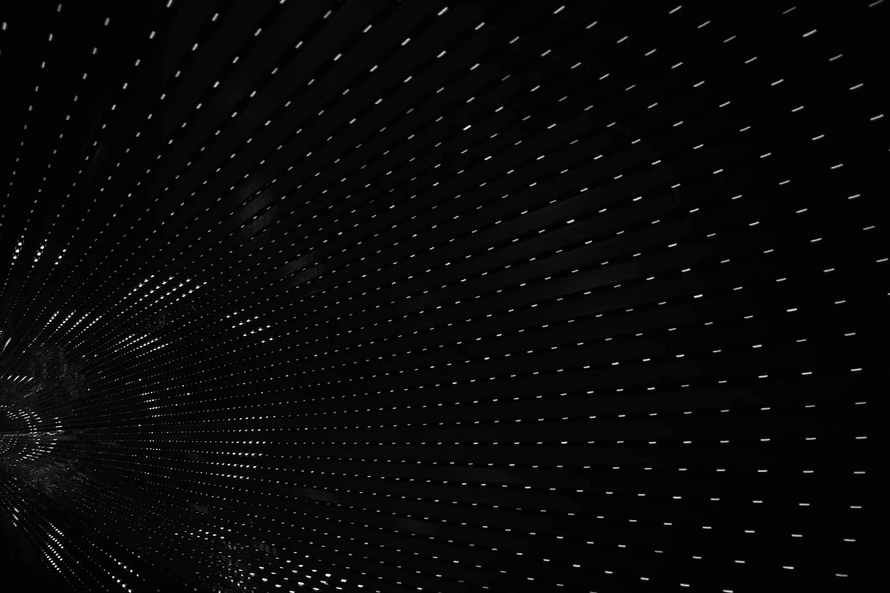
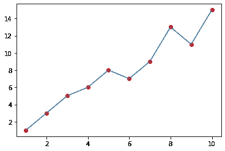
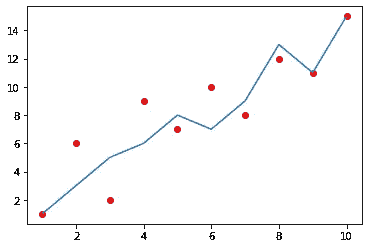

# 从零开始岭回归正则化

> 原文：<https://towardsdatascience.com/ridge-regression-regularization-from-scratch-9149be19ff19?source=collection_archive---------62----------------------->

## 降低回归模型的方差。



贾里德·阿兰戈在 [Unsplash](https://unsplash.com/s/photos/abstract?utm_source=unsplash&utm_medium=referral&utm_content=creditCopyText) 上的照片

为了使机器学习模型有效，它必须在偏差和方差之间取得平衡。岭回归正则化旨在通过折衷偏差来减少方差。

# 偏差和方差:

要理解岭回归正则化的使用及其实现，需要了解它试图解决的问题的一些背景。

偏差本质上是模型的均方误差，当应用于它被训练的数据时。具有低均方误差的模型因此具有低偏差。

方差是将数据与数据集的不同样本进行比较时，损失变化的度量。过度拟合的模型具有很高的方差，因为它们的预测对其他样本不起作用。



这个模型有很高的偏差，因为它完美地符合每一点。



然而，当对一个不同的样本进行拟合时，它没有被训练过，表现很差。

每种机器学习算法都有偏差和方差之间的权衡。一般的经验法则是，参数越多的模型偏差越小，但方差越大，而参数越少的模型偏差越大，但方差越小。

# 岭正则化如何减少方差？

与最小化均方误差函数的回归模型相反，岭正则化最小化添加到λ和斜率平方的乘积的均方误差函数。

# 代码:

```
import numpy as np
from matplotlib import pyplot as pltdef sigmoid(x):
    return 1/(1+np.exp(-x))def sigmoid_p(x):
    return sigmoid(x)*(1 -sigmoid(x))def relu(x):
    return np.maximum(x, 0)def relu_p(x):
    return np.heaviside(x, 0)def tanh(x):
    return np.tanh(x)def tanh_p(x):
    return 1.0 - np.tanh(x)**2def deriv_func(z,function):
    if function == sigmoid:
        return sigmoid_p(z)
    elif function == relu:
        return relu_p(z)
    elif function == tanh:
        return tanh_p(z)class NeuralNetwork:
    def __init__(self):
        self.layers = []
        self.weights = []
        self.loss = []
    def add(self,layer_function):
        self.layers.append(layer_function)

    def propagate(self,X):
        As,Zs = [],[]
        input_data = X
        for layer in self.layers:
            index = self.layers.index(layer)
            weights = layer.initialize_weights(self.layers,index)
            if type(weights) != type(None) :
                self.weights.append(weights)
            a,z = layer.propagate(input_data)
            As.append(a)
            Zs.append(z)
            input_data = a
            print(a.shape)
        return As,Zs

    def train(self,X,y,iterations):
        loss = []
        for i in range(iterations):
            As,Zs = self.propagate(X)
            loss.append(np.square(sum(y - As[-1])))
            As.insert(0,X)
            g_wm = [0] * len(self.layers)
            for i in range(len(g_wm)):
                pre_req = (y-As[-1])*2
                a_1 = As[-(i+2)]
                z_index = -1
                w_index = -1
                if i == 0:
                    range_value = 1
                else:
                    range_value = 2*i
                for j in range(range_value):
                    if j% 2 == 0:
                        pre_req = pre_req * sigmoid_p(Zs[z_index])
                        z_index -= 1
                    else:
                        pre_req = np.dot(pre_req,self.weights[w_index].T)
                        w_index -= 1
                gradient = np.dot(a_1.T,pre_req)
                g_wm[-(i+1)] = gradient
                for i in range(len(self.layers)):
                    if self.layers.trainable == True:
                        self.layers[i].network_train(g_wm[i])

        return loss

    class Perceptron:
        def __init__(self,nodes,input_shape= None,activation = None):
            self.nodes = nodes
            self.input_shape = input_shape
            self.activation = activation
            self.trainable = True
        def initialize_weights(self,layers,index):
            if self.input_shape:
                self.weights = np.random.randn(self.input_shape[-1],self.nodes)
            else:
                self.weights = np.random.randn(layers[index-1].output_shape[-1],self.nodes)
            return self.weights
        def propagate(self,input_data):
            z = np.dot(input_data,self.weights)
            if self.activation:
                a = self.activation(z)
            else:
                a = z
            self.output_shape = a.shape
            return a,z
        def network_train(self,gradient):
            self.weights += gradient

model = NeuralNetwork()Perceptron = model.Perceptron
```

这是我创建的一个神经网络框架，执行基本的线性和逻辑回归。我在这里添加了完整的代码，这样当示例完成时，您可以自己实现它。让我们从培训功能中删除所有内容:

```
def train(self,X,y,iterations):
        loss = []
        for i in range(iterations):
            As,Zs = self.propagate(X)
            loss.append(np.square(sum(y - As[-1])))
            As.insert(0,X)
            g_wm = [0] * len(self.layers)
            for i in range(len(g_wm)):
                pre_req = (y-As[-1])*2
                a_1 = As[-(i+2)]
                z_index = -1
                w_index = -1
                if i == 0:
                    range_value = 1
                else:
                    range_value = 2*i
                for j in range(range_value):
                    if j% 2 == 0:
                        pre_req = pre_req * sigmoid_p(Zs[z_index])
                        z_index -= 1
                    else:
                        pre_req = np.dot(pre_req,self.weights[w_index].T)
                        w_index -= 1
                gradient = np.dot(a_1.T,pre_req)
                g_wm[-(i+1)] = gradient
                for i in range(len(self.layers)):
                    if self.layers.trainable == True:
                        self.layers[i].network_train(g_wm[i])
```

这个代码通过神经网络导航，将导数链接到它们各自的部分。您会注意到变量 pre_req 对于所有计算的梯度都是一致的。这是预测对损失函数的偏导数。我们需要更改的只是那行代码:

```
pre_req = (y-As[-1])*2
```

目前，该变量包含均方误差函数的导数。让我们用岭回归损失函数的导数来代替它:

```
#The loss function
loss = np.square(y-As[-1]) + lam*self.weights[0]
#the derivative
pre_req = (y-As[-1])*2 + lam*self.weights[0]
```

# 结论:

岭正则化的工作原理是对较高斜率值的模型进行惩罚，从而降低数据集中不同样本之间的方差

谢谢你看我的文章！