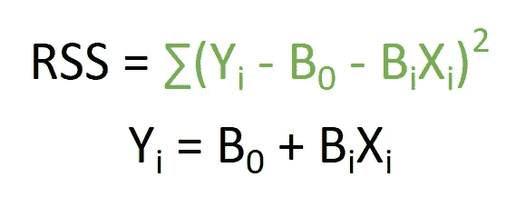
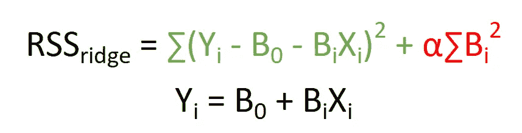

# 简易模式下的岭回归

> 原文：<https://towardsdatascience.com/ridge-regressions-on-easy-mode-9e7353a0e3f9?source=collection_archive---------76----------------------->

## 了解岭回归模型背后的理论，如何通过 python 和 scikit-learn 对其进行编码和调优。

# 它们是什么？

岭回归可以被认为是线性回归的一个**步骤。它们也被称为吉洪诺夫正则化；和对于**缓解线性回归**中的多重共线性问题特别有用，该问题通常出现在具有大量参数的模型中。**


照片由[尼古拉斯·J·勒克莱尔](https://unsplash.com/@nicolasjleclercq?utm_source=medium&utm_medium=referral)在 [Unsplash](https://unsplash.com?utm_source=medium&utm_medium=referral) 拍摄

*简单概括线性回归*:他们通过最小化模型的*残差平方和(RSS)* 来估计*线性模型截距*和*斜率系数*。RSS 公式及其生成的线性模型如下所示:



点击[这里](https://medium.com/python-in-plain-english/linear-regressions-with-scikitlearn-a5d54efe898f?source=your_stories_page---------------------------)了解更多关于如何用 python 编写自己的线性回归代码！

虽然简单的线性回归在大多数数据分析情况下通常被认为是有效的，但它们总是产生直线最佳拟合线。这源于关于因变量和自变量之间关系的强有力的先验假设:它们具有线性关系。

当我们不得不抛弃这个假设时，问题就来了，我们需要接受缺乏参数来控制模型复杂性的事实。

> 这就是岭回归的用武之地。他们增加了一个额外的术语，如下图红色所示。

这一项被称为 *L2 正则化参数*，其中 **L1 可以产生稀疏模型，而 L2 不能。**最终结果仍然是一个简单的线性模型，如果使用 OLS 方法，其格式**与**相似，但系数**可能不同**。(通过下面的示例显示)



岭回归方程

正则项充当**损失函数**，它是在计算岭回归的 RSS 时对错误预测的**惩罚。它通过**将系数的平方值加到模型的 RSS 上来起作用。**由于“最佳”模型是具有最小 RSS 的模型，**具有较大系数的模型根据**被有效过滤。**

正则化的作用是**通过试图限制模型以降低复杂性来减少过拟合**。正则项通过**将系数的平方值添加到模型的 RSS 中来起作用。**由于“最佳”模型是 RSS 最小的模型，因此**系数较大的模型会根据**进行有效过滤。

**最终结果是，模型更喜欢系数较小的特征。**

正则化对于 100+变量特别有效。**此外，正则化的量由正则化项中的阿尔法参数控制。**较高的 alpha 值导致模型招致更多的惩罚，使系数进一步向 0 收缩。python 中的默认值是 1。**一个特殊的情况是，当α= 0 时，得到的模型相当于 OLS 简单线性回归。**

# 代码

为了举例说明岭回归的编码，我们将看看如何使用*犯罪数据集*。

## 包装

对于包，让我们导入*犯罪数据集、*和用于创建训练测试分割、进行 MixMaxScaling 和创建岭回归的类。

```
import numpy
from adspy_shared_utilities import load_crime_dataset
from sklearn.model_selection import train_test_split
from sklearn.preprocessing import MinMaxScaler
from sklearn.linear_model import Ridge
```

## 加载数据集，并创建 75 / 25 列车测试数据分割:

```
(X_crime, y_crime) = load_crime_dataset()

X_train, X_test, y_train, y_test = train_test_split(X_crime,
                                   y_crime, random_state = 0)
# take note of the indentation.
```

## 缩放训练和测试数据集:

```
scaler = MinMaxScaler()
X_train_scaled = scaler.fit_transform(X_train)
X_test_scaled = scaler.transform(X_test)
```

## 创建 alpha 值为 20.0 的岭回归对象，并在缩放的 X 训练数据上拟合该对象以及相应的训练数据 Y 标签:

```
linridge = Ridge(alpha=20.0).fit(X_train_scaled, y_train)
```

## 获取模型系数:

```
linridge.intercept_
linridge.coef_ **-3352.423035846206
[  1.95091438e-03   2.19322667e+01   9.56286607e+00  -3.59178973e+01
   6.36465325e+00  -1.96885471e+01  -2.80715856e-03   1.66254486e+00
  -6.61426604e-03  -6.95450680e+00   1.71944731e+01  -5.62819154e+00
   8.83525114e+00   6.79085746e-01  -7.33614221e+00   6.70389803e-03
   9.78505502e-04   5.01202169e-03  -4.89870524e+00  -1.79270062e+01
   9.17572382e+00  -1.24454193e+00   1.21845360e+00   1.03233089e+01
  -3.78037278e+00  -3.73428973e+00   4.74595305e+00   8.42696855e+00
   3.09250005e+01   1.18644167e+01  -2.05183675e+00  -3.82210450e+01
   1.85081589e+01   1.52510829e+00  -2.20086608e+01   2.46283912e+00
   3.29328703e-01   4.02228467e+00  -1.12903533e+01  -4.69567413e-03
   4.27046505e+01  -1.22507167e-03   1.40795790e+00   9.35041855e-01
  -3.00464253e+00   1.12390514e+00  -1.82487653e+01  -1.54653407e+01
   2.41917002e+01  -1.32497562e+01  -4.20113118e-01  -3.59710660e+01
   1.29786751e+01  -2.80765995e+01   4.38513476e+01   3.86590044e+01
  -6.46024046e+01  -1.63714023e+01   2.90397330e+01   4.15472907e+00
   5.34033563e+01   1.98773191e-02  -5.47413979e-01   1.23883518e+01
   1.03526583e+01  -1.57238894e+00   3.15887097e+00   8.77757987e+00
  -2.94724962e+01  -2.32995397e-04   3.13528914e-04  -4.13628414e-04
  -1.79851056e-04  -5.74054527e-01  -5.17742507e-01  -4.20670930e-01
   1.53383594e-01   1.32725423e+00   3.84863158e+00   3.03024594e+00
  -3.77692644e+01   1.37933464e-01   3.07676522e-01   1.57128807e+01
   3.31418306e-01   3.35994414e+00   1.61265911e-01  -2.67619878e+00]**
```

## 获得模型 R 平方得分

```
linridge.score(X_train_scaled, y_train)
linridge.score(X_test_scaled, y_test)**-31.672
-37.249**
```

## 非零特征的数量:

```
(np.sum(linridge.coef_ != 0))**88**
```

## 调整 alpha 值以最大化训练和测试分数。我们可以获得非零特征的数量以及如下的训练和测试分数:

```
for alpha in [0, 1, 10, 20, 50, 100, 1000]:
    linridge = Ridge(alpha = this_alpha).fit(X_train_scaled,y_train) 
    r2_train = linridge.score(X_train_scaled, y_train)
    r2_test = linridge.score(X_test_scaled, y_test)
    num_coeff_bigger = np.sum(abs(linridge.coef_) > 1.0)
    print('Alpha = {:.2f}\nnum abs(coeff) > 1.0: {}, \
r-squared training: {:.2f}, r-squared test: {:.2f}\n'
         .format(this_alpha, num_coeff_bigger, r2_train, r2_test))**Ridge regression: effect of alpha regularization parameter****Alpha = 0.00
num abs(coeff) > 1.0: 88, r-squared training: 0.67, r-squared test: 0.50

Alpha = 1.00
num abs(coeff) > 1.0: 87, r-squared training: 0.66, r-squared test: 0.56

Alpha = 10.00
num abs(coeff) > 1.0: 87, r-squared training: 0.63, r-squared test: 0.59

Alpha = 20.00
num abs(coeff) > 1.0: 88, r-squared training: 0.61, r-squared test: 0.60

Alpha = 50.00
num abs(coeff) > 1.0: 86, r-squared training: 0.58, r-squared test: 0.58

Alpha = 100.00
num abs(coeff) > 1.0: 87, r-squared training: 0.55, r-squared test: 0.55

Alpha = 1000.00
num abs(coeff) > 1.0: 84, r-squared training: 0.31, r-squared test: 0.30**
```

# 结论

通过这篇文章，我希望您已经**了解了岭回归背后的理论，以及如何通过 python 和 scikit-learn 对岭回归模型进行编码和调优。**

我通过由 Coursera 主办的密歇根大学 MOOC“Python 中的应用机器学习”了解到了这一点。

如果你有问题或者想讨论后新冠肺炎世界，请随时联系我。

我希望我能够以这样或那样的方式帮助您学习数据科学方法！

这是另一篇数据科学文章！

[](https://medium.com/analytics-vidhya/k-nearest-neighbors-in-6-steps-efbcbebce54d) [## 6 步 k 近邻

### 使用 scikit-学习 python

medium.com](https://medium.com/analytics-vidhya/k-nearest-neighbors-in-6-steps-efbcbebce54d)