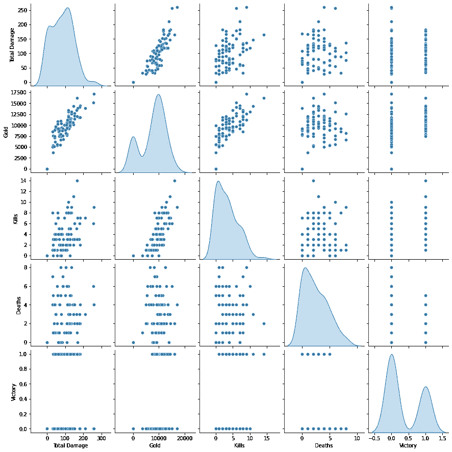
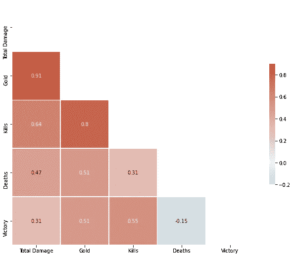
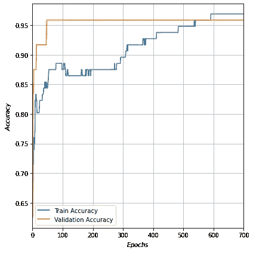
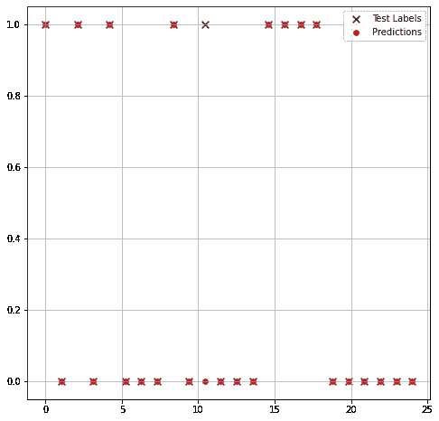

# Riot API:一个机器学习和数据分析应用

> 原文：<https://towardsdatascience.com/riot-api-a-machine-learning-and-data-analysis-application-c8524b4160b4?source=collection_archive---------15----------------------->

## [实践教程](https://towardsdatascience.com/tagged/hands-on-tutorials)

## 一个简单的基于 python 的教程，通过 Riot API 进行数据分析和机器学习，以提高个人水平


在 [Unsplash](https://unsplash.com?utm_source=medium&utm_medium=referral) 上[的照片](https://unsplash.com/@ffstop?utm_source=medium&utm_medium=referral)

# 为什么要看这篇文章？

一个简单的基于 python 的教程，通过 Riot API 进行数据分析和机器学习，以提高个人水平。

如果你正在阅读这篇文章，你可能是《英雄联盟》的粉丝，这是一款流行的 MOBA 类型的在线游戏(多人在线竞技场)。或者你可能对机器学习和数据分析在网络游戏世界中的可能应用感兴趣。这款游戏由 Riot Games 开发发布。

全世界有数百万玩家，这款游戏拥有广泛的业余玩家和职业玩家。它利用了游戏的不断进化和统计复杂性。这个游戏的基本原理(非常)简单。由于有成千上万的变量和可能的场景，每场比赛都是不同的。

给定大量的数据，提取重要的数据可以让你获得关于你的比赛风格的有趣信息。你可以提取有用的信息来改善你的游戏风格或预测你未来的表现。

许多网站如 op.gg 提供了大量的数据、分析和图表。这很好，但是如果您想要开发定制的或者更复杂的模型，您将需要一些手工工作。

[**Riot**Games**API**](https://developer.riotgames.com/)是一个 REST **API** 为开发者构建自己的应用或网站提供有用的数据。

我建议您在开始编程之前阅读文档，以避免违反服务的法律条款。您还可以避免数据请求速率的问题。

在接下来的部分中，我们将了解如何:

*   从 Riot API 中提取有用的数据
*   处理数据以获得有用的信息
*   创建简单的预测模型

# 从 Riot API 中提取有用的数据

让我们从安装和导入一些基本库开始。如果您使用的是 Google 协作笔记本，您将不会遇到任何问题，否则，您将需要根据您的操作系统安装单独的库。

```
!pip3 install riotwatcher!pip install -q seaborn!pip install -q git+https://github.com/tensorflow/docsimport numpy as np
import matplotlib.pyplot as plt
import pathlib
import pandas as pd
import seaborn as sns
import tensorflow as tf
import time
from tensorflow import keras
from tensorflow.keras import layers
import tensorflow_docs as tfdocs
import tensorflow_docs.plots
import tensorflow_docs.modeling
from riotwatcher import LolWatcher, ApiError
```

为了提取数据，我们使用了 [RiotWatcher](https://github.com/pseudonym117/Riot-Watcher) ，它是一个薄薄的包装器，位于英雄联盟的 [Riot Games API 之上。必须使用 Riot API 密钥，每 24 小时生成一次。请记住，此密钥是个人的，不应共享。让我们从提取一个玩家(或者召唤师)的一些信息开始:让我们得到想要的玩家的等级](https://developer.riotgames.com/)

```
lol_watcher = LolWatcher('%YOUR RIOT API KEY%')
my_region = 'euw1'
me = lol_watcher.summoner.by_name(my_region, '%YOUR SUMMONER NAME%')
my_ranked_stats = lol_watcher.league.by_summoner(my_region, me['id'])print(my_ranked_stats)
```

让我们提取一个更新版本的冠军，物品，召唤师法术和任何其他所需的属性，因此我们的比赛历史:

```
versions = lol_watcher.data_dragon.versions_for_region(my_region)
champions_version = versions['n']['champion']
summoner_spells_version=versions['n']['summoner']
items_version=versions['n']['item']
( ... )
current_champ_list = lol_watcher.data_dragon.champions(champions_version)
( ... )
my_matches = lol_watcher.match.matchlist_by_account(my_region, me['accountId'])
```

我们拥有大量的数据，这些数据的重要性是高度主观的。更多的功能将导致更复杂，但更准确的模型。为了获得真正准确的分析，有必要获得尽可能多的游戏信息，以更好地适应我们的模型，并使结果更可信。让我们从过去的 100 场比赛中提取数据，并定义一系列包含所有主要信息的熊猫数据帧。

```
n_games = 100Games = {}
Game_duration=np.zeros(n_games)
Damage = np.zeros(n_games)
(...)
j=0
cont=0
while cont<n_games:
 try:
  last_match = my_matches['matches'][cont]
  match_detail = lol_watcher.match.by_id(my_region,      last_match['gameId'])
  participants = []
  for row in match_detail['participants']:
   participants_row = {}
   participants_row['champion'] = row['championId']
   participants_row['win'] = row['stats']['win']
   participants_row['assists'] = row['stats']['assists']
   ( ... )
   participants.append(participants_row)
  Games[j] = pd.DataFrame(participants) champ_dict = {}
  for key in static_champ_list['data']: 
  row = static_champ_list['data'][key] 
  champ_dict[row['key']] = row['id'] summoners_dict = {}
  for key in static_summoners_list['data']:
   row = static_summoners_list['data'][key]
   summoners_dict[row['key']] = row['id'] Summoner_name = []
  for row in match_detail['participantIdentities']:
   Summoner_name_row = {}
   Summoner_name_row=row['player']['summonerName']
   Summoner_name.append(Summoner_name_row) i=0for row in participants:
   row['championName'] = champ_dict[str(row['champion'])]
   row['Summoner_name']=Summoner_name[i]
   row['Summoner Spell 1']=summoners_dict[str(row['spell1'])]
   row['Summoner Spell 2']=summoners_dict[str(row['spell2'])]
   i+=1

  Games[j]= pd.DataFrame(participants)
  for index, row in Games[j].iterrows():
    if row['Summoner_name']=='%YOUR SUMMONER NAME%':
      Damage[j]=row['totalDamageDealt']
      Gold[j]=row['goldEarned']
      ( ... )   time.sleep(10)
  j+=1
  cont+=1
 except:
  cont+=1
```

至此，我们已经提取了所有感兴趣的数据:让我们继续进行数据分析。警告:在每个循环中插入了 10 秒钟的暂停，以不超过 Riot API 允许的每小时请求的最大数量。

## 数据处理

在这一点上，我们拥有大量的数据，显然并不重要:要获得有用的信息，你需要将你在“游戏属性”方面的兴趣与数据分析和机器学习的现代算法结合起来，能够给出有效的答案。数据可以给出很多关于游戏中表现的答案，有可能发现优势/劣势，甚至根据你的现场游戏统计数据预测获胜的概率！为了便于理解，在下面的段落中给出了对一组简化的参数进行的一些简单分析作为例子，但是您可以很容易地生成更复杂和有趣的模型。我们可以从准备一个可以有效用于数据分析的数据库开始:让我们看看我们游戏的一些简单特性:

```
dataset={}
dataset['Total Damage']=Damage
dataset['Gold']=Gold
( ... )
dataset['Victory']=Victory #Boolean
```

无论我们的目标是解决回归问题(连续输出系统)还是分类问题(离散输出系统)，都有必要将起始数据集分成两个独立的数据集:

*   训练集:该数据集用于模型(即神经网络)的训练。在训练集上具有良好的预测性能是重要的，但同时，避免过拟合现象也是必要的。
*   测试集:在训练迭代过程中用于模型验证的集

```
train_dataset_raw = dataset.sample(frac=0.8,random_state=0)
test_dataset_raw = dataset.drop(train_dataset_raw.index)
train_dataset=train_dataset_raw.iloc[:,range(0,4)]
test_dataset=test_dataset_raw.iloc[:,range(0,4)]
train_labels=train_dataset_raw.iloc[:,4]
test_labels=test_dataset_raw.iloc[:,4]
```

**配对图**

[pair plot 绘制数据集中的成对关系。Pairplot 函数创建一个轴网格，这样数据中的每个变量将在 y 轴的一行中共享，在 x 轴的一列中共享。](https://pythonbasics.org/seaborn-pairplot/#:~:text=A%20pairplot%20plot%20a%20pairwise,Matplotlib%20Examples%20and%20Video%20Course)

```
sns.pairplot(train_dataset_raw, diag_kind="kde")
```



作者图片

为什么要分析这样一个图？因为它允许您快速获得有关所选数据之间各自关系的定性信息。例如，我们可能会注意到，所拥有的黄金总量的增加会导致更大的总伤害，这是获胜次数和游戏参数之间的关系，也是各自领域中个体数量的概率分布。

**互相关矩阵**

对于数据间相关性的更定性分析，可以参考相关矩阵。[计算相关值](https://www.vertica.com/blog/in-database-machine-learning-2-calculate-a-correlation-matrix-a-data-exploration-post/)有几种方法。最流行的是 [*皮尔逊相关系数*](https://en.wikipedia.org/wiki/Pearson_correlation_coefficient) 。然而，应该注意的是，它只测量两个变量之间的线性关系。换句话说，它可能无法揭示非线性关系。皮尔逊相关值的范围从-1 到+1，其中+/-1 表示完全正/负相关，0 表示不相关。相关矩阵是对称矩阵，所有对角元素等于+1”

```
corr = dataset.corr()
mask = np.triu(np.ones_like(corr, dtype=bool))
f, ax = plt.subplots(figsize=(11, 9))
cmap = sns.diverging_palette(230, 20, as_cmap=True)
sb.heatmap(corr, mask=mask, cmap=cmap, vmax=0.9, center=0, vmin=-0.2,
square=True, linewidths=.5, cbar_kws={"shrink": .5}, annot = True)
plt.show()
```



作者图片

知道这个问题的人可能会意识到，比如说，附身黄金的伤害增加或者死亡和胜利之间的反向趋势是正确的，即使看起来微不足道。然而，用简单的语句对这些模型进行验证，可以更准确地应用于更复杂的数据集。

**胜利概率的估计:一个简单的分类问题**

首先，让我们将数据标准化:

```
def norm(x):
return (x - train_stats['mean']) / train_stats['std']
normed_train_data = norm(train_dataset)
normed_test_data = norm(test_dataset)
```

Keras 和 TensorFlow 库提供的强大工具有助于模型生成。让我们为我们的分类定义一个简单的序列模型，它具有以下属性:

*   型号:顺序
*   输入层:4 节点层
*   2 隐藏层:activation = ' relu 节点数= 16/32
*   2 个下降层:0.2
*   输出层:activation = ' sigmoid 节点数= 1；
*   模型属性:loss='binary_crossentropy '，optimizer='adam '，metrics=['accuracy']

```
dumbo=(normed_test_data,test_labels)
model = Sequential()
epochs=700
model.add(Dense(16, input_dim=4, activation='relu'))
layers.Dropout(0.2)
model.add(Dense(32, activation='relu'))
layers.Dropout(0.2)
model.add(Dense(1, activation='sigmoid'))
model.compile(loss='binary_crossentropy', optimizer='adam',metrics ['accuracy'])
history = model.fit(normed_train_data, train_labels, epochs=epochs,validation_data=dumbo)
```

然后，我们在整个测试数据集上评估模型预测的质量:



作者图片

定性地说，我们可以注意到在训练集和验证集上都有非常好的表现(与所研究案例的简单性相关)。从数量上我们得到:

*   测试损失:0.4501 —测试精度:0.9583
*   列车损失:0.0891-列车精度:0.9688

从图形上看，我们得到:



作者图片

***我们根据选择的游戏参数，有 97%的准确率正确预测游戏结果！*** 显然，预测的质量将取决于所选择的特征、模型的质量等等。

**结论**

我们已经看到了 riot API 的一个简单应用，我们开发了一系列工具来分析我们在游戏中的技能。我们还预测了我们未来的表现！这是开发代码、应用程序等的起点。利用英雄联盟游戏中产生的大量数据。

*感谢阅读*