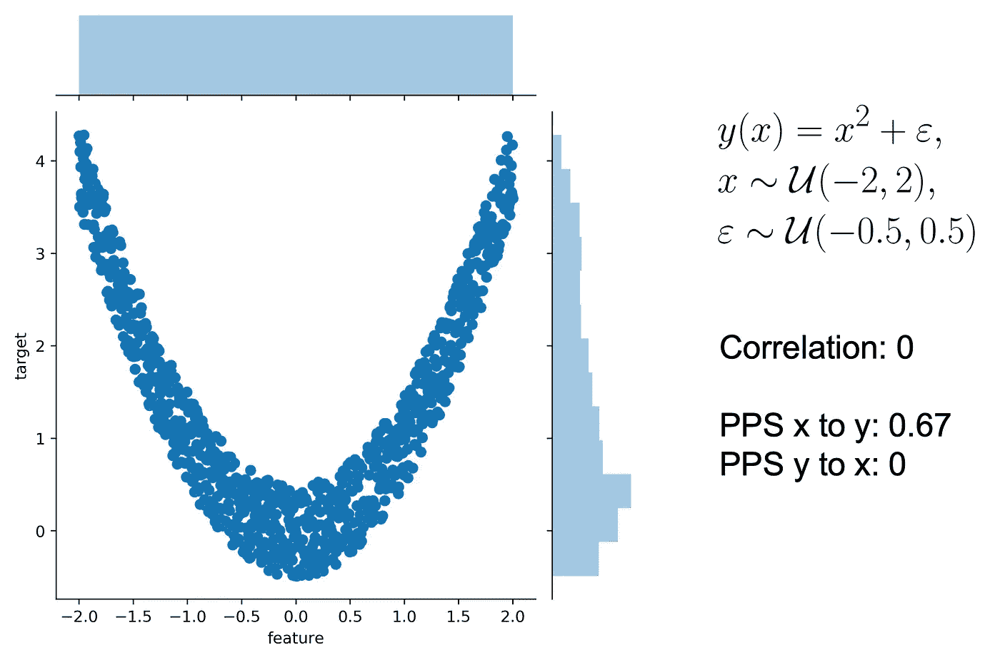
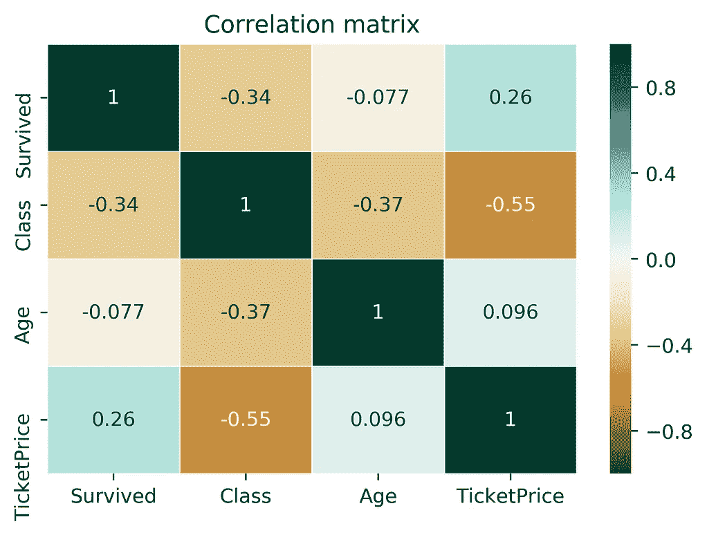
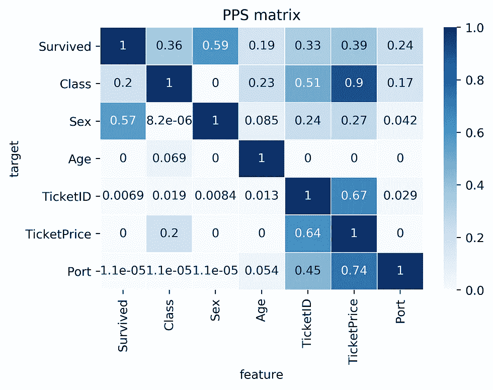

# RIP 相关性。引入预测能力评分

> 原文：<https://towardsdatascience.com/rip-correlation-introducing-the-predictive-power-score-3d90808b9598?source=collection_archive---------0----------------------->

## 我们定义并[开源的](https://github.com/8080labs/ppscore)预测能力评分(PPS)。PPS 是在您的数据中发现更多模式的相关性的替代方案。

# 相关性有太多问题

现在是周五下午，您的老板告诉您，数据发送出乎意料地提前到了——前后只有 4 周。这是您的预测模型缺少的部分。您很兴奋，但也有点焦虑，因为您知道接下来会发生什么:探索数据。好吧。45.列。这可能需要几个小时，但您知道这是值得的，因为没有数据理解，您就是在瞎走。一个明显的步骤是查看所有单变量列分布。但这还不够。

> 您会问自己:列之间存在什么关系？

要回答这个问题，您只需要重复典型的练习:计算一个相关矩阵，并检查一些令人惊讶的关系。每当你感到惊讶的时候，你就花点时间画出手头两列的散点图，看看你是否能理解它。希望你能做到，但通常你做不到，因为你甚至都不知道这些列的含义。但这是另一天的故事。

> 检查完相关矩阵后，您继续前进，您甚至不知道您不知道的东西(可怕)。

让我们花点时间回顾一下相关性。评分范围从-1 到 1，表示是否存在**强线性关系**——正向或负向。到目前为止还不错。然而**有许多分数根本检测不到的非线性关系**。例如，正弦波、二次曲线或神秘的阶跃函数。分数将只是 0 分，表示“这里没什么有趣的”。此外，相关性只为数字列定义**。所以，让我们放下所有的分类栏。在我上一个项目**中，超过 60%的列是分类的，**但是嘿。没关系。不，我不会转换列，因为它们不是有序的，一个原子编码会创建一个矩阵，它的值比宇宙中的原子还要多。**


关联为 0 的方案太多。这让我怀疑我是否错过了什么……(节选自丹尼斯·博伊格罗的[图像)](https://en.wikipedia.org/wiki/Correlation_and_dependence)

如果你受过良好教育，你会知道**相关矩阵是对称的**。所以你基本上可以扔掉一半。太好了，我们节省了一些工作！或者我们有吗？对称意味着无论你计算 A 和 B 的相关性还是 B 和 A 的相关性，相关性都是相同的。然而，现实世界中的关系很少是对称的。更多的时候，**关系是不对称的**。这里有一个例子:我最后一次检查时，我的邮政编码 60327 相当可靠地告诉陌生人我住在德国的法兰克福。但是当我只告诉他们我所在的城市时，不知何故，他们永远无法推断出正确的邮政编码。Pff …业余爱好者。另一个例子是这样的:一个有 3 个唯一值的列永远不可能完美地预测另一个有 100 个唯一值的列。但事实可能恰恰相反。显然，不对称很重要，因为它在现实世界中非常普遍。

> 想到相关性的那些缺点，我开始怀疑:我们能做得更好吗？

**需求:**去年的一天，我梦见了一个分数，它会告诉我两列之间是否存在任何关系——不管这种关系是线性的、非线性的、高斯的还是只有外星人知道的。当然，分数应该是不对称的，因为我想检测城市和邮政编码之间的所有怪异关系。如果没有关系，得分应该是 0，如果有完美的关系，得分应该是 1。作为锦上添花，score 应该能够开箱即用地处理类别和数字列。总结一下我所有的学术朋友:一个不对称的，数据类型不可知的分数，用于两列之间的预测关系，范围从 0 到 1。

# 计算预测能力得分(PPS)

> 首先，**没有唯一的方法**来计算预测能力得分。事实上，有许多可能的方法**来计算满足前面提到的要求的分数。所以，让我们把预测能力分数看作是一个分数家族的框架。**

假设我们有两个列，并希望计算 A 预测 B 的预测能力得分。在这种情况下，我们将 B 视为我们的目标变量，将 A 视为我们的(唯一)特征。我们现在可以计算一个**交叉验证的决策树**和**计算一个合适的评估指标**。当目标是数字时，我们可以使用决策树回归器并计算平均绝对误差(MAE)。当目标是类别时，我们可以使用决策树分类器并计算加权 F1。您也可以使用其他得分，如 ROC 等，但让我们先把这些疑虑放在一边，因为我们还有另一个问题:

> 如果不与基线进行比较，大多数评估指标都是没有意义的

我想你们都知道这种情况:你告诉你的奶奶，你的新车型的 F1 分数为 0.9，不知何故，她不像你一样兴奋。事实上，她非常聪明，因为她不知道是否有人能得 0.9 分，也不知道你是否是第一个在数百万令人敬畏的卡格勒人尝试后得分高于 0.5 分的人。所以，我们需要“标准化”我们的评估分数。你如何使分数正常化？你定义了一个下限和一个上限，并把分数放在适当的位置。那么下限和上限应该是多少呢？让我们从上限开始，因为这通常更容易:一个完美的 F1 是 1。完美的 MAE 是 0。嘣！完成了。但是下限呢？事实上，我们不能绝对地回答这个问题。

> 下限取决于评估指标和您的数据集。这是一个简单的预测器所能达到的值。

如果你的 F1 成绩是 0.9，这可能是非常糟糕或者非常好。如果你的超级花哨的癌症检测模型总是预测“良性”,并且在高度倾斜的数据集上仍然得到 0.9 分，那么 0.9 显然不是那么好。所以，我们需要为一个非常幼稚的模型计算一个分数。但是什么是幼稚的模型呢？对于分类问题，总是预测最常见的类是非常天真的。对于回归问题，总是预测中值是相当幼稚的。

## 让我们来看一个详细的、虚构的例子:

回到邮政编码和城市名称的例子。想象两列都是范畴。首先，我们要计算邮政编码到城市的 PPS。我们使用加权 F1 分数，因为城市是一个范畴。我们的交叉验证决策树分类器达到了 0.95 F1 的分数。我们通过总是预测最常见的城市来计算基线分数，并获得 0.1 F1 的分数。如果您对分数进行归一化，则在应用以下归一化公式后，您将获得 0.94 的最终 PPS:(0.95–0.1)/(1–0.1)。正如我们所见，0.94 的 PPS 分数相当高，因此**邮政编码似乎对城市**有很好的预测能力。但是，如果我们以相反的方向计算 PPS，我们可能会获得接近 0 的 PPS，因为决策树分类器并不比总是预测最常见的邮政编码好多少。

> 请注意:MAE 的标准化公式不同于 F1。对于 MAE，越低越好，最佳值为 0。

# 将 PPS 与相关性进行比较

为了更好地感受 PPS 及其与相关性的差异，让我们来看下面两个例子:

## 示例 1:非线性效应和不对称



示例 1:y = x 时与 PPS 的相关性比较

让我们使用一个典型的二次关系:特征 x 是范围从-2 到 2 的均匀变量，目标 y 是 x 的平方加上一些误差。在这种情况下，x 可以很好地预测 y，因为存在明显的非线性二次关系——毕竟我们就是这样生成数据的。然而，在从 y 到 x 的另一个方向上，这是不成立的。例如，如果 y 是 4，则不可能预测 x 大致是 2 还是-2。因此，预测关系是不对称的，分数应该反映这一点。

**这个例子中的分值是多少？**如果你还不知道你在找什么，相关性会让你无所适从，因为**相关性是 0** 。从 x 到 y 和从 y 到 x，因为相关是对称的。然而，从 x 到 y 的 **PPS 是 0.67** ，检测到非线性关系并挽救了局面。然而，PPS 不是 1，因为在关系中存在一些误差。在另一个方向，从 y 到 x 的 **PPS 是 0** ，因为你的预测不可能比原始基线更好，因此分数是 0。

## 示例 2:分类列和隐藏模式

让我们将相关矩阵与 Titanic 数据集上的 PPS 矩阵进行比较。“泰坦尼克号数据集？又来了？?"我知道，你可能认为你已经看到了关于泰坦尼克号数据集的一切，但也许 PPS 会给你一些新的见解。



示例 2:比较 Titanic 数据集的 Pearson 相关矩阵(左)和 PPS 矩阵(右)。

## 关于相关矩阵的两个发现:

1.  相关矩阵更小，省略了许多有趣的关系。当然，这是有意义的，因为像 Sex、TicketID 或 Port 这样的列是分类的，并且不能为它们计算相关性。
2.  相关矩阵显示了股票价格和中等强度等级(-0.55)之间的负相关。如果我们看一下 PPS，我们可以仔细检查这种关系。我们将会看到，TicketPrice 是该类别的一个强预测值(0.9 PPS)，但反之则不然。该类仅预测 PPS 为 0.2 的 TicketPrice。这是有道理的，因为无论你的机票价格是 5.000 美元还是 10.000 美元，你都很有可能是最高等级的。相比之下，如果你知道某人在最高级，你就不能说他是花了 5000 美元还是 10000 美元买的票。在这种情况下，PPS 的不对称性再次显现。

## 关于 PPS 矩阵的四项发现:

1.  矩阵的第一行告诉您幸存的列的最佳单变量预测值**是列性别。这是有道理的，因为在救援过程中女性是优先考虑的。(我们在相关矩阵中找不到此信息，因为删除了列性别。)**
2.  如果您查看 TicketID 的列，您会发现 TicketID 对于一系列列来说是一个相当好的预测器。如果你进一步挖掘这个模式，**你会发现许多人有相同的 TicketID** 。因此，TicketID 实际上是指一起买票的潜在乘客群体，例如意大利罗西大家庭，它将任何夜晚都变成了奇观。因此，PPS 帮助我**发现了一个隐藏的模式**。
3.  比 TicketID 强大的预测能力更令人惊讶的是 TicketPrice 在广泛的列中的强大预测能力。特别是，TicketPrice 在预测 TicketID (0.67)方面相当不错，反之亦然(0.64)。进一步研究后，你会发现门票往往有独特的价格。例如，仅意大利罗西家族就付出了 72，50 美元的代价。这是一个关键的洞察力！这意味着****ticket price 包含了关于 TicketID** 的信息，因此也包含了关于我们意大利家庭的信息。在考虑**潜在信息泄露**时，您需要掌握的信息。**
4.  **查看 PPS 矩阵，我们可以看到可以用因果链来解释的影响。(他刚才说的是因果吗？—当然，这些因果假设必须认真对待，但这超出了本文的范围。)例如，你可能会惊讶为什么 TicketPrice 对存活率有预测能力(PPS 0.39)。但是如果你知道这个职业会影响你的存活率(PPS 0.36)，而且 TicketPrice 是你职业的一个很好的预测指标(PPS 0.9)，那么你可能会找到一个解释。**

# **PPS 和 PPS 矩阵的应用**

**在我们了解了 PPS 的优点之后，让我们看看在现实生活中我们可以在哪里使用 PPS。**

> **免责声明:PPS 和相关性都有用例。对于**在数据中寻找预测模式**而言，PPS 明显优于相关性。然而，一旦发现了模式，相关性仍然是**传达发现的线性关系**的好方法。**

*   ****查找数据中的模式:**PPS 查找关联所找到的每个关系，甚至更多。因此，您可以使用 PPS 矩阵作为相关矩阵的替代，来检测和理解数据中的线性或非线性模式。使用一个范围总是从 0 到 1 的单一分数，这在所有数据类型中都是可能的。**
*   ****特征选择:**除了您通常的特征选择机制之外，您还可以使用预测能力得分来为您的目标列找到好的预测器。此外，您可以消除只是添加随机噪声的要素。这些特性有时仍然在特性重要性度量中得分很高。此外，您可以排除可由其他要素预测的要素，因为它们不会添加新信息。此外，您可以在 PPS 矩阵中识别相互预测的特征对，这包括强相关的特征，但也将检测非线性关系。**
*   ****检测信息泄漏:**使用 PPS 矩阵检测变量之间的信息泄漏——即使信息泄漏是通过其他变量介导的。**
*   ****数据规范化:**通过将 PPS 矩阵解释为有向图，找到数据中的实体结构。当数据包含以前未知的潜在结构时，这可能会令人惊讶。比如:泰坦尼克号数据集中的 TicketID 往往是一个家庭的指标。**

# **如何在自己的(Python)项目中使用 PPS**

**如果你还在跟随，你就是少数仍有注意力持续时间的人之一——你这个疯狂的野兽！如果你迫不及待地想知道 PPS 将在你自己的数据上揭示什么，我们有一些好消息给你:我们开源了 PPS 的一个实现，作为一个名为 ppscore 的 [Python 库。](https://github.com/8080labs/ppscore)**

> **在使用 Python 库之前，请花点时间[通读一下计算细节](https://github.com/8080labs/ppscore)**

**安装软件包:**

```
pip install ppscore
```

**计算给定熊猫数据框架的 PPS:**

```
import ppscore as pps
pps.score(df, "feature_column", "target_column")
```

**您还可以计算整个 PPS 矩阵:**

```
pps.matrix(df)
```

## **与相关性相比，PPS 的速度有多快？**

**虽然 PPS 比相关法有许多优点，但也有一些缺点:计算时间较长。但是有多糟糕呢？是需要几周时间，还是几分钟甚至几秒钟就能完成？当使用 Python 库计算一个**单 PPS** 时，时间应该没有问题，因为它通常需要大约**10–500 ms**。计算时间主要取决于数据类型、行数和使用的实现。然而，当计算 40 列的整个 PPS 矩阵时，这会导致 40*40= **1600 次单独计算**，而**可能需要 1-10 分钟**。所以你可能想在后台开始 PPS 矩阵的计算，去那个你一直梦想的暑假！🏖️For:我们的项目和数据集计算性能一直很好，但当然还有改进的空间。幸运的是，我们看到许多方法可以改进 PPS 的计算，以实现 10-100 倍的速度增益。例如，使用智能采样、试探法或 PPS 的不同实现。如果你喜欢 PPS 并且需要更快的计算，请联系我们。**

# **限制**

**我们成功了——您很兴奋，想要向您的同事展示 PPS。然而，你知道他们总是对新方法吹毛求疵。这就是为什么你最好准备好了解 PPS 的局限性:**

1.  **计算比相关(矩阵)慢。**
2.  **分数不能像相关性那样容易解释，因为它不能告诉你任何关于所发现的关系的**类型的信息。因此，PPS 更适合于发现模式，而相关性更适合于传达发现的线性关系。****
3.  **您不能以严格的数学方式比较不同目标变量的得分，因为它们是使用不同的评估指标计算的。分数在现实世界中仍然是有价值的，但是你需要记住这一点。**
4.  **发动机罩下使用的部件有局限性。请记住:您可以交换组件，例如使用 GLM 代替决策树，或者使用 ROC 代替 F1 进行二元分类。**
5.  **如果使用 PPS 进行功能选择，您还需要执行向前和向后选择。此外，PPS 无法检测目标特征之间的交互影响。**

# **结论**

**在使用相关性多年后，我们变得如此大胆(或疯狂？)来建议一种可以检测线性和非线性关系的替代方案。PPS 可以应用于数字列和类别列，并且是不对称的。我们提出了一个实现，并开源了一个 Python 包。此外，我们在一些示例中展示了相关性的差异，并讨论了我们可以从 PPS 矩阵中获得的一些新见解。**

**现在由你来决定你对 PPS 的看法，以及你是否想在你自己的项目中使用它。我们已经将 PPS 作为 bamboolib 库的一部分使用了一年多，PPS 对于添加一些高级功能是必不可少的，因此我们希望与更广泛的社区共享 PPS。因此，我们希望收到您对该概念的反馈，如果您在自己的数据上尝试 PPS，我们将非常激动。如果有可能得到积极的回应，我们很高兴听到您对实现进行调整或改进的请求。正如我们之前提到的，有许多方法可以提高速度，以及如何针对更具体的用例调整 PPS。**

****Github:**【https://github.com/8080labs/ppscore】T4**

**8080labs.com 的弗洛里安**

****简讯:**如果您想了解更多关于 PPS 和我们其他即将推出的数据科学项目和工具的信息，您可以 [**订阅此处**](http://eepurl.com/g0ddnH) 。我们不会写付费产品，你可以随时取消订阅，很遗憾我们不得不提到这一点，我们永远不会放弃你的电子邮件。**

***原载于 2020 年 4 月 23 日 https://8080labs.com*[](https://8080labs.com/blog/posts/rip-correlation-introducing-the-predictive-power-score-pps/)**。****