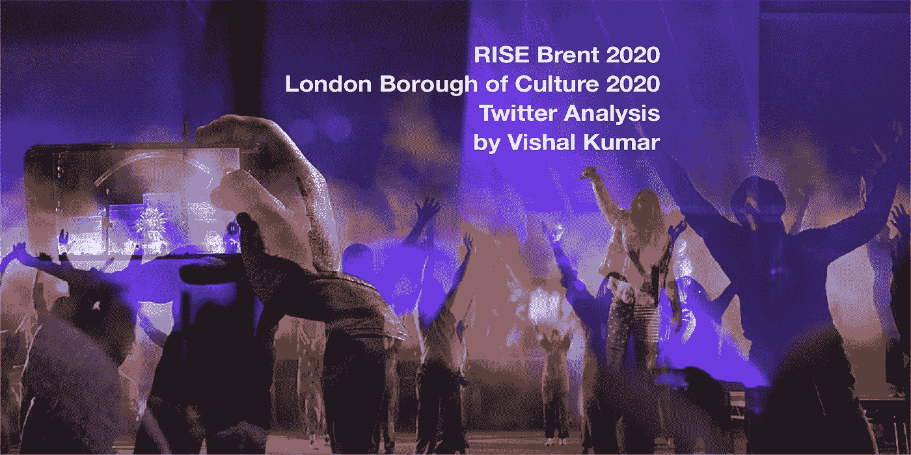
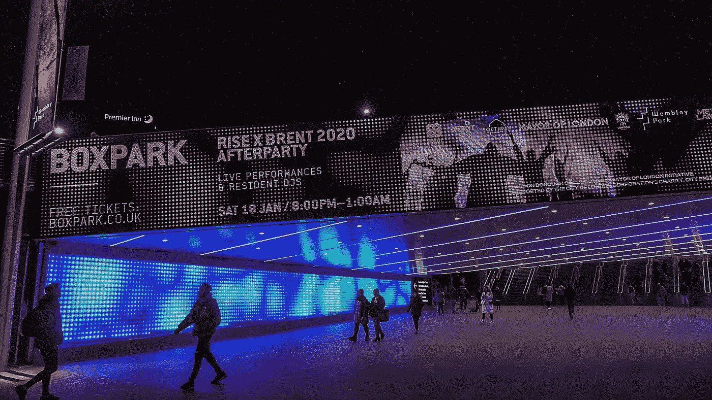
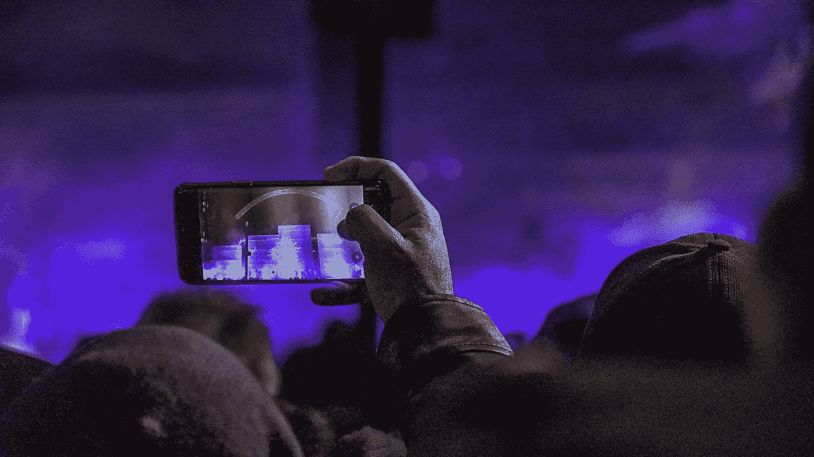
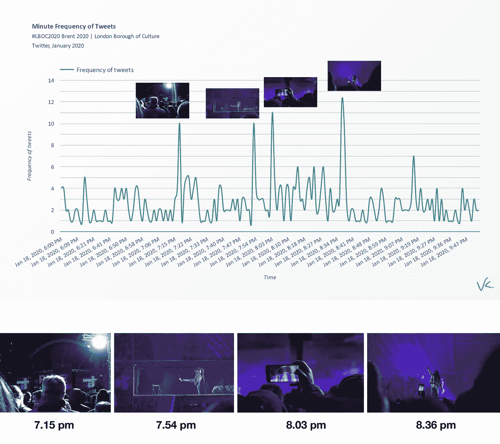
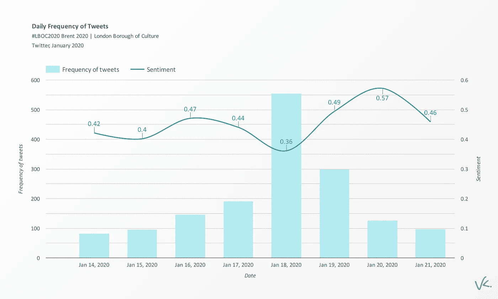
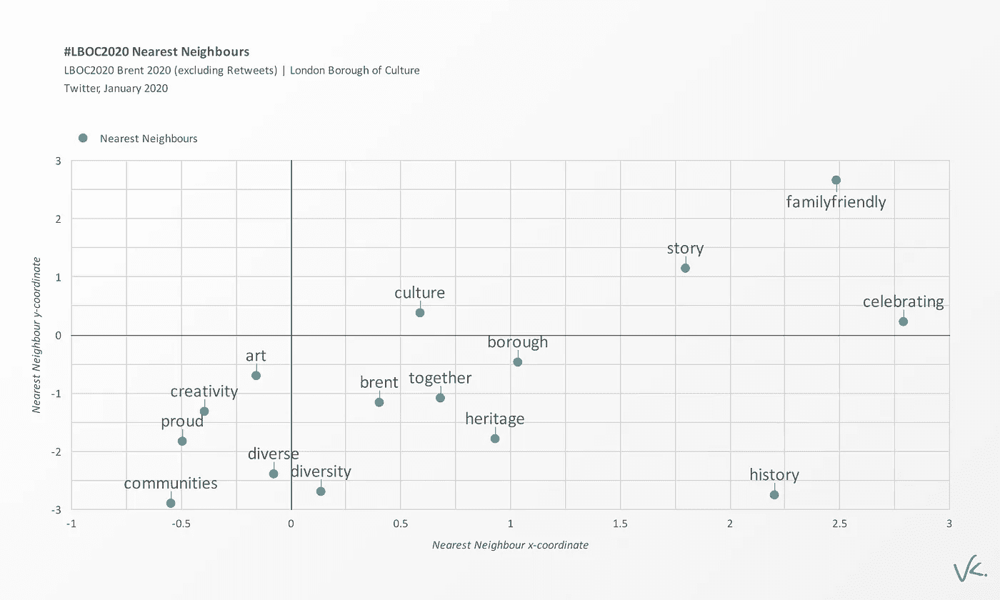
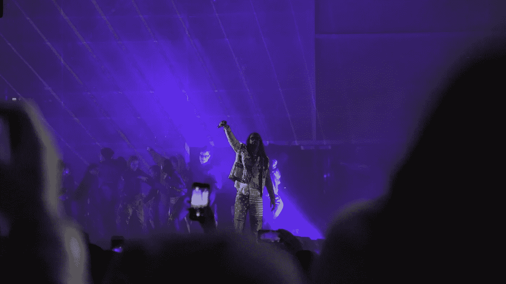
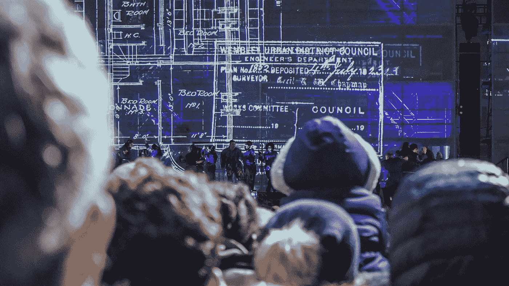

# 上涨布伦特 2020。伦敦文化区 2020 推特分析

> 原文：<https://towardsdatascience.com/rise-brent-2020-london-borough-of-culture-2020-twitter-analysis-31913f0b40?source=collection_archive---------37----------------------->

## 分析 3000 条关于伦敦文化区 2020 开幕活动 RISE 的推文

2020 年 1 月 18 日星期六，伦敦西北部的布伦特区举办了伦敦文化区 2020 庆祝活动。布伦特区是第二个伦敦文化区，第一个是沃尔瑟姆森林区，赢得了伦敦市长的竞标。

伦敦文化区项目的目标是“将社区聚集在一起，庆祝整个伦敦的文化多样性”。市长以及私人和企业合作伙伴提供资金，促进为期一年的艺术和文化事件和活动方案。这是一个很棒的倡议，作为一个伦敦人，我很自豪！

今年布伦特 2020 的开幕活动是**，由[左撇子舞蹈团](http://southpawdancecompany.co.uk/)编排的长达一小时的表演。去年，我对文化区 2019 年的开幕活动做了一个非常类似的分析，名为 ***欢迎来到森林*** ，你[可以在这里](/welcome-to-the-forest-london-borough-of-culture-2019-twitter-analysis-9ea25cf4f033)阅读。与去年不同的是，今年我实际上参加了开幕式，度过了一段美好而愉快的时光，并拍了一些照片，在这篇博文中分享😊**

**这篇文章的目的是使用 Twitter 数据来了解事件的涨落，并应用机器学习和自然语言处理技术来阐明*社会价值*和*文化价值*。通过分析参加 **RISE** 的用户的推文，我们能够深入了解该活动是否实现了伦敦文化区的目标。**

**让我们试一试！请滚动查看分析。希望你喜欢。**

****

**这张照片是我用索尼 a6600 拍的**

## **数据和方法**

**与去年的开幕式不同，这次活动没有专门的标签。相反，我收集了所有包含#Brent2020 计划官方标签的推文，以及提到@LBOC2020 的推文，这是 Brent2020 的推特账号。在事件发生时，我使用 Twitter API 收集了 2020 年 1 月 14 日至 1 月 21 日之间总共 3000 条推文。需要注意的是，我只收集了包含#Brent2020 或@ LBOC2020 当然，有许多关于*崛起的推文不包含这些搜索词。***

***在收集了推文之后，我执行了一系列高级统计和机器学习自然语言处理技术，以帮助我理解该事件的社会和文化价值。具体来说，我使用了[谷歌云自然语言 API](https://cloud.google.com/natural-language/) 来计算每条推文的情感，然后我使用了 [gensim 库的 Word2Vec 模型](https://radimrehurek.com/gensim/models/word2vec.html)来对推文的整个语料库进行语义分析。***

***我以各种角色[处理过艺术和文化的*经济、社会*和*文化* *价值*测量:作为 UCL Bartlett 高级空间分析中心
的文化数据科学家和研究员；担任全球首家致力于艺术与文化的数据科学咨询机构](https://www.vishalkumar.london/about)[**cultureincities**](http://cultureincities.com/)总监；关于下一个英国文化城市的技术参考小组，[考文垂 2021](https://coventry2021.co.uk/)；最重要的是，作为 2019 年伦敦文化区[的一部分，他领导了沃尔瑟姆森林委员会的数据科学研究。](https://wfculture.co.uk/)***

***正如英国社会价值所描述的，“社会价值是人们对他们在生活中经历的变化的相对重要性的量化”。“崛起”是当地居民对布伦特历史和文化的一种依恋。然而，正如 Geoff Mulgan 指出的，社会价值很难衡量。尽管这篇文章没有使用 Mulgan 建议的健壮的方法学技术——很大程度上是因为它们昂贵且耗时——在这里我向 NLP 提供了一个有趣的方法来尝试捕捉 **RISE** 的参与者感受到的体验。***

******

***这张照片是我用索尼 a6600 拍的***

## ***夜晚的概观***

***下面是一张图，用我那天晚上拍的照片展示了这件事是如何在 Twitter 上展开的。 ***上升*** 大约在晚上 7 点 15 分开始，这由第一个尖峰说明。然后，在晚上 7 点 54 分，a 里面出现了一个令人惊叹的舞者，在晚上 8 点 03 分，大量彩色粉末被抛向空中，最后，当利维将军在晚上 8 点 36 分出现时，出现了一个高峰！***

******

***你可以观看下面由[马丁·弗朗西斯](https://www.youtube.com/channel/UCMQdWx1-B7B-VRfD2-uETRw)制作的酷视频，他更详细地记录了那个夜晚！***

## ***自然语言处理***

***在活动当天，共有 741 名独立用户发了推文，一周有 876 名用户发了推文。如果我们更深入地研究文本，我们就能够根据人们在推文中使用的语言来分析他们对事件的反应。自然语言处理(NLP)提供了一种创新的方法，使用机器学习来分析文本的情感和语义结构，帮助我们得出结论。***

***每条推文的情绪是使用谷歌的云 NLP API 计算的。下面的条形图显示了七天期间推文的总频率和每天推文的平均情绪，其中-1 表示非常消极的情绪，+1 表示非常积极的情绪。我们看到，在活动前几天，推文的情绪徘徊在 0.42 左右，在活动当天下降到 0.36，然后在活动后两天急剧上升到 0.49 和 0.57 的非常强烈的情绪。总体而言，全天上涨的平均情绪为 0.57。***

******

## ***语义分析***

***为了从 tweets 中获得更细致的文本理解，我进行了语义分析。在这一步，从分析中删除所有转发是很重要的，因为它们会产生重复的推文，因此在分析文本时会产生不必要的噪音。***

***[Word2Vec](https://en.wikipedia.org/wiki/Word2vec) 是一个神经语言机器学习模型，它将大量文本(在这种情况下，来自 3000 条推文的文本)作为输入，并输出一个向量空间，通常有数百个维度，每个唯一的单词对应于空间中的一个向量——单词嵌入。***

***具体来说，空间中距离较近的物体意味着它们是相似的。*最近邻*是来自 Word2Vec 模型的少数几个基于余弦度量相似性得分与“ *Brent* ”最相似的单词。下面的散点图显示了“*布伦特*”的最近邻居。***

******

***与 *Brent* 、*、【familyfriendly】、*、*、*、*、【社区】、【骄傲】、*等词非常接近的还有*、*、*、【欢庆】、*等词也在*中出现。*word 2 vec 模型的结果非常积极，因为这些词与伦敦文化区的总体目标紧密相关，即“将社区聚集在一起，庆祝伦敦的文化多样性”。这项发现从统计学上证明，这些词最接近人们在推特上描述他们的经历时描述的*的方式，因此可以表明社会价值。****

********

****这张照片是我用索尼 a6600 拍的****

## ****结论****

****自然语言处理提供了一种创新的方法来分析文本数据，以揭示和说明人们在推特上谈论某个事件时的感受。这项研究的发现表明，有用的描述性词语是从推特数据中提取出来的，以证明**的崛起**展示了社会价值。对于任何评估研究来说，拥有一种可量化和定量的方法来衡量诸如社会和文化价值之类的东西现在是至关重要的，这将使文化机构有别于它们的同行。****

****然而，应该注意的是，NLP 并不是一种完美或完整的技术。此外，只分析社交媒体数据也有问题。事实上，在**上涨**事件后的一周内，许多推文都被转发了。更准确的研究当然包括实地调查收集和访谈，这些问题的答案仍然可以使用 NLP 进行分析。****

********

****这张照片是我用索尼 a6600 拍的****

****伦敦文化区的最大使命之一是将社区聚集在一起，庆祝伦敦的文化多样性，从而创造社会和文化价值。重要的是能够在某种程度上定量地捕捉和展示这种价值，以便这些发现可以用于利用像这样的计划的重要性。****

****在接下来的 12 个月里，我将跟踪整个项目，看看文化数据科学如何让我们更深入地了解这个项目。还有巨大的潜力来进一步挖掘推文！****

****祝贺布伦特取得如此重大的事件和成就，并祝伦敦文化区今年剩余时间一切顺利！****

****谢谢，****

****Vishal****

****Vishal 是一名文化数据科学家，也是伦敦 UCL 学院**的研究生。他对城市文化的经济和社会影响感兴趣。你可以在*[*Twitter*](https://twitter.com/vishalkumarldn)*或者*[*LinkedIn*](https://www.linkedin.com/in/vishalkumarlondon/)*上与他取得联系。在*[*insta gram*](https://www.instagram.com/vishalkumar.london/)*或他的* [*网站*](https://vishalkumar.london/) *上看到更多 Vishal 的作品。******