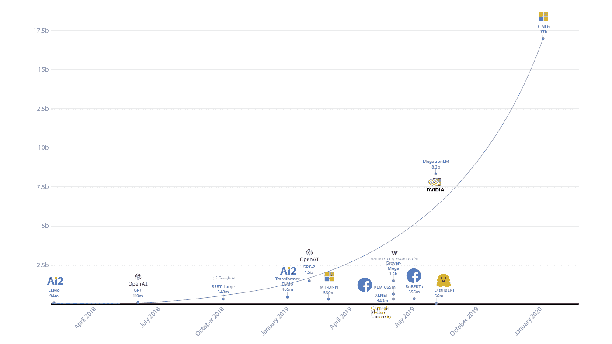
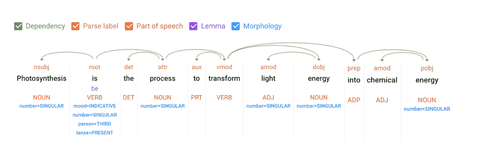
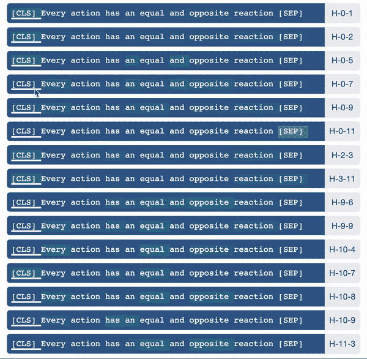
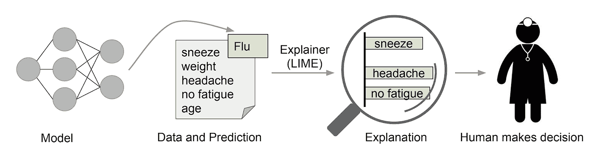
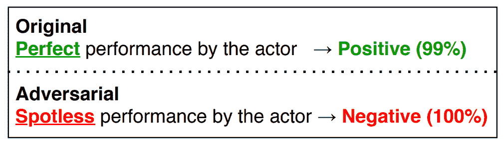
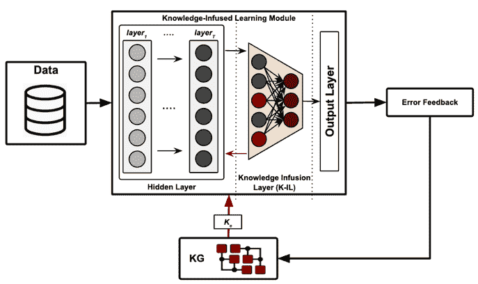

# 现代自然语言处理的兴起和可解释性的需要！

> 原文：<https://towardsdatascience.com/rise-of-modern-nlp-and-the-need-of-interpretability-97dd4a655ac3?source=collection_archive---------23----------------------->

## 现代 NLP 在可分析性、可理解性、透明性、可解释性和脆弱性方面的能力和挑战。

*在*[*embi be*](http://www.embibe.com/)*(AI 学习成果平台)，我们正在利用现代自然语言处理来解决诸如内容摄取、知识图完成、智能元标记、问题生成、问题回答、概念总结、学生对话助手、白话学术翻译、描述性答案评估等问题。将现代 NLP 应用于现实世界的应用需要可解释性，以使系统更加透明、可解释和健壮。让我们看看现代自然语言处理的兴起和可解释性的需要！*

现代 NLP 处于计算语言学的前沿，它涉及自然语言的计算建模。

可解释性:太阳+雨= >反射、折射和色散= >彩虹。(图片由[胡炬雄](https://unsplash.com/@karson_?utm_source=medium&utm_medium=referral)在 [Unsplash](https://unsplash.com?utm_source=medium&utm_medium=referral) 上拍摄)

乔姆斯基在 20 世纪 50 年代对计算语言学潜力的理解，特别是对那些统计模型的理论基础的理解，有点类似于爱因斯坦对量子物理的反应，****【上帝不掷骰子】。这些是世界见证另类理论兴起的关键时刻。然而，无论如何，乔姆斯基为语言学理论奠定的基础仍然是相关的，并有助于计算语言学的发展、分析和理解。****

*的确，已经有很多工作试图将统计模型应用于各种语言问题。我认为有一些成功，但也有很多失败。有一个成功的概念……我认为这在科学史上是新颖的。它将成功解释为逼近未分析的数据。”—诺姆·乔姆斯基*

*他提到，成功的概念不是成功。好吧，缺陷可能是理论基础，但从经验上来说，它可以被认为是“可解释性”，这说明了这些计算模型的可分析性、透明性、可问责性和可解释性。*

*计算语言学的主要进步归功于三个后续阶段:统计建模、经典机器学习和深度学习。这些阶段的可解释性越来越复杂。*

*统计建模处理数据的统计分析和推断，并以机器学习的形式获得预测能力。使用机器学习解决问题有三个重要方面，*

*   *设计输入要素。*
*   *派生特征表示。*
*   *架构模型内部。*

*经典的 ML 技术总是给人一种控制的感觉，因为特性是明确指定的，而且大部分是由人类直觉驱动的。过去本质上是聚集的和统计的特征表示也在可解释性的范围内，即基于 Tf-Idf 的向量表示等。像决策树、逻辑回归、支持向量机或其他参数模型这样的 ML 模型也很容易推理。这些模型的扩展变得复杂，因为使用了非线性内核、集成、boosting 等技术来进一步提高性能。然而，仍然有可能理解模型的内部结构。*

*为提高命名实体识别、情感分析、分类等经典自然语言处理任务的性能所做的持续努力，以及不断增加越来越复杂的任务，如问答、摘要、机器翻译等，已经引起了研究界越来越多的关注。*

*现代 NLP 的兴起要归功于一个简单模型——感知器的进化。随着深度神经网络的出现，感知机的扩展不仅仅是集成或增强等技术的二阶扩展，而是指数级扩展，如果不是渐近扩展的话。*

****“我深信，在我们的有生之年，机器能够并且将会思考。”—奥利弗·塞尔弗里奇(思考机器— 1961)。****

*回顾微小的感知机转变为深度学习海啸的历程，将标志着几个重要的里程碑。举几个例子，1958 年感知器的诞生与 20 世纪 60 年代“思维机器”的研究远见相结合，随后是 20 世纪 80 年代反向传播的发明，以及 21 世纪 10 年代初数据激增与超级计算能力的结合。所有这些都加剧了数百万个感知机之间相互作用的化学反应，从而导致了深度学习和现代 NLP 的兴起。*

*自然地，深度学习让计算语言学重获新生；使用神经机制学习的潜在统计模式给出了令人难以置信的表现。只是为了加强，在某些定义良好的 NLP 任务上，人类基线的表现优于深度学习模型，这些任务的复杂性逐年增加。图像的合成性质使得卷积神经网络获得了巨大的成功，而自然语言不同于图像，因为它不仅具有合成依赖性，还具有顺序状态。递归神经网络和长短期记忆(LSTM)网络超过了现有技术水平，最近，注意力机制在新型变压器方面取得了前所未有的成功。*

*现代 NLP 的关键成功还归功于自我监督的预训练目标，以学习上下文嵌入和将学习转移到下游特定任务模型的能力。自我监督的预训练目标已经放弃了对大规模标记数据的需求。另一方面，迁移学习已经放弃了巨大的计算成本的需要。因此，我们可以看到复杂模型的指数增长。*

**

*图一。自然语言处理模型复杂性的指数增长(图片:Turning-NLG [8])*

*那又怎样？*

*   *深度学习使得特征工程变得多余，因此灭绝了！*
*   *令牌的底层表示变得密集而复杂*
*   *深度神经网络复杂架构的内部变得难以理解。*

*因此，我们不能直接强调决策是如何做出的，什么特征是重要的，或者因果关系来自哪里？现代自然语言处理的成功扩大了可解释性的挑战。*

*可解释性在领域采用中起着关键的作用，它也为现实世界的应用建立了信心。我们可以将正在进行的研究工作集中在以下问题中来解释神经 NLP 模型:*

1.  *语言学知识是习得的还是忽略的？*
2.  *为什么模型会以这种方式工作？*
3.  *我们能解释模型预测吗？*
4.  *什么使得 NLP 模型易受攻击？*
5.  *知识图如何推进现代 NLP 及其可解释性？*

*让我们深入了解这些问题的含义。*

*   *语言知识:忽略还是习得？*

**

*图二。句子中的语言知识*

*语言学，研究语言及其结构，包括语法、句法和语音学等。对人类来说很直观的是，除非系统能够学习语言成分，否则理解、推理和生成自然语言的能力是不可能的。在经典的自然语言处理中，诸如词性标注、命名实体识别、依存关系树、主谓一致、共指消解等语言特征是使用规则驱动或统计学习方法获得的。深度神经网络模型，如 RNNs、LSTMs、Transformers 等，不需要这些手工制作的功能，但仍然能够在某些明确定义的现实世界任务中表现出色，如分类、语义分析、问题回答、摘要、文本生成等。所以，要回答的问题是“ [**现代 NLP 模型**](/encoded-linguistic-knowledge-in-nlp-models-b9558ba90943) **”学到了哪些(如果有的话)语言学知识。***

*   ***为什么模型会以这种方式工作？***

*黑盒系统有利于模块化和集成，但系统需要透明才能分析和改进。透明度是可解释性的一个关键支柱。**“模型理解”**是一个利基领域，处理模型的内部。这需要详细分析给定 dnn 中的每一层模块学到了什么，它们如何相互作用，从而有助于模型决策。*

**

*图三。伯特模型中不同层次的注意力是如何在处理一个特定的表征时注意其他表征的。*

*基本上，一个模型的学习如何归因于它的构建模块或底层机制？对模型如何工作的更深入的理解将促进可解释性，并打开进一步改进系统的机会。例如，注意力机制是驱动最先进的 LSTMs 或变形金刚模型成功回家的关键思想。**“在自然语言处理模型中，注意力是如何促进学习的？”** ***(即将推出)*** 倒要研究得更深一些。*

*   ***预测可能还行，能解释一下吗？***

**

*图 4。模型预测说明(图片:[里贝罗](https://scholar.google.com/citations?user=rmsIyGMAAAAJ&hl=en&oi=sra)等[11])*

*好吧，知道什么语言知识是通过模型学习的，以及底层机制如何使这些 NLP 模型的学习成为可能是 NLP 可解释性的基础。最重要的是将**”转向对 NLP 模型的可信和忠实的解释？*****【即将推出】*** 这需要深入研究输入记号如何影响模型决策，从而将预测归因于记号，并推导记号的重要性。我们如何从这些重要的记号中产生解释呢？这些生成的解释可信吗？或者说，产生忠实解释的最佳方式是什么？这些解释能在理解一个模型的潜在稳健性方面发挥积极作用吗？这是一个活跃的研究领域，最近已经取得了很多进展。*

*   *在成功的背景下，是什么让现代 NLP 模型变得脆弱？*

*现代 NLP 在现实世界的应用中取得了适度的进展，例如对话聊天机器人、实时翻译、自动问答、仇恨言论或假新闻检测。是否有可能出于恶意入侵这些模型，比如使假新闻合法化，或者在无法访问训练数据的情况下窃取模型？*

**

*图 5:对抗性攻击示例*

*一个透明的、可解释的和可解释的系统将更好地理解**“现代 NLP 漏洞的挑战和缓解”*(即将推出)*。**在这里，可以理解敌对攻击的风险、潜在的偏见、不可靠的评估标准以及提取模型的学习状态的可能性，并且可以采取措施来减轻这些风险。*

*   ***知识图谱呢？它能进一步推进现代自然语言处理和可解释性吗？***

*传统上，知识图，即以图的形式表示的结构化信息，是基于特定领域用例的信息检索系统的核心。主要是因为知识图可以由专家确定性地构建，更容易理解，无缝集成，对特定用例有效，并且易于解释。因此，依赖于知识图的系统很容易在不同的领域被采用。现代 NLP 出现之前的检索系统主要是在知识图的基础上开发的。*

**

*图六。知识注入式学习(Image:[kur uncu](https://arxiv.org/search/cs?searchtype=author&query=Kursuncu%2C+U)等[5])*

*自我监督学习使现代 NLP 能够学习统计模式，而不用担心专家的干预。这些系统在各种复杂的用例中变得可扩展和强大，但在非常简单的任务中可能会失败，因为简单的事实由于数据中缺乏统计意义而被忽略。这就是为什么，如果知识图可以与现代 NLP 系统集成，它将带来两个世界的最佳效果，使系统变得全面。知识图还可以调整特征的内部表示，使其更有意义。**“面向高级和可解释 NLP 的知识启始”*(即将推出)*** 将是未来时代的一个活跃研究领域。*

*探索现代 NLP 在上述维度上的限制，可以很好地理解为什么可解释性很重要，挑战是什么，在这些方面取得了什么进展，以及哪些问题仍然存在？虽然我们试图尽可能地广泛，但这绝不是对 NLP 现状的详尽调查。了解一个现代的 NLP 将如何在未来变得可分析、透明、健壮、可靠、可解释和安全是一件有趣的事情。另一方面，将 KG 和 NLP 结合起来也同样令人着迷，这不仅有助于 NLP 的可解释性，还能提高其在教育、医疗、农业等领域的应用。*

**我要感谢所有合作者为发表本文所做的努力，特别是*[*Amit Sheth*](https://www.linkedin.com/in/amitsheth/)*教授的评论和反馈，以及*[*Aditi Avasthi*](https://www.linkedin.com/in/aditiavasthi/)*的支持。**

***参考文献***

*[1]曼宁光盘。计算语言学和深度学习，麻省理工学院出版社 2015 年*

*[2]诺维格 P. [论乔姆斯基与统计学习的两种文化](https://link.springer.com/chapter/10.1007/978-3-658-12153-2_3)，施普林格 2017*

*[3]贝尔基诺夫和格拉斯。神经语言处理中的分析方法:调查，麻省理工学院出版社 2019 年*

*[4]曼宁和舒茨。[统计自然语言处理基础](https://books.google.com/books?hl=en&lr=&id=3qnuDwAAQBAJ&oi=fnd&pg=PT12&dq=natural+language+processing&ots=yrO3k6DuQW&sig=1y2eJ7Dkxrj50SQgxMXu07Gl7is)，1999*

*[5] [库尔顺库](https://arxiv.org/search/cs?searchtype=author&query=Kursuncu%2C+U)、[高尔](https://arxiv.org/search/cs?searchtype=author&query=Gaur%2C+M)、[谢斯](https://arxiv.org/search/cs?searchtype=author&query=Sheth%2C+A)、维克拉马拉奇和亚达夫。知识注入深度学习，ACM 2020*

*[6] Arrieta 等人.可解释的人工智能(XAI):面向负责任的人工智能的概念、分类法、机遇和挑战，Elsevier，2020 年*

*[7]鲁梅尔哈特、辛顿和威廉姆斯。通过反向传播错误学习表征，自然 1986*

*[8]图灵-nlg:微软的 170 亿参数语言模型，微软研究博客，2020 年*

*【9】[张](https://scholar.google.com/citations?user=NFzUTiEAAAAJ&hl=en&oi=sra)[盛](https://scholar.google.com/citations?user=lwy2C5YAAAAJ&hl=en&oi=sra)[阿兹米](https://scholar.google.com/citations?user=iXD-PDcAAAAJ&hl=en&oi=sra)[李](https://scholar.google.com/citations?user=p4RNNCQAAAAJ&hl=en&oi=sra)。对自然语言处理中深度学习模型的对抗性攻击:一项调查，ACM 2020*

*[10] [克拉克](https://arxiv.org/search/cs?searchtype=author&query=Clark%2C+K)，[坎德尔瓦尔](https://arxiv.org/search/cs?searchtype=author&query=Khandelwal%2C+U)，[列夫](https://arxiv.org/search/cs?searchtype=author&query=Levy%2C+O) y 和[曼宁](https://arxiv.org/search/cs?searchtype=author&query=Manning%2C+C+D)。伯特在看什么？对 BERT 注意力的分析，ACL Workshop BlackboxNLP 2019*

*[11] [里贝罗](https://scholar.google.com/citations?user=rmsIyGMAAAAJ&hl=en&oi=sra)、[辛格](https://scholar.google.com/citations?user=-hGZC54AAAAJ&hl=en&oi=sra)和[盖斯特林](https://scholar.google.com/citations?user=DpLFv4gAAAAJ&hl=en&oi=sra)。"[我为什么要相信你？"解释任何分类的预测](https://dl.acm.org/doi/abs/10.1145/2939672.2939778)*

*[12]柯勒·本德。“攀登 NLU:数据时代的意义、形式和理解”，ACL 2020*