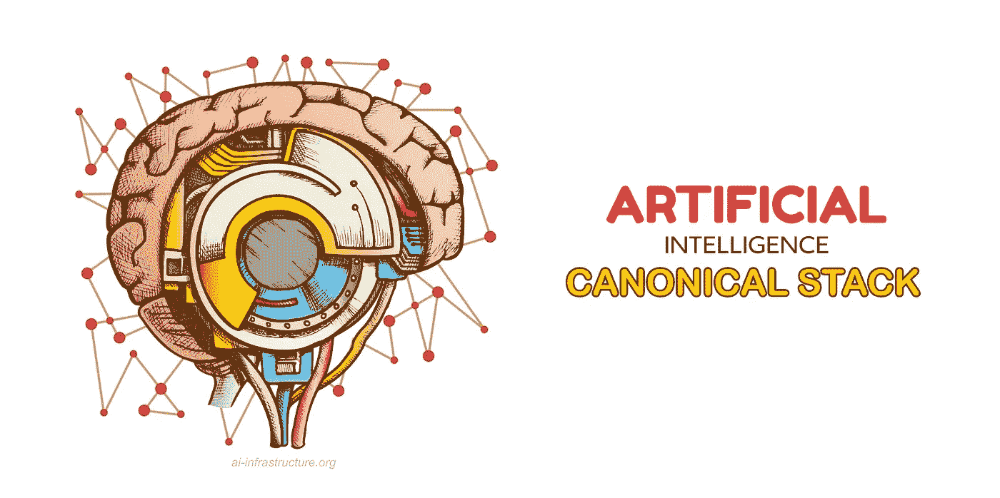
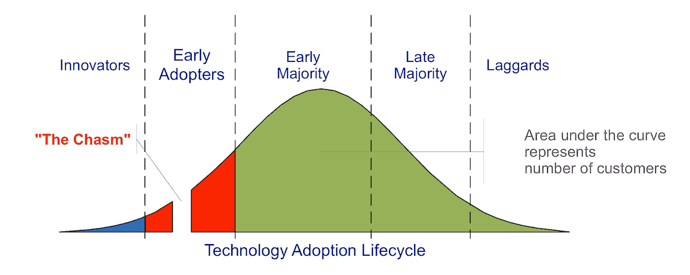

# 机器学习中规范栈的兴起

> 原文：<https://towardsdatascience.com/rise-of-the-canonical-stack-in-machine-learning-724e7d2faa75?source=collection_archive---------6----------------------->

## 一个占主导地位的新软件栈将如何解锁下一代尖端人工智能应用

(来源:图片由作者/Shutterstock 提供)

随着每一代计算技术的出现，都会出现一个占主导地位的新软件或硬件堆栈，扫除竞争对手，将一项新兴技术推向主流。

我称之为**规范堆栈(CS)** 。

想想 20 世纪 80 年代和 90 年代的 WinTel 王朝，95%的个人电脑都装有“Intel inside”认为[灯](https://en.citizendium.org/wiki/LAMP_(application_stack))和[的意思是](https://en.wikipedia.org/wiki/MEAN_(solution_stack))栈。想想亚马逊的 [S3 正在成为一个近乎通用的存储 API。想想云编排的](https://www.architecting.it/blog/has-s3-become-the-de-facto-api-standard/) [Kubernetes 和 Docker](https://www.amazon.com/Kubernetes-Running-Dive-Future-Infrastructure-ebook/dp/B07YP1XSZ9/ref=sr_1_1?dchild=1&keywords=kubernetes&qid=1597401588&sr=8-1) 。

当组织寻求解决同样具有超级挑战性的问题时，堆栈从成千上万的其他解决方案中脱颖而出。在任何复杂系统的开始阶段，问题都是很多的。一个项目的进展停滞阻碍了其他几十个项目的进展。但是当人们完全解决了一个问题，它打开了通向大量新解决方案的大门。

在互联网的早期，工程师们同时致力于解决数以千计的新问题，每个解决方案都建立在最后一个之上。一旦有人发明了 SSL，你就可以对信息进行加密传输。一旦你有了能做 SSL 的 Netscape 浏览器，你现在就可以开始从事电子商务了。每个解决方案都解开了一个新的难题，让人们可以构建越来越复杂的应用程序。

随着越来越多的碎片聚集在一起，网络效应**开始发挥作用。每一个上线的节点都让网络越来越有价值。突然，当你增加了足够多的人时，你就达到了一个“ [**”的临界点**](https://www.amazon.com/Tipping-Point-Little-Things-Difference/dp/0316346624/ref=sr_1_2?dchild=1&keywords=tipping+point&qid=1609419198&sr=8-2) ”，采用会以指数 S 曲线快速上升。一旦它加速足够快，你就达到了临界质量，采用就变得不可阻挡。**

**当 CS 形成时，它让开发人员“向上移动”以解决更有趣的问题。在过去的几十年里，随着越来越好的栈出现，我们看到传统软件开发达到了令人眩晕的新高度。在 20 世纪 80 年代和 90 年代，曾经需要一小群开发人员编写一个界面丑陋的数据库，为几千名企业用户服务。**

**WhatsApp 只用了 35 名工程师就拥有了 4 . 5 亿用户。**

**这是完全有效的网络效应，任何团队都可以利用来自其他几十个团队的尖端 ide、API 和库，以极快的速度交付创新。**

**我们可以用著名的**技术采用曲线**来追踪 CS 的形成。**

****

***(来源:维基共享资源)***

**在他 1962 年的著作《创新的扩散》中，社会学家埃弗雷特·罗杰斯向我们展示了在采用新技术时，人和企业分成五个不同的群体。杰弗里·摩尔在他的商业畅销书《跨越鸿沟》中建立了这个想法。**

**想想智能手机。我跑出去拿到了第一部苹果 iPhone，这让我处于**早期采用者**阶段。我从中受益，因为我成功地保持了相同的无限手机合约 15 年，这是在所有手机公司淘汰它们之后很久。但我也深受其害，因为早期的手机没有我们今天这么多的应用程序，因为网络效应没有发挥作用。最终，**早期的大多数**加入了智能手机革命，不久我们就有了像 Instagram、AirBnB、WhatsApp 和优步这样的大型应用程序，它们利用了你口袋里的智能手机操作系统、GPS 和互联网的标准堆栈。现在智能手机无处不在，几乎每个人都有一部，甚至在世界上最遥远的地方。**

**如果你知道有人还在使用翻盖手机，他们是落后者的一部分。**

**现在，计算机领域正在发生一些新的事情。软件的本质正在改变。我们已经非常擅长构建手工编码的软件，以至于我们已经达到了它所能做的上限。**

**直到最近，编码人员手工制作他们软件的所有逻辑。这对于设计电子表格的界面非常有效，但是对于在图片中识别猫或者在手机上识别你的声音就不太好了。这就是为什么在过去的十年里，一种新的软件出现了。**

****机器学习。****

**我们训练机器，让它们自己学习规则，而不是手工编写规则。**

**我们需要机器学习来解决以前无法解决的问题，比如自动驾驶的汽车，检测欺诈，识别人脸，驾驶无人机，理解自然语言等等。虽然机器学习与传统的软件开发有很多共同之处，但它也完全不同，它需要不同的规范堆栈。**

# ****机器学习栈****

**ML 开发周期有多个独特的步骤，比如训练和超参数优化，这些步骤与传统的软件开发方式完全不匹配。**

**研究人员和大型科技公司开发了许多最好的算法，以及将这些算法训练成模型并部署到生产中所需的工具。随着大科技解决了生产应用程序中创建、训练和服务模型的问题，越来越多的工具进入了开源项目，这推动了人工智能革命的发展。随着越来越多的团队获得这些工具，我们终于开始看到“人工智能的民主化”**

**随着尘埃落定，我们现在可以看到**机器学习规范堆栈(MLCS)** 形成的早期轮廓。我们也可以开始清楚地看到**机器学习生命周期(MLL)的主要阶段，**在现实世界中制作前沿模型所需的步骤。很多时候，公司甚至看不到阶段。这就是为什么你会看到带有 45 种机器学习的 NASCAR 幻灯片的文章。**

**机器学习不会有 45 类。**

**随着该技术继续发展成为下一个十年的发电站技术，将会有三个或四个主要的。**

## ****机器学习生命周期****

**MLL 有四个关键阶段:**

1.  ****数据采集和转换****
2.  ****试验、培训、调整和测试****
3.  ****生产、部署和推理****
4.  ****监控、审计、管理和再培训****

****

**(来源:图片由作者提供)**

**这个过程的大部分仍然是难以置信的手工操作。我们仍然随处可见数据科学家编写网页抓取器和粘合脚本，从数据库中复制数据，拼凑在一起，从一个地方移动到另一个地方。**

**这种情况变化很快。**

**我们已经看到 ML 开发周期中每个阶段的早期竞争者从竞争的混乱中脱颖而出。**

# **数据收集和转换**

**当团队试图争论他们的数据时，我们看到像[**Pachyderm**](https://www.pachyderm.com/)**这样的先驱通过不可变的写入时复制文件系统大规模提供数据版本控制，该系统面向 Google Cloud Store (GCS)、Amazon S3、Azure Blob Storage 和 Minio 等对象存储。****

****数据版本控制是 AI/ML 管道独有的东西，也是每个数据科学团队在试图扩展团队以快速将模型交付到生产中时最终遇到的问题之一。****

****[**TerminusDB**](https://terminusdb.com/) 与 Pachyderm 不同，它提供了一个可扩展的图形数据库，允许 Git 一样的版本控制。虽然 Pachy 侧重于可以放入对象存储的任何类型的文件，但 Terminus 最适合放入数据库的数据。****

****一旦公司拥有了这些数据，像 [**Superb AI**](https://www.superb-ai.com/) 这样的 SaaS 服务就可以帮助数据科学家快速标记大量数据，而不必全部手动完成，这是将数据传递给数据饥渴的神经网络的关键组件。 [**YData**](https://ydata.ai/) 还可以帮助数据科学团队快速标记、清理和构建数据集，甚至生成合成数据集，为训练、调整和测试阶段增加数据。****

# ****实验、培训、调整和测试****

****在所有的数据都被清理和标记后，像 [**maiot 核心引擎**](https://maiot.io/) 或 [**Allegro AI**](https://allegro.ai/) 这样的平台及其 Trains 框架形成了一个顺畅的实验和训练管道。****

****像[**【TFX】**](https://www.tensorflow.org/tfx)和 [**Horovod**](https://github.com/horovod/horovod) 这样的开源库正在成为跨 GPU 和 TPU 快速扩展训练的标准，但这些库很可能会被纳入更高级的训练、数据和可视化系统，如 [**Determined AI**](https://determined.ai/) 。Determined AI 利用 [Horovod](https://github.com/horovod/horovod) 在 GPU 之间快速分割和扩展训练工作，同时还进行超参数调整，并在全面的达尔文战争中测试许多不同的算法变体。这可不是小事，因为几年前，在多个 GPU 上并行运行一个算法还是一个手动过程。我们也看到像 [**Hyperopt**](https://github.com/hyperopt/hyperopt) 这样的库用于快速超参数调整和搜索。****

****如果这些人工智能架构是神经网络，那么该团队几乎肯定会在两个基本平台中的一个设计这个网络，脸书支持的[**【py torch】**](https://pytorch.org/)，或者谷歌支持的 [**Tensorflow**](https://www.tensorflow.org/) 。这些强大的平台创造了一场两匹马的比赛，许多其他框架曾经在这里比赛，比如 MXnet 和 Chainer。****

****当然，不是每个团队都是从零开始开发算法和模型的。许多团队可能永远不需要超越最先进的水平。他们可以抓住一个顶级模型，用迁移学习来训练它，以使他们的模型适应他们的特定数据集，并在产品推荐、自动图像标记或情感分析等已知问题上提供令人难以置信的性能。****

****期待看到越来越多的训练有素的系统嵌入到各地的应用中。我们已经看到了经过充分训练的变形金刚模型的出现，它们有像 [**拥抱脸的变形金刚**](https://huggingface.co/transformers/) 这样的库，它们不会是最后一个。****

****我们看到许多公司和组织试图成为预训练模型的“中心”，如 [Pytorch Hub](https://pytorch.org/hub/) 和 [Tensorflow Hub。](https://www.tensorflow.org/hub)像 [**Algorithmia**](https://algorithmia.com/product) 这样的公司希望将 SaaS API 前端交付给预训练的模型，而不是让公司下载他们自己的模型版本，他们很有可能成为 GitHub，用于训练模型访问并大规模运行那些处理器密集型模型。在未来几年，有人将开发每个人都标准化的模型库，也许是类似于 [ModelHub](http://modelhub.ai/) 的东西，但现在它是任何人的游戏。****

****当然，所有这些库、超参数搜索和训练运行都需要一个引擎来驱动，这就是管道平台发挥作用的地方。****

# ****生产、部署和推理****

****管道平台构成了 ML 规范堆栈的基石。****

****管道引擎可能会吸收人工智能/人工智能难题的许多其他部分，形成一个完整的端到端系统，用于选择、训练、测试、部署和服务人工智能模型。****

****管道桂冠有三个主要竞争者:****

*   ******Kubeflow******
*   ******MLFlow******
*   ******厚皮动物******

****厚皮动物是管道系统中最简单明了的。它使用定义良好的 JSON 或 YAML 定义来调用容器，以便在模型通过 ML 生命周期时对其进行转换、训练和跟踪。它是数据驱动的，因此每次数据发生变化时，它都可以使用数据的状态来驱动管道前进。它的管道系统也可以轻松地向其他管道系统(如 Kubeflow 或 MLFlow)提供数据沿袭。****

****[**Kubeflow**](https://www.kubeflow.org/) 背靠谷歌等。它正在发展成为一个覆盖广阔土地的强大生态系统。它的主要功能是作为一个编排引擎，利用 Kubernetes 的力量来快速扩展容器，但它仍然是一个庞大的项目，厨房里有很多厨师，它有成为机器学习开放堆栈的危险，这是一个伟大的想法，但由于其复杂性，从未得到广泛采用。****

****最后一个大的竞争者是 [**MLFlow**](https://mlflow.org/) ，由 Databricks 支持，这是一家专门从事 Spark 传统统计分析的公司。MLFlow 得到了为其代码库做出贡献的大公司的大力支持。Kubeflow 来自于将许多不同的不同组件集成到一个统一架构中的理念，而 MLFLow 则提供了一个清晰、明确、有目的的简单设计，因为它来自于一家公司打造端到端管道的愿望。****

****许多公司和组织使用 [**气流**](https://airflow.apache.org/) 用于 AI/ML 管道，但它不是专门为 AI 而建的。它是由 AirBnB 创建的，用于管理任何类型软件中的复杂工作流程。它有一个庞大的生态系统和安装的用户群，但它的主要缺点是，它不是专门为人工智能工作流构建的，它 100%专注于 Python，不允许任何简单的方法来插入其他语言。从长远来看，可能的赢家将是一个纯粹的人工智能/人工智能焦点，它不会局限于单一的语言或框架。****

****在寻找行业标准管道引擎的过程中，你不会看到类似亚马逊的 [**SageMaker**](https://aws.amazon.com/sagemaker/) 的东西。像 SageMaker 这样的产品将永远赚钱，所有加入亚马逊的公司都将为这一特权付费，但 SageMaker 无可救药地被锁定在单一云上。这意味着它永远不会成为 CS 的一部分，除非亚马逊决定向其他云开放它。****

****另一方面，我们已经看到了像[**algorithm ia**](https://algorithmia.com/)**的** MLOps 栈这样的闭源管道系统的良好采用，因为它没有被锁定，可以在任何地方运行，不像它的亚马逊竞争对手。我们还看到与许多其他堆栈集成良好的管道，如 [**Neu.ro**](http://Neu.ro) ，开始获得真正的牵引力，因为它们像乐高积木一样与其他解决方案相结合。最后， [**Allegro AI 的**](https://allegro.ai/) 企业产品在多个类别的管道中提供服务，并获得了很大的牵引力，国防领域的**也是如此。******

******在争夺管道霸权的竞赛中挑选赢家还为时过早，但这场竞赛现在正在升温。风险资本正在涌入，因为如果你创造了未来推动机器学习的基础设施，你对那里的每一个公司和项目都是有用的。******

******所有这些公司和项目都帮助数据科学家快速创建工作模型。现在，我们必须将它部署到生产环境中，这样它才能开始工作。这就是模型服务、监控和可解释性框架出现的地方。******

********谢顿** [**部署**](https://www.seldon.io/tech/products/deploy/) 已经迅速成为 ML 在这个星球上的顶级模型服务系统之一。Algorithmia 的企业基础设施堆栈也在这一领域发挥作用，并在规模上提供强大的模型服务。他们在快速生产和部署模型方面与 Algorithmia 和他们的企业 ML 堆栈竞争。******

****部署系统运行 A/B 和 [canary 测试](https://dzone.com/articles/canary-tests)来验证模型在离开开发并投入生产后是否真的如您所愿。这让你可以对一小部分用户进行测试，以确保它能正常工作。它还淘汰了旧型号，但将它们存档，以便在出现问题时快速重新部署。****

# ****监测、审计、管理和再培训****

****最后，我们有一个现场制作的 AI 应用程序。它在现实世界中工作，为客户服务。现在，我们需要在 AI/ML 流程的这个阶段对其进行监控。****

****我们有许多框架已经将机器学习整合到他们的监控应用程序中，如 [Splunk](https://www.splunk.com/en_us/artificial-intelligence-aiops.html) ，但我们几乎没有监控人工智能本身的应用程序。在未来几年，越来越多的日志分析工具和实时监控框架将把 ML 融入其中。他们将进行异常检测和智能的自动化事件管理和解决方案，在任何人接触系统之前解决问题，或者向人类工程师建议可能的解决方案，如 [Red Hat Insights](https://www.redhat.com/en/technologies/management/insights) 。****

****但是我们也需要对人工智能本身进行监控。****

****生产 AI 团队需要知道应用程序是否仍然表现良好？像 COVID 这样的重大黑天鹅事件是否破坏了你的供应链管理模式，就像它对许多生产人工智能模型所做的那样？是漂移吗？机器是否将其做出的每一个决定都记录到分布式数据库中，以便以后进行审计和取证？****

****各地政府即将出台的立法将要求对这些应用进行越来越多的监控。当事情出错时，他们希望得到解释，你和你的企业以及法律体系也是如此。当[的自动驾驶汽车测试在亚利桑那州杀死一名妇女](/ais-phoenix-project-moment-b51f581711d8)和[的安全司机刚刚被指控过失杀人](https://arstechnica.com/cars/2020/09/arizona-prosecutes-uber-safety-driver-but-not-uber-for-fatal-2018-crash/)时，优步面临着激烈的调查，所以监控和理解你的人工智能的每个方面的风险非常非常高。公司需要他们在毁掉一个人的生活或底线之前到位。****

******谢顿** [**不在场证明**](https://www.seldon.io/tech/products/alibi/) 和 [**提琴手**](https://www.fiddler.ai/) 框架可以帮助[传递那种可解释性](https://docs.seldon.io/projects/alibi/en/stable/methods/Anchors.html)。这就是我们询问一个模型来理解它为什么做决定的地方。这有助于我们揭开黑盒。我们可能会有一个卷积神经网络告诉我们它集中在哪些像素上，以告诉我们图片包含一只狗，以防它开始错误地标记东西。Fiddler 的框架在这两者中走得最远，它将监控和可解释性结合到一个堆栈中。****

****我们还将看到对人工智能系统的直接攻击大幅增加。即使您设法在这些系统投入生产时保护它们，它们仍然会受到利用其逻辑和推理漏洞的新型攻击。这是地球上任何一个安全团队过去都没有处理过的事情。错误和漏洞可能会使生产 IT 系统瘫痪，但是完全有可能出现一个“没有错误”的人工智能，它仍然会犯一些错误，让攻击者可以利用这些错误。****

****脸书建立了一个人工智能红队来阻止对 Instagram 的攻击，当聪明的用户使用图像中微小的，难以察觉的图案来欺骗裸体探测器时。几个月前，我写了关于[建立人工智能红队来阻止问题](https://hackernoon.com/building-an-ai-red-team-to-stop-problems-before-they-start-9e6g32uj)的文章，现在它们已经成为现实，各地的公司都在竞相建立它们。****

******谢顿的** [**不在场证明检测**](https://docs.seldon.io/projects/alibi-detect/en/stable/index.html) 用于发现神经网络上的[对抗性攻击](https://openai.com/blog/adversarial-example-research/)，它们将加入任何红队的工具包。****

# ******新的堆栈现在******

****在任何新的领域发展一个规范的堆栈都需要时间。在它发展并释放出新的创新浪潮之前，任何人都很难看清它的走向。大多数人不容易看到未来。他们只能看到现在正在发生的事情。当当前的问题没有解决方案时，他们认为我们永远也不会有解决方案。****

****但只要有足够的时间、兴趣和投资，总会有解决的办法。****

****人工智能将触及并改变地球上的每一个行业和国家，其影响力超过互联网本身。****

****当我们解决了一个问题，它就开启了新的可能性。最终，当你解决了足够多的问题，你就有了一个网络效应，将新技术推向主流。人工智能已经开始感受到网络效应的力量，进展越来越快。****

****我们很快就会将智能融入这个星球上的每一个应用、每一个设备、每一辆车和每一件产品。****

****随着大量的投资，真正的解决方案和真正的尖端产品的开发，这是一场完美的风暴，将使人工智能民主化，并向全世界提供它。****

****而正是规范堆栈将使它成为现实。****

****###########################################****

*****[***作者***](http://meuploads.com/) ***【工程师】*** [***亲博者***](https://medium.com/@dan.jeffries)*[***播客***](http://dailyposthuman.com/)*[***我还运营了***](https://www.youtube.com/watch?v=01kPat84a8g) [***实用人工智能伦理联盟***](http://practical-ai-ethics.org/) ***和*** [***人工智能基础设施联盟***](http://ai-infrastructure.org/) ***，这两个开放社区帮助将规范栈带入现实，并确保人工智能为我们所有人工作。**********

******###########################################******

******这篇文章包括亚马逊的会员链接。******

******###########################################******