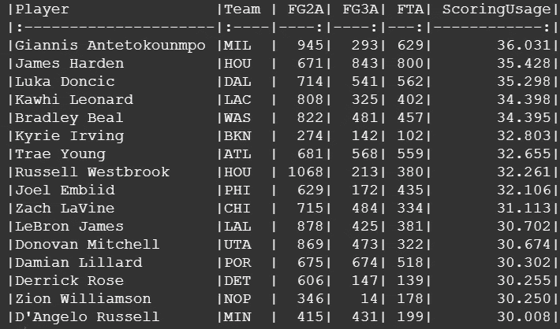
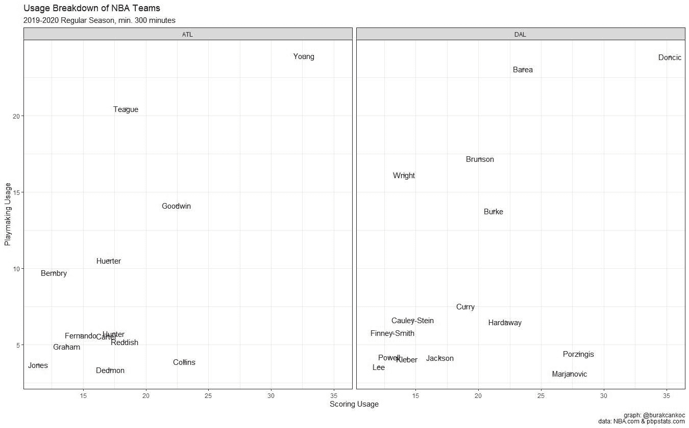

# NBA 的上升趋势:日心说

> 原文：<https://towardsdatascience.com/rising-trend-in-the-nba-heliocentrism-6bb12eba1c54?source=collection_archive---------47----------------------->

## 理解 NBA 进攻中使用的概念。

近年来，以太阳为中心的术语被用作定义首选团队建设方式的趋势。可以理解的是，球队优先考虑聚集明星，让明星成为场上的最终决策者(有些场下也是如此)。回到 2019 年 12 月， [**塞斯·帕特诺**](https://twitter.com/SethPartnow) [为竞技](https://theathletic.com/1427059/2019/12/06/the-new-nba-heliocentrism-how-teams-revolve-more-around-todays-stars-than-they-ever-have-before/)写了一篇文章，阐述球星如何成为各自球队的中锋。他特别调查了年轻的明星，特雷·杨和卢卡·东契奇，以及他们各自的球队，亚特兰大鹰队和达拉斯小牛队。

在这篇文章中，我使用了和 Seth 一样的方法，通过几个指标来评估球员在进攻端的使用情况。在[Basketball-Reference.com](https://www.basketball-reference.com/)、[NBA.com](http://www.nba.com)和[pbpstats.com](http://www.pbpstats.com/)(基于 NBA.com 的详细数据)上有许多统计数据，以探索球员的影响，Seth 估计包括跟踪数据以估计战术使用情况，这对于考虑战术行动是有意义的。

总的用法基本上是由三个部分相互总结而成的。

*   **评分用法:**

(投篮次数+ 0.44 *罚球次数)/总机会

*   **游戏制作用法:**

(潜在助攻+罚球助攻)/总机会

*   **营业额用途:**

失误/总机会

从定义上来说，得分的用法主要是由控球型风格的明星球员组成的，我相信这里有两点需要注意。

我注意到的第一件事是在名单的顶端(得分使用率超过 30.0 的球员)，只有休斯顿火箭队有一个以上的球员:詹姆斯·哈登和拉塞尔·维斯特布鲁克，很明显。从天文学的角度来说，把火箭的进攻描述成他们有两个太阳是没有错的。另一方面，在新奥尔良鹈鹕队的情况下，尽管只打了 24 场比赛，锡安·威廉森发现自己在高得分球员名单上。以太阳为中心不是鹈鹕队进攻的最佳术语，至少在过去的一个赛季，因为他们是一个基于使用分布的合作团队。看看他们如何从现在开始发展，以及他们是否能实现预期的飞跃，这将是一件有趣的事情。

休斯顿火箭队和新奥尔良鹈鹕队的使用情况分析

在下面，你可以找到 2019-2020 常规赛得分超过 30.0 的球员名单。

2019-2020 常规赛得分使用排名靠前的球员名单

对于组织进攻的使用，跟踪数据让我们可以看到各种类型的助攻。在 NBA 统计术语表中，**二次助攻**被定义为*“在接到球后 1 次运球内将球传给投篮的队友”*，**罚球助攻**被定义为*“如果球员将球传给在接到球后 1 次运球内造成投篮犯规的球员”*。正如 Seth 已经在他的文章中指出的，这种组织进攻的措施是信任球员发现队友空位(或没有空位)而不管投篮进还是出，并且也考虑到以罚球结束的传球。

2019-2020 常规赛潜在助攻和罚球助攻前 25 名球员

2019-2020 赛季常规赛最佳球员

在这种用法中很少有名字值得一提，尽管他们玩的时间可能是一个小样本。蒂姆·弗雷泽、克里斯·基奥扎和乔丹·麦克劳克林在他们有限的机会中展示了一个真正的组织者，我相信这三名球员在几乎每个 NBA 球队的替补角色中都能在压力下茁壮成长。

由于失误的用法是不言自明的，现在是时候从得分和组织进攻的角度来研究 NBA 中进攻是如何定义的了。

2019-2020 常规赛 NBA 球队使用明细

上表是得分用法和组织进攻用法的综合表示。在每支球队中，我都标记出总使用率最高的球员，并试图了解他们的进攻负荷分布。在塞斯写的文章中，他提到了亚特兰大老鹰队和达拉斯小牛队，以及他们的进攻是如何围绕他们的二年级球员特雷·杨和卢卡·东契奇进行的。常规赛结束后，再一次，可以说两支球队都在走一条相似的路线。有趣的是，东契奇的支持者明显比特蕾·杨多，这可能是一个很好的指标，可以观察亚特兰大在休赛期会选择什么类型的球员，我相信(也希望)他们会通过改善阵容来最大化特蕾(和老鹰)的进攻能力。

亚特兰大老鹰队和达拉斯小牛队的使用明细

由于跟踪数据只能从 2013 年到 2014 年获得，我制作了一个动画，展示了球队如何分配他们的进攻负荷/使用率，从下面可以看出，明星驱动的球队近年来与众不同。

从 2013–2014 年到 2018–2019 年改变团队的使用

在塞斯的文章之后，[本·泰勒](https://twitter.com/ElGee35)制作了一个精彩的[视频](https://www.youtube.com/watch?v=r0934lGZ4dw)通过回顾这些年来 NBA 进攻的历史发展来审视 NBA 中的日心说概念。他的方法与 Seth 的有点不同，但结论是相似的:NBA 球队用其他威胁包围控球型球员"*为他们创造空间，然后惩罚帮助摆脱这些威胁的防守队员"*。在下图中，我看了一些明星驱动的球队和他们的进攻负荷，以更好地理解他们的进攻组织。

明星驱动团队中的使用分布示例

Seth 提到了他的作品，即没有一支球员总使用率超过 50%的球队在那个赛季赢得冠军，随着明星驱动的进攻系统的兴起，在未来几年有一个问题需要回答:是否会有以太阳为中心的进攻赢得冠军，或者冠军是合作参与的结果，而不是一个巨大的太阳系？2020 年 NBA 季后赛，特别是总决赛可能是一个很好的起点，可以提取有价值的见解来回答这个问题。