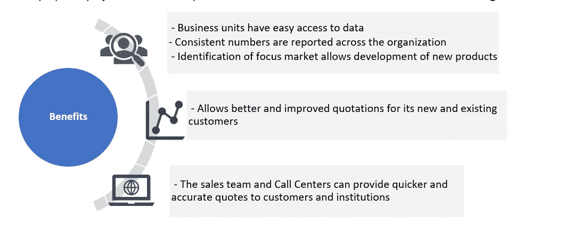
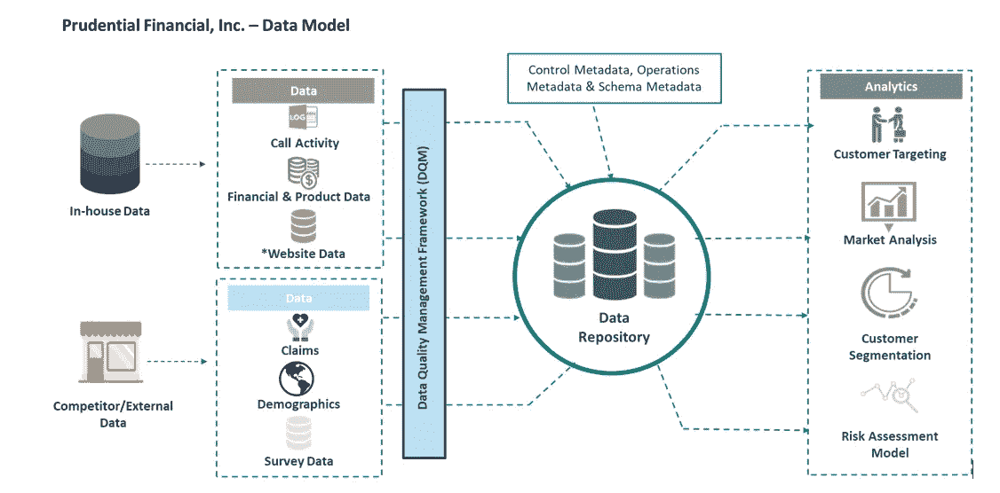
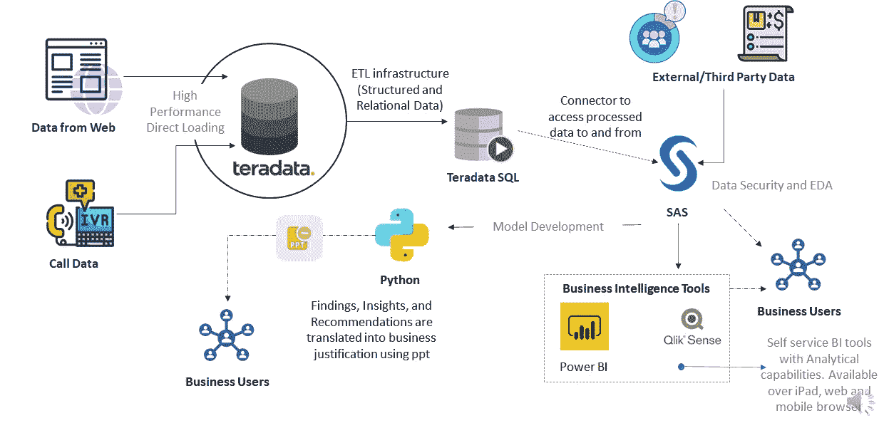
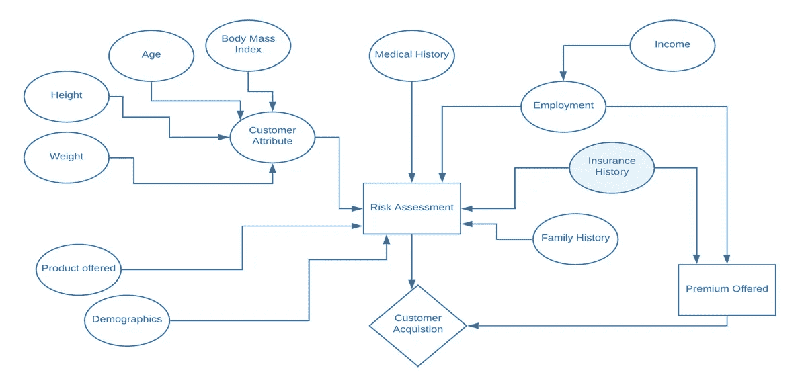
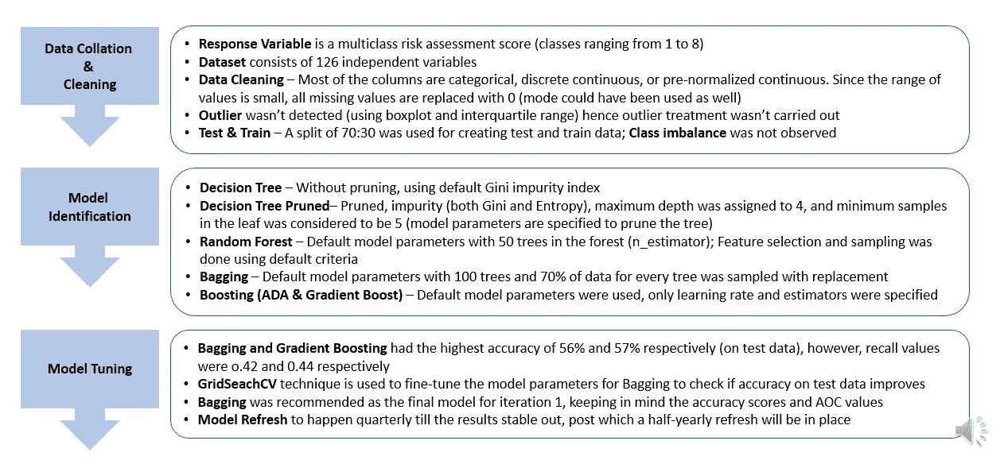

# 人寿保险资格的风险分类评估

> 原文：<https://towardsdatascience.com/risk-classification-assessment-for-life-insurance-eligibility-476252c1cfd5?source=collection_archive---------40----------------------->

## 案例研究—数据科学项目

卢卡斯·布拉塞克在 [Unsplash](https://unsplash.com?utm_source=medium&utm_medium=referral) 上的照片

***作者备注*** *—该项目是作为案例研究任务的一部分开发的，旨在更全面地了解数据科学在行业中的实施情况。2016 年，保诚人寿宣布在 Kaggle 举办一场比赛，邀请数据科学家提出一个风险评估模型。本案例研究的基础基于相同的问题空间，并使用来自 Kaggle 的数据和通过在线研究发现的数据来演示数据科学流程。演示文稿的链接可以在* [*这里找到*](https://www.youtube.com/watch?v=HonynCmRIN4&t=10s) *。*

# 行动纲要

保险公司正专注于利用大数据和机器学习的力量来推出满足不同客户和细分市场需求的产品。下面的案例研究简要介绍了美国最大的保险公司之一保诚金融有限公司如何利用强大的数据科学路线图在整个组织内进行社会化分析，同时解决为客户群提供可扩展风险评估模型的最大瓶颈。案例研究分析了实施的数据和业务模型、数据存储和处理的规模和范围，提供了对数据和软件标准的清晰简洁的评估，同时验证了所使用的关键分析和统计方法。

# 项目描述

即使在提供了充分和广泛的信息之后，客户通常也会经历较长的医疗检查等待时间。任何保险计划的初始在线报价通常都不准确。销售和呼叫中心团队必须依靠传统方法向客户提供保险报价，这非常耗时。这些因素让任何客户都望而却步，迫使他们寻找其他替代品。该公司认为，只有通过更好地获取和留住客户，才能提高 L&A 部门的收入。由于获得一个新客户所需的努力比保留现有客户要高得多，因此识别具有高机会的市场并减少客户的入职时间非常重要(Kaggle，2016)。

# 商业模式

# 概观

保诚金融公司采用细分市场的方法开发产品和服务，以满足各种客户和机构的需求。价值主张是其商业模式的一个关键要素，其重点是金融产品的可获得性、改善的商业诚信、强大的道德以及通过改善客户关系提升的品牌形象。

下面的图 1 显示了项目的拟议目标如何影响一些关键业务领域，如客户关系(通过改进报价)、保险产品开发(通过研究现有业务和市场份额)、营销渠道优化和客户获取。

图一。项目在不同业务领域的优势。图片致谢——由作者使用 PowerPoint 制作。

# 挑战

由于不同的客户特征，预测模型在其他保险细分市场中的可扩展性以及对不同的利益相关者、销售和客户参与团队进行关于采用该模型的培训是具有挑战性的。

# 数据处理

分析数据模型是建立客户数据一站式商店的关键，同时确定开发风险评估模型的关键因素(麦肯锡公司，2017 年)。下面的图 2 展示了不同数据源、数据质量管理框架和分析如何集成的概念视图。

图二。保诚金融公司的数据模型。请注意*网站数据将涉及通过 L&A 网络部分获取的客户信息和其他必要的详细信息。图片致谢——由作者使用 PowerPoint 制作。

下面让我们来看看数据模型的一些关键组件。

**数据源** —内部和外部，包括通过网站收集的数据、产品信息、财务数据、通话活动数据(客户和销售代表的 IVR 通话)、来自第三方供应商的索赔数据、市场人口统计信息和外部调查

**数据量**—2000 万客户，内部数据云存储 2.5

**数据速度**—L&A 段的通话和网络数据每日更新，财务和产品信息每月更新，外部数据每季度获取

**数据种类** —客户人口统计、医疗、就业和家族史。数据还包括销售额、拨打的电话、促销和活动

**数据准确性** —各地标准不同；DQM 用于确保数据质量

**ETL (Extract Load Transform)工具** —用于 web 保险应用和调用日志数据的 Teradata 和 Teradata SQL 产品和财务数据通常通过 Excel 存储和流通，并直接输入 info link 存储(SAS 数据集)。从第三方供应商处获得的外部数据(如索赔数据)存储为 SAS 数据集。该组织正计划将通过 web 生成的数据转移到 Apache Spark

**分析工具** — SAS & Python。SAS 用于数据安全目的；医疗信息非常敏感，因此该公司倾向于 SAS。Python (Jupyter Notebook)用于建模

**商业智能工具** — QlikSense 和 Power BI

**处理** —分析处理、数据量处理和查询优化

**能力** —支持后续风险评估和客户细分研究的模型

**安全/隐私** —医疗记录和患者数据需要隐私和保密。健康保险便携性和责任法案(HIPAA)管理美国健康数据的数据保护

**生命周期** —需要全面的数据管理

# 资源

下面的图 3 说明了不同的工具和技术在英国保诚金融有限公司的应用。

图 3。整合工具和技术以促进组织中的数据科学项目。图片致谢——由作者使用 PowerPoint 制作。

推荐工具的特点:

1. **Teradata** —以结构化形式存储数据的关系数据库管理系统，便于最终用户查询(Teradata，2014)

2. **Apache Spark** (推荐)——包含 map-reduce 功能。无模式设计在本质上是分布式的，允许更好地摄取点击流数据。存储成本要低得多，并且支持云原生或本地处理引擎

3. **SAS** —支持更好的数据安全性，并附带用于预测分析的分析功能。与任何开源平台相比，大多数制药和银行公司更喜欢 SAS

4.**Python**——通用且易于使用的语言，与 SAS 相比具有更好的机器学习和预测分析能力。由于有多个开源库可用，所以更适合模型开发

5.**QlikSense/Power BI**—QlikSense 是一款自助式商业智能工具，它利用内存使用来加速仪表盘。允许为 QVDs (Qlik View 数据集)的数据争论和转换编写脚本，允许更快地前端加载大型数据集。Power BI 的基本版本与组织购买的 Microsoft 软件包捆绑在一起，仅用于内部报告

# 数据分析

# 探索性数据分析

数据分析分为两个部分。下面图 4 所示的第一个部分涉及为业务用户创建一个 360 度仪表板，以访问当前的市场场景，而下一个部分涉及构建风险评估模型。所有涉及客户群、市场份额、可用产品、收入和增长的顶级 KPI 都与按地理位置和产品划分的相对绩效指标一起显示在执行摘要页面中。使用 QlikSense 的探索性数据分析能够识别需要注意的业务领域，同时整合模型开发所需的准备工作。

图 4。Qlik Sense 仪表板中的执行摘要概述。请注意，仪表板是使用 Qlik Sense Desktop 开发的，没有使用其他扩展。图片来源-作者使用 Qlik Sense desktop 开发的仪表板快照。

从上述数据分析中快速发现:

1.保诚金融公司拥有 2200 万客户，但在美国仅占有 6%的市场份额

2.该公司在美国西部主要是加利福尼亚州、内华达州、新墨西哥州和科罗拉多州有较好的知名度

3.产品 D3 和 D4 是 L&A 组合中表现最好的产品

4.该公司拥有不同年龄组的客户，观察到年龄和风险水平之间呈正相关(使用皮尔逊相关系数进行相关性检查)

# 风险评估模型

# 概念图

在模型开发之前，先开发一个高级概念图，以确定影响风险水平的因素。概念图如下图 5 所示。

图 5。影响保险公司风险水平的多个因素的概念图。由作者使用 Lucid Chard 开发。

# 模型开发

保诚金融公司将风险分为从 1 到 8 的 8 个主要类别，1 是风险最低的保险公司，8 是风险最高的。风险级别是一个多类属性，因此使用决策树和集成技术的组合来识别具有最高准确度分数的模型。集成意味着组合来自一组模型的结果以获得更好的准确性和稳定性。尝试和测试了多种算法，以在偏差和方差之间取得平衡。数据争论、缺失值处理、异常值处理在模型开发之前完成。计算所有属性的集中趋势和偏斜度，缺失值用 0 或模式替换。利用箱线图和四分位数间距组合来识别异常值。以下算法(Analytics Vidhya，2016)是在推荐要在服务器上部署的模型之前开发的，如下图 6 所示。

1.**决策树** —用于分类问题的监督学习算法，适用于分类变量数量较多的数据集。适用于处理多类问题，但经常导致模型过度拟合而没有修剪。基尼指数和熵被用作分裂的信息增益标准

2.**随机森林** —一种通用的机器学习方法，可以处理回归和分类问题。允许数据和特征子集(独立变量)的引导抽样在一个森林中生长多棵树。基于最大投票将数据分类到标签中。随机森林可以很好地处理具有更高维度的大型数据集，并结合多个分类器的结果来提高模型的稳定性

3.**装袋** —类似于随机森林，除了它利用所有特征来发展树

4. **Boosting** —结合弱学习者创建强学习者的算法家族。ADA boost 依次训练不同的预测器，以提高前一个预测器的输出。ADA boost 通过改变每次迭代的不正确预测的样本权重来工作，而梯度 boost 通过识别在前一次迭代中计算的较大残差来工作

5.**网格搜索 CV** —一种通过尝试多个模型参数范围来微调模型输出的技术。使用 K 倍交叉验证技术，根据 K 倍的结果输出算法的最佳参数。如果使用多个参数范围，计算时间会长得多

图 6。如何利用不同的集成技术提出模型的流程。图片致谢——由作者使用 PowerPoint 制作。

# 模型输出

下面的图 7 显示了使用 Bagging 技术开发的模型的配对图、精确度、召回率、F1 和 ROC 分数。在比较来自不同算法的模型参数时，考虑宏观平均分数。Bagging 的准确率最高，为 0.56，召回率和准确率分别为 0.42 和 0.51。在下一个刷新阶段，可以使用 k 倍交叉验证或自举采样对模型结果进行微调。

图 7。由 bagging 技术产生的模型的配对图、精确度、回忆、F1 和 ROC 分数。图像来源 Jupyter 笔记本中模型结果的输出。

# 结论

保诚金融公司正在利用数据的力量做出明智的决策。数据科学领域目前是一条合理回报的河流，行为科学和设计思维开辟了通过人、流程和技术平台的整体生态系统加速解决问题的途径。风险评估模型和 360 度仪表盘是同类产品中的第一个，有可能在未来几天内以十分之一的管理顾问成本释放 1000 万美元的价值。

# 参考

1.德勤金融服务中心。(2019). *2020 年保险展望*【白皮书】。检索自[https://www2 . Deloitte . com/us/en/insights/industry/financial-services/financial-services-industry-outlook/insurance-industry-outlook . html](https://www2.deloitte.com/us/en/insights/industry/financial-services/financial-services-industry-outlooks/insurance-industry-outlook.html)

2.卡格尔。(2016).保诚人寿保险评估。检索自[https://www . ka ggle . com/c/prudential-life-insurance-assessment/overview](https://www.kaggle.com/c/prudential-life-insurance-assessment/overview)

3.保诚金融公司(2020)。 *2019 年年报*。检索自[http://s22 . q4c dn . com/600663696/files/doc _ financials/voting _ results/Prudential-ar 2019 . pdf](http://s22.q4cdn.com/600663696/files/doc_financials/voting_results/Prudential-AR2019.pdf)

4.Teradata (2014 年)。大数据:TERADATA 统一数据架构 TM 在行动。[在线]可从以下网址获得:[http://assets . teradata . com/resource center/downloads/whites/EB 7805 . pdf](http://assets.teradata.com/resourceCenter/downloads/WhitePapers/EB7805.pdf)

5.麦肯锡公司(2017)。利用保险数据的潜力。[在线]麦肯锡公司。可从以下网址获得:[https://www . McKinsey . com/industries/financial-services/our-insights/having-the-potential-of-data-in-insurance](https://www.mckinsey.com/industries/financial-services/our-insights/harnessing-the-potential-of-data-in-insurance)。

6.分析 Vidhya (2016 年)。基于树的算法:从头开始的完整教程(用 R & Python 编写)。[在线]分析维迪亚。可在:[https://www . analyticsvidhya . com/blog/2016/04/tree-based-algorithms-complete-tutorial-scratch-in-python/](https://www.analyticsvidhya.com/blog/2016/04/tree-based-algorithms-complete-tutorial-scratch-in-python/)获取。