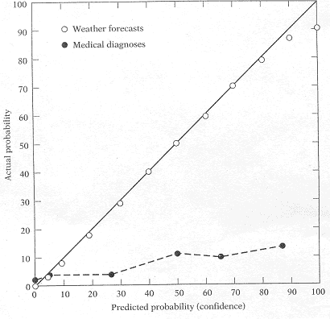
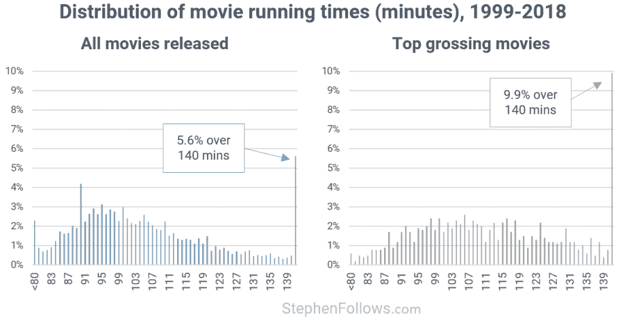

# 风险情报

> 原文：<https://towardsdatascience.com/risk-intelligence-3f25ffa25e74?source=collection_archive---------36----------------------->

## 死于新冠肺炎的风险有多大？

沃洛季米尔·赫里先科拍摄的照片(经由[取消拍摄](https://unsplash.com/)

风险智能是准确估计事件概率的能力。在本文中，我们应用[迪伦·埃文斯](https://www.amazon.com/Risk-Intelligence-How-Live-Uncertainty/dp/1451610912)的思维方式来评估:

*   死于新冠肺炎的风险有多大
*   电影一般会放多长时间
*   有多少 M & Ms 在 100 米的距离上排成一行
*   [你的风险情报有多好](https://www.guidedtrack.com/programs/ei1hor4/run)

## 天气预报员对医生

天气预报员通过明确提及天气事件是否会发生的确定程度来使用概率预报。他们经常被要求在预报中包括天气事件发生的可能性。当他们预测“明天有 90%的可能性会下雨”时，他们有 85%的可能性是正确的。

天气预报员会在校准曲线上打满分。相比之下，医疗从业者会表现出过度自信。

当医生确信他们的病人有 90%的机会患肺炎时，只有 15%的病人被检测出肺炎阳性(见下文)。这是极端的高估偏差。

气象预报员对降水的预测和医生对肺炎的诊断的校准曲线(通过[斯科特·普劳斯](https://web.csulb.edu/~cwallis/382/certainty/chapter19.html)

医生对其诊断准确性的信心比证据实际保证的要大得多。他们宁愿安全也不愿后悔，即使这可能会导致更多的假阳性病例。如果晚期病人被发现是假阴性，医生将面临诉讼。

> 你有没有注意到，医生更喜欢用模糊的词语来描述他们的诊断有多大可能是正确的？

使用诸如“可能”、“可能”、“大概”这样的模糊词，他们可以回避他们所传达的模糊信息，这样他们就不太可能出错。

天气预报员的工作是重复的。他可以立即检查他的天气预报第二天是否是真实的。问题“明天会下雨还是下雪？”，“周五东京遭受台风袭击的可能性有多大？”都是定义明确的。答案清晰明确。因此，天气预报员可以通过从即时反馈中学习来快速提高他的风险情报。

医生很难从病人那里得到即时反馈。病人可能不会回来了。病人可能会被介绍给另一位医生。医学领域的许多问题无法准确回答。某些传染病，如伊波拉病毒和新冠肺炎病毒，需要进行预后筛查测试、基因组测序、接触者追踪、数据分析和严密监控。

诸如“这种新药对病人有副作用吗？”、“对于患有慢性疾病的新冠肺炎患者，应该给予什么样的治疗？”通常会在几周或几个月内导致医学诊断的改变。

# 未知的未知

邓宁-克鲁格效应是一种认知偏差，根源在于缺乏风险智能。大卫·邓宁和贾斯汀·克鲁格认为，无能不仅会导致糟糕的表现，还会导致无法认识到自己的无能。无能的人最容易产生虚幻的优越感。出于过度自信和缺乏自我意识，他们更有可能高估自己的知识或能力。

知识渊博的人在获得更多知识的同时，会更加意识到自己知识的局限性，即使这种意识可能会削弱他们的信心。一个博学的学者可能因此遭受虚幻的自卑。他可能低估了自己的能力。他知道有很多问题他还不知道答案。

# 未知的知识

你的知识通常是基于你没有意识到的事情。这可能是直觉、本能或直觉。

以英语为母语的人可能不知道语法规则，但他们可以连贯、正确地说和写。非母语人士将不得不花费数年时间学习时态、句子结构和词汇，以达到足够好的掌握水平。

大学生可能已经学习了数学概念和规则，但不知道如何将它们应用于一个特别困难的问题。他们所接受的数学基础是未知的知识。但是对于数学天才来说，这些问题只是小菜一碟。

他们不知道的是，数学天才更擅长调用数学基础来解决问题。数学天才在很小的时候就学习数学，他们已经将数学概念、方法和技巧内化了。简而言之，他们更善于发现联系，并将隐性的已知转化为显性的已知。

# 已知的未知

一个专业的赌徒会故意犯一些明显的错误来判断他的对手会如何对付他。如果对手巧妙地利用了他的错误，这个专业赌徒就会停止游戏。他只有在确信自己能赢的时候才会下注。专业赌徒通常了解自己的优势、弱点和局限性，并从过去的错误中吸取教训。

展示智慧的欲望会抑制风险智慧。知道自己不知道的东西，可以防止自己屈服于解释深度的错觉。

## 贝叶斯定理

当我们确定地知道其他概率时，贝叶斯定理对于寻找未知概率是有用的。

> 65 岁及以上的老年人死于 Covid 的可能性有多大？

一个中国人和美国人的死亡风险会略有不同。对于 65 岁以上的中国人:

> P(死于 Covid | 65 岁以上)= P(死于 Covid)* P(65 岁以上|死于 Covid)/P(65 岁以上)
> 
> P(C|>65) = P(C) * P(>65 | C) / P(>65)
> 
> P(C) = [死于 Covid](http://weekly.chinacdc.cn/en/article/id/e53946e2-c6c4-41e9-9a9b-fea8db1a8f51) 的概率= 2.3% = 0.023
> 
> p(> 65 | C)=[65 岁以上中国人死于 Covid 的概率](http://weekly.chinacdc.cn/en/article/id/e53946e2-c6c4-41e9-9a9b-fea8db1a8f51) = 81% = 0.81
> 
> p(> 65)=[65 岁以上中国人的百分比](https://chinapower.csis.org/aging-problem/) = 9.5% = 0.095
> 
> p(C | > 65)= 65 岁以上中国人死于 Covid 的概率= 0.023*0.81/0.095 = 0.196 = 19.6%

如果一个中国人年龄在 65 岁或以上，他有 19.6%的机会死于 Covid。

对于一个年龄相仿的美国人来说:

> P(C|>65) = P(C) * P(>65 | C) / P(>65)
> 
> P(C) = [死于 Covid](https://en.wikipedia.org/wiki/Template:2019%E2%80%9320_coronavirus_pandemic_data) 的概率= 3.86% = 0.0386
> 
> p(> 65 | C)=[65 岁以上美国人死于 Covid 的概率](https://www.cdc.gov/mmwr/volumes/69/wr/pdfs/mm6912e2-H.pdf) = 80% = 0.8
> 
> p(> 65)=[65 岁以上美国人的百分比 ol](https://acl.gov/sites/default/files/Aging%20and%20Disability%20in%20America/2017OlderAmericansProfile.pdf) d = 15.2% = 0.152
> 
> p(C | > 65)= 65 岁以上美国人死于 Covid 的概率= 0.0385*0.8/0.152 = 0.203 = 20.3%

美国人有 20.3%的几率死于 Covid。

贝叶斯定理只有在你能避免犯基础率谬误时才有效。不同的国家有不同的基本利率。人口老龄化的国家往往有更高的病死率。

## 正态分布

> 如果你去拜访一个看了 30 分钟电影的朋友，你会预测电影的长度是多少？

当托马斯·格里菲斯和约书亚·特南鲍姆问人们完全相同的问题时，人们根据他们的日常经验给出了统计估计。通过考虑电影播放时间的基本比率，他们不知不觉地采用了贝叶斯思维。

Griffith 和 Tenenbaum 发现电影运行时间遵循高斯分布，由此预测值围绕平均值聚集(见下文):

电影在“所有上映电影”和“票房最高电影”中的分布(通过[斯蒂芬跟随](https://stephenfollows.com/are-movies-getting-longer/)

你不必掌握贝叶斯定理或高斯分布的复杂数学理论来得出上述结果。风险情报看起来很直观。

# 已知的知识

费米问题是我们永远不会知道确切答案的数学问题。如果我们能做出合理的假设和大概的估计，我们就能做出有根据的猜测，得出一个大概的答案。

微软和谷歌喜欢用费米问题来拷问他们的受访者，以测试他们的思维能力。准备好面对这些臭名昭著的问题:

> 芝加哥有多少钢琴调音师？

这里的解决方案是。

> 如果银河系中有相当数量的智慧文明，为什么我们的文明从未遇到过其他文明？

费米悖论可以用[德雷克方程](https://www.vox.com/science-and-health/2018/7/3/17522810/aliens-fermi-paradox-drake-equation)解决。

> 测量单条 M&Ms 线路到 100 米的距离需要多少数据包？

> 一个 1.59 盎司的袋子里大约有 30 颗 M & Ms 巧克力豆。
> 
> 一个普通的 M&M 直径约为 1 厘米。
> 
> 一包 M & Ms 可以做 30cm 距离的单行。
> 
> 100 米的距离将有 100 米/0.3 米= 333 个 M & Ms 包

> 如果你是一百万秒，你是多少岁？一百万小时前？一百万天前？

> 1 年= 365 天 x 24 小时 x 60 分钟 x 60 秒= 31，536，000 秒
> 
> 1000000 秒/31536000 秒= 0.03 年

这意味着你是一个 11 天大的婴儿。

> 1 年= 365 天 x 24 小时= 8，760 小时
> 
> 1，000，000 小时/ 8，760 小时= 114 年

这使你成为一个非常老的超级百岁老人。

> 1 年= 365 天
> 
> 1，000，000 天/ 365 天= 2740 年

这对人类来说是不可能的，至少现在是这样。

## 以下是你如何做出更好的预测

风险智能可以防止我们停留在无知的幸福或过度恐惧的反应。总体而言，预测地缘政治、宏观经济和股市趋势等紧迫问题要困难得多。

令人惊讶的是，每个人都可以有条不紊地训练预测未来的能力。Philip Tetlock 提出了以下实用的方法。参加概率推理和预测的简短培训课程。识别日常生活中的认知偏差。阅读新闻并与其他预报员讨论。加入[全球预测锦标赛](https://goodjudgment.com/resources/good-judgment-open/)。

最后但同样重要的一点是，保持开放的心态，愿意经常快速地改变你的想法。

***编者按:*** [*走向数据科学*](http://towardsdatascience.com/) *是一份以数据科学和机器学习研究为主的中型刊物。我们不是健康专家或流行病学家，本文的观点不应被解释为专业建议。想了解更多关于疫情冠状病毒的信息，可以点击* [*这里*](https://www.who.int/emergencies/diseases/novel-coronavirus-2019/situation-reports) *。*

*本文最初发表于*[*showdeyang.com*](http://showdeyang.com)