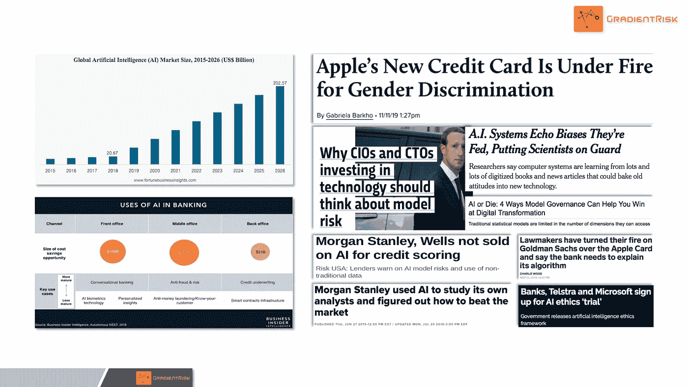
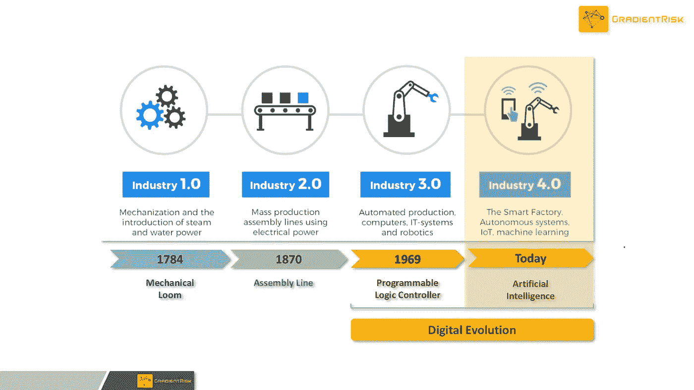
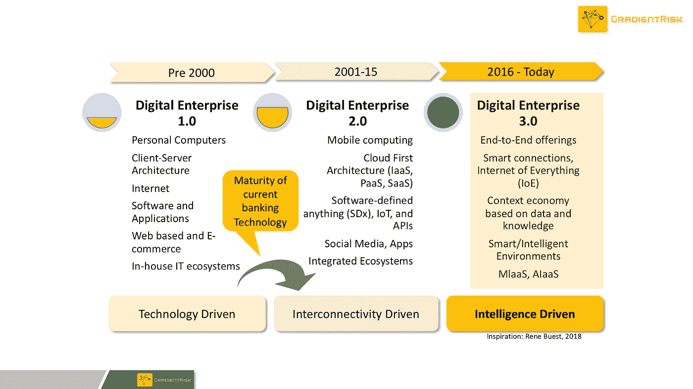
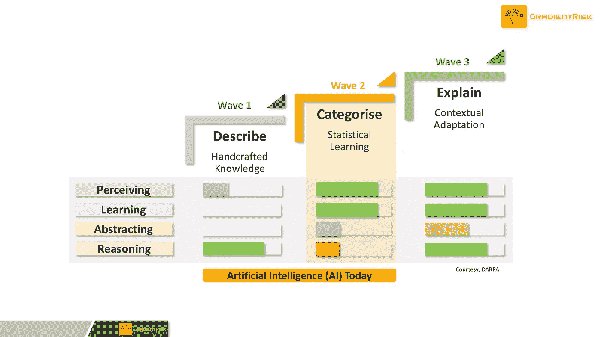
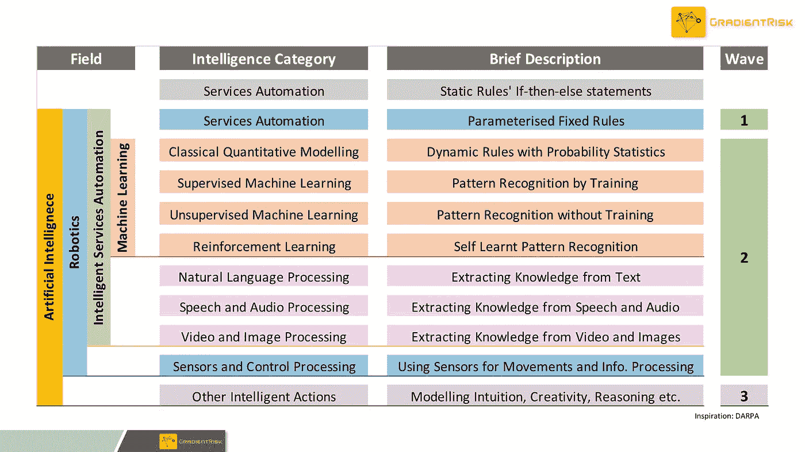
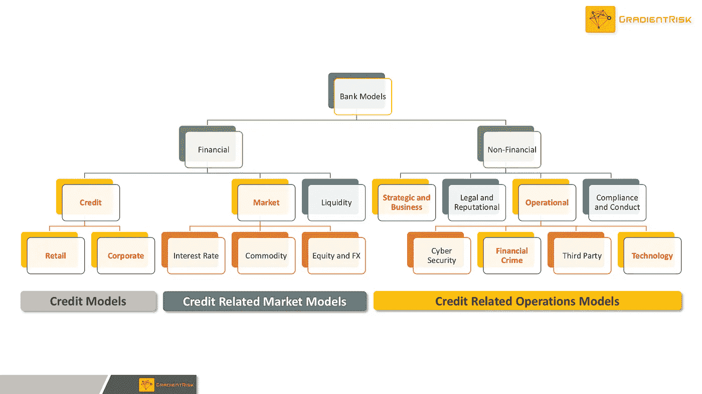
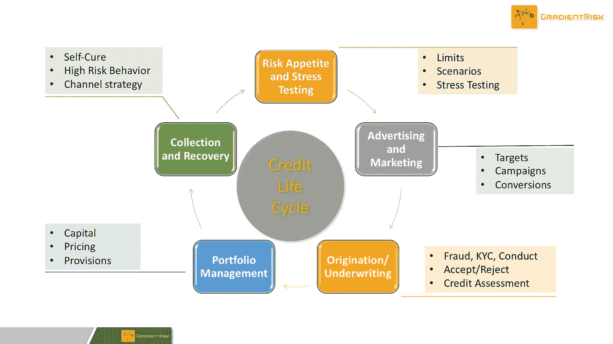
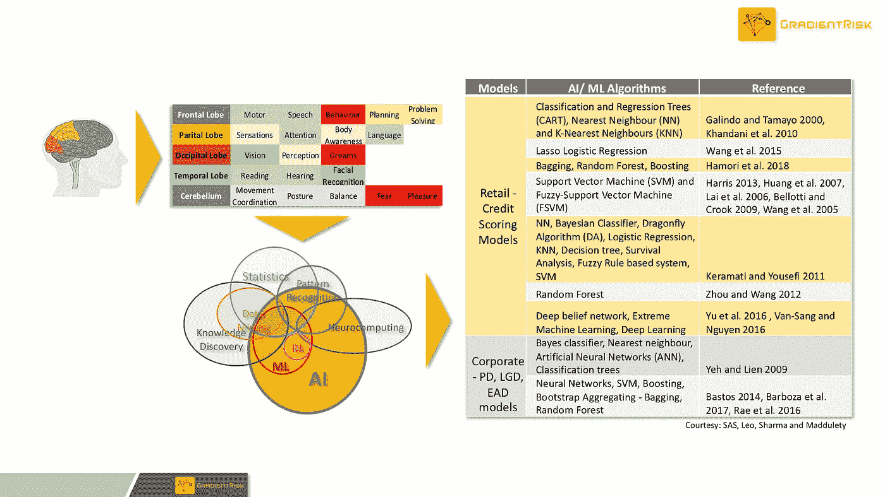

# 人工智能驱动的信贷自动化的风险——综述

> 原文：<https://towardsdatascience.com/risks-of-ai-driven-credit-automation-an-overview-cae91d12a298?source=collection_archive---------37----------------------->

## 企业人工智能越来越多地被应用于改造和自动化银行流程，包括贷款和信贷价值链。

银行业似乎正在依赖人工智能(AI)和智能自动化来保护不断减少的利润。企业人工智能越来越多地被应用于改造和自动化银行流程，包括贷款和信贷价值链。对于一个历史上保守的行业来说，这是一个前所未有的举动，但绝望的时刻需要绝望的措施。人工智能仍然是一项成熟的技术，其创造者在技术行业尚未理解和控制风险。人工智能风险及其影响会在高度监管的大规模银行信贷流程中放大。银行很清楚这一点，但他们别无选择，因为他们的利润率正受到来自各个方面的冲击，时间对他们不利。

**银行被迫部署提高效率和削减成本等防御性策略，以维持利润率。理论上，这是人工智能和自动化有望拯救银行业的地方。**

传统信贷和贸易本身一样古老，自从大约 4000 年前基于物物交换系统的作物贷款在美索不达米亚的古代寺庙中引入以来，其核心概念并没有根本改变。然而，自那以后，信贷流程、系统和效用发生了演变，推动了人类文明的大规模扩张和进步。尽管非银行贷款在现代经济中发挥着至关重要的作用，但银行仍是神圣不可侵犯的现代信用殿堂。自 19 世纪初以来，银行已经建立了一个强大的信贷业务堡垒，并成功抵御了多次冲击。然而，对银行来说，最新的破坏性冲击是非传统的、未知的领域。当前人工智能驱动的颠覆正在走向成熟，但却是尖端技术，它通过快节奏的产品和运营创新推动快速变化，并呈现出一大堆未知的未知。这与当前保守的银行业经营理念或商业模式很难兼容。银行第一次面临一个可怕的敌人。由于多年来在低于标准的信贷实践中躲闪和迂回，持牌银行和受监管银行陷入了错综复杂的监管之中。一方面，银行业正试图应对人工智能如何影响现有银行和信贷法规的合规性，另一方面，人工智能本身将如何受到监管存在[监管不确定性](/artificial-intelligence-ai-in-banking-the-double-edged-sword-276e3e6321ff)。

尽管存在所有的不确定性，但银行业正缓慢但肯定地被人工智能的无情打击所吸引，似乎正在梦游进入智能自动化陷阱，而没有充分意识到与之相关的风险。

事实上，对银行业人工智能风险的集体理解还需要数年时间。在讨论风险，特别是人工智能模型风险之前，有必要了解人工智能驱动的自动化预计将如何重塑银行的信贷价值链及相关流程和技术。让我们从 10 万英尺高空的卫星视图开始，然后快速下降，处理信贷价值链的细节以及地面上的相关模型和算法。

## **10 万英尺高空的工业革命**

工业 4.0:早期工业化以来的工业革命

由于数字技术进步的令人振奋的步伐，我们被认为正在经历第四次工业革命，被称为“工业 4.0”。这一革命性阶段背后的普遍影响有时被称为“网络物理系统”，实际上是人工智能。工业 4.0 主要专注于将智能注入每个系统和流程，使其智能和自主。

## **万英尺高空的数字进化**

数字进化:数字企业成熟度和时间表

对工业革命的进一步研究表明,“工业 4.0”及其前身对“数字进化”做出了重大贡献。数字企业(DE)被认为是在三个不同但相互关联的阶段中发展。DE 1.0 主要关注个人电脑和软件等技术的发展，而 DE 2.0 则关注移动性和互连性的进步。最新阶段的 DE 3.0 是关于利用技术基础设施和注入智能，使流程和系统智能和自治。今天，大多数 DE 3.0 企业都是大型科技公司，已经掌握了利用人工智能的技术基础设施。大多数传统银行刚刚开始升级其遗留系统，还远未实现人工智能的全部潜力。理想情况下，阶段之间的过渡应该是一个渐进的过程，组织有机会建立、消化和维持。在尝试大规模部署人工智能之前，银行业似乎没有时间、技能或资源来达到所需的技术成熟度水平。银行渴望成为科技企业，这很可能是一个有效的战略选择。但是，受监管银行的商业模式和文化并没有发生重大变化，以适应技术驱动的战略。

系统中人工智能风险的积累可以比作' [**【沸腾的青蛙】**](https://en.wikipedia.org/wiki/Boiling_frog) **'在这种情况下，风险在突然发生灾难性转变之前就已经酝酿好了。银行正以某种方式面对自己的“** [**柯达时刻**](https://medium.com/@brand_minds/why-did-kodak-fail-and-what-can-you-learn-from-its-failure-70b92793493c) **”。**

## **人工智能进化@ 5000 英尺**

人工智能波——DARPA 人工智能进化分类

作为愿望或抽象概念的人工智能与人类思想本身一样古老，尽管它可能从未被设想为一种技术可能性。虽然人工智能作为一个具体的概念和计算机科学的一个分支自 20 世纪 50 年代以来一直在酝酿之中，但直到 2010 年代初才带来任何商业利益。人工智能只是在与数字进化融合时才开始有商业意义。国防高级研究计划局(DARPA)，一个著名的前沿人工智能研究的先锋，已经将人工智能进化分为三个浪潮。波浪被称为**手工知识**、**统计学习**和**语境适应**。今天的人工智能属于第一波和第二波，但离解释它们的行为和结果还有一段距离。

> 可解释性和透明度是在信贷和银行领域有效实施人工智能面临的一些最大挑战。监管机构要求银行能够解释贷款和信贷决策，并充分披露批准或拒绝信贷决策背后的原因。

此外，数字进化 3.0 是一个必要的技术生态系统，可以充分发挥人工智能的全部潜力，并充分管理其风险。据估计，银行在实现 DE 3.0 到期方面落后 10 到 15 年。

## **人工智能@ 1000 英尺**

受 DARPA 启发的人工智能分类:人工智能模型的整体图景

人工智能是一种结合数据、业务逻辑和机器/统计学习模型来影响或自动化流程的系统。虽然这需要一种计算机科学的方法来描述人工智能，并且不一定是人工智能的学术定义，但从应用模型风险的角度来理解人工智能是有用的。DARPA 启发的分类是比标准定义更好的理解人工智能的方法。

*   **机器学习** : DARPA 将其称为“统计学习”，是经典统计建模和监督、非监督和强化学习的融合。深度学习是机器学习的一个子集，使用多层神经网络来解决更高维度的问题。
*   **智能服务自动化**:自然语言处理(NLP)、语音、音频、视频和图像处理被认为是智能服务自动化(ISA)。ISA 应用机器学习和深度学习技术，并且它们在它们的效用水平上被商品化。
*   **机器人**:机器人将物理传感器和控制与人工智能相结合。

## **100 英尺处的银行模型**

银行模型清单:信贷模型不仅仅是法规遵从性

银行已经广泛使用模型和工具来产生商业见解、自动化流程和做出商业决策。任何标准的零售和商业银行模型库存都可能有成百上千的金融和非金融模型。大型零售银行和企业银行可能有 1，000 到 2，500 种工具和模型。

> **大多数银行模型属于上述 DARPA 分类的第 1 波& 2。大多数 wave 2(统计学习)信贷和贷款模型的开发和部署都是为了支持高级巴塞尔协议 II & III 认证。**

从信贷角度来看，模型主要属于零售和非零售(公司)投资组合。但是，值得考虑的是与信用相关的市场和市场风险模型以及包括信用策略(风险偏好)在内的与信用相关的运营和操作风险模型。

## **50 英尺的信用模型**

银行业中的信贷模型清单-企业人工智能越来越多地用于自动化信贷价值链

银行将大部分信贷建模精力用于遵守风险报告的各种监管要求。高级统计学习模型的真正潜力在管理与信用风险及其操作相关的风险方面几乎从未发挥过重要作用。尽管巴塞尔(Basel)和多德-弗兰克(Dodd-Frank)等监管要求迫使银行更加以数据为导向，但客观的基本银行文化从未出现过。例如，信贷模型性能指标在过去十年中几乎没有改善，但这从来都不是问题，因为投资和改善模型性能没有太大的商业意义。银行业信贷模型的最大风险不是模型可能出错，而是监管者会注意到这一点，并对违规行为处以重罚。缺乏来自行业外的竞争，部分是由于其庞大的规模，导致银行自满，监管机构一直在打勾，直到现在。

> **银行业的竞争态势突然发生了变化，BigTech、FinTech、TechFin、neo banks 等新的参与者。正在通过一次一次的技术颠覆蚕食银行利润。过去，银行成功应对了传统的竞争和干扰，但现在它们面临着痛苦的“千刀万剐”的局面。**

企业人工智能被这个行业作为银弹出售，这个行业也是通过专有贷款(亚马逊)、支付系统和信用卡(苹果、谷歌)、加密货币(脸书)等盈利的有力竞争者。此外，他们可以使用更成熟的技术基础设施，并且不受法规的束缚，至少目前是这样。银行别无选择，只能与这些科技巨头合作，实施人工智能，实现信贷价值链的自动化。尽管监管信贷模型目前超出了先进人工智能算法的限制，但整体信贷价值链正在快速自动化。正在使用先进的人工智能算法开发下一代模型，以找到优秀的客户并参与其中，改善整体客户体验，为客户开发个性化的价值主张，帮助银行提高效率和道德水平，管理收款等。

## **人工智能算法@地面**

用人工智能算法复制人脑——信贷价值链自动化越来越多地利用这些算法。

最新的人工智能算法已经以不同的复杂程度复制了人类大脑的大部分活动。对于银行来说，应用这些能力来改善客户价值主张和应对竞争的诱惑是不可抗拒的。这些算法的全部主机将可能被用于生成集体见解、增强客户体验和提高效率。它已经在聊天机器人、语音银行、智能信贷政策整合、连接物联网数据以自动化流动性和贸易融资、交易员和银行家对话分析以改善销售机会、监控行为和增强客户服务等方面发挥作用。其中一些人工智能算法复杂、精密且不透明，但由于它们没有应用于监管模型，因此被认为风险重要性较低。

> **众所周知，沸腾的锅的温度似乎上升得相当快，而青蛙仍然幸福地不知道。**

## **总之……**

银行在转型项目上投资数十亿美元，希望提升信贷和银行系统，使它们为人工智能做好准备。企业人工智能有望在信贷和关联银行流程的自动化和智能化方面发挥重要作用。但是，由于目前的技术成熟度和相关技能差距，根本的转型战略绝不是以人工智能为中心的。大多数银行仍在从传统系统(数字企业 1.0)向移动和基于云的基础设施(数字企业 2.0)过渡。银行正在努力获得正确的数据和基础设施基础，以便能够有效地利用人工智能。这在正常情况下是有道理的，但现在是银行和信贷的非常时期。

> **竞争和成本压力持续存在，银行已经开始将人工智能模型滴入银行生态系统，而没有整体的人工智能战略或监管指导方针。杂耍才刚刚开始，但随着更多的人工智能模型进入生态系统，它将变得异常困难。**