# 教机器行为:强化学习

> 原文：<https://towardsdatascience.com/rl-4-all-1-3edac941fe37?source=collection_archive---------34----------------------->

## [强化学习基础](https://medium.com/tag/rl-fundamentals)

## 第一部分

*这篇文章的目的是为任何人进入强化学习提供一个切入点。我打算提供理解什么是强化学习算法，它们如何工作所必需的基础知识。后续文章将深入讨论具体的算法和实现。一定要订阅。*

*TL；大卫:在文章的最后，你会发现所有学习材料的总结。*

Re enforcement Learning(**RL**)是一门科学，旨在创造能够学习如何在特定环境中以最佳方式*行动的机器。如果我们将*智能代理*定义为最佳行为的智能代理，那么这个领域可以被认为是**人工智能**的一个子领域。一个这样的智能代理将是一个学习如何在世界冠军的水平上下棋的系统。*

*请注意，正如在所有机器学习子领域中一样， **RL** 程序并不是显式编码的，以便在某些给定的任务中最佳地执行。相反，这门科学背后的动机是设计通用算法，这些算法能够不断地从环境中学习 T21，这样它们就可以利用学到的知识在特定的任务中表现出色。*

# *基础知识*

*RL 的灵感来自于*行为心理学*，这是一个科学领域，专注于个体的行为如何通过**强化** 和**重复**来改变。在这种情况下，正确的行为会得到奖励，不受欢迎的行为会受到惩罚；想出一个典型的对狗的调理方法:当狗表现好时奖励它，但当它咬你的鞋子时惩罚它。通过足够多的互动，个体可以学习到最优行为，即**最大化其总回报**，或者等价地**最小化其惩罚**。*

> *总报酬可以被认为是在一个代理人的生命周期中的每个时间步给出的独立报酬的总和。*

*为了最大化其总回报，**一个 RL 代理需要学习如何最佳地表现**。这意味着，它必须花一些时间在每时每刻寻找最佳行动。测试未知的行动路径可能会浪费代理人的时间(比如说，如果代理人的时间有限，像大多数生物一样)，这些时间可以用来在更好的已知路径下获得更高的奖励。这意味着必须在*探索*环境和*使用* 已经获得的知识之间找到平衡。这种困境在强化学习中被命名为**探索 vs 利用**，是工程化类似类型在职者时需要解决的一个经常性任务。*

> *强化学习的重点是开发**代理**，这些代理学习在**环境中**采取行动，以便最大化**累积回报**的一些概念。*

*为了构建一个具有这些特征的代理，我们利用数学框架来模拟代理的执行。正如你将看到的，一个问题的数学模型允许工程师在计算机上实现它们。*

**

*一群与环境互动的蓝色特工。他们的目标是避免被红色特工直接看到[1]。*

# *任务建模*

## *简单的模型*

*让我们假设一个智能体与环境的交互是这样的:一个智能体**在**时间** `t`、中的一个点上观察**环境**状态** `s`，并根据它所看到的，决定执行一个给定的**动作** `a`。在随后的时间`t+1`，比如说一秒钟后，代理接收到**奖励/惩罚** `r` 以执行该动作；这个循环在时间`t+1`重新开始，此时代理观察到环境的新状态`s.t+1`。该循环要么永远重复，要么直到最后一个时间步`T`。*

*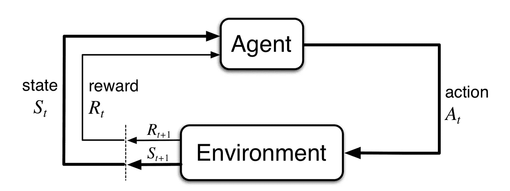*

*主体-环境相互作用模型。摘自[2]。*

*一系列的状态、动作和奖励被正式称为轨迹:`s0, a0, r1, s1, a1, r2, ...`。*

*如果环境曾经到达一个 ***最终状态*** (例如，在国际象棋游戏中到达一个对弈对手)，我们认为这个交互**是插曲**:它有一个*开始*和一个*结束*。相反，没有在任何时间点完成的任务被命名为**连续**(我们的宇宙可能就是这样的环境之一)。我们需要区分这两者的原因将在下面几节中变得显而易见。*

## *有限马尔可夫决策过程*

*根据*状态*、*动作*和*奖励*来公式化这种相互作用，允许我们将问题构建在被称为**马尔可夫决策过程** ( **MDP，简称**)的数学框架中。您可以将 MDP 视为数学模型，它允许我们将这种高层次的交互概念简化为定义明确的元素。具体来说，MDP 可以使用一个*三元素元组*对交互进行建模:*

*   ***S** :可能状态的有限集合**。
    比如井字游戏的一个 ***单态*** `**s**`就是游戏的网格，它告诉被玩的 ***x 的*** 和 ***o 的*** 所在的位置。所有状态的集合将包含所有可能实现的板的组。***

******

***井字游戏中可实现的各种状态列表。***

*   *****A(s)** :从状态`**s**`可用的**有限组可能动作**。
    如前所述，动作将代理从一个状态带到下一个状态( **sᵢ** → **sᵢ₊₁** )。因此，从任何状态`s`，将有一组可能采取的行动，定义为`**A(s)**`。在井字游戏开始时，第一个玩家可以选择最多 9 个单元格来标记(要采取的行动)，而第二个玩家在第一轮只能从 8 个单元格中选择。***

***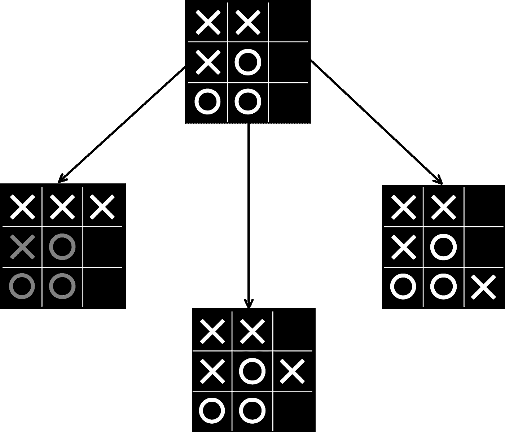***

***井字游戏状态图。每个箭头都是将代理从一种状态带到下一种状态的操作。***

*   *****Prob(s '，r| s，a)** :转移概率函数**。** 这个概率函数描述了代理的环境机制:当从一个状态`s`开始并采取一个行动`a`时，实现一个状态奖励对(例如，check-mate，WIN)的概率是多少。更正式地说，我们可以将单个交互描述为 *{s，a → s '，r}:* 从状态`**s**`开始，执行动作`**a**`，将代理带到一个新的状态`**s'**`，获得奖励`**r**`。如果想象起来很混乱，下一段旨在让它变得清晰。***

***备份图是非常有用的工具，可以让我们更好地可视化 MDP。我们可以将代理和环境之间可能的交互想象成一个图，其中 **S** 中的每个状态 **s** 是一个*节点*，来自给定状态 **A(s)** 的每个可能动作是一个*动作节点*，边是每个下一个状态**S’**的奖励概率以及它们相关的奖励 **r** 。***

***让我们通过备份图来说明转移概率函数。让我们假设你处于这样一个场景中，你可以购买一张彩票，以千分之一(0.1%)的概率赢得`$1000`，以 99.9%的概率输掉`$10`，或者不购买，既不赢也不输钱，但有 100%的概率。***

***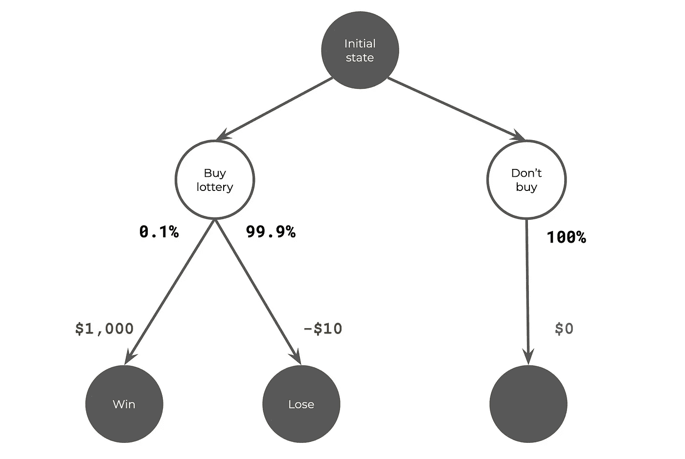***

***所有可能的转换包括:***

*   ***`Prob(Win, $1000| Initial, Buy)` = 0.1%***
*   ***`Prob(Lose, -$10| Initial, Buy)` = 99.9%***
*   ***`Prob(GoHome, $0| Initial, DontBuy)` = 100%***

***所有其他的转变组合都是不可能的，这意味着它们发生的概率为零。举几个例子:***

*   ***`Prob(Win, $999999999| Initial, Buy)` = 0.0%
    不可能用一张单人票赢得超过 1，000 美元的奖金。***
*   ***`Prob(Win, $1000| Initial, DontBuy)` = 0.0%
    不买票不可能中奖。***

## ***随机与确定***

***状态转移是随机定义的*(用更简单的话来说，是一个概率函数)，允许像扑克游戏这样的随机环境用 MDP 来建模。在 ***确定性环境*** ( *非随机*，如井字游戏)中，从状态`**s**`开始并采取行动的代理人`**a**`总是会转换到状态`**s'**`并获得相同的奖励`**r**`。****

# ****奖励****

****最优代理人本身的目标是最大化累积报酬，而不是个人报酬。一个聪明的代理人宁愿在它的轨迹中获得小的回报，最终得到正的累积和，也不愿随着时间的推移获得高的正回报和低的负回报，最终得到低的累积和。所有奖励之和 **G** 在一定时间后 *t* 定义为****返回*** *。*这种**回归**就是我们希望我们的代理人学会最大化的价值。*****

****如果交互作用是*幕式的*，则此和 ***G(t)*** 将被限制，因为有最大数量的步骤: *T* 。****

****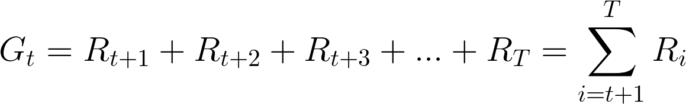****

****情景任务中的奖励累积总和****

****反之，在*连续* *互动*中，由于最终时间 *T* 不存在，累积总和**、 G(t)** 将趋向于`+infinity`或`-infinity`。这是因为将会有无限多的奖励。****

****例外情况:****

*   ****如果所有的返回值都为零，那么总和也将是 0。****
*   ****如果每个后续奖励都比前一个小，并且其总和已经有界(更多信息见下文)。****

****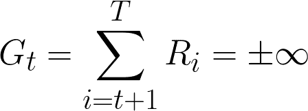****

****持续互动中的累积奖励总和(从时间 t 开始)****

## ****折扣未来的奖励****

****一般来说，对无限回报建模是没有用的，因为它不允许我们优化代理的行为。为了解决这个问题，有人提出了一个非常聪明的想法:**贴现**。它包括给予代理人*【能力】*优先考虑/加权短期回报。这样，长期奖励会以指数方式贴现(这意味着每个后续奖励的价值都会比前一个减少更多)。正如您将看到的，这使我们能够摆脱无限报酬的问题。****

> ****一个有用的类比是，将贴现理解为代理人在其累积报酬计算中变得**短视**。****

****实际上，我们将把每个奖励乘以一个**贴现因子(𝛾；希腊单词“gamma”)**带有指数项，随着时间的推移，奖励越大。****

****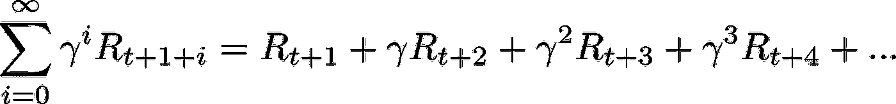****

****折扣累积奖励金额****

## ****折扣演示****

****让我们举例说明折扣奖励是如何工作的。让我们任意决定，在每一步，奖励 R 为1。下图对此进行了说明，其中 x 轴是时间步长，y 轴是相应时间步长的计算奖励。****

****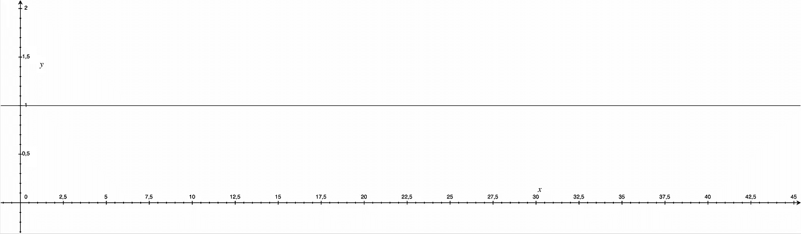****

****在所提供的示例中，每个时间步长的奖励****

****如果我们应用𝛾=0.9 的贴现值，每一步`R * gamma`的回报都成指数递减。这意味着，在随后的每个时间步长，该值比之前步骤中已经减少的值减少更多。****

****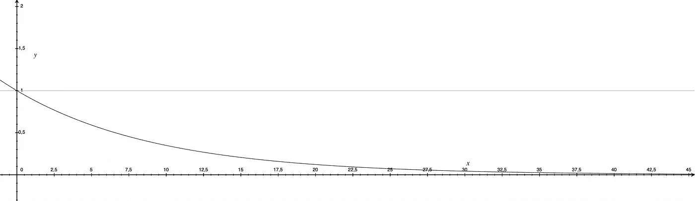****

****如果我们只使用到时间`t`(下图中的 x 轴)的奖励来计算回报`G`(下图中的 y 轴)，您将会看到奖励限制在某个值。在下面的例子中，考虑所有奖励直到无穷大，提供了 10 的有界回报`G`。****

****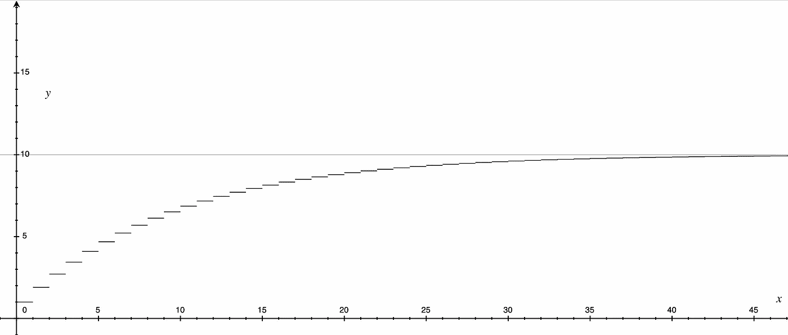****

****使用贴现因子时，显示奖励累计总额的图表是有界的。折现系数(γ)= 0.9；每一步 r = 1；G = 10。****

****当我们将越来越多的时间步长加入到我们的回报`G`计算中时，计算这个相同的值，没有任何折扣，将为我们提供一个无穷大的值。****

****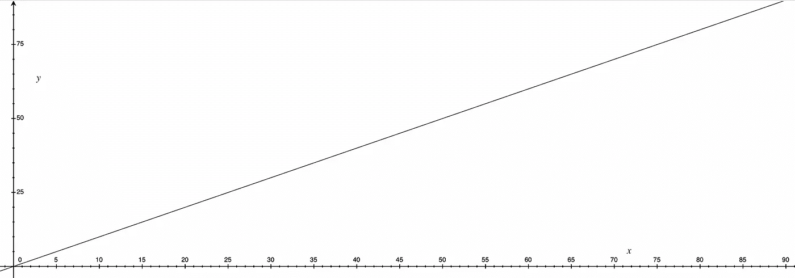****

****如果不使用折扣，则显示奖励累积总额的图表不受限制。****

## ****考虑****

****重要的是要记住:****

*   ******贴现因子**是一个[有理数](https://en.wikipedia.org/wiki/Floating-point_arithmetic#Floating-point_numbers)。****
*   ******贴现因子**需要在开放范围内: *0 < 𝛾 < 1。*
    数值越接近 1，越考虑长期回报。
    该值越接近 0，就越不会考虑长期奖励。****
*   ****当**贴现因子**等于 1 (𝛾 = 1)时，我们再次得到上面看到的无界累积报酬公式。如前所述，在这种情况下，回报将趋于(+/-)无穷大。如果**贴现因子**大于 1 (𝛾 > 1)，也会发生同样的情况。****
*   ****如果贴现因子等于零(𝛾 = 0 ),回报将是微不足道的，等于 0。****

****这种技术也可以用于建模*的情景任务*。如果**折扣因子**被设置为 1，并且时间 T 之后的所有奖励被设置为零，它将模拟一个情节任务。****

****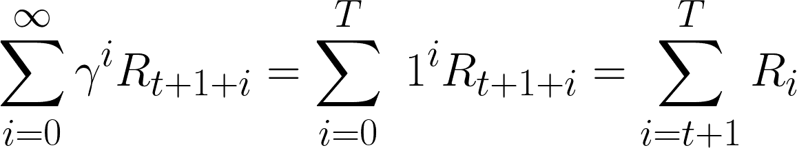****

****在上述条件下，奖励的折扣总额也可以代表**偶发任务******

# ****最佳行为:政策和价值函数****

****许多 RL 算法涉及估计**值函数**，该值函数定量地描述“代理将自己定位在状态 ***s*** *中有多好】*。**值*的概念是根据一个代理人在一个给定状态开始时能够获得的 ***回报*或*累积未来回报*** 来定义的。*****

****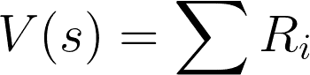****

****价值函数的简单建模****

****将奖励分配给各州可以让代理了解其周围的环境，从而提供最佳策略的洞察力。当井字游戏代理被设置为第一次玩时，它的值函数可以将零分配给所有状态，因为它们是未知的。通过遵循预定义的行为，代理可以了解哪些状态导致了赢和输，并相应地更新**值函数。**一个状态值代表在一个状态`**s**`下开始并遵循**策略π** ( [希腊字母 pi](https://en.wikipedia.org/wiki/Pi) )，代理人的行为的期望报酬。在国际象棋棋盘上，一个直接导致对弈的状态将被赋予一个值`1`给获胜的一方，而`-1`给失败的一方。****

****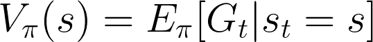****

****状态值函数定义。它是遵循策略 **π** 的状态 **S** 的期望值。****

****也可以为[状态，动作]对定义值函数。他们估计从状态`**s**.`开始采取行动`**a**`的回报****

****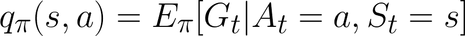****

****给定策略的动作值函数的定义 **π** 。****

******策略**则是代理在每个状态下采取的指导方针或决策。****

> ****一个**策略 P** 可以理解为在状态**s**t53】时选择一个动作 **aᵢ** 的概率。****

****形式上，**策略**被定义为可用动作*的**概率分布函数**，给定输入状态*。它们不一定是确定性的，因为代理的策略可能是随机的，这意味着它会选择具有一定程度随机性的决策。******

*****例如， ***随机策略*** 将为来自状态 s 的每个可用动作提供相等的概率(等效地使用*均匀分布*),并且在执行期间将从策略中对动作进行采样。使用随机函数来描述策略允许代理处理一定程度的随机性，这种特性在存在不确定性的环境中(例如扑克游戏)是有价值的。*****

****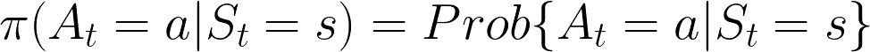****

****政策的数学表述****

****在此框架中可以定义两种类型的策略:****

1.  ******探索性策略:**它们允许代理采取非最优决策，目的是探索潜在的最优未知路径，并改进其策略。他们给导致明显非最优回报的行为分配一个非零概率。****
2.  ******开发性政策:**利用现有的环境知识，试图获得最佳回报的政策。它们是贪婪的政策，分配产生最高预期回报的概率。当环境不为人所知时，这种政策的不利之处就来了，代理人会得到次优的回报。****

# ******寻找最优策略:贝尔曼方程******

****强化学习代理的最终目标是学习提供最高回报的策略。这就是所谓的最优策略，用 **π*** 表示。对于这样一个最优策略，在任何状态下，其预期收益都大于或等于任何其他策略的预期收益。换句话说，在每一个可能的状态下遵循 **π*** 的预期回报，如果不比使用任何其他可能的策略(**π**’)时更高，至少等于。****

****为了确定未知的最优策略 **π*，**让我们利用目前所学的知识。首先，让我们将***【v *(s)***定义为最优状态值函数，如果我们遵循最优策略**【π*】**则实现该函数。类似地， ***a**** 是最优状态-动作-值函数，如果遵循最优策略 **π*** 获得。****

****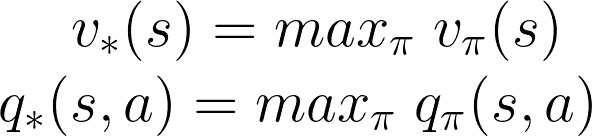****

****最佳值函数:在遵循使 v(s)和 a(s，a)最大化的策略 **π** 时获得****

****假设最优值函数 ***v**** 和 ***a**** 是已知的，但是最优策略是未知的，可以通过以下方式建立最优策略:****

*   *******当 v *(s)***已知时:通过允许代理**仅采取从状态`s`开始的使价值**最大化的行动，可以建立最优策略。换句话说，给任何使***【v *(s)***最大化的行动分配非零概率的策略将是最优策略。****
*   *******当 q*(s，a)已知时*** :最优策略可以通过允许代理在每个可用状态下采取任何使 q(s，a)最大化的行动来建立。****

****使用 **q **(s，a) v*(s)*** 有一大好处。即使***v *(S)****是一个更简单的值函数，由于它只取决于可能的状态数| S |(S 的大小)，所以它需要环境的知识。用 ***v**** 生成最优策略需要知道从初始状态`**s**` *可达的可能状态***【s’***。*相反，用 q*(s，a)生成最优策略只需要知道初始状态`**s**`和在该状态下可用的可能动作。*****

## ***贝尔曼方程***

***但是，当我们不知道最优策略时，我们如何确定最优值函数呢？等式:***

******

***没有提供太多关于如何获得最大化价值函数的策略的信息:最优策略。我们必须计算所有可能策略的价值函数，然后选择提供最大价值的策略。幸运的是，我们可以以一种不依赖于特定政策的方式定义最优价值函数，并允许我们计算它们。***

> ***具体地说，我们将根据其他状态的价值函数来重新表述给定状态的价值函数。从数学上来说，我们将递归地定义它们。***

***根据定义，最优价值函数***【v *(s)****被表示为期望回报`G`，从状态`s`开始，并采取使该值最大化的行动`a`。****

****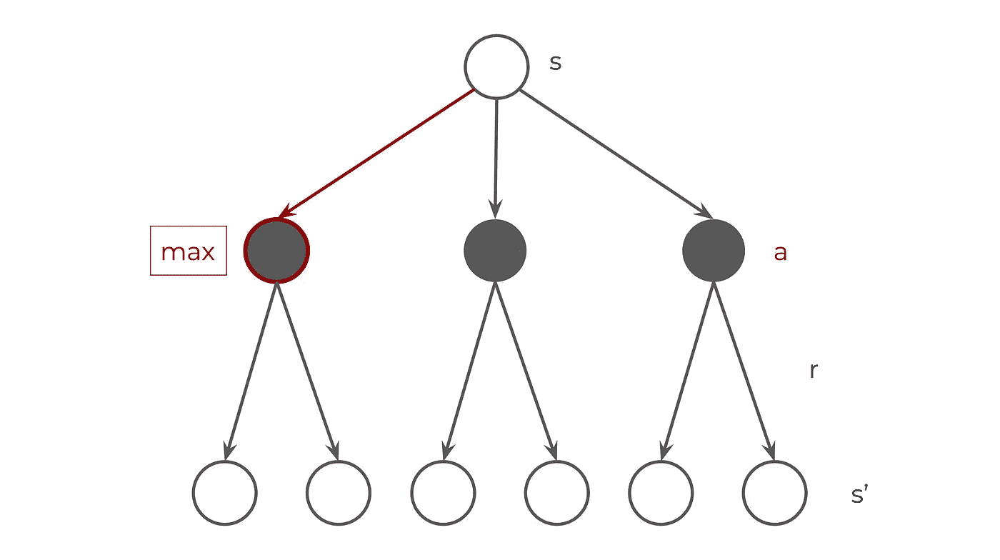****

****代表最佳状态值函数 v(s)的备份图****

*   ****等效表示为:****

****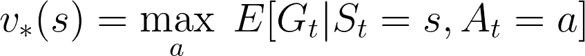****

****定义为预期收益的状态值函数。****

*   ****使用 G 的定义，即奖励的贴现累计总和，我们得到:****

****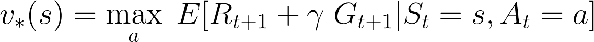****

*   ****用值函数代替`G`:****

****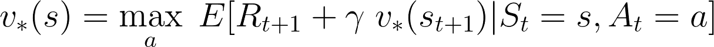****

****当采取最优行动时，状态 **s** 的最优值是下一个奖励的期望值加上下一个状态`**s'**`的贴现最优值。****

****`**q(s,a)**`也是如此:****

****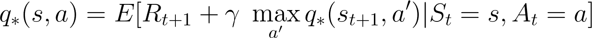****

****在状态`**s**`采取行动`**a**`时的最优值是后续奖励的期望值加上在后续状态`***s'***`采取后续最优行动`**a'**`时的贴现最优值。****

****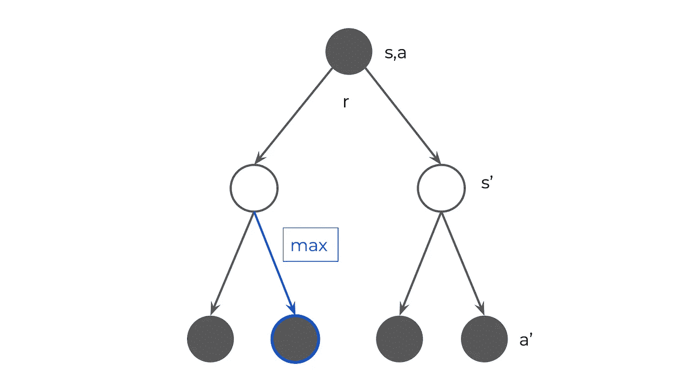****

****表示最佳状态值函数 q(s，a)的备份图****

## ****求解贝尔曼方程****

****这些方程被称为[贝尔曼最优方程](https://en.wikipedia.org/wiki/Bellman_equation)，以美国数学家理查德·贝尔曼的名字命名，他是最早描述这些方程的人之一。贝尔曼优化方程可以用类似于[动态规划](https://en.wikipedia.org/wiki/Dynamic_programming)的优化方法数值求解(例如使用计算机)。****

****如果我们有所有后续步骤`s'`的价值函数的近似值，那么就有可能计算状态`s`的最佳价值函数。这应该允许我们学习一个最优策略。****

****尽管如此，最好将这一解释留给后续文章。已经有很多信息需要消化了，我很高兴你能理解这一点。****

****在我的下一篇文章中，我将总结用来做这件事的技术的基础和状态。当我把它们写下来的时候:****

1.  ****看看更多的机器学习内容:例如[我最近的一篇解释 GANs 的文章](https://medium.com/ai-society/gans-from-scratch-1-a-deep-introduction-with-code-in-pytorch-and-tensorflow-cb03cdcdba0f)。****
2.  ****在我的[强化学习 Github 知识库](https://github.com/diegoalejogm/Reinforcement-Learning)中，您可以随意地先睹为快更高级的算法来寻找最优策略🙂。****
3.  ****对于更高级的技术，请随意浏览我实现的玩 Atari 游戏的[深度 Q 学习](https://github.com/diegoalejogm/deep-q-learning)算法。****
4.  ****[入门](https://www.youtube.com/watch?v=2pWv7GOvuf0&list=PLqYmG7hTraZDM-OYHWgPebj2MfCFzFObQ)看 Deepmind 的强化学习入门。****

****GitHub: [diegoalejogm](http://GitHub.com/diegoalejogm)****

# ****摘要****

1.  ******强化学习**是研究如何构建智能代理的领域，智能代理是在给定环境中设置时表现最佳的代理。受*行为心理学启发。*****
2.  ******马尔可夫决策过程**可以通过状态`s`、动作`A(s)`、奖励`r`和转移概率`Prob(s', r | s, a)`对主体-环境交互进行建模:通过执行动作`a`从`s`到达状态`s'`并获得奖励`r`的概率。****
3.  ******奖励** **的累计总和称为** **回报**，可以用贴现因子 **𝛾** *有界到一个离散数。*在强化学习中，我们试图教会代理一种行为，使这种价值最大化。****
4.  ******值函数 v(s)** 和 **q(s，a)** 近似于代理在处于状态 *s 时将会收到的期望值。*它们可用于定量评估达到某个状态或执行某个动作的效果。****
5.  ******策略**是代理遵循的行为。它们被定义为处于给定状态`s`时采取行动`a'`的概率。****
6.  ******最优值函数** `v*`和`q*`允许我们确定最优策略***【π****，这将允许我们生成智能代理。****

# ******参考文献******

****[1] OpenAI。2020.*多智能体交互产生的紧急工具使用*。[在线]可在 https://openai.com/blog/emergent-tool-use/查阅[2020 年 4 月 11 日查阅]。****

****[2]萨顿和巴尔托(未注明日期)。*强化学习*。第二版。麻省剑桥:麻省理工学院出版社。****

****[3]szepesva ri，C. (2010 年)。*强化学习的算法*。[加州圣拉斐尔]:摩根&克莱普尔出版社。****

****[4] Mnih，v .等《通过深度强化学习实现人级控制》。*性质* 518，529–533(2015)。****