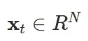
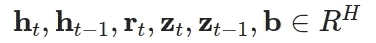
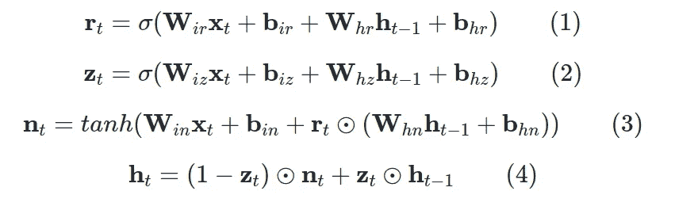
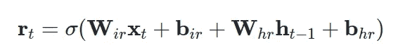
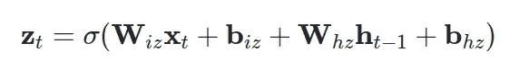
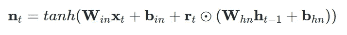
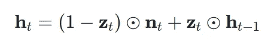
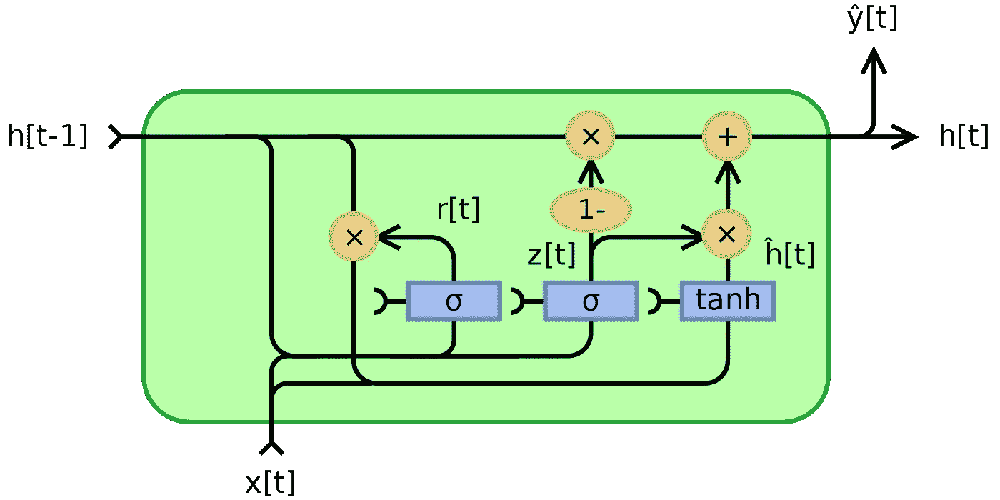

# RNN 细胞:分析 GRU 方程与 LSTM，以及何时选择 RNN 超过变压器

> 原文：<https://towardsdatascience.com/rnn-cells-analyzing-gru-equations-vs-lstm-and-when-to-choose-rnn-over-transformers-a28e46beef31?source=collection_archive---------31----------------------->

深度学习往往感觉像试图在雪山中找到自己的道路。有坚实的原则会让你在做决定时更有信心。我们都去过那里

约书亚·厄尔在 [Unsplash](https://unsplash.com?utm_source=medium&utm_medium=referral) 上的照片

在之前的[帖子](https://theaisummer.com/understanding-lstm/)中，我们全面介绍并考察了 LSTM 牢房的方方面面。有人可能会说，RNN 的方法已经过时，研究它们没有意义。确实，最近一类叫做变形金刚[5]的方法已经完全占领了自然语言处理领域。然而，深度学习从未停止让我惊讶，包括 RNN。也许有一天，我们会看到一个巨大的回归。

# RNN VS 变形金刚

请记住，在以下情况下，RNN 仍然是变形金刚的最佳选择:

*   序列长度**过长**。
*   任务需要**实时控制**(机器人)，否则**下一时间步不可用**。
*   没有**巨大的数据集来利用变形金刚的迁移学习**能力。
*   计算机视觉问题是弱监督的(动作识别)。是的。**混合** CNN-RNN 方法，以及[连接主义时间分类(CTC)损失【6】](https://distill.pub/2017/ctc/)仍然工作得很好。

更多了解 RNN 的其他原因包括混合动力车型。例如，我最近遇到了一个模型，它结合了递归神经网络和 [GANs](https://theaisummer.com/gan-computer-vision/) ，可以产生真实的实值多维医学数据序列。所以你永远不知道它们会在哪里派上用场。

无论如何，**基本面是要掌握的**。这一次，我们将审查和建立**门控循环单元(GRU)** ，作为 LSTM 的自然紧凑的变化。最后，**我们将根据问题**提供关于使用哪种电池的多种比较见解。

> *随附笔记本代码提供* [*此处*](https://github.com/The-AI-Summer/RNN_tutorial) *。*

# GRU:简化 LSTM 细胞

我们已经看到 LSTM 是如何预测连续数据的。最初引入 LSTM 的 where 时出现的问题是参数数量太多。让我们首先说，在参数数量和执行的操作方面，提议的称为 GRU 的 LSTM 变体的动机是简化。

在我们进入方程之前，让我们澄清一个重要的事实:**就长期序列建模而言，LSTM 和 GRU 细胞的原理是共同的**。首先，我们可以处理任意数量的时间步长，此外，**我们试图洗去多余的信息，并加入存储在权重中的记忆成分。**在网络中通过隐藏状态向量引入记忆，该隐藏状态向量对于每个输入序列是唯一的，每次从\(t=0)的零元素向量开始。

现在，让我们看看略有不同的数学！同样，我们将一步一步地分析它们。我在这里只是把它们作为一个参考点。用于:

图片由作者提供，最初用 Latex 编写

其中 N 是每个时间步长的特征长度，而:

图片由作者提供，最初用 Latex 编写

其中 H 是隐藏状态维数，GRU 方程如下:

图片由 Aythor 提供，最初是用 Latex 编写的

# 等式 1:复位门

图片由作者提供，最初用 Latex 编写

这个门和 LSTM 牢房的遗忘门非常相似。**产生的复位向量 r 表示将确定从先前的隐藏时间步长**中移除什么的信息。如同在遗忘门中一样，我们通过逐元素乘法应用遗忘操作，由 [Hadamard 乘积](https://en.wikipedia.org/wiki/Hadamard_product_(matrices))运算符表示。我们将重置向量计算为当前时间步长以及先前隐藏状态的输入向量的线性组合。

这两种运算都是用矩阵乘法(nn)来计算的。PyTorch 中的线性)。注意，对于第一个时间步长，隐藏状态通常是一个用零填充的向量。这意味着没有关于过去的信息。最后，应用非线性激活(即，sigmoid)。此外，通过使用激活函数(sigmoid ),结果位于(0，1)的范围内，这说明了训练稳定性。

图片由作者提供，最初用 Latex 编写

所谓的**更新门**中的 GRU 的输入和输出门的合并就发生在这里。我们计算输入向量 x 和先前隐藏状态的另一种表示，但是这次使用不同的可训练矩阵和偏差。向量 z 将代表更新向量。

# 等式 3:几乎输出分量

图片由作者提供，最初用 Latex 编写

向量 **n** 由两部分组成；第一层是应用于输入的线性层，类似于 LSTM 中的输入门。第二部分由复位向量 **r** 组成，并应用于先前的隐藏状态。注意，这里遗忘/复位向量**直接应用于隐藏状态**，而不是应用于 LSTM 单元的单元向量 **c** 的中间表示。

图片由作者提供，最初用 Latex 编写

首先，在描述的等式中，注意 1 基本上是 1 的向量。因为 z 的值位于范围(0，1)中，所以 1-z 也属于同一范围。然而，向量 z 的元素具有互补值。很明显，对 z 和(1-z)应用了元素式操作。

有时候我们通过分析极端案例来理解事情。在一个极端的场景中，让我们假设 **z** 是一个 1 的向量。那是什么意思？

简单来说就是输入会被忽略，所以下一个隐藏状态会是上一个！在相反的情况下，z 将是零元素向量，这将意味着先前的隐藏状态几乎被忽略。我使用几乎这个词很重要，因为更新向量 **n** 在应用重置向量后会受到之前隐藏状态的影响。尽管如此，复发将几乎消失！

**直观地，共享向量 z 平衡互补先前隐藏状态和更新输入向量 n** 的影响。

现在，我选择使用共享世界**来代表 z 的原因变得深刻了。以上所有内容都可以在维基百科的下图中得到说明:**

*图片由 Jeblad —自己的作品，CC BY-SA 4.0，借用自* [*维基百科*](https://en.wikipedia.org/wiki/Gated_recurrent_unit)

我不太喜欢这些图的原因是因为**它们可以用标量输入 x 和 h 来解释，这至少会误导**。

**其次是不清楚可训练矩阵在哪里**。基本上，当你在 RNN 的旅程中根据这些图表思考时，试着认为 **x** 和 **h** 每次使用时都乘以一个权重矩阵。

就我个人而言，我更喜欢钻研方程式。幸运的是，数学从不说谎！

> *简单来说，* ***复位门*** *(r 向量)决定了如何将* ***新输入*** *与先前的记忆融合，而* ***更新门*** *定义了* ***先前的记忆还剩多少*** *。*

为了深入理解 GRU 细胞是如何工作的，你只需要知道这些。他们[连接的方式](https://theaisummer.com/understanding-lstm/#connecting-lstm-cells-across-time-and-space)(在空间和时间上)与 LSTM 完全一样:

**隐藏的输出向量将是下一个 GRU 单元/层的输入向量。**

双向可以通过以相反的方式同时处理序列并连接隐藏向量来定义。

# LSTM 与 GRU 细胞:使用哪一个？

GRU 单元是在 2014 年推出的，而 LSTM 单元是在 1997 年推出的，因此 GRU 的权衡还没有完全探索出来。在许多任务中，这两种架构的性能不相上下[1]。通常情况下，超参数的调整可能比选择合适的单元更重要。但是，并排比较一下还是不错的。

## 以下是 5 个基本的讨论点:

*   重要的是，这两种架构都是为了解决梯度消失的问题而提出的。这两种方法都是**利用不同的方式将先前的时间步长信息与门融合，以防止消失梯度**。然而，在 LSTM 的梯度流来自三个不同的路径(门)，所以直观地说，你会观察到梯度下降比 GRUs 更多的可变性。
*   如果你想要一个更快的**和更紧凑的**和**型号，GRU 的可能是你的选择，因为它们的参数更少。因此，在许多应用中，它们可以被更快地训练。在序列不太大的小规模数据集中，通常选择 GRU 像元，因为数据较少，LSTM 的表达能力可能不会暴露出来。从这个角度来看， **GRU 被认为结构更简单，效率更高**。**
*   另一方面，如果必须处理大型数据集，LSTMs 更强的表达能力可能会带来更好的结果。理论上讲， **LSTM 细胞**应该**比 GRUs 记住更长的序列**，并且在需要模拟长程相关性的任务中胜过它们。
*   根据等式，可以观察到 GRU 单元比 LSTM 少一个门。准确地说，只是一个重置和更新门，而不是 LSTM 的遗忘、输入和输出门。
*   基本上， **GRU 单元控制信息流，而不必使用单元存储单元**(在 LSTM 的等式中表示为 c)。它暴露了完整的记忆(不像 LSTM)，没有任何控制。所以，这是基于手头的任务，如果这可能是有益的。

综上所述，**答案在于数据**。没有**明确的赢家**来说明哪一个更好。确定哪一个对您的问题最有效的唯一方法是训练两者并分析它们的性能。为此，以灵活的方式构建你的[深度学习项目](https://theaisummer.com/best-practices-deep-learning-code/)很重要。

# 结论

在这篇文章中，我们提供了一个 GRU 单位的审查。我们观察了它的独特特征，我们甚至建造了自己的细胞，用来预测正弦序列。后来，我们将 LSTM 和 GRU 进行了对比。这一次，我们将提议进一步阅读一篇有趣的论文，该论文由[尹等人 2017](https://arxiv.org/abs/1702.01923) 在自然语言处理[3]的背景下分析 GRUs 和 [LSTMs](https://theaisummer.com/Bitcon_prediction_LSTM/) 。

**我们专注于对 RNN 的理解，而不是在更花哨的应用中部署他们的实现层。**

参考

[1] Greff，k .，Srivastava，R. K .，kout Nik，j .，Steunebrink，B. R .，& Schmidhuber，J. (2016)。LSTM: [太空探索之旅。](https://arxiv.org/abs/1503.04069) *IEEE 神经网络与学习系统汇刊*， *28* (10)，2222–2232。

[2] Chung，j .，Gulcehre，c .，Cho，k .，& Bengio，Y. (2014 年)。[门控递归神经网络对序列建模的实证评估](https://arxiv.org/abs/1412.3555)。 *arXiv 预印本 arXiv:1412.3555* 。

[3]尹，魏，坎，k，余，m .，，许子华(2017)。[CNN 和 rnn 用于自然语言处理的比较研究](https://arxiv.org/abs/1702.01923)。 *arXiv 预印本 arXiv:1702.01923* 。

[4]埃斯特万，c .，海兰，S. L .，& Rä tsch，G. (2017 年)。[用递归条件生成实值(医学)时间序列](https://arxiv.org/abs/1706.02633)。 *arXiv 预印本 arXiv:1706.02633* 。

[5] Vaswani，a .，Shazeer，n .，Parmar，n .，Uszkoreit，j .，Jones，l .，Gomez，A. N .，… & Polosukhin，I. (2017)。你所需要的只是注意力。在*神经信息处理系统的进展*(第 5998–6008 页)。

[6]汉南，《用 CTC 进行[序列建模》，蒸馏，2017。](https://distill.pub/2017/ctc/)

*原载于 2020 年 9 月 16 日*[*https://theaisummer.com*](https://theaisummer.com/gru/)*。*