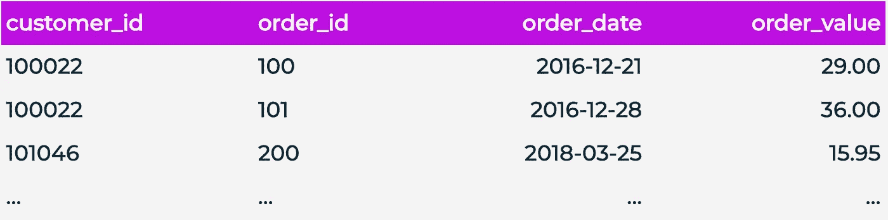
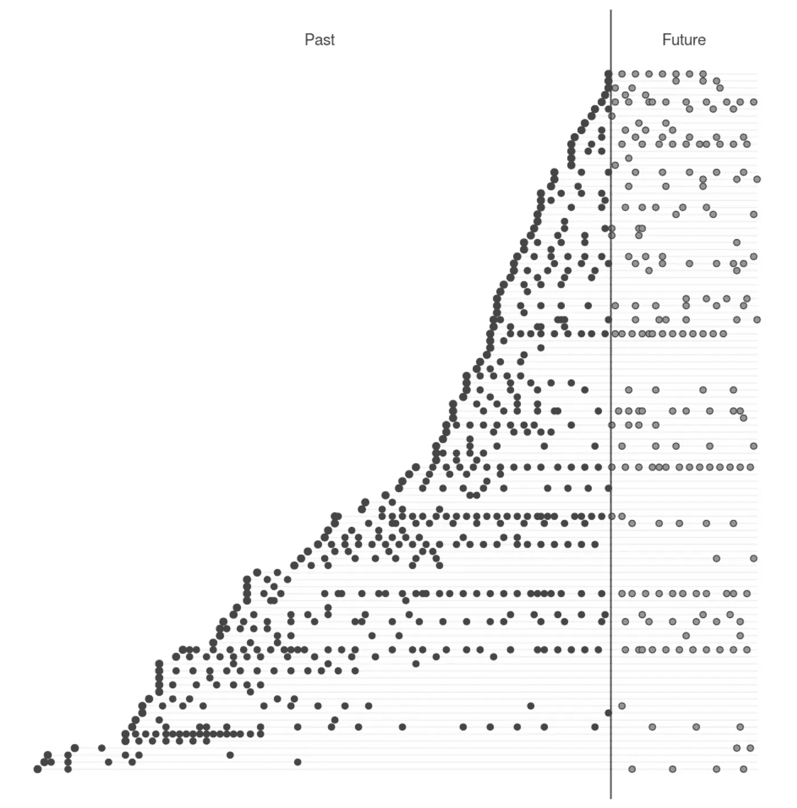
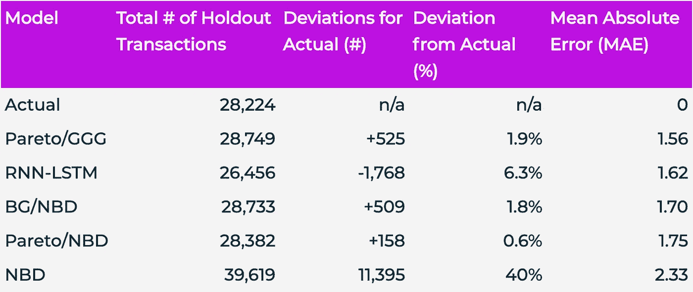
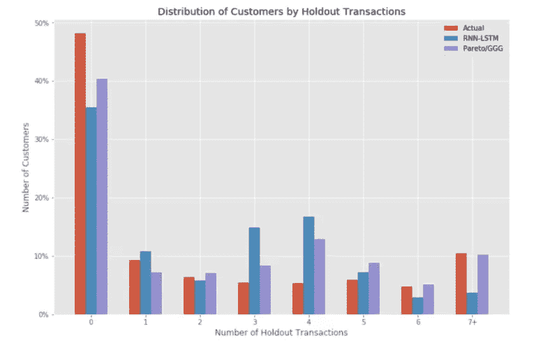

# RNNs 与传统 ML 在预测客户终身价值方面的比较

> 原文：<https://towardsdatascience.com/rnns-vs-traditional-ml-for-predictive-customer-lifetime-value-42b6b12558fe?source=collection_archive---------29----------------------->

## 比较序列和贝叶斯方法预测未来收入

我工作的公司 RETINA.ai 建立了 ML 模型来预测客户的终身价值(CLV)。我们的数据科学团队一直致力于利用最好的学术和行业研究来完善和改进这些模型。本文描述了我们使用递归神经网络(RNNs)预测 CLV 的结果。

因为 RETINA 的客户需要从战略和战术两方面了解他们的客户，所以我们在宏观(群体层面)和微观(客户层面)购买模式上构建和测试我们的模型。我们将此作为评估模型性能的基础，这样我们就可以不断地迭代我们的模型。

在这篇博文中，我们将展示 RNN-LSTM(具有长/短期记忆的递归神经网络)机器学习模型如何能够像其他行业领先的模型一样准确地预测 CLV。

# 语境

为了建立一个预测性的 CLV 模型，我们从客户交易历史开始。我们输入到模型中的数据集可能如下所示:

订单表示例

从这个交易表中，我们不仅可以确定 CLV，还可以预测每个客户的未来交易——并且，我们可以用一个**时间模式图**来直观显示这一点:

上图显示了我们交易表中的每笔交易以及预测的未来交易:

*   垂直的灰线标志着今天
*   水平灰线代表个人客户
*   黑点是我们交易历史中的交易
*   灰点是我们的模型预测的交易

除了预测交易数量，我们的模型还预测这些未来交易的平均收入值。当我们知道每笔未来交易的价格和交易量时，我们可以很容易地计算出客户的 CLV。

# 评估模型

但是我们如何产生这些预测的交易和收入呢？更重要的是，我们如何知道它们有多精确？

首先，我们将交易历史数据分成两个数据集。我们通过确定数据集中最早的交易和最近的交易之间的大约 80%的日期来实现这一点。在此日期当天或之前发生的事务是校准期的一部分，之后发生的事务是保持期的一部分。之所以这样命名这些数据集，是因为校准期间的数据被输入到模型中进行校准，而维持期间的数据被故意保留下来以测试模型的预测能力。

如果一个模型可以使用校准期提供的数据准确预测维持期的数据，那么我们知道它是一个强模型。

# 比较模型

用于计算 CLV 的常见模型是帕累托/NBD 模型，尽管视网膜目前使用帕累托/GGG 模型，这是对帕累托/NBD 模型的改进。帕累托/GGG 模型之所以成为如此强大的 CLV 模型，是因为它创建了三个伽玛分布来确定客户交易间隔时间(ITT)和流失概率。如果你想更深入地探索它，你可以在[原始论文](http://www.reutterer.com/papers/platzer&reutterer_pareto-ggg_2016.pdf)或 [BTYD 包中阅读更多关于这个模型的内容。](https://cran.r-project.org/web/packages/BTYD/vignettes/BTYD-walkthrough.pdf)

然而，Retina 团队还开发了一个更新的模型，目前正在与帕累托/GGG 进行比较。它被称为长短期记忆递归神经网络模型(RNN-LSTM)。这个模型接受一系列事件，寻找这些事件中导致现在的模式，这使它能够预测未来。我们向模型提供客户交易历史，希望它能够学习我们案例中的未来交易。

# 结果

重演 RNNs 和 PGGG 之间的对决

通过使用上面概述的校准/维持技术，我们能够看到每个模型的预测强度。我们还包括了额外的帕累托家族模型(BG/NBD 和 NBD)来为我们的结果提供背景。这是我们实验的结果:

我们测试的所有模型的聚合 CLV 统计数据

当我们将维持期内的实际事务数量与每个模型预测的数量进行比较时，我们可以看到每个模型的表现如何。上表按平均绝对误差(MAE)排序，即每个客户的预测交易数和实际交易数之间的平均差异。

除了 NBD，统计模型在这一指标上都表现强劲(与真实值的偏差小于 10%)。这意味着他们能够在总体水平上成功捕捉客户购买趋势。有趣的是，我们的 RNN-LSTM 模型是唯一低估抵制交易总数的模型。

该图比较了 RNN-LSTM 和帕累托/GGG 在每个客户不同采购金额上的准确性:

这张图表表明，RNN-LSTM 法案严重低估了流失的客户(在抵制期没有购买任何东西的客户),并高估了 3-4 个购买客户。帕累托/GGG 也低估了流失客户，高估了 3-4 个购买客户，但程度较轻。

# 讨论

起初，帕累托/NBD 似乎预测了接近完美的交易数量，这种准确性是由于预测的交易总数。正如我们在计算 MAE 时看到的，帕累托/NBD 在个人层面上的表现实际上比帕累托/GGG 和 RNN-LSTM 更差。在个人层面，CLV 是一个更具可操作性的指标，因此我们决定将进一步分析的重点放在这两个模型上。

回到我们的 CLV 拳击赛:当使用 MAE 时，帕累托/GGG 胜过 RNN-LSTM，但不是很多。这些结果是令人兴奋的，因为它不仅证明了帕累托/GGG 的优越性，而且证明了 RNN-LSTM 作为 CLV 计算的竞争者的有效性。

在考虑哪种模型更优越时，有两个概念变得与我们的结果无关，应该加以讨论:可扩展性和解释能力。

RNN-LSTM 是 CLV 计算的一个强有力的选择，因为它是可扩展的。与帕累托/GGG 不同，RNN-LSTM 采用了大量可以由运行模型的数据科学家定制和聚合的功能。这意味着 RNN-LSTM 可以通过网站访问、电子邮件，甚至特定的行业趋势获得信息，以创建越来越智能的迭代。

由于其解释能力，帕累托/GGG 是 CLV 计算的一个强有力的选择。与 RNN-LSTM 法案不同，后者在理解*为什么*做出某种预测方面本质上是一个黑匣子，帕累托/GGG 允许数据科学家理解模型做出的预测背后的底层框架。如果该模型似乎低估了流失客户，我们可以得出结论，这是一个过于乐观的流失预测伽马函数的函数。因此，当模型准确或比其他模型更好时，我们可以对*为什么*是更强的模型更有信心。对于机器学习模型，我们没有这种奢侈。

# 后续步骤

最后，有几个步骤将是建立在这些结果之上的激动人心的实验。我们热衷于尝试的一些未来迭代是:

1.  预测维持中事务的*值*而不是数量，并在此指标上比较模型
2.  向 RNN-LSTM 模型添加额外的相关特征，看看新架构是否明显优于帕累托家族模型
3.  调整 RNN-LSTM 的超参数，以观察更智能的超参数选择是否会产生更好的模型
4.  修改帕累托/GGG 输出以生成绘制的交易序列，以便与 RNN-LSTM 的预测能力进行直接比较