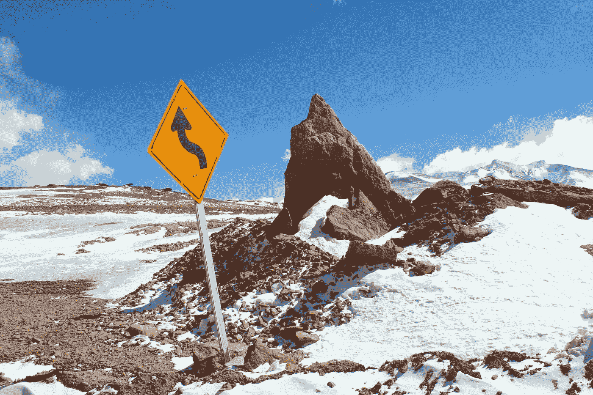
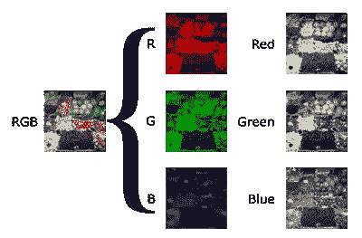
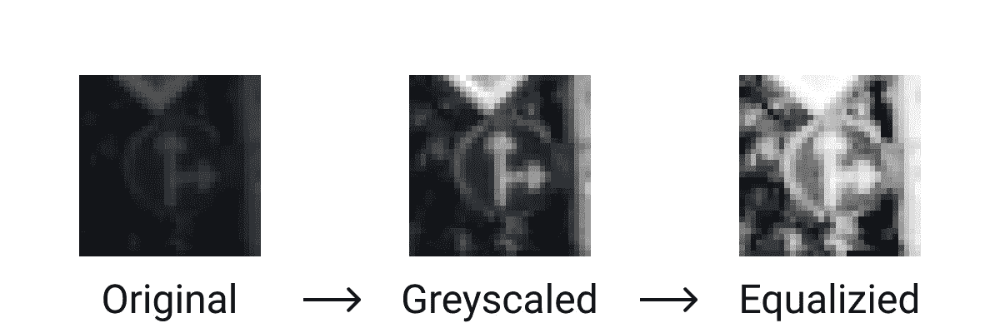
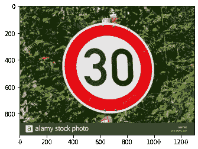

# 构建路标分类器

> 原文：<https://towardsdatascience.com/road-sign-classification-learning-to-build-a-cnn-7771373179d3?source=collection_archive---------42----------------------->

J.C .希门尼斯在 [Unsplash](https://unsplash.com/s/photos/road-signs?utm_source=unsplash&utm_medium=referral&utm_content=creditCopyText) 上的照片

## 学习使用 CNN 的力量

每年，汽车制造商都在他们的车队中增加更多的*高级驾驶辅助系统* (ADAS)。其中包括自适应巡航控制(ACC)、前方碰撞警告(FCW)、自动泊车等。一项研究发现，在美国，ADAS 可以预防高达 28%的车祸。这项技术只会不断改进，最终会发展到 5 级，完全自动驾驶的汽车。

对于一辆完全自动驾驶的汽车来说，它需要能够了解它的环境。这包括其他车辆、行人和**路标**。

路标给我们关于法律的重要信息，警告我们危险的情况，并指引我们到达理想的目的地。如果汽车不能区分符号、颜色和形状的差异，许多人可能会严重受伤。

汽车观察道路的方式与我们感知道路的方式不同。我们都能瞬间分辨出路标和各种交通状况的区别。当把图像输入电脑时，他们只能看到 1 和 0。这意味着我们需要教会汽车像人类一样学习，或者至少像我们一样识别标志。

为了解决这个问题，我试图建立自己的卷积神经网络(CNN)来对交通标志进行分类。在这个过程中，主要有三个步骤:**预处理图像**、**构建卷积神经网络**、**输出预测**。

# 预处理图像

在预处理阶段，从“德国交通标志”位存储库中导入图像。这包含一个由**标记的图像**组成的数据集，它将允许我们建立一个监督学习模型。这个存储库可以克隆到 Google Colab 笔记本上，使得导入数据集和开始编码变得容易。

现在为了利用这个数据集，图像将通过一个**灰度**和**均衡**功能。

## 灰度

目前，来自知识库的图像是三维的。这是因为彩色图片有三个颜色通道——红色、绿色和蓝色(RGB ),它们相互叠加，赋予它们鲜明的色彩。

对于这个机器学习模型，三层图像是不必要的，只需要标志的特征。因此，通过灰度函数传递数据集图像可以清理我们的数据，只过滤重要的信息，还可以将图像缩减到一个维度。

三色通道图像的分解。(*图片经由 Nevit Dilman 授权给 Kael Lascelle)* 。

## 使相等

现在图像已经灰度化，它们失去了一些对比度，或者像素的白色或黑色。为了增加对比度，图像必须进行**均衡**。这一点很重要，因为模型必须区分通过对比度变化获得的各种特征。

均衡图像意味着展开像素值分布，创建更大范围的图像白色和黑色。

(图片由作者提供)

# 卷积神经网络

卷积神经网络是一类深度学习网络，用于分析视觉图像。在这种情况下，它被用于查找各种道路标志之间的独特的功能集。

CNN 的架构。(来源:【1489512765771.html https://www . mathworks . com/videos/introduction-to-deep-learning-what-is-convolutionary-neural-networks)

它使用的过程类似于我们的眼睛和大脑对我们看到的一切进行分类的方式。例如，当看一组数字时，你可以区分 1 和 8。1 是垂直线，而 8 是在另一个循环之上的循环。当然，你不会真的在脑子里这么说，因为我们已经见过他们很多次了，这已经成了一种习惯。

## 他们是如何学习的？

为了让卷积神经网络提取图像的重要特征，他们使用**内核**来扫描或跨越图像。

我把它想象成你的眼睛在图像上快速扫视。他们分析一个部分，然后水平移动到下一部分，直到你看到整个画面。

内核比较他们所看到的和他们正在寻找的之间的差异。当一个特征匹配时，它被记录并存储在**特征图**中。这些特征地图是原始图像的细化版本。他们保留了标志的重要特征，而忽略了其他特征。几个不同的核遍历原始图像并提取不同的重要特征，然后它们结合起来创建最终的卷积模式。

输出矩阵称为卷积特征或特征图。(来源:[http://deep learning . Stanford . edu/wiki/index . PHP/Feature _ extraction _ using _ convolution](http://deeplearning.stanford.edu/wiki/index.php/Feature_extraction_using_convolution))

## 解决过度拟合

当处理像模型中使用的小数据集时，出现了一个称为**过度拟合**的问题。这时模特开始*记忆*图像，而不是努力寻找它们的特征。更具体地说，当模型经历过多的*时期*(基本上就是模型经历数据集的次数)时，它开始监听一些节点的输入，而忽略其他节点。这降低了模型的准确性，因为它不知道如何对数据集之外的任何新图像进行分类。

为了解决它，增加了一个**脱落层**。这是对该模型的简单修正。通过删除节点的随机子集，它可以防止过度拟合，因为节点不能记住标签(因为节点很有可能被关闭)。这就像老师点名批评上课不专心的孩子。通过让他尴尬并引起他的注意，他会(希望)集中注意力并为班级提供价值。

# 预言；预测；预告

最后，该模型提供了一个交通标志的图像，它通过卷积神经网络运行，并吐出与相应标志相关的数字。

当下面的随机符号通过模型运行时…

展示给模型的随机图像。(来源:[https://c8 . alamy . com/comp/g667w 0/road-sign-speed-limit-30-kmh-zone-passau-Bavaria-Germany-g667w 0 . jpg](https://c8.alamy.com/comp/G667W0/road-sign-speed-limit-30-kmh-zone-passau-bavaria-germany-G667W0.jpg))

模型预测类为[1]，正确！

与符号关联的类。(图片由作者提供)

对代码感兴趣的人，可以在我的 GitHub 上找到，[这里](https://github.com/kaelplascelle/Road-Sign-Classifier)！

# 关键要点

*   使用灰度和均衡功能对图像进行预处理
*   卷积神经网络(CNN)使用核来提取符号的特征
*   将特征与其他分类图像进行比较，以做出预测

嘿，我是[凯尔·拉塞尔](https://kaelplascelle.github.io)，一个 16 岁的知识社会创新者！我对自主系统充满热情，尤其是自动驾驶汽车，以及可持续能源。

如果你能在 [Medium](https://medium.com/@kael.lascelle) 和 [Twitter](https://mobile.twitter.com/kael_lascelle) 上关注我，我将不胜感激！还有，在 [LinkedIn](https://www.linkedin.com/in/kaellascelle/) 上加我，或者给我发[邮件](mailto:kael.lascelle@gmail.com)。