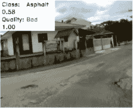
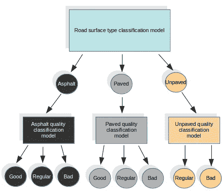
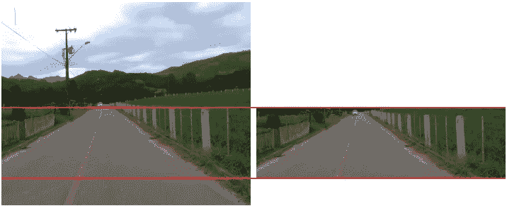
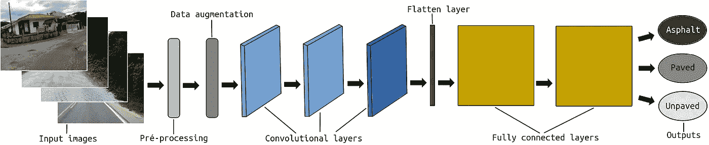
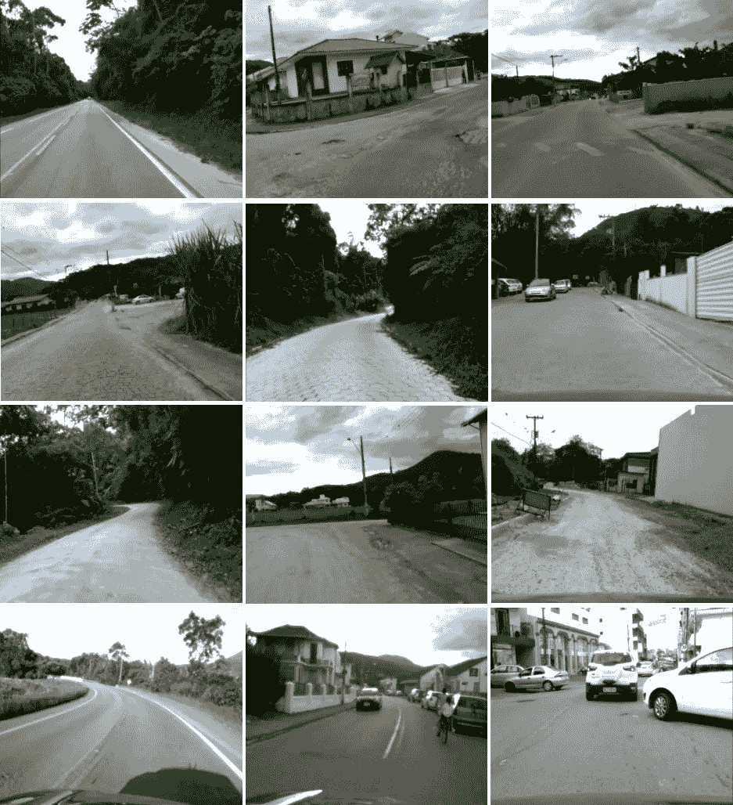
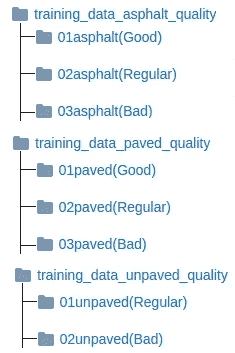
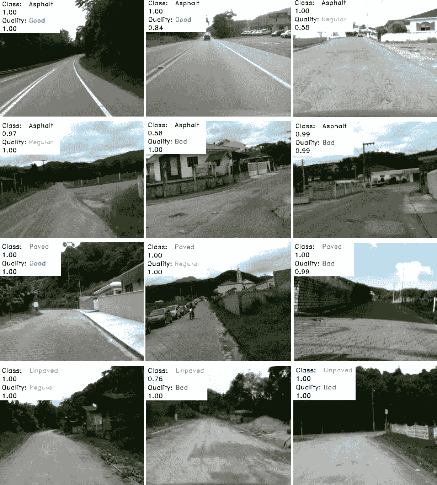

# 路面分类

> 原文：<https://towardsdatascience.com/road-surface-classification-150f9874faef?source=collection_archive---------31----------------------->

## 一种路面类型和质量分类方法

你好。在这篇文章中，我们展示了一种对路面类型和质量进行分类的方法及其步骤。以及如何复制它的步骤。为了测试这种方法，我们使用了自己制作的 RTK 数据集。



路面分类

该数据集[1]由低成本相机拍摄的图像组成，场景在新兴国家很常见，包含未铺设的道路和坑洼。这是相关的，考虑到配有 ADAS(高级驾驶辅助系统)的车辆在新兴国家(如巴西)已经商业化。

路面的类型对于车辆的驾驶方式是重要的信息，无论是由人驾驶还是由自动车辆驾驶。除了乘客舒适度和车辆维护之外，它还涉及到所有相关人员的安全。我们可以用一个简单的卷积神经网络(CNN)结构来实现这一点。



进场顺序[1]

在这种方法中，我们使用特定的模型来完成表面类型分类任务，我们将这些类别定义为:沥青路面、已铺路面(适用于所有其他类型的路面)和未铺路面。对于表面质量，我们使用其他三种不同的模型，每种类型的表面一个模型。所有这四个模型都有相同的结构。我们从第一个模型中得到结果，称之为特定质量模型。

在 CNN 结构之前，感兴趣区域(ROI)被定义为每个输入帧的预处理步骤。毕竟，我们不需要整个图像来分类道路。该 ROI 旨在仅保留图像中实际包含道路像素的部分。图像的上半部分以及图像底部的一小部分被丢弃，因为在一些帧中，它可能包含负责捕捉图像的车辆的一部分。ROI 是硬编码的，因为如果我们使用自适应 ROI，它可能会失败并损害模型训练。



感兴趣区域[1]

在这个预处理之后，执行数据扩充步骤。数据扩充包括增加和降低每一帧的亮度。这样，我们改进了我们的训练输入集，并帮助我们的系统学习识别具有不同照明条件的相同类型和质量的道路。

最后，输入图像被传递到包含三个卷积层和两个全连接层的 CNN 结构。



全进路结构[1]

# **R**oad**T**reversing**K**knowledge(RTK)数据集

在这种方法中使用的数据集，即**R**oad**T**raver sing**K**knowledge(**RTK**)[1]是在巴西拍摄的，拍摄地点是圣卡塔琳娜州的瓜斯莫尔纳斯和圣阿马罗达普雷泽斯市，弗洛里亚诺波利斯的邻近城市。数据集包含具有不同类型表面和质量的图像。



RTK 样本[1]

**RTK 数据集可从以下网址下载:**

[http://www . lapix . ufsc . br/pesquisas/projeto-vei culo-autonomo/datasets/？lang=en](http://www.lapix.ufsc.br/pesquisas/projeto-veiculo-autonomo/datasets/?lang=en)

# 路面类型分类

**完整的代码可在:**获得

[](https://github.com/thiagortk/Road-Surface-Classification) [## thiagortk/路面分类

### 在新兴国家，常见的是未铺砌的道路或没有维护的道路。未铺砌或损坏的道路也…

github.com](https://github.com/thiagortk/Road-Surface-Classification) 

我们利用了 *Python* 、 *TensorFlow* 和 *OpenCV* 。

**让我们一步一步地检查……**

首先，我们需要建立我们的表面类型分类模型。为此，您需要准备用于训练模型的数据。您可以使用 RTK 数据集中的图像或制作自己的图像。图像需要按照路面类型进行组织。


培训数据文件夹结构

在我们的实验中，我们使用了 6264 帧:

*   铺面(沥青):沥青道路为 4344。
*   铺面(混凝土):1337 用于不同的铺面，如鹅卵石。
*   未铺路面:585 用于未铺路面、土路、越野。

接下来，在 *train.py* 中，我们定义从哪里收集训练数据。我们应该分离出 20%的数据自动用于验证。我们还将 *batch_size* 定义为 32。

[/路面分类/train.py](https://github.com/thiagortk/Road-Surface-Classification/blob/master/Road%20Surface%20Classification/train.py)

在 *train.py* 上设置的参数将在 *dataset.py* 类上读取。

[/路面分类/train.py](https://github.com/thiagortk/Road-Surface-Classification/blob/master/Road%20Surface%20Classification/train.py)

在 *dataset.py* 类中，我们定义了 ROI 和数据扩充。两个数据增强功能， *adjust_gamma* 降低亮度， *increase_brightness* ，其名称不言自明…

[/路面分类/dataset.py](https://github.com/thiagortk/Road-Surface-Classification/blob/master/Road%20Surface%20Classification/dataset.py)

当加载输入数据时，对每幅图像进行 ROI 定义。

[/路面分类/dataset.py](https://github.com/thiagortk/Road-Surface-Classification/blob/master/Road%20Surface%20Classification/dataset.py)

我们还平衡了输入的图像，因为有更多的沥青图像和更少的铺设和未铺设的道路。

[/路面分类/dataset.py](https://github.com/thiagortk/Road-Surface-Classification/blob/master/Road%20Surface%20Classification/dataset.py)

回到 *train.py，*让我们定义 CNN 层，如这个 [TensorFlow 教程](https://cv-tricks.com/tensorflow-tutorial/training-convolutional-neural-network-for-image-classification/) [2]所示。训练步骤中选择的所有图像都被传递到第一个卷积层，其中包含有关宽度、高度和通道数的信息。前两层有 32 个大小为 3×3 的过滤器。随后是具有 64 个大小为 3×3 的过滤器的层。所有步幅定义为 1，填充为 0。正态分布用于权重初始化。为了在维度上减少输入，这有助于分析输入子区域中的特征信息，在所有卷积层中应用最大池。在每个卷积层的末端，在 max-pooling 函数之后，ReLU 被用作激活函数。

[/路面分类/train.py](https://github.com/thiagortk/Road-Surface-Classification/blob/master/Road%20Surface%20Classification/train.py)

在卷积层之后，展平层用于将卷积多维张量转换成一维张量。

[/路面分类/train.py](https://github.com/thiagortk/Road-Surface-Classification/blob/master/Road%20Surface%20Classification/train.py)

最后添加两个完全连接的层。在第一个完全连接的层中，应用了 ReLU 激活功能。第二个完全连接的层具有可能的输出，即期望的类。

[/路面分类/train.py](https://github.com/thiagortk/Road-Surface-Classification/blob/master/Road%20Surface%20Classification/train.py)

我们使用 softmax 函数来获得每一类的概率。我们还在最后使用 Adam 优化器，它根据训练中使用的输入数据更新网络权重。

[/路面分类/train.py](https://github.com/thiagortk/Road-Surface-Classification/blob/master/Road%20Surface%20Classification/train.py)

您可以在您的终端中训练模型运行:`python train.py` 。

现在，有了训练好的模型，我们就可以测试了。首先，让我们准备接收输入测试帧和输出文件名。

[/路面分类/test.py](https://github.com/thiagortk/Road-Surface-Classification/blob/master/Road%20Surface%20Classification/test.py)

检索经过训练的模型并访问图表。

[/路面分类/test.py](https://github.com/thiagortk/Road-Surface-Classification/blob/master/Road%20Surface%20Classification/test.py)

请记住，我们不需要整个图像，我们的培训侧重于使用 ROI，这里我们也使用它。

[/路面分类/test.py](https://github.com/thiagortk/Road-Surface-Classification/blob/master/Road%20Surface%20Classification/test.py)

最后，基于输出预测，我们可以在每一帧中打印分类的表面类型。

[/路面分类/test.py](https://github.com/thiagortk/Road-Surface-Classification/blob/master/Road%20Surface%20Classification/test.py)

您可以在您的终端:`python test.py PATH_TO_YOUR_FRAMES_SEQUENCE NAME_YOUR_VIDEO_FILE.avi`中测试运行的模型。

# **道路质量分类**

现在让我们包括质量分类。我们简单地使用用于训练表面类型分类模型的相同 CNN 体系结构，并分别应用于每个表面类别上的每个质量类别。因此，除了现有的模型，我们还训练了 3 个新模型。为此，您需要为每个表面类别准备用于训练模型的数据。在 [**RTK** 数据集](http://www.lapix.ufsc.br/pesquisas/projeto-veiculo-autonomo/datasets/?lang=en)页面中，我们已经给出了按类组织的帧。



质量分类的培训数据文件夹结构

要训练每个模型，请在您的终端中运行:

```
python trainAsphaltQuality.py
python trainPavedQuality.py
python trainUnpavedQuality.py
```

现在改变的是预测部分。我们使用四种不同的图形，每种图形对应一个训练好的模型。

[/路面质量分类/testRTK.py](https://github.com/thiagortk/Road-Surface-Classification/blob/master/Road%20Surface%20Quality%20Classification/testRTK.py)

**恢复类型模型**

[/路面质量分类/testRTK.py](https://github.com/thiagortk/Road-Surface-Classification/blob/master/Road%20Surface%20Quality%20Classification/testRTK.py)

**恢复沥青质量模型**

[/路面质量分类/testRTK.py](https://github.com/thiagortk/Road-Surface-Classification/blob/master/Road%20Surface%20Quality%20Classification/testRTK.py)

**恢复铺设质量模型**

[/路面质量分类/testRTK.py](https://github.com/thiagortk/Road-Surface-Classification/blob/master/Road%20Surface%20Quality%20Classification/testRTK.py)

**恢复未铺设的质量模型**

[/路面质量分类/testRTK.py](https://github.com/thiagortk/Road-Surface-Classification/blob/master/Road%20Surface%20Quality%20Classification/testRTK.py)

此时，输出预测也考虑质量模型，我们可以打印分类的表面类型以及每个帧中该表面的质量。

[/路面质量分类/testRTK.py](https://github.com/thiagortk/Road-Surface-Classification/blob/master/Road%20Surface%20Quality%20Classification/testRTK.py)

**打印结果**

[/路面质量分类/testRTK.py](https://github.com/thiagortk/Road-Surface-Classification/blob/master/Road%20Surface%20Quality%20Classification/testRTK.py)

您可以在您的终端中测试运行:`python testRTK.py PATH_TO_YOUR_FRAMES_SEQUENCE NAME_YOUR_VIDEO_FILE.avi`。

**部分结果样本:**



路面分类结果[1]

**视频与结果:**

如果您有任何问题、批评或建议，请随时联系我们。我希望下次能见到你。🤘

这个实验是来自 [**LAPiX**](http://www.lapix.ufsc.br/?lang=en) (图像处理与计算机图形实验室)的 项目 [**的一部分。**](http://www.lapix.ufsc.br/pesquisas/projeto-veiculo-autonomo/?lang=en)

# 承认

这项工作是一组积极参与的研究人员共同努力的结果:

*   [蒂亚戈](https://medium.com/@thiagortk)<*rateke.thiago@gmail.com*>
*   [Karla Aparecida Justen](https://medium.com/@justen.karla)<*justen.karla@gmail.com*
*   [奥尔多·冯·万根海姆](https://medium.com/@awangenh) < *奥尔多. vw@ufsc.br* >

如果您打算使用 [**数据集**](http://www.lapix.ufsc.br/pesquisas/projeto-veiculo-autonomo/datasets/?lang=en) 或此 [**方法**](https://www.researchgate.net/publication/337682194_Road_Surface_Classification_with_Images_Captured_From_Low-cost_Camera_-_Road_Traversing_Knowledge_RTK_Dataset) ，请引用为:

> **@article** {rtk:2019，
> **作者**= { Thiago Rateke and Karla Aparecida Justen and Aldo von wangen heim }，
> **标题**= {利用从低成本相机捕获的图像进行路面分类—道路穿越知识(rtk)数据集}，
> **期刊**= { Revista de informática teóRica e Aplicada(RITA)}，【关键词

# **参考文献**

[1] T. Rateke，K. A. Justen 和 A. von Wangenheim， [**利用低成本摄像机拍摄的图像进行路面分类——道路穿越知识(RTK)数据集**](https://www.researchgate.net/publication/337682194_Road_Surface_Classification_with_Images_Captured_From_Low-cost_Camera_-_Road_Traversing_Knowledge_RTK_Dataset) ，(2019)，《哥斯达黎加与应用信息杂志》(RITA)

[2] A. Sachan， [**Tensorflow 教程二:利用卷积神经网络的图像分类器**](https://cv-tricks.com/tensorflow-tutorial/training-convolutional-neural-network-for-image-classification) ，(2017)，CV-Tricks.com

# 请参见

[](/road-surface-semantic-segmentation-4d65b045245) [## 路面语义分割

### 检测坑洞，水坑，不同类型的地形和更多

towardsdatascience.com](/road-surface-semantic-segmentation-4d65b045245) [](https://medium.com/analytics-vidhya/visual-depth-estimation-by-two-different-sensors-36f756d1575a) [## 两种不同传感器的视觉深度估计

### 来自被动和主动视觉低成本传感器的立体视差图和点云

medium.com](https://medium.com/analytics-vidhya/visual-depth-estimation-by-two-different-sensors-36f756d1575a)