# 路面语义分割

> 原文：<https://towardsdatascience.com/road-surface-semantic-segmentation-4d65b045245?source=collection_archive---------12----------------------->

## 检测坑洞，水坑，不同类型的地形和更多

你好。这篇文章是关于路面语义分割方法的。因此，这里的重点是路面模式，如:车辆行驶在何种路面上，或者道路上是否有任何损坏，道路标记和减速带以及其他与车辆导航任务相关的东西。

在这里，我将向你展示基于在[自主机器人](https://rdcu.be/cdpxi) (Springer) [1]的论文的一步一步的方法。地面实况和实验是使用 [RTK 数据集](http://www.lapix.ufsc.br/pesquisas/projeto-veiculo-autonomo/datasets/?lang=en)【2】进行的，图像是用低成本相机拍摄的，包含不同路面类型和不同路面质量条件的道路图像。

制作它很有趣，我很高兴分享它，我希望你也喜欢它。🤗

# **简介**

这种方法的目的是验证使用被动视觉(摄像机)检测道路上不同模式的有效性。例如，识别路面是柏油路还是鹅卵石路还是未铺设的(泥土)路？这可能与智能车辆有关，无论它是自动驾驶车辆还是高级驾驶辅助系统(ADAS)。根据路面的类型，可能需要调整车辆的行驶方式，无论是为了使用者的安全还是车辆的保护，甚至是为了车内人员的舒适。

这种方法的另一个相关因素与检测坑洞和水坑有关，坑洞和水坑可能会造成事故，损坏车辆，在发展中国家可能相当常见。这种方法对于负责维护高速公路和道路的部门或组织也很有用。

为了实现这些目标，卷积神经网络(CNN)被用于路面的语义分割，我将在接下来的章节中详细讨论。

# 地面实况; 真值（机器学习）

为了训练神经网络并测试和验证结果，使用来自 RTK 数据集的 701 幅图像创建了地面实况(GT)。[该 GT 在数据集页面](http://www.lapix.ufsc.br/pesquisas/projeto-veiculo-autonomo/datasets/?lang=en#gtSegmentacao)上可用，由以下类组成:

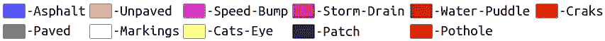

燃气轮机分类[1]

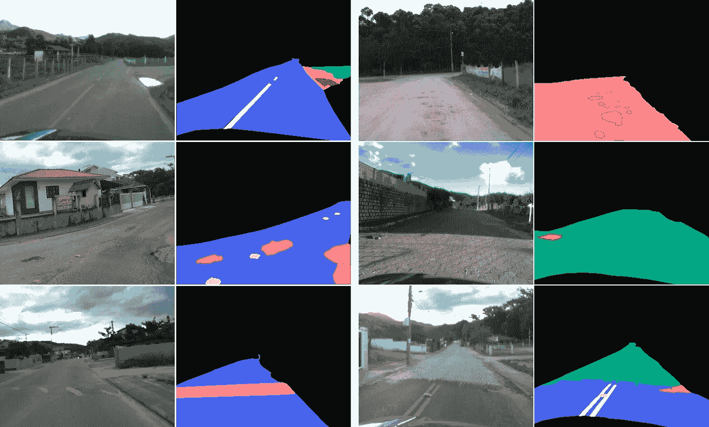

GT 样品[1]

# 方法和设置

这里所做的一切都是使用 Google Colab 完成的。这是一个免费的 Jupyter 笔记本环境，让我们可以免费访问 GPU，非常容易使用，也非常有助于组织和配置。也有人用了[*fastai*](https://www.fast.ai/)【3】，令人惊叹的深度学习库。更准确地说，我将展示的一步一步在很大程度上是基于杰瑞米·霍华德在一门关于深度学习的课程中的一节课，在这里是[第 3 课——cam vid](https://github.com/fastai/course-v3/blob/master/nbs/dl1/lesson3-camvid.ipynb)。

使用的 CNN 架构是 U-NET [4]，这是一种设计用于执行医学图像语义分割任务的架构，但也成功应用于许多其他方法。此外，使用了基于 ResNet [5]的编码器和解码器。该方法的实验是在 resnet34 和 resnet50 上进行的。

对于数据扩充步骤，使用了来自 *fastai* 库的标准选项，应用了水平旋转和透视变形。使用 *fastai* 可以对原始图像和掩模(GT)图像进行相同的数据扩充步骤。

与此相关的一点是，对这种方法的定义非常重要的是，GT 的类别相当不平衡，具有比其他类别大得多的背景或表面类型(例如:沥青、铺砌或未铺砌)像素。与影像分类问题不同，在影像分类问题中，从数据集中复制某些影像可能有助于平衡类别，在这种情况下，复制影像将意味着进一步增加最大和最小类别之间的像素数量差异。然后，在定义的方法中，在类中使用权重进行平衡。🤔

基于不同的实验，人们认识到仅应用权重是不够的，因为当提高包含少量像素的类的精度时，包含大量像素的类(例如:沥青、已铺路面和未铺路面)会降低精度结果的质量。

考虑到所有类别，在不损失太多表面类型检测质量的情况下，最佳精度值为以下配置:首先不使用权重来训练模型，为表面类型生成具有良好精度的模型，然后，使用之前训练的模型作为下一个模型的基础，该模型使用类别的比例权重。就是这样！

你可以在 GitHub 上查看完整的代码，我将在这篇文章中对此进行评论:

 [## thiagortk/考虑路面损坏的路面检测和鉴别

### 用于道路表面的语义分割 GT 包含来自 RTK 数据集的 701 帧。

github.com](https://github.com/thiagortk/Road-surface-detection-and-differentiation-considering-surface-damages) 

# 循序渐进

你准备好了吗？

来自 https://giphy.com/的 gif 图片

酷，所以我们从初始设置开始，导入 *fastai* 库和 pathlib 模块。姑且称之为**第一步**。

## 步骤 1 —初始设置

[路面语义分割. ipynb](https://github.com/thiagortk/Road-surface-detection-and-differentiation-considering-surface-damages/blob/master/RoadSurfaceSegmentation.ipynb)

因为我们将使用来自 google drive 的数据集，所以我们需要挂载它，所以在下一个单元格类型中:

[路面语义分割. ipynb](https://github.com/thiagortk/Road-surface-detection-and-differentiation-considering-surface-damages/blob/master/RoadSurfaceSegmentation.ipynb)

您将看到类似下图的内容，单击该链接，您将获得一个授权码，因此只需将授权码复制并粘贴到预期字段中。

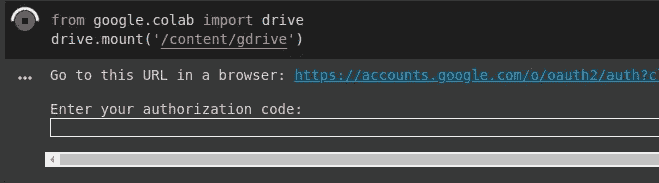

来自作者

现在只需将你的 Google Drive 作为一个文件系统来访问。这是**步骤 2** 的开始，加载我们的数据。

## **步骤 2 —** 准备数据

[路面语义分割. ipynb](https://github.com/thiagortk/Road-surface-detection-and-differentiation-considering-surface-damages/blob/master/RoadSurfaceSegmentation.ipynb)

其中“*图像*”是包含原始图像的文件夹。“*标签*”是包含我们将用于训练和验证的遮罩的文件夹，这些图像在色彩映射表移除过程后是 8 位像素。在“*颜色标签*”中，我已经放上了原始的彩色蒙版，我们可以用它来进行视觉对比。“ *valid.txt* ”文件包含随机选择用于验证的图像名称列表。最后，“ *codes.txt* ”文件包含一个带有类名的列表。

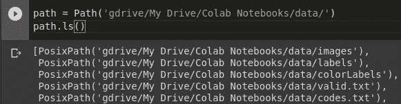

来自作者

[路面语义分割. ipynb](https://github.com/thiagortk/Road-surface-detection-and-differentiation-considering-surface-damages/blob/master/RoadSurfaceSegmentation.ipynb)

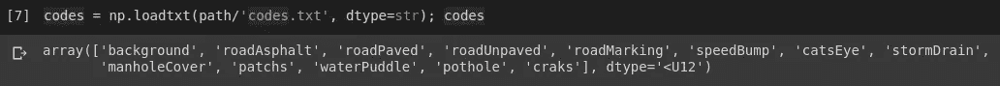

来自作者

现在，我们为原始图像和 GT 遮罩图像定义路径，以便以后能够访问每个文件夹中的所有图像。

[路面语义分割. ipynb](https://github.com/thiagortk/Road-surface-detection-and-differentiation-considering-surface-damages/blob/master/RoadSurfaceSegmentation.ipynb)

我们可以看到一个例子，数据集的图像 139。

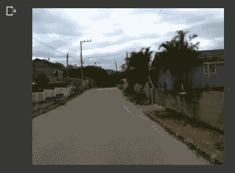

来自作者

接下来，如 *fastai* 课所示，我们使用一个函数从原始图像中推断蒙版文件名，负责每个像素的颜色编码。

[路面语义分割. ipynb](https://github.com/thiagortk/Road-surface-detection-and-differentiation-considering-surface-damages/blob/master/RoadSurfaceSegmentation.ipynb)

## 第 3 步——第一步——无重量

我们到了第三步。让我们使用数据块 API 创建 DataBunch 来训练我们的第一个模型。定义我们的图像来自哪里，哪些图像将用于验证，以及对应于每个原始图像的遮罩。对于数据扩充， *fastai* 库也给出了选项，但是这里我们将只使用默认选项和`get_transforms()`，它由随机水平旋转和透视扭曲组成。记住在 transform 调用中设置`tfm_y=True`,以确保数据集中数据扩充的转换对于每个遮罩及其原始图像都是相同的。试想一下，如果我们旋转了原始图像，但是那个图像对应的蒙版却没有旋转，那该是多么的混乱啊！😵

[路面语义分割. ipynb](https://github.com/thiagortk/Road-surface-detection-and-differentiation-considering-surface-damages/blob/master/RoadSurfaceSegmentation.ipynb)

我们继续使用来自 *fastai* 课程的 [lesson3-camvid](https://github.com/fastai/course-v3/blob/master/nbs/dl1/lesson3-camvid.ipynb) 示例来定义精度指标和重量衰减。我之所以使用 resnet34 模型，是因为在这个数据集上使用 resnet50 并没有太大的区别。我们可以使用`lr_find(learn)`找到学习率，在我的例子中，我将它定义为`1e-4`。

[路面语义分割. ipynb](https://github.com/thiagortk/Road-surface-detection-and-differentiation-considering-surface-damages/blob/master/RoadSurfaceSegmentation.ipynb)

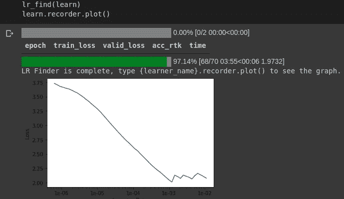

来自作者

接下来，我们运行`fit_one_cycle()`10 次，检查我们的模型做得如何。

[路面语义分割. ipynb](https://github.com/thiagortk/Road-surface-detection-and-differentiation-considering-surface-damages/blob/master/RoadSurfaceSegmentation.ipynb)

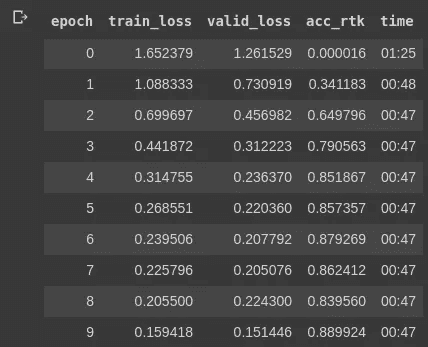

来自作者

使用混淆矩阵，我们可以看到到目前为止每个类的模型有多好(或多差)

[路面语义分割. ipynb](https://github.com/thiagortk/Road-surface-detection-and-differentiation-considering-surface-damages/blob/master/RoadSurfaceSegmentation.ipynb)

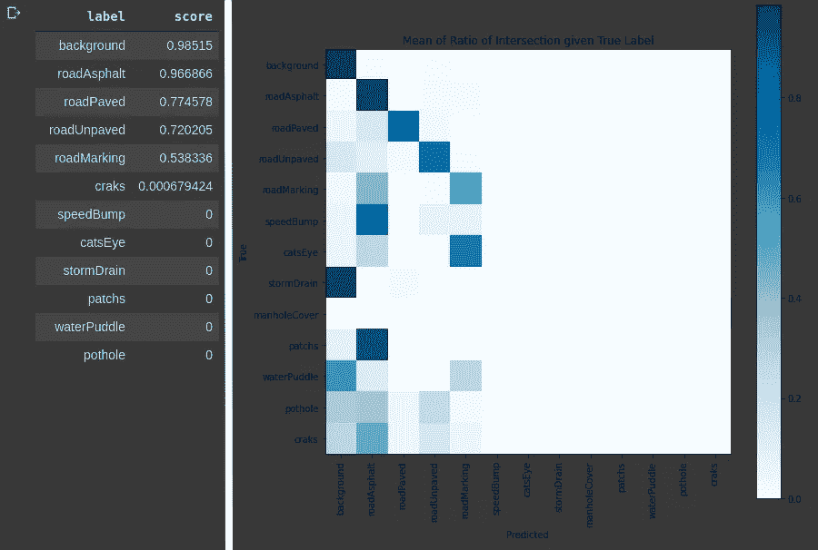

来自作者

不要忘记保存我们到目前为止训练的模型。

[路面语义分割. ipynb](https://github.com/thiagortk/Road-surface-detection-and-differentiation-considering-surface-damages/blob/master/RoadSurfaceSegmentation.ipynb)

现在，我们只是在更多的时期内训练模型，以改进学习，并记住保存我们的最终模型。slice 关键字用于获取起始值和终止值，因此在第一层中，以起始值开始训练，并且当到达训练过程的末尾时，该值将改变，直到终止值。

[路面语义分割. ipynb](https://github.com/thiagortk/Road-surface-detection-and-differentiation-considering-surface-damages/blob/master/RoadSurfaceSegmentation.ipynb)

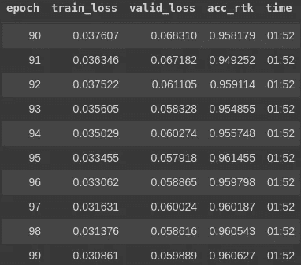

来自作者

这是我们的第一个模型，没有重量，适用于路面，但不适用于小班。

来自作者

## 步骤 4-第二部分-重量

我们将在下一步中使用第一个模型。这一部分几乎与第 3 步完全相同，因为数据集中，我们只需要记住加载我们以前的模型。

[路面语义分割. ipynb](https://github.com/thiagortk/Road-surface-detection-and-differentiation-considering-surface-damages/blob/master/RoadSurfaceSegmentation.ipynb)

并且，在我们开始训练过程之前，我们需要在班级里放重量。我定义这些权重是为了与每个类在数据集中出现的数量(像素数)成比例。*我用 OpenCV 运行了一个 python 代码，只是为了计算 GT 的 701 幅图像中每个类别的像素数量，以了解每个类别的比例…😓

[路面语义分割. ipynb](https://github.com/thiagortk/Road-surface-detection-and-differentiation-considering-surface-damages/blob/master/RoadSurfaceSegmentation.ipynb)

剩下的部分和前面的第三步完全一样。得到的结果有什么变化。😬

来自作者

现在，看起来我们对所有职业都有了一个更合理的结果。记得存起来！

[路面语义分割. ipynb](https://github.com/thiagortk/Road-surface-detection-and-differentiation-considering-surface-damages/blob/master/RoadSurfaceSegmentation.ipynb)

# 结果

最后，让我们看看我们的图像，对不对？在做任何事情之前，最好保存我们的结果，或者我们的测试图像。

[路面语义分割. ipynb](https://github.com/thiagortk/Road-surface-detection-and-differentiation-considering-surface-damages/blob/master/RoadSurfaceSegmentation.ipynb)

但是，等等！图像看起来全黑，我的结果呢？？？😱冷静下来，这些是结果，只是没有彩色地图，如果你在整个屏幕上打开这些图像中的一个，在高亮度下，你可以看到小的变化，“11 个灰色阴影”🙃。所以，让我们的结果颜色更像样？现在我们将使用 OpenCV 并创建一个新文件夹来保存我们的彩色结果。

[路面语义分割. ipynb](https://github.com/thiagortk/Road-surface-detection-and-differentiation-considering-surface-damages/blob/master/RoadSurfaceSegmentation.ipynb)

因此，我们创建一个函数来识别每个变化，并给每个像素着色。

[路面语义分割. ipynb](https://github.com/thiagortk/Road-surface-detection-and-differentiation-considering-surface-damages/blob/master/RoadSurfaceSegmentation.ipynb)

接下来，我们读取每个图像，调用函数并保存最终结果。

[路面语义分割. ipynb](https://github.com/thiagortk/Road-surface-detection-and-differentiation-considering-surface-damages/blob/master/RoadSurfaceSegmentation.ipynb)

但是，这个过程可能会花费不必要的时间，使用`%timeit`我们可以实现如下性能:

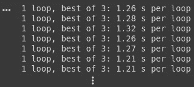

来自作者

想象一下，如果我们需要用更多的图像来测试呢？我们可以使用 Cython 加快这一步。所以，让我们把一撮 Cython 放在那上面！

来自[https://giphy.com/](https://giphy.com/)的 gif

因此，我们编辑我们的函数来识别每个变化并给每个像素着色，但是这一次，使用 Cython。

[路面语义分割. ipynb](https://github.com/thiagortk/Road-surface-detection-and-differentiation-considering-surface-damages/blob/master/RoadSurfaceSegmentation.ipynb)

我们只是读取每张图片，调用函数，然后像之前一样保存最终结果。

[路面语义分割. ipynb](https://github.com/thiagortk/Road-surface-detection-and-differentiation-considering-surface-damages/blob/master/RoadSurfaceSegmentation.ipynb)

瞧啊。现在我们有一个表现为:

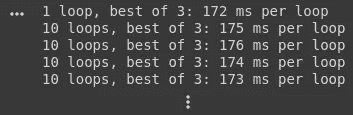

来自作者

好多了，对吧？

## 一些结果样本

下图是一些结果。左边一栏是原始图像，中间一栏是 GT，右边一栏是用这种方法得到的结果。

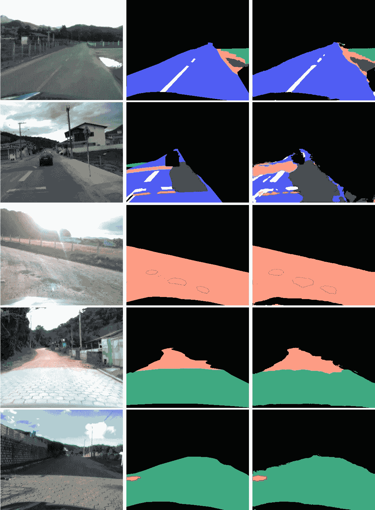

改编自[1]

## 结果视频

# 讨论(大家来说说吧)

识别路面状况在任何情况下都很重要，基于此，车辆或驾驶员可以适应并做出决定，使驾驶更加安全、舒适和高效。这一点在发展中国家尤为重要，因为这些国家可能面临更多的道路维护问题，或者有相当数量的未铺设道路。

这种方法看起来很有希望处理路面变化的环境。这对于公路分析和养护部门来说也很有用，以便使他们在评估公路质量和确定哪里需要养护方面的部分工作实现自动化。

然而，一些点被确定和分析为有待改进。

对于分段 GT，将一些类别划分为更具体的类别可能会很有意思，例如裂缝类别，用于不同的损坏，而与道路类型无关。因此每种类型的表面具有不同的裂纹，因为不同的表面具有不同类型的损伤。同样把这个职业分成不同的职业，在每个新的职业中对不同的伤害进行分类。

目前就这些。请随时联系我。🤘

# 承认

这个实验是来自 [**LAPiX**](http://www.lapix.ufsc.br/?lang=en) (图像处理和计算机图形实验室)的关于车辆导航视觉感知的 [**项目**](http://www.lapix.ufsc.br/pesquisas/projeto-veiculo-autonomo/?lang=en) 的一部分。

如果你要谈这个 [**方法**](https://www.researchgate.net/publication/337682194_Road_Surface_Classification_with_Images_Captured_From_Low-cost_Camera_-_Road_Traversing_Knowledge_RTK_Dataset) ，请引用为:

***@ article****{ Rateke:2020 _ 3，* ***作者****= { Thiago Rateke and Aldo von Wangenheim }，* ***标题*** *= {* 路面检测与考虑路面破损的判别 *}，* ***CV}，
}***

# 参考

[1] T. Rateke，A. von Wangenheim。 [**考虑路面破损的路面检测与区分**](https://rdcu.be/cdpxi) ，(2020)，自主机器人(Springer)。

[2] T. Rateke、K. A. Justen 和 A. von Wangenheim。 [**【利用低成本摄像机拍摄的图像进行路面分类——道路穿越知识(RTK)数据集**](https://www.researchgate.net/publication/337682194_Road_Surface_Classification_with_Images_Captured_From_Low-cost_Camera_-_Road_Traversing_Knowledge_RTK_Dataset) ，(2019)，《哥斯达黎加与应用信息杂志》(RITA)。

[3] J .霍华德等著 [**fastai**](https://www.fast.ai/) (2018)。[https://github.com/fastai/fastai](https://github.com/fastai/fastai)

[4] O .龙内贝格，p .菲舍尔，t .布罗克斯 [**U-net:用于生物医学图像分割的卷积网络**](https://arxiv.org/abs/1505.04597) ，(2015)，NAVAB，n .等(编。).医学图像计算和计算机辅助介入— [MICCAI 2015。查姆:施普林格国际出版公司](https://link.springer.com/chapter/10.1007/978-3-319-24574-4_28)。

[5] K. He 等著****(2016)[IEEE 计算机视觉与模式识别大会(CVPR)](https://ieeexplore.ieee.org/document/7780459/authors#authors) 。****

# ****请参见****

**** [## 路面分类

### 一种路面类型和质量分类方法

towardsdatascience.com](/road-surface-classification-150f9874faef)  [## 两种不同传感器的视觉深度估计

### 来自被动和主动视觉低成本传感器的立体视差图和点云

medium.com](https://medium.com/analytics-vidhya/visual-depth-estimation-by-two-different-sensors-36f756d1575a)****