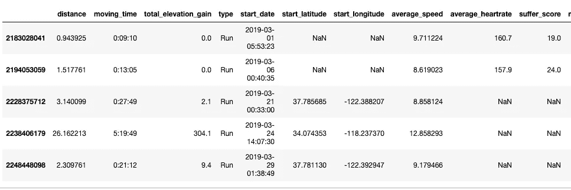
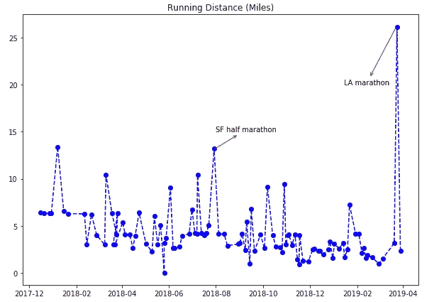
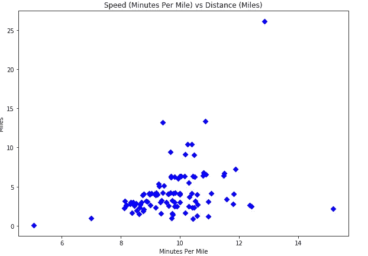
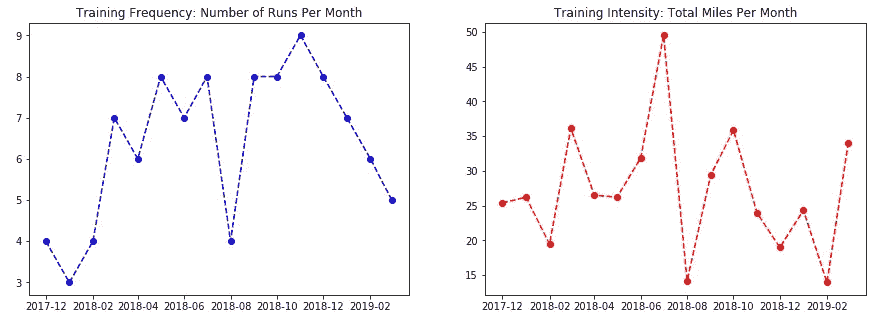

# Python 首次马拉松之路

> 原文：<https://towardsdatascience.com/road-to-the-first-marathon-with-python-c78b2eee4e47?source=collection_archive---------49----------------------->

## 一位数据科学家讲述了他与 Strava API、熊猫等的马拉松之旅。

跑步对我来说不仅仅是一种锻炼。这让我成为一个更快乐的人。2019 年 3 月，我在洛杉矶第一次跑马拉松。那时，我写了第一篇关于那次经历的媒体文章。

作为一名数据科学家，我知道我可以做更多的事情来记住这段旅程。但是，我拖了一年多。由于新冠肺炎，我们外出跑步和参加比赛的能力非常有限。这让我更加怀念过去的时光。多亏了 Strava，我记录了我第一次马拉松前的所有跑步。我决定埋头研究这些数据。

**这篇文章不是关于什么的？**

这不是关于如何更好地跑步。为此，我推荐《丹尼尔的跑步公式》这本书。

**这篇文章是关于什么的？**

这是一本技术入门书，介绍了如何使用 Python 连接 Strava 的 activities API，并使用常见的 Python 库对我在 2019 年洛杉矶马拉松之前的跑步进行探索性分析。这揭示了数据是如何偏离直觉的。还提供了代码片段。

**Strava API**

在过去的 5 年里，我一直在使用 Strava。我喜欢这个应用程序的简单性和功能性。直到最近，我才开始探索 [Strava API](https://developers.strava.com/) 。在高层次上，Strava API 要求开发人员使用 OAuth 2.0 身份验证来访问用户的数据。并且每次用户发起认证时，都会创建一个认证码来交换临时访问令牌。开发人员可以使用这个访问令牌来获取用户的数据。

例如，我首先发送一个 post 请求来获取我的访问令牌。这个访问令牌允许我访问我的活动数据。

```
import pandas as pd
import requests
import configparser
import os.path
import json
from collections import defaultdict
import datetime
import matplotlib.pyplot as pltconfig = configparser.ConfigParser()
config.read('/Users/LG/Documents/key_files/strava/strava.cfg')
client_id = config.get('USER','CLIENT_ID')
client_secret = config.get('USER','SECRET')
auth_url = config.get('OAUTH','AUTH_URL')
auth_code = config.get('OAUTH','AUTH_CODE')
params = {'client_id':client_id,'client_secret':client_secret,'code':auth_code,'grant_type':'authorization_code'}
headers = {'content-type': 'application/json'}
r =requests.post(auth_url,data=params)
```

然后，我使用访问令牌发送 get 请求，从 Strava 提取我的所有活动数据。

```
# retrieve access token
access_token = "access_token=" + str(r.json()['access_token'])
# url for getting activities
activity_url = "[https://www.strava.com/api/v3/activities](https://www.strava.com/api/v3/activities)"
# only select variables of interest
cols = ['average_heartrate','average_speed','distance','moving_time',\
        'start_date','start_latitude','start_longitude','suffer_score','total_elevation_gain',
       'type'
       ]
# write a loop to retrieve all the activities and store in a dictionary indexed by activitiy id.
page = 1
d = defaultdict()
while True:
    string = activity_url + '?'+ access_token + '&per_page=50' + '&page=' + str(page)
    # get the page of activities
    r = requests.get(string)
    r = r.json()
    if not r:
        break
    for i in range(len(r)):
        if r[i]['id'] not in d:
            d[r[i]['id']] = defaultdict()
            for key,value in r[i].items():
                if key in cols:
                    d[r[i]['id']][key] = value
        else: 
            continue
    page += 1
```

嘣，我把我所有的活动数据都保存在一个 Python 字典里了。现在，让我们做一些数据管理。

*   仅过滤正在运行的活动。我有时也骑自行车。
*   Strava 记录的跑步距离是米，我需要把它转换成英里。
*   Strava 记录的速度是米每秒，我需要把它转换成分钟每英里。
*   我过滤了 2017-12 和 2019-03 之间的日期，当时我正在为马拉松比赛进行实际训练。

```
my_strava = pd.DataFrame.from_dict(d,orient='index')
# filter only run activities
my_strava = my_strava[my_strava['type']=='Run']
# meter to mile translation
def meter_to_mile(meter):
    return meter * 0.000621371192
# average speed meter per second to Minutes Per Mile
def speed_converter(speed):
    return 1 / (meter_to_mile(speed) * 60)# translate my distance into miles, and moving time into hours/minutes, 
# and start_date into date/time, speed into Minutes per Mile
my_strava['distance'] = my_strava['distance'].apply(meter_to_mile)
my_strava['moving_time'] = my_strava['moving_time'].apply(lambda x:str(datetime.timedelta(seconds=x)))
my_strava['start_date'] = my_strava['start_date'].apply(lambda x:datetime.datetime.strptime(x,'%Y-%m-%dT%H:%M:%SZ'))
my_strava['average_speed'] = my_strava['average_speed'].apply(speed_converter)
# filter dates between 2017-12-01 and 2019-03-24
first_run_date = '2017-12-01'
last_run_date = '2019-03-25'
mar = (my_strava['start_date'] > first_run_date) & (my_strava['start_date'] < last_run_date)
my_marathon = my_strava.loc[mar]
my_marathon.head()
```

数据如下表所示，似乎可以进行一些探索性分析。



**分析**

这绝对是关键时刻之一。只有当我看数据的时候，我才意识到我跑的比我想象的要少得多。在洛杉矶马拉松之前的一年里，我的跑步距离实际上是下降的。它不符合任何在线马拉松训练计划。反而是长达一年多的训练之旅，建立了我的信心和抵抗力。

```
fig,ax = plt.subplots(figsize=(10,7))
ax.set_title('Running Distance (Miles)')
ax.plot('start_date','distance','bo--',data=my_marathon)
arrowprops=dict(arrowstyle='<-', color='red')
# add annotations for 2018-07-29 for SF half, 2019-03-24 for LA full.
ax.annotate(s='SF half marathon',xy=((datetime.datetime.strptime('2018-07-29','%Y-%m-%d')),13.1),\
           xytext=((datetime.datetime.strptime('2018-08-01','%Y-%m-%d')),15.0),\
           arrowprops=arrowprops);
ax.annotate(s='LA marathon',xy=(datetime.datetime.strptime('2019-03-24','%Y-%m-%d'),26.2),\
           xytext=(datetime.datetime.strptime('2019-01-15','%Y-%m-%d'),20.0),\
           arrowprops=arrowprops);
```



我的跑步大多集中在 3-7 英里，每英里 10 分钟。这种水平的表现就是所谓的“轻松步伐”。偶尔，我会跑个门槛。洛杉矶马拉松是我唯一一次跑超过 15 英里。

```
fig,ax = plt.subplots(figsize=(10,7))
ax.set_title('Speed (Minutes Per Mile) vs Distance (Miles)')
ax.scatter('average_speed','distance',data=my_marathon,color='blue',marker='D')
ax.set_xlabel('Minutes Per Mile')
ax.set_ylabel('Miles')
plt.show()
```



我的巅峰月份是 2018–07 年训练和参加旧金山半程马拉松时的 50 多英里。事件发生后，情况急转直下。然而有趣的是，低于 15 英里的最低表现出现在 2019 年 2 月洛杉矶马拉松比赛之前。同样，只有当我们看数据时才会感到惊讶！

```
fig,ax = plt.subplots(nrows=1,ncols=2,figsize=(15,5))
ax[0].set_title('Training Frequency: Number of Runs Per Month')
ax[0].plot('month','count','bo--',data=monthly_run)
ax[1].set_title('Training Intensity: Total Miles Per Month')
ax[1].plot('month','total_distance','ro--',data=monthly_mile)
plt.show()
```



给你。简而言之，这是我第一次用 Python 请求、字典、pandas 和 matplotlib 进行马拉松式的体验。