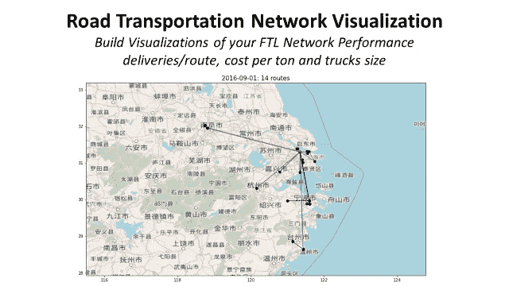
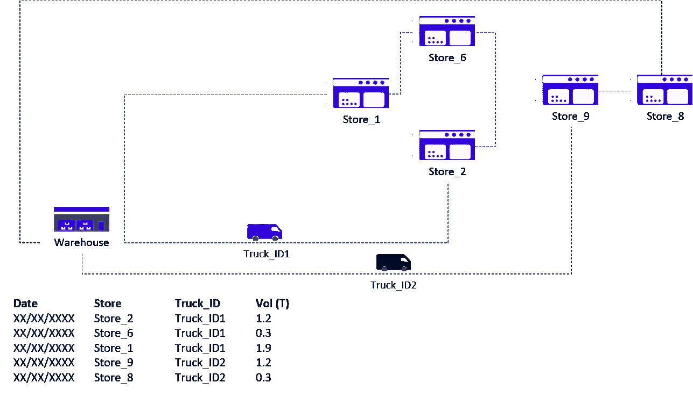
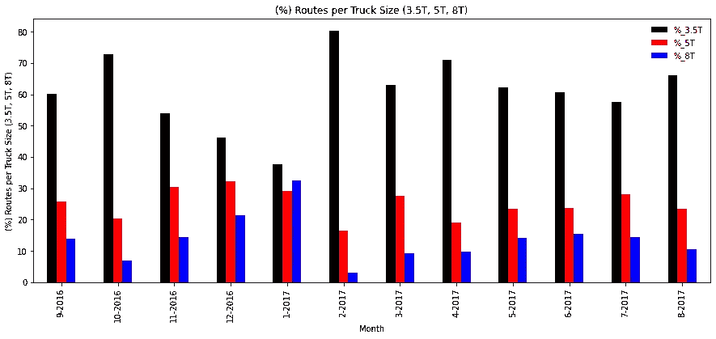
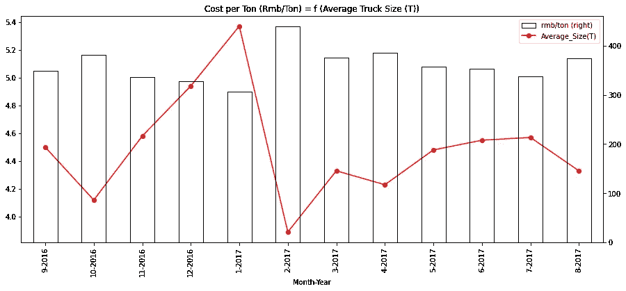
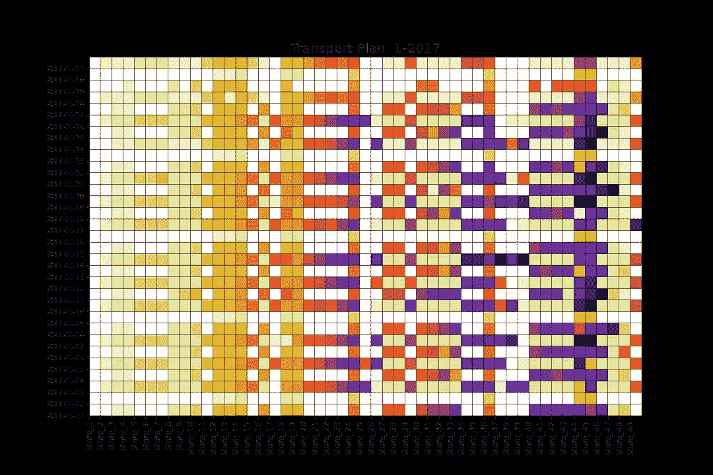
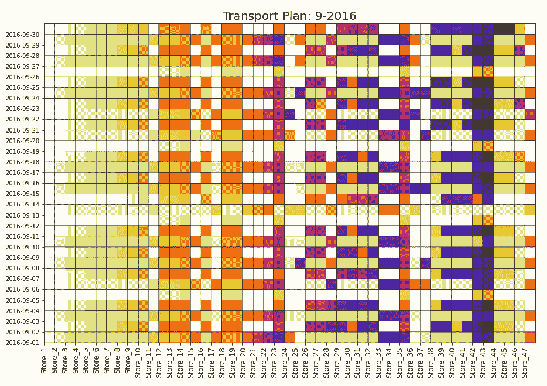
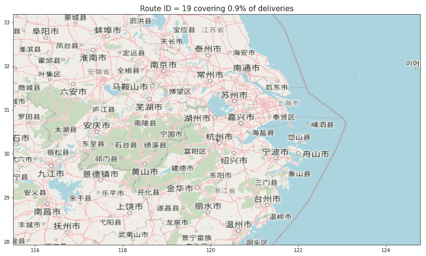
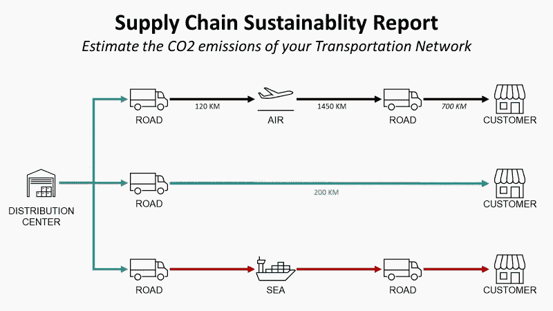

# 道路交通网络可视化

> 原文：<https://towardsdatascience.com/road-transportation-optimization-with-python-part-1-visualisation-costing-698eadcdce0b?source=collection_archive---------14----------------------->

## 构建您的 FTL 网络性能的可视化:**交付/路线**、**每吨成本**和**卡车尺寸**

道路交通网络可视化—(图片由作者提供)

在一系列[仓储作业优化](/optimizing-warehouse-operations-with-python-part-1-83d02d001845)之后，我们将使用相同的方法通过以下方式提高**道路** **运输**效率

1.  **处理数据:**提取非结构化的运输记录，并对其进行处理，以构建您的优化模型
2.  **提高可见性:**使用 Python 可视化库来清楚地了解当前路线和**卡车装载率**
3.  **模拟场景:**建立一个模型，模拟多种路线方案，估计对**平均每吨成本**的影响

💌新文章直接免费放入你的收件箱:[时事通讯](https://www.samirsaci.com/#/portal/signup)

# 一、如何用 Python 做运输计划？

## 问题陈述

零售店配送用 [**满载卡车(FTL)**](https://www.youtube.com/watch?v=PYkN24PMKd8)

*   **1 仓库**使用**三种**型号的卡车
    (3.5T、5T、8T)运送物料
*   **第 49 家店铺**交付
*   **12 个月**的历史数据，其中 **10，000 次交付**
*   **一周 7 天**的运营
*   **23 个城市**
*   **您车队中的 84 辆卡车**

2 辆卡车的运输路线，覆盖 2 条路线中的 5 家商店—(图片由作者提供)

## 目标:降低每吨成本

方法:装运合并

在这种情况下，您使用第三方承运商，按目的地对整辆卡车收费:

上表显示了承运人针对每种类型的卡车交付的每个城市所适用的费率。观察到**较大卡车的每吨成本较低**，一个改进措施是**在建造路线时最大化装运整合**。

因此， [**路线运输计划优化的**](https://www.youtube.com/watch?v=lhDBTlsGDVc&t=1s) 主要目标是在每条路线上覆盖最大数量的商店。

 [## 萨米尔·萨奇

### 数据科学博客，专注于仓储，运输，数据可视化和机器人流程自动化…

samirsaci.com](http://samirsaci.com) 

# 二。数据处理:了解当前情况

## 1.导入数据集

在开始考虑[优化模型](https://www.youtube.com/watch?v=lhDBTlsGDVc&t=1s)之前，你的首要任务是了解目前的情况。

从来自多个来源的非结构化数据开始，我们需要构建一组数据框架来模拟我们的网络，并提供每条路线的装载率和交付商店列表的可见性。

**单店发货记录**

**店面地址**

**运输成本**

## 2.每条路线交付的商店列表

让我们处理初始数据帧，以列出每条路线交付的所有商店。

## 1 条路线= 1 个卡车 ID + 1 个日期

## 3.添加每条路线覆盖的城市

现在让我们来计算运输公司为每条路线开具的运输成本发票:

**可视化:每辆卡车的交付量百分比**

每辆卡车(3.5T、5T、8T)的路线百分比(百分比)——(图片由作者提供)

平均卡车尺寸(吨)对每吨总成本(人民币/吨)的影响(图片由作者提供)

**见解**

*   **平均卡车尺寸:**大多数小型卡车
*   **每吨成本:**每吨成本与平均卡车尺寸成反比

在本教程中找到更多智能可视化的灵感，

# 二。理解现状:观想

## 1.运输计划可视化

**目标**:获得每天所有交付的简单可视化，重点关注不同路线的数量

运输计划:2017 年 1 月—(图片由作者提供)

**解决方案** : Python 的 Matplotlib 网格函数

*   **列:** 1 列= 1 家商店
*   **行:** 1 行= 1 天
*   **颜色=白色:** 0 发货
*   **颜色:** 1 种颜色= 1 条路线(1 辆卡车)

**视觉洞察力**

*   **交货频率:**每周 n 次交货
*   **路线数量:**一天有多少种不同的颜色？
*   **Color = White:** 不发货
*   **路线:**我们是否每天都有相同的商店分组？

**12 个月概述**

12 个月概述—(图片由作者提供)

优化后，此图表将帮助我们轻松直观地了解新路由的影响。更好的路线意味着每天更少的路线，所以每条线的颜色会更少。

## 2.商店交付的地理可视化

**目标** 将同一路线上的地理位置可视化

所有商店位置(蓝点)——(图片由作者提供)

**解决方案** OpenStreet 地图+ Matplotlib 散点图

要获得这种可视化效果，你可以使用免费工具 OpenStreet Map。详细的解释可以在[艾哈迈德·卡西姆](https://medium.com/u/fdba1265ab48?source=post_page-----698eadcdce0b--------------------------------)写的这篇伟大的文章(*在地图上绘制地理数据的简单步骤*、[链接](/easy-steps-to-plot-geographic-data-on-a-map-python-11217859a2db))中找到。

如果你需要支持来获得 GPS 坐标，看看这个简短的教程

**每天不同路线的可视化**

不同路线的可视化(1 种颜色= 1 条路线)——(图片由作者提供)

# 三。后续步骤

*关注我的 medium，了解更多与供应链数据科学相关的见解。*

## 1.衡量环境影响

除了降低成本，您还可以通过优化您的运输网络来减少二氧化碳排放量。

供应链可持续性报告—(图片由作者提供)

在这篇文章中，我介绍了一个简单的方法来使用 Python 和 PowerBI 报告你的分销网络的二氧化碳排放量。

 [## 使用 Python 进行供应链可持续性报告

### 自动化和报告构建 ESG 报告的 4 个步骤，重点关注分销网络的二氧化碳排放 4 个步骤…

www.samirsaci.com](https://www.samirsaci.com/supply-chain-sustainability-reporting-with-python/) 

## **2。路线优化:每条路线的交货数量**

*   处理了历史记录的数据框架
*   当前运输计划
*   基于配送城市的每条路线运输成本计算模型
*   每天不同路线数量的可视化
*   每条路线交付的地理位置可视化

**接下来的步骤是**

*   **路线:**增加每条路线交付的店铺数量
*   车队分配:确保工作量分配均匀
*   **发货频率**:减少每周发货次数，增加每次发货数量
*   **模拟影响:**我们可以从上面列出的优化中获得节约

# 关于我

让我们在 [Linkedin](https://www.linkedin.com/in/samir-saci/) 和 [Twitter](https://twitter.com/Samir_Saci_) 上连线，我是一名供应链工程师，正在使用数据分析来改善物流运营并降低成本。

如果你对数据分析和供应链感兴趣，可以看看我的网站

 [## Samir Saci |数据科学与生产力

### 专注于数据科学、个人生产力、自动化、运筹学和可持续发展的技术博客

samirsaci.com](https://samirsaci.com) 

# 参考

[1] [Ahmed Qassim](https://medium.com/u/fdba1265ab48?source=post_page-----698eadcdce0b--------------------------------) ，在地图上绘制地理数据的简单步骤，[链接](/easy-steps-to-plot-geographic-data-on-a-map-python-11217859a2db)

[2]用 Python 进行供应链可持续性报告， [Samir Saci](https://medium.com/u/bb0f26d52754?source=post_page-----698eadcdce0b--------------------------------) ， [Link](/supply-chain-sustainability-reporting-with-python-161c1f63f267)