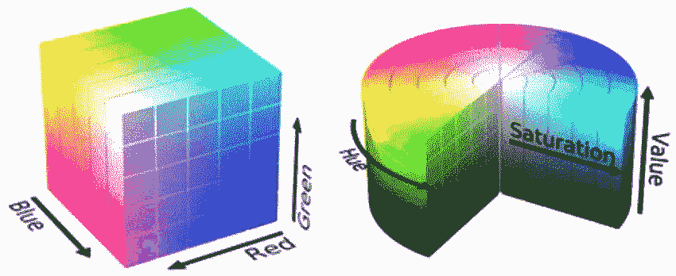
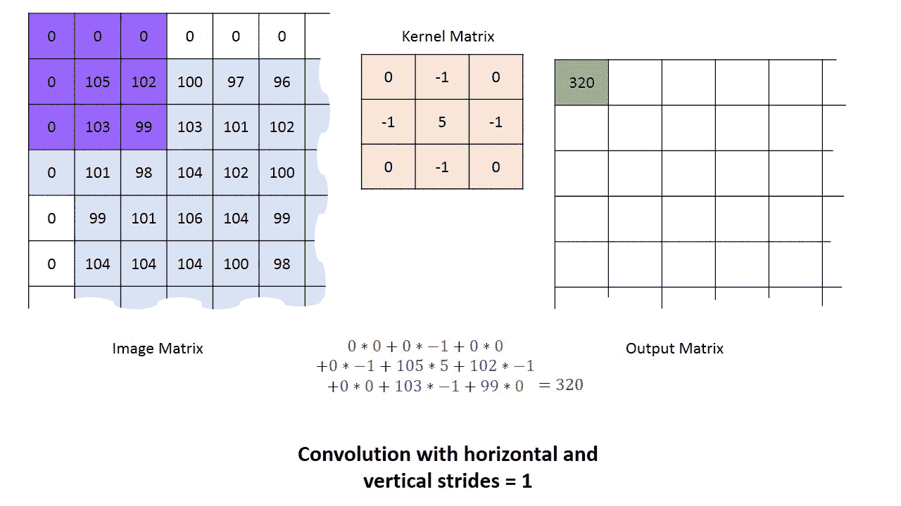
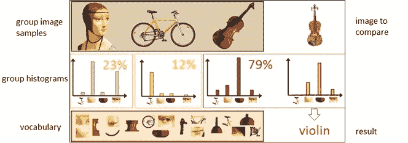
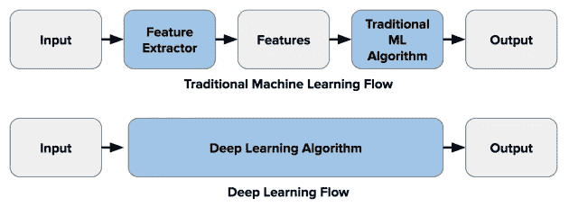

# 计算机视觉路线图

> 原文：<https://towardsdatascience.com/roadmap-to-computer-vision-79106beb8be4?source=collection_archive---------18----------------------->

## 介绍组成计算机视觉系统的主要步骤。从图像预处理、特征提取和预测开始。

恩尼奥·迪贝利在 [Unsplash](https://unsplash.com?utm_source=medium&utm_medium=referral) 上拍摄的照片

# 介绍

计算机视觉是当今人工智能的主要应用之一(如图像识别、目标跟踪、多标记分类)。在本文中，我将带您了解组成计算机视觉系统的一些主要步骤。

计算机视觉系统工作流程的标准表示为:

1.  一组图像进入系统。
2.  为了预处理和从这些图像中提取特征，使用了特征提取器。
3.  机器学习系统利用提取的特征来训练模型并进行预测。

现在，我们将简要介绍一些主要流程，数据可能会经历这三个不同的步骤。

# 图像进入系统

在尝试实现 CV 系统时，我们需要考虑两个主要组件:图像采集硬件和图像处理软件。部署 CV 系统的主要要求之一是测试其健壮性。事实上，我们的系统应该能够不受环境变化的影响(比如光照、方向、比例的变化),并且能够重复执行设计的任务。为了满足这些要求，可能有必要对我们系统的硬件或软件应用某种形式的约束(例如，远程控制照明环境)。

一旦从硬件设备获得图像，在软件系统中有许多可能的方法来用数字表示颜色(颜色空间)。两个最著名的颜色空间是 RGB(红、绿、蓝)和 HSV(色调、饱和度、值)。使用 HSV 颜色空间的一个主要优点是，通过只取 HS 分量，我们可以使我们的系统光照不变(图 1)。

图 1: RGB 与 HSV 色彩空间[1]

# 特征提取器

## 图像预处理

一旦图像进入系统并使用颜色空间来表示，我们就可以对图像应用不同的操作符来改善其表示:

*   **点操作符**:我们使用图像中的所有点来创建原始图像的变换版本(为了明确图像内部的内容，而不改变其内容)。点算子的一些例子是:强度归一化、直方图均衡化和阈值化。点操作符通常用于帮助人类视觉更好地可视化图像，但不一定为计算机视觉系统提供任何优势。
*   **组操作符**:在这种情况下，我们从原始图像中取出一组点，以便在图像的变换版本中创建一个点。这种类型的运算通常通过使用卷积来完成。可以使用不同类型的核与图像进行卷积，以获得我们的变换结果(图 2)。一些例子是:直接平均，高斯平均和中值滤波。因此，对图像应用卷积运算可以减少图像中的噪点数量并提高平滑度(尽管这也可能会导致图像略微模糊)。因为我们使用一组点来在新图像中创建单个新点，所以新图像的尺寸必然会比原始图像的尺寸小。这个问题的一个解决方案是应用零填充(将像素值设置为零)或在图像边界使用较小的模板。使用卷积的一个主要限制是在处理大模板时的执行速度，这个问题的一个可能的解决方案是使用傅立叶变换。

图 2: [核卷积](https://stats.stackexchange.com/questions/296679/what-does-kernel-size-mean/296701)

对图像进行预处理后，我们可以应用更先进的技术，通过使用一阶边缘检测(例如 Prewitt 算子、Sobel 算子、Canny 边缘检测器)和 Hough 变换等方法，尝试提取图像中的边缘和形状。

## 特征抽出

一旦预处理了图像，有 4 种主要类型的特征形态可以通过使用特征提取器从图像中提取:

*   **全局特征**:将整幅图像作为一个整体进行分析，从特征提取器中提取出一个特征向量。全局特征的一个简单例子可以是面元像素值的直方图。
*   **基于网格或块的特征**:将图像分割成不同的块，从每个不同的块中提取特征。为了从图像的块中提取特征，使用的主要技术之一是密集 SIFT(尺度不变特征变换)。这种类型的特征被广泛用于训练机器学习模型。
*   **基于区域的特征**:将图像分割成不同的区域(例如，使用阈值或 K-Means 聚类等技术，然后使用连通分量将它们连接成片段)，并从这些区域中的每一个提取特征。可以通过使用诸如矩和链码的区域和边界描述技术来提取特征)。
*   **局部特征**:在图像中检测多个单个兴趣点，通过分析兴趣点附近的像素提取特征。可以从图像中提取的两种主要类型的兴趣点是角点和斑点，这些可以通过使用诸如哈里斯&斯蒂芬斯检测器和高斯的拉普拉斯算子的方法来提取。通过使用诸如 SIFT(尺度不变特征变换)的技术，可以最终从检测到的兴趣点提取特征。通常使用局部特征来匹配图像以构建全景/3D 重建或从数据库中检索图像。

一旦提取了一组区别特征，我们就可以使用它们来训练机器学习模型进行推理。使用像 [OpenCV](https://opencv-python-tutroals.readthedocs.io/en/latest/py_tutorials/py_feature2d/py_sift_intro/py_sift_intro.html) 这样的库，可以很容易地在 Python 中应用特性描述符。

# 机器学习

计算机视觉中用于对图像进行分类的主要概念之一是视觉单词包(BoVW)。为了构建一个视觉单词包，我们首先需要通过从一组图像中提取所有特征来创建一个词汇表(例如，使用基于网格的特征或局部特征)。随后，我们可以计算提取的特征在图像中出现的次数，并根据结果构建频率直方图。使用频率直方图作为基本模板，我们可以通过比较它们的直方图来最终分类一幅图像是否属于同一类(图 3)。

这个过程可以总结为以下几个步骤:

1.  我们首先通过使用特征提取算法(如 SIFT 和 Dense SIFT)从图像数据集中提取不同的特征来构建词汇表。
2.  其次，我们使用 K-Means 或 DBSCAN 等算法对词汇表中的所有特征进行聚类，并使用聚类质心来总结我们的数据分布。
3.  最后，我们可以通过计算词汇中的不同特征在图像中出现的次数，从每个图像中构建一个频率直方图。

然后，可以通过对我们想要分类的每个图像重复相同的过程来分类新图像，然后使用任何分类算法来找出我们的词汇表中哪个图像与我们的测试图像最相似。

图 3:视觉单词包[2]

如今，由于人工神经网络架构的创建，如卷积神经网络(CNN)和递归人工神经网络(RCNNs)，已经有可能构思出计算机视觉的替代工作流(图 4)。

图 4:计算机视觉工作流程[3]

在这种情况下，深度学习算法结合了计算机视觉工作流程的特征提取和分类步骤。当使用卷积神经网络时，在将特征向量提供给密集层分类器之前，神经网络的每一层在其描述中应用不同的特征提取技术(例如，第 1 层检测边缘，第 2 层发现图像中的形状，第 3 层分割图像等等)。

机器学习在计算机视觉中的进一步应用包括多标记分类和对象识别等领域。在多标记分类中，我们的目标是构建一个模型，能够正确地识别一幅图像中有多少个对象以及它们属于哪一类。相反，在对象识别中，我们的目标是通过识别图像中不同对象的位置，将这一概念向前推进一步。

# 联系人

如果你想了解我最新的文章和项目[，请通过媒体](https://medium.com/@pierpaoloippolito28?source=post_page---------------------------)关注我，并订阅我的[邮件列表](http://eepurl.com/gwO-Dr?source=post_page---------------------------)。以下是我的一些联系人详细信息:

*   [领英](https://uk.linkedin.com/in/pier-paolo-ippolito-202917146?source=post_page---------------------------)
*   [个人博客](https://pierpaolo28.github.io/blog/?source=post_page---------------------------)
*   [个人网站](https://pierpaolo28.github.io/?source=post_page---------------------------)
*   [中等轮廓](https://towardsdatascience.com/@pierpaoloippolito28?source=post_page---------------------------)
*   [GitHub](https://github.com/pierpaolo28?source=post_page---------------------------)
*   [卡格尔](https://www.kaggle.com/pierpaolo28?source=post_page---------------------------)

# 文献学

[1]用作海滩清洁工的模块化机器人，Felippe Roza。研究之门。访问:[https://www . research gate . net/figure/RGB-left-and-HSV-right-color-spaces _ fig 1 _ 310474598](https://www.researchgate.net/figure/RGB-left-and-HSV-right-color-spaces_fig1_310474598)

[2]OpenCV 中的视觉词汇包，视觉与图形组*。扬·昆德拉克。访问:*[https://vgg . fiit . stuba . sk/2015-02/bag-of-visual-words-in-opencv/](https://vgg.fiit.stuba.sk/2015-02/bag-of-visual-words-in-opencv/)**

*【3】深度学习 Vs 传统计算机视觉。哈里塔·蒂拉卡拉恩，纳迪斯人。访问网址:[https://naadispeaks . WordPress . com/2018/08/12/deep-learning-vs-traditional-computer-vision/](https://naadispeaks.wordpress.com/2018/08/12/deep-learning-vs-traditional-computer-vision/)*