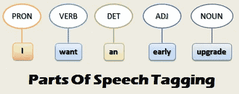
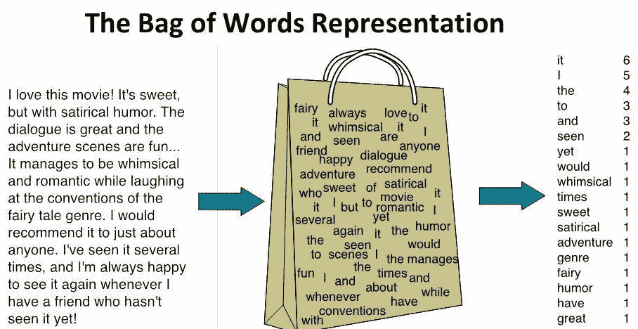
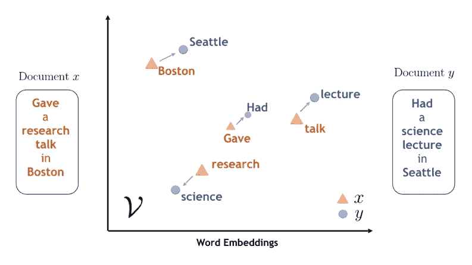

# 自然语言处理(NLP)路线图

> 原文：<https://towardsdatascience.com/roadmap-to-natural-language-processing-nlp-38a81dcff3a6?source=collection_archive---------27----------------------->

## 介绍自然语言处理(NLP)中最常用的一些技术和模型


凯利·西克玛在 [Unsplash](https://unsplash.com?utm_source=medium&utm_medium=referral) 上的照片

# 介绍

由于过去十年[大数据](/big-data-analysis-spark-and-hadoop-a11ba591c057)的发展。组织现在每天都面临着分析来自各种来源的大量数据。

自然语言处理(NLP)是人工智能的研究领域，专注于处理和使用文本和语音数据来创建智能机器和创造洞察力。

当今最有趣的自然语言处理应用之一是创造能够与人类讨论复杂话题的机器。迄今为止，IBM Project Debater 代表了该领域最成功的方法之一。

视频 1: IBM 项目辩手

# 预处理技术

为了准备用于推理的文本数据，一些最常用的技术是:

*   **标记化:**用于将输入文本分割成其组成单词(标记)。这样，将我们的数据转换成数字格式就变得更容易了。
*   **停用词移除:**用于从我们的文本中移除所有介词(如“an”、“the”等……)，这些介词仅被视为我们数据中的噪声源(因为它们在我们的数据中不携带额外的信息)。
*   **词干化:**最后使用是为了去掉我们数据中的所有词缀(如前缀或后缀)。通过这种方式，我们的算法实际上可以更容易地不将实际上具有相似含义的单词(例如，insight ~ insightful)视为区分单词。

使用标准的 Python NLP 库，例如 [NLTK](https://www.nltk.org/) 和 [Spacy](https://spacy.io/) ，所有这些预处理技术都可以很容易地应用于不同类型的文本。

此外，为了推断我们文本的语言语法和结构，我们可以利用诸如词性(POS)标记和浅层解析等技术(图 1)。事实上，使用这些技术，我们用词汇类别(基于短语句法上下文)显式地标记每个单词。



图 1:词性标注示例[1]。

# 建模技术

## 一袋单词

单词包是一种用于自然语言处理和[计算机视觉](/roadmap-to-computer-vision-79106beb8be4)的技术，目的是为训练分类器创建新的特征(图 2)。这种技术是通过构建一个统计文档中所有单词的直方图来实现的(不考虑单词顺序和语法规则)。



图 2:单词袋[2]

限制这种技术有效性的一个主要问题是在我们的文本中存在介词、代词、冠词等。事实上，这些都可以被认为是在我们的文本中频繁出现的词，即使在找出我们的文档中的主要特征和主题时不一定具有真正的信息。

为了解决这类问题，通常使用一种称为“术语频率-逆文档频率”(TFIDF)的技术。TFIDF 旨在通过考虑我们文本中的每个单词在大样本文本中出现的频率来重新调整我们文本中的单词计数频率。使用这种技术，我们将奖励那些在我们的文本中经常出现但在其他文本中很少出现的单词(提高它们的频率值)，同时惩罚那些在我们的文本和其他文本中频繁出现的单词(降低它们的频率值)(如介词、代词等)。

## 潜在狄利克雷分配

潜在狄利克雷分配(LDA)是一种主题造型手法。主题建模是一个研究领域，其重点是找出聚类文档的方法，以便发现潜在的区分标记，这些标记可以根据它们的内容来表征它们(图 3)。因此，主题建模在这个范围内也可以被认为是一种[维度缩减技术](/feature-extraction-techniques-d619b56e31be)，因为它允许我们将初始数据缩减到一个有限的聚类集。


图 3:主题建模[3]

潜在狄利克雷分配(LDA)是一种无监督学习技术，用于发现能够表征不同文档的潜在主题，并将相似的文档聚集在一起。该算法将被认为存在的主题的数量 ***N*** 作为输入，然后将不同的文档分组为彼此密切相关的文档的 ***N*** 簇。

LDA 与其他聚类技术(如 K-Means 聚类)的区别在于，LDA 是一种软聚类技术(基于概率分布将每个文档分配给一个聚类)。例如，可以将一个文档分配给聚类 A，因为该算法确定该文档有 80%的可能性属于该类，同时仍然考虑到嵌入到该文档中的一些特征(剩余的 20%)更有可能属于第二个聚类 b

## 单词嵌入

单词嵌入是将单词编码为数字向量的最常见方式之一，然后可以将其输入到我们的机器学习模型中进行推理。单词嵌入旨在可靠地将我们的单词转换到向量空间，以便相似的单词由相似的向量表示。



图 4:单词嵌入[4]

如今，有三种主要的技术用于创建单词嵌入: [Word2Vec](https://en.wikipedia.org/wiki/Word2vec) 、 [GloVe](https://en.wikipedia.org/wiki/GloVe_(machine_learning)) 和 [fastText](https://en.wikipedia.org/wiki/FastText) 。所有这三种技术都使用浅层神经网络，以便创建所需的单词嵌入。

如果您有兴趣了解更多关于单词嵌入是如何工作的，这篇文章是一个很好的起点。

## 情感分析

情感分析是一种 NLP 技术，通常用于理解某种形式的文本是否表达了对某个主题的积极、消极或中性的情感。例如，当试图了解公众对某个话题、产品或公司的普遍看法(通过在线评论、推文等)时，这可能特别有用。

在情感分析中，文本中的情感通常表示为介于-1(消极情感)和 1(积极情感)之间的值，称为极性。

情感分析可以被认为是一种无监督的学习技术，因为我们通常不会为我们的数据提供手工制作的标签。为了克服这一障碍，我们使用预先标记的词典(一本单词书)，它被创建来量化不同上下文中大量单词的情感。情感分析中广泛使用的词汇的一些例子是[文本块](https://github.com/sloria/TextBlob/tree/eb08c120d364e908646731d60b4e4c6c1712ff63)和 [VADER](https://github.com/cjhutto/vaderSentiment) 。

# 变形金刚(电影名)

[Transformers](http://jalammar.github.io/illustrated-transformer/) 代表当前最先进的 NLP 模型，用于分析文本数据。一些广为人知的变形金刚模型的例子有[伯特](https://arxiv.org/abs/1810.04805)和 [GTP2](https://openai.com/blog/better-language-models/) 。

在创建变压器之前，递归神经网络(RNNs)代表了顺序分析文本数据以进行预测的最有效的方法，但是这种方法发现很难可靠地利用长期依赖性(例如，我们的网络可能会发现很难理解在几次迭代之前输入的单词是否可能对当前迭代有用)。

由于一种叫做[注意力](https://arxiv.org/pdf/1706.03762.pdf)的机制,《变形金刚》成功地克服了这种限制(这种机制用于确定文本的哪些部分需要关注并给予更多的权重)。此外，Transformers 使得并行处理文本数据比顺序处理更容易(因此提高了执行速度)。

多亏了[拥抱人脸库](https://huggingface.co/)，变形金刚如今可以很容易地用 Python 实现。

## 文本预测演示

文本预测是可以使用诸如 GPT2 之类的转换器轻松实现的任务之一。在这个例子中，我们将引用 Carlos Ruiz Zafón 的" [The Shadow of the Wind](https://en.wikipedia.org/wiki/The_Shadow_of_the_Wind) "作为输入，然后我们的转换器将生成其他 50 个字符，这些字符在逻辑上应该遵循我们的输入数据。

```
A book is a mirror that offers us only what we already carry inside us. It is a way of knowing ourselves, and it takes a whole life of self awareness as we become aware of ourselves. This is a real lesson from the book My Life.
```

从上面显示的示例输出中可以看出，我们的 GPT2 模型在为输入字符串创建可重密封的延续方面表现得非常好。

点击[此链接，您可以运行一个示例笔记本来生成自己的文本。](https://drive.google.com/open?id=1UVfieBsf4gb6J_s_FaRA93D0ueO4-7JE)

*希望您喜欢这篇文章，感谢您的阅读！*

# 联系人

如果你想了解我最新的文章和项目[，请通过媒体](https://medium.com/@pierpaoloippolito28?source=post_page---------------------------)关注我，并订阅我的[邮件列表](http://eepurl.com/gwO-Dr?source=post_page---------------------------)。以下是我的一些联系人详细信息:

*   [Linkedin](https://uk.linkedin.com/in/pier-paolo-ippolito-202917146?source=post_page---------------------------)
*   [个人博客](https://pierpaolo28.github.io/blog/?source=post_page---------------------------)
*   [个人网站](https://pierpaolo28.github.io/?source=post_page---------------------------)
*   [中等轮廓](https://towardsdatascience.com/@pierpaoloippolito28?source=post_page---------------------------)
*   [GitHub](https://github.com/pierpaolo28?source=post_page---------------------------)
*   [卡格尔](https://www.kaggle.com/pierpaolo28?source=post_page---------------------------)

# 文献学

[1]使用 python 中的 NLTK POS tagger 提取自定义关键字，Thinkinfi，Anindya Naskar。访问位置:[https://www . thinkinfo . com/2018/10/extract-custom-entity-using-nltk-pos . html](https://www.thinkinfi.com/2018/10/extract-custom-entity-using-nltk-pos.html)

[2]字袋模型弓和字集模型播的比较，程序员求。访问地址:[http://www.programmersought.com/article/4304366575/;jsessionid = 0187 f8e 68 a 22612555 b 437068028 c 012](http://www.programmersought.com/article/4304366575/;jsessionid=0187F8E68A22612555B437068028C012)

[3]话题建模:NLP 中讲故事的艺术，
TechnovativeThinker。访问地址:[https://medium . com/@ magesh dominator/topic-modeling-art-of-story-in-NLP-4d c83 e 96 a 987](https://medium.com/@MageshDominator/topic-modeling-art-of-storytelling-in-nlp-4dc83e96a987)

[4] Word Mover 的嵌入:来自 Word2Vec 的通用文本嵌入，IBM 研究博客。访问网址:[https://www . IBM . com/blogs/research/2018/11/word-movers-embedding/](https://www.ibm.com/blogs/research/2018/11/word-movers-embedding/)