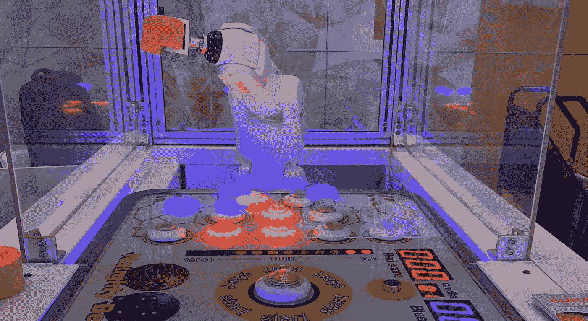
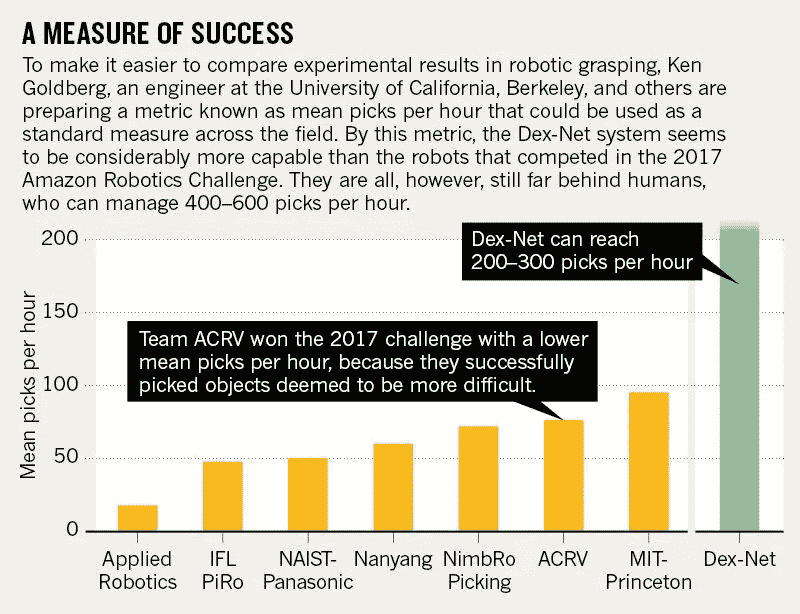
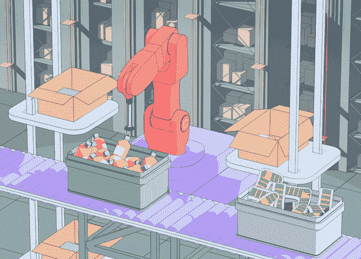
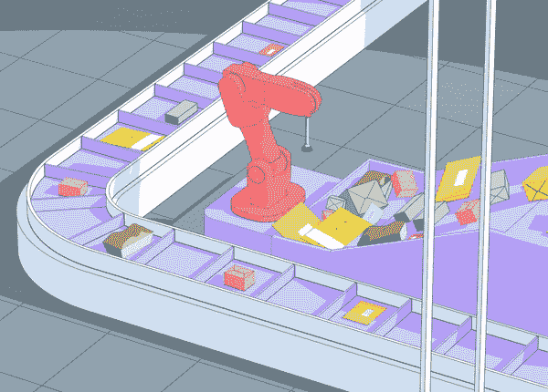
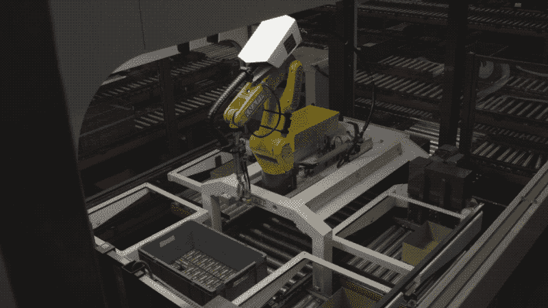
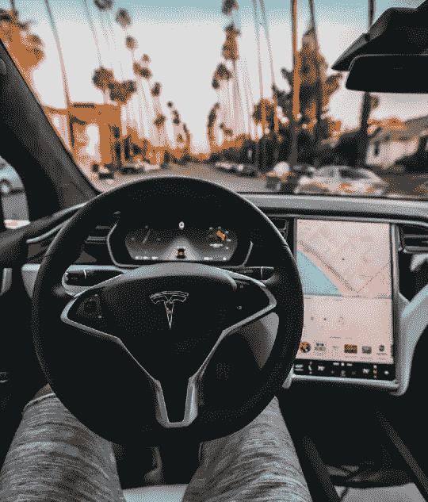
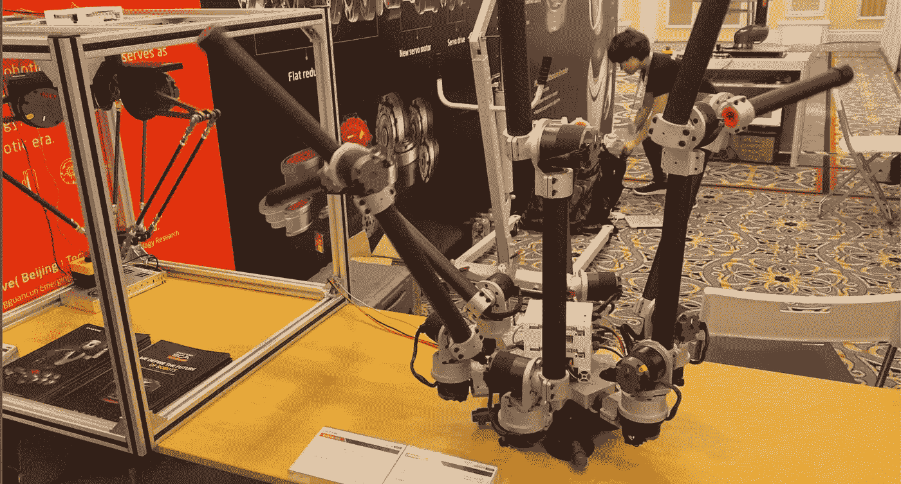

# 机器人已经为现实世界做好了准备

> 原文：<https://towardsdatascience.com/robots-are-ready-for-the-real-world-32808cb1a4eb?source=collection_archive---------34----------------------->

来自加州大学伯克利分校[人工智能研究所](https://bair.berkeley.edu/)的新创业公司 **Covariant.ai** 展示了机器人可以在大型游戏(真实世界)中做到这一点，人工智能社区很高兴看到这一点。他们解决了*泛化*和*鲁棒性*的问题。

那么什么是[co variant . ai](https://covariant.ai/)——一家隐形机器人学习初创公司，它希望将*功能性*机器人*大规模*带到现实世界。这是一个广泛的使命，但迹象表明这是一个准备充分的使命。即将播出的新闻片段只是即将到来的许多成功的第一瞥——团队和机器人才刚刚开始学习。首先是机器人配送，其次是范式转变。

我在机器人会议上的对手。

# 抓住(新)任务

近年来，随着电子商务的主导地位，仓储物流出现了爆炸式增长，自动化需求也随之增长。重复的，看似简单的任务对机器人来说太难代替了。

来源[肯·戈德堡，自然特稿。](https://www.nature.com/articles/d41586-018-05093-1)

抓取任务是机器人研究的一个非常热门的领域。有很多研究小组或多或少地关注于开发可靠的方法来获得新的“区块”为什么机器人还没有取代人类？纵观文献( [1](https://arxiv.org/pdf/1804.05172.pdf) 、 [2](https://mmatl.github.io/files/2019-dexnet4.pdf) 、 [3](https://arxiv.org/pdf/1509.06825.pdf) )，显而易见:

1.  机器人失败的案例太多了。拿起一个新物体的简单动作需要 a)在空间中定位它，b)规划一条路径以在它要去的地方遇到一个物体，以及 c)知道末端的手臂可以拿起它。当环境中的其他变量(如照明、对象位置或温度)发生变化时，角点案例的数量会呈指数增长。*解决*把握会来自于概括。
2.  人类在这方面非常非常擅长。说实话。机器人抓取的最先进技术在他们接受训练的物体上的成功率仍然保持在 80-90%([1](https://arxiv.org/pdf/1804.05172.pdf)、 [2](https://mmatl.github.io/files/2019-dexnet4.pdf) 、 [3](https://arxiv.org/pdf/1509.06825.pdf) )。人们认为人类的错误少一个数量级，因此成功率下限为 99%，或者是机器人每小时挑选次数的两倍多。 [*协变是如何弥合差距的？*](https://www.nature.com/articles/d41586-018-05093-1)

最终，人类可以以极高的速度和可靠性完成这些任务，而机器人在过去十年里一直在努力解决这些问题。令人印象深刻的机器人展示背后的潜在力量是**强化学习**的(巨大)进步。

*免责声明:经过进一步的研究，以及与伯克利研究人员的讨论，结果是 Covariant.ai 推出的产品尚未使用 RL。他们正致力于整合它，但目前它是强大的深度学习。*

来源:[协变的极简网站](https://covariant.ai/)。

协变通过在性能上的巨大飞跃弥合了这一差距(*我想看看这些结果在多大程度上取代了该领域最近的学术基线*)。他们通过 ***行业研究、*** *和* ***尖端科学、实际工程*** 解决的关键问题有:

> 1.谁需要这些机器人让他们去尝试。

Covariant 的新闻稿称，他们花了大约一半的年轻时间询问数百家需要机器人的公司，因此他们选择了物流。是聪明的计划，而不是运气，让他们在以聪明的计划而闻名的德国经销商 Knapp 引起轰动。

> 2.具有通用性和鲁棒性的模型结构。

他们聚集了业内最优秀的人才来解决机器人学习中的通用性和鲁棒性问题。这是大多数研究没有触及的两个领域——学生们选择一个他们想要解决的问题，然后只需要让它工作一次。在两年或更短时间内将一个疯狂的研究生想法变成一个完美的产品并不常见。他们因此获得了领先于时代的产品。

> 3.我们如何把它变成一个产品。

该网站暗示相机的改进，严格的实验室测试，等等。这就是橡胶肉的来源——协变公司的工程师们想出了如何在实验室中惩罚他们的机器人，所以这是现实世界中的 T2 傻瓜证据。这太令人印象深刻了。他们似乎不需要在线学习期(微调模型)或试用期(收集真实数据)。协变机器人出现了，准备改变世界。

来源:[连线篇](https://www.wired.com/story/ai-helps-warehouse-bots-pick-new-skills/) —来自[本视频](https://www.youtube.com/watch?v=ApiQwHlxdmA&t=137s)。

## 机器学习的一大步？

在过去的帖子中，我总是回到当前的人工智能系统如何需要*结构化学习*和*数据特异性*。看看 Covariant 的机器人能多快地完成新任务就知道了。这里有真正的**一般化**吗，或者只是一个独一无二的数据集。如果这些算法可以在许多环境中工作，这将是一个明显的进步，这将在 2020 年初启动一波机器人自动化转型。

就我个人而言，我认为某种更聪明的方法正在推动这一进程走向普遍化。这些结果展示了性能的提升，远远超过了研究论文的增量改进——这通常伴随着方法的彻底改变。有一点是肯定的，物流公司 Knapp 已经感受到了这项技术的好处。纳普的创新副总裁将这些机器人的年轻生命概括为:

> “我们对这个机器人进行了三四个月的测试，它几乎可以处理我们扔给它的任何东西。我们真的要把这些推向市场。我们希望有大量这样的机器。”

## 少数人的团体

迄今为止，在机器人和机器人任务的机器学习方面很少有经济上的成功— *任何带有与世界互动的智能体的东西* —才刚刚开始进入公众的视线。科幻小说中已经预测了几十年的时间，但现实总是不尽如人意。

来源— [罗伯托·尼克森](https://twitter.com/rpnickson)，Pexel。

特斯拉是第一家致力于自动驾驶系统的公司，该系统使用端到端的卷积神经网络进行控制。自动驾驶仪之所以受到如此多的关注(前几个月的 [1](https://www.bloomberg.com/news/features/2019-10-09/tesla-s-autopilot-could-save-the-lives-of-millions-but-it-will-kill-some-people-first) 、 [2](https://www.cbsnews.com/news/three-tesla-autopilot-crashes-kill-three-people-raising-concerns-about-safety/) 、 [3](https://www.industryweek.com/operations/safety/article/21980863/i-just-drove-8-hours-on-tesla-autopilot-and-lived) 、 [4](https://fortune.com/2019/10/02/tesla-autopilot-ai-deepscale/) 、 [5](cnet.com/news/meet-tesla-self-driving-car-computer-and-its-two-ai-brains/) )，是因为它是此类**的第一款**，而且它拥有**高调的**股权。

协变是下一个让机器学习机器人进入现实世界的产品。许多其他创业公司正在研究抓取问题，包括[软机器人](https://www.softroboticsinc.com/)、[影子机器人公司](https://www.shadowrobot.com/)、[双手灵巧机器人](https://www.ambidextrous.ai/)等等。更不用说亚马逊、谷歌和其他科技巨头投入的资金了。

现在我们有了特斯拉和 ***，下一个*** 是谁？促成这一成功的另一个因素是*产品推出的时机*，我不会深入探讨。协变公司在这里抓住了时机，因为自动化正在积极发展，并且[物流对公司来说是一项巨大的成本](https://www.wsj.com/articles/amazon-beats-earnings-estimates-as-shipping-costs-stabilize-11580419032?mod=breakingnews)(亚马逊的股票在盘后交易中上涨了 12%，此前他们降低了物流成本的增长率——是的，成本仍在上升)。

机器人不再需要成为桌面玩具。(图片由作者提供)

我想以机器人研究人员的身份来写，但我可以把主流印象留给媒体。该公司于 1 月 29 日退出黑暗模式，迎来了一系列正面报道——协变出现在[纽约时报](https://www.nytimes.com/2020/01/29/technology/warehouse-robot.html)、 [IEEE Spectrum](https://spectrum.ieee.org/automaton/robotics/industrial-robots/covariant-ai-gigantic-neural-network-to-automate-warehouse-picking) 、 [The Verge](https://www.theverge.com/2020/1/29/21083313/robot-picking-warehouses-logistics-ai-covariant-stealth) 、 [Wired](https://www.wired.com/story/ai-helps-warehouse-bots-pick-new-skills/) 、[麻省理工科技评论](https://www.technologyreview.com/s/615109/ai-powered-robot-warehouse-pickers-are-now-ready-to-go-to-work/)和[华尔街日报](https://www.wsj.com/articles/smarter-delivery-hinges-on-smarter-robots-11580288408)中。

 [## 面向真实世界的人工智能机器人

### “人工智能机器人技术正迅速与每一个仓库运营相关联，并对 KNAPP 的战略至关重要……

协变. ai](https://covariant.ai/) 

尽管如此，该公司目前不太可能需要更多资金，因为它得到了一个大胆的机器学习创始人名单的支持(来自《连线》的文章):杰弗里·辛顿和扬·勒村(深度学习的联合创始人)[、杰夫·迪恩](https://www.wired.com/story/googles-new-ai-head-is-so-smart-he-doesnt-need-ai/)(谷歌人工智能负责人)[费-李非](https://www.wired.com/story/fei-fei-li-artificial-intelligence-humanity/)和[丹妮拉·鲁斯](https://www.csail.mit.edu/person/daniela-rus)(分别是斯坦福大学和麻省理工学院人工智能研究部门的负责人)。

***我和他们在一起*。我迫不及待地想看看协变和人工智能社区的下一步。**

我去本德旅行的照片。