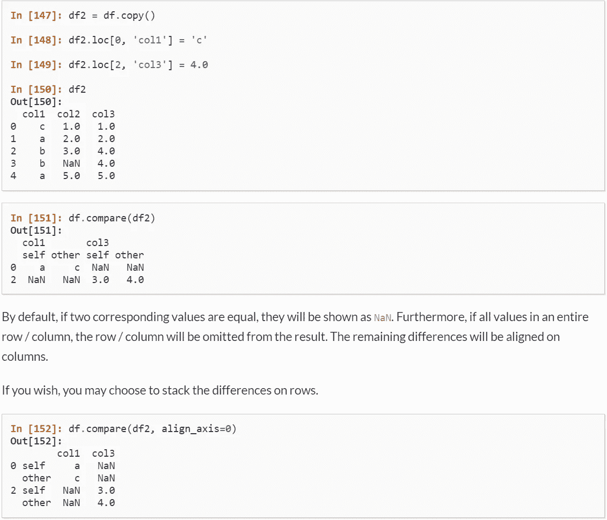

# 使用 Pandas 1.1.0 进行可靠的 2 数据帧验证

> 原文：<https://towardsdatascience.com/robust-2-dataframes-verification-with-pandas-1-1-0-af22f328e622?source=collection_archive---------48----------------------->

## 使用最近添加的 DataFrame.compare()进行可靠的资格检查。

库纳尔·卡拉在 [Unsplash](https://unsplash.com?utm_source=medium&utm_medium=referral) 上拍摄的照片

Pandas 是数据科学家和数据工程师最常用的 Python 库之一。今天，我想分享一些 Python 技巧来帮助我们在两个数据帧之间进行**资格**检查。

注意，我用了这个词:**资格**，而不是完全相同。相同很容易检查，但是**资格**是一个松散的检查。它是基于商业逻辑的。因此，更难实现。

# 不是重新发明轮子

在 1.1.0 版本中——发布于 2020 年 7 月 28 日，8 天前——Pandas 引入了内置的 [**比较**功能](https://pandas.pydata.org/pandas-docs/stable/user_guide/merging.html)。我们接下来的所有步骤都是基于它构建的。

用于比较的官方文档截图

**提示**:如果您正在使用 Anacondas 发行版，您应该使用下面的命令行来升级您的 Pandas 版本。

# 低垂的果实

总是先检查两帧之间的列数。在某些情况下，这种简单的检查可以发现问题。

在某些情况下，如浓缩变化，我们可以有不同数量的列。合格的定义可以是:对于在 2 个数据帧之间具有相同值的所有前面的列。因此，我们将确定要检查的列，并将它们保存在变量**列**中，以备后用。

# 开锁的钥匙

在实际应用中，我们会有不同的 id 来标识一个记录，比如 user-id、order_id 等。为了进行唯一的查询，我们可能需要使用这些键的组合。**最终，我们希望验证具有相同关键字的记录具有相同的列值。**

第一步是编写组合键。这就是数据框架**应用**的亮点所在。我们可以使用 df.apply(lambda: x: func(x)， **axis = 1** )进行任何数据转换。在**轴= 1** 的情况下，我们告诉熊猫一排排做同样的操作**。(轴= 0，逐列)**

# 处理值错误

对于新的 DataFrame.compare 函数，下面的错误是最令人困惑的。让我解释一下。

> **值错误**:只能比较标签相同的 DataFrame 对象

出现此错误的原因是两个数据框之间的列的形状和顺序不相同。是的。DataFrame.compare 仅适用于相同检查，不适用于资格检查。

解决问题的方法是:使用之前创建的 **keyColumn** ，比较具有相同 keyColumn 值的数据帧之间的子集。对每个 keyColumn 值都这样做。

如果两个数据框架中键列的尺寸不同，则提出问题并跳过检查。

# 带走:

使用最新的 Pandas 1.1.0 DataFrame.compare 进行可靠的 DataFrame 资格检查。为了处理 ValueError，我们使用 keyColumn 进行多个子数据帧检查，并返回最终决定。