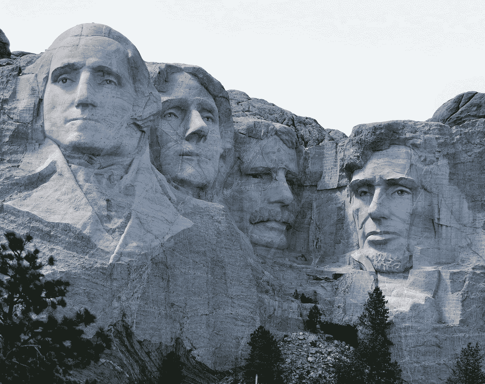
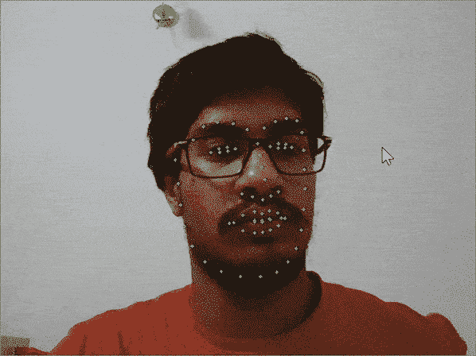
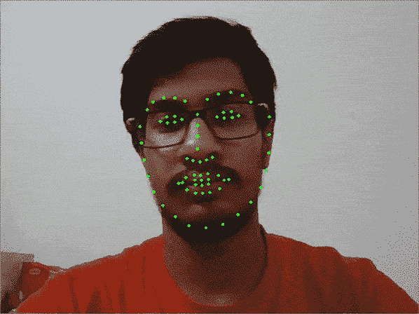

# 遮挡倾斜人脸的面部标志检测

> 原文：<https://towardsdatascience.com/robust-facial-landmarks-for-occluded-angled-faces-925e465cbf2e?source=collection_archive---------11----------------------->

## Dlib 提供了一个很好的面部标志检测器，但是当面部处于陡峭的角度时，它不能很好地工作。了解如何使用一个可以？



照片由[特伦斯伯克](https://unsplash.com/@ancientwanderer?utm_source=medium&utm_medium=referral)在 [Unsplash](https://unsplash.com?utm_source=medium&utm_medium=referral) 拍摄

面部标志检测或面部关键点检测在计算机视觉中有很多用途，例如面部对齐、睡意检测、Snapchat 过滤器等等。这项任务最广为人知的模型是 Dlib 的 68 关键点界标预测器，它能实时给出非常好的结果。但当人脸被遮挡或与相机成一定角度时，问题就开始了。获得精确的角度结果对于头部姿态估计等任务至关重要。所以在这篇文章中，我将介绍一个鲜为人知的 Tensorflow 模型，它可以实现这一使命。

# Dlib 的问题

## 装置

现在，这只是因为我想找到缺点，但本质上，在 Windows 中安装 Dlib 有点困难，需要安装 Cmake 和其他一些应用程序来完成。如果您正在使用 Anaconda 并尝试使用 conda install，那么 Windows 的版本也是过时的，不支持 Python>3.5。如果你使用任何其他操作系统，那么你会没事。

## 倾斜的面孔

我不写错了什么，直接给你看。



Dlib 的结果

好了，诽谤 Dlib 已经够了，让我们来看看真正的东西。

# 要求

我们将需要 Tensorflow 2 和 OpenCV 来完成这项任务。

```
# pip install
pip install tensorflow
pip install opencv# conda install
conda install -c conda-forge tensorflow
conda install -c conda-forge opencv
```

# 人脸检测

我们的第一步是在图像中找到面部标志。对于这个任务，我们将使用 OpenCV 的 DNN 模块的 Caffe 模型。如果你想知道它与其他模型如 Haar Cascades 或 Dlib 的正面人脸检测器相比表现如何，或者你想深入了解它，那么你可以参考这篇文章:

[](/face-detection-models-which-to-use-and-why-d263e82c302c) [## 人脸检测模型:使用哪种模型，为什么？

### 一个关于用 Python 实现不同人脸检测模型的完整教程，通过比较，找出最好的…

towardsdatascience.com](/face-detection-models-which-to-use-and-why-d263e82c302c) 

你可以从我的 GitHub [库](https://github.com/vardanagarwal/Proctoring-AI/tree/master/models)下载需要的模型。

```
import cv2
import numpy as npmodelFile = "models/res10_300x300_ssd_iter_140000.caffemodel"
configFile = "models/deploy.prototxt.txt"
net = cv2.dnn.readNetFromCaffe(configFile, modelFile)
img = cv2.imread('test.jpg')
h, w = img.shape[:2]
blob = cv2.dnn.blobFromImage(cv2.resize(img, (300, 300)), 1.0,
(300, 300), (104.0, 117.0, 123.0))
net.setInput(blob)
faces = net.forward()#to draw faces on image
for i in range(faces.shape[2]):
        confidence = faces[0, 0, i, 2]
        if confidence > 0.5:
            box = faces[0, 0, i, 3:7] * np.array([w, h, w, h])
            (x, y, x1, y1) = box.astype("int")
            cv2.rectangle(img, (x, y), (x1, y1), (0, 0, 255), 2)
```

使用`cv2.dnn.readNetFromCaffe`加载网络，并将模型的层和权重作为参数传递。它在大小调整为 300x300 的图像上表现最佳。

# 面部标志检测

我们将在这个 Github [repo](https://github.com/yinguobing/cnn-facial-landmark) 中使用尹提供的面部标志检测器。它还提供了 68 个地标，这是一个在 5 个数据集上训练的 Tensorflow CNN！预先训练好的模型可以在这里[找到。作者还写了一系列解释背景、数据集、预处理、模型架构、训练和部署的帖子，可以在](https://github.com/vardanagarwal/Proctoring-AI/tree/master/models)[这里](https://yinguobing.com/facial-landmark-localization-by-deep-learning-background/)找到。我在这里提供了他们的概要，但是我强烈建议你去读一读。

在第一个系列中，他描述了视频中面部标志的稳定性问题，然后列出了现有的解决方案，如 OpenFace 和 Dlib 的面部标志检测以及可用的数据集。第三篇文章是关于数据预处理和准备使用的。在接下来的两篇文章中，工作是提取人脸并在其上应用面部标志，以使其准备好训练 CNN 并将它们存储为 TFRecord 文件。在第六篇文章中，使用 Tensorflow 训练了一个模型。在最后一篇文章中，模型被导出为 API，并展示了如何在 Python 中使用它。

我们需要从图像中提取的作为感兴趣区域的人脸坐标。然后，它被转换为大小为 128x128 的正方形，并被传递给模型，该模型返回 68 个关键点，然后这些关键点可以被归一化为原始图像的尺寸。



张量流模型的结果

本作品使用的完整代码:

现在，你知道它可以很好地表现侧面，它可以用来做一个头部姿态估计器。如果你想做你可以参考这篇文章:

[](/real-time-head-pose-estimation-in-python-e52db1bc606a) [## Python 中的实时头部姿态估计

### 使用 Python 和 OpenCV 创建一个头部姿态估计器，它可以告诉你头部朝向的角度

towardsdatascience.com](/real-time-head-pose-estimation-in-python-e52db1bc606a) 

# 速度

Dlib 的主要卖点之一是它的速度。让我们看看它们在我的 i5 处理器上是如何比较的(是的😔).

*   Dlib 给出大约 11.5 FPS，并且界标预测步骤花费大约 0.005 秒。
*   张量流模型给出大约 7.2 FPS，并且界标预测步骤花费大约 0.05 秒。

因此，如果速度是主要关注点，并且遮挡或倾斜的人脸不太多，那么 Dlib 可能更适合你，否则我觉得张量流模型占主导地位，而不会在速度上有太大的妥协。

你可以在 GitHub 上的这里找到面部检测和地标检测的正确记录的代码，我曾试图在这里为在线监督制作一个人工智能。