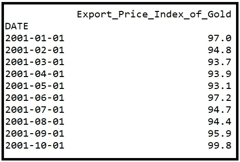
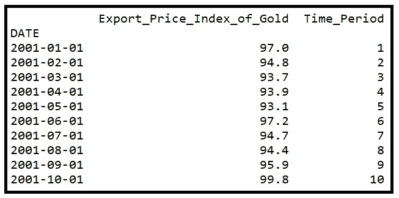
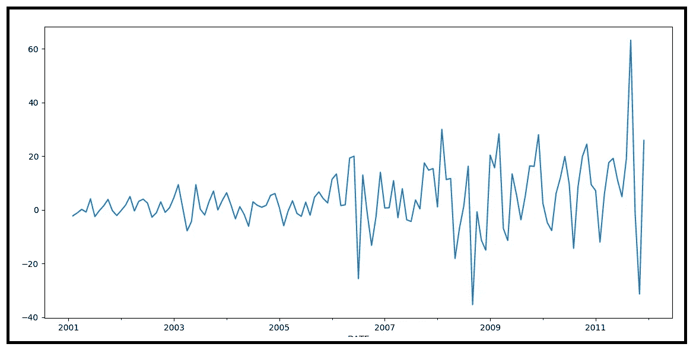
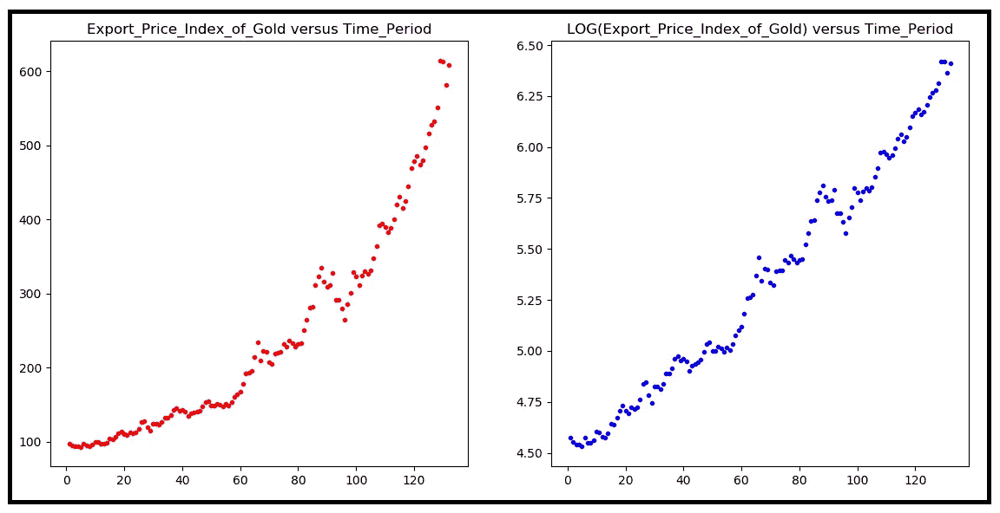
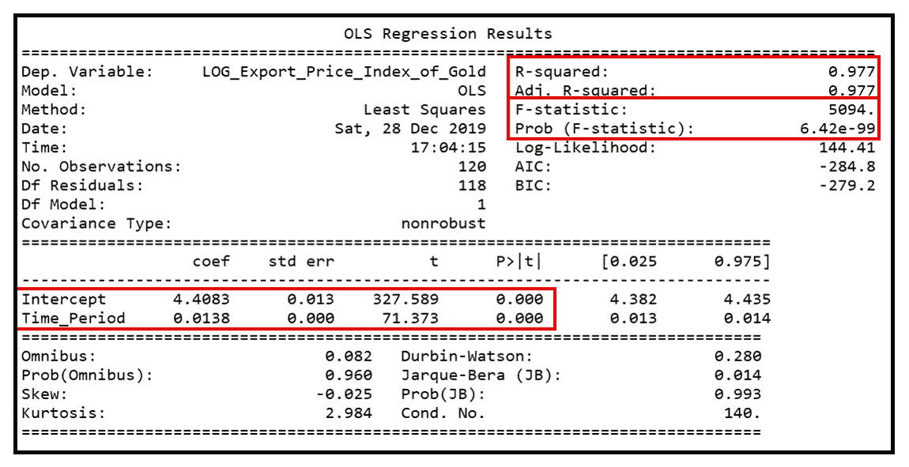
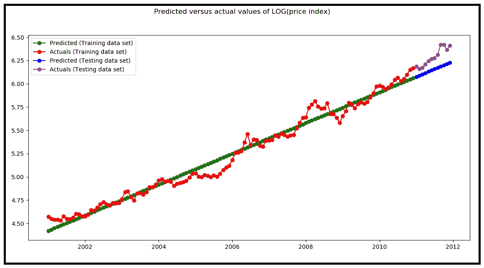
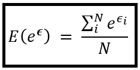
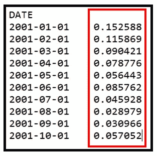
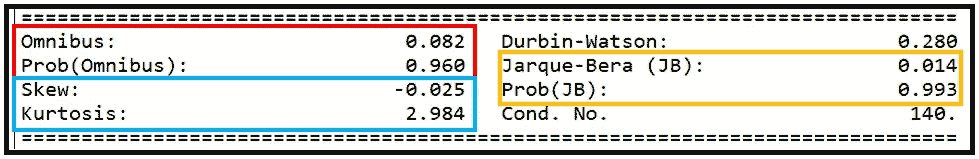
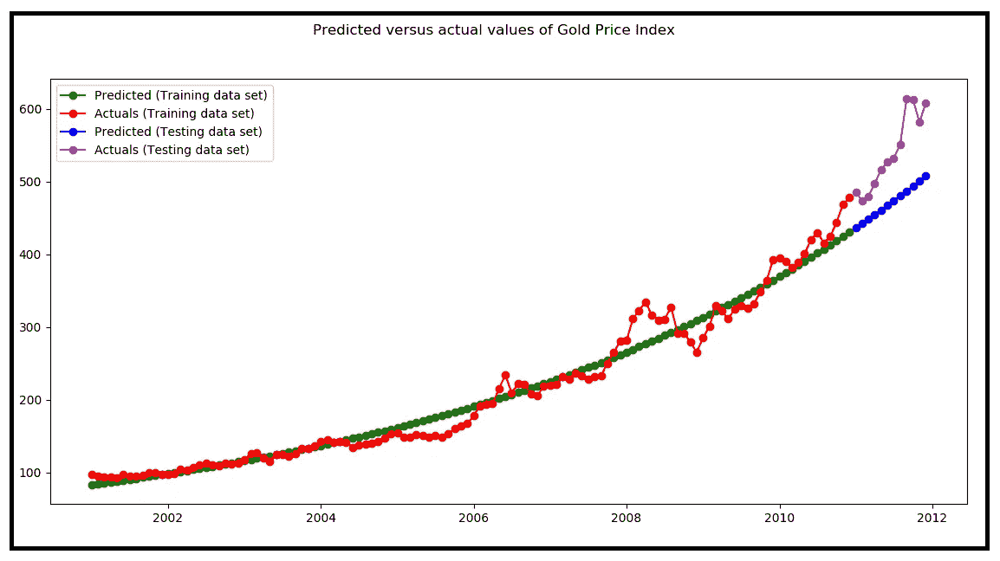

# 非线性异方差数据的稳健线性回归模型

> 原文：<https://towardsdatascience.com/robust-linear-regression-models-for-nonlinear-heteroscedastic-data-14b1a87c1952?source=collection_archive---------8----------------------->


图片由来自 [Pixabay](https://pixabay.com/?utm_source=link-attribution&utm_medium=referral&utm_campaign=image&utm_content=4158911) 的 [Pixabay 许可](https://pixabay.com/service/license/)的[诺贝特·瓦尔德豪森](https://pixabay.com/users/waldnob-9842518/?utm_source=link-attribution&utm_medium=referral&utm_campaign=image&utm_content=4158911)拍摄

## Python 的分步教程

我们将讨论以下内容:

1.  **线性回归模型假设的简要概述**，其中包括关系的线性和同方差(即恒定方差)残差。
2.  **逐步指导**将回归线性模型拟合到*真实世界*数据，而**真实世界数据通常是非线性且非均方的**。
3.  **段涂抹估计量介绍:**减少预测误差的必要工具。
4.  **一个基于 Python 的教程:**一直以来，我们将使用来自美国 FRED 的*黄金出口价格指数*的真实世界数据集，我们将使用 ***Python、Pandas、Numpy、Patsy 和 Statsmodels*** 详细说明每个步骤。

*这篇文章有一种“边学边写”的风格。*

我将从第一点的一点理论开始，然后我们将直接进入第二到第四点的动手部分。

## 线性回归模型的假设

线性回归模型，如线性回归模型，如线性回归模型，对线性关系的建模非常有效。它们的运行特性已经被很好地理解，并且它们得到了数十年研究的支持，导致了可解释的、可辩护的和高度可用的结果。

线性回归模型有几个假设，即:

*   **线性:**因变量和解释变量之间的关系被假定为线性的，即可以用下面的等式来表示:
    **y**=***β*********x****+****ϵ*** 其中 ***y*** 是因变量向量 ***β*** 是(**常值**)回归系数的向量，***【ϵ】***是误差项的向量，即*y***【x***无法解释的部分。*
*   ***独立同分布残差:**回归模型的残差***【ϵ】***被假设为 **i** 相互独立(即残差之间没有相关性)并且**I**I**d**同分布。此外，我们更喜欢(但不要求)残差是正态分布的。*
*   ***同方差残差:**残差中的方差被假定为常数，特别是方差应该**而不是**是因变量*(或解释变量***×时间*** )的函数，或者是时间的函数(在时间序列数据的情况下)。**

****在真实世界的数据集中，数据通常是非线性的和异方差的(即非异方差的)。模型的残差也可能不是完全同分布或正态分布的。****

**在本文中，我们将了解如何将线性模型拟合到数据中，尽管存在这些实际障碍。**

**让我们开始吧。**

## **真实世界的数据集**

**我们将使用以下黄金价格指数数据集([此处可用](https://gist.github.com/sachinsdate/c2a92fd009c62fee9364c835aff7e2f0)):**

**[*出口价格指数(最终用途):非货币黄金*](https://fred.stlouisfed.org/series/IQ12260#0) *(来源:美国弗雷德)***

## **步骤 1:加载数据集**

**让我们将数据加载到一个*熊猫数据框架*中:**

```
**import pandas as pdimport numpy as npfrom matplotlib import pyplot as pltdf = pd.read_csv('monthly_gold_price_index_fred.csv', header=0, infer_datetime_format=True, parse_dates=[0], index_col=[0])print(df.head(10))**
```

**以下是前 10 行:**

****

**(图片由[作者](https://sachin-date.medium.com/))**

**我们将添加一个名为***Time _ Period****的新列，其取值范围为 1 到 132。***

```
***df['Time_Period'] = range(1, len(df)+1)***
```

***打印前 10 行:***

```
***print(df.head(10))***
```

******

***(图片由[作者](https://sachin-date.medium.com/)提供)***

## ***步骤 2:检查数据***

***绘制因变量*出口价格黄金指数*与*时间段*的关系图:***

```
****#Create a new pyplot figure to plot into** fig = plt.figure()**#Set the title of the plot** fig.suptitle('Export Price Index of Gold')**#Set the X and Y axis labels** plt.xlabel('Time Period')
plt.ylabel('Price Index')**#plot the time series and store the plot in the *actual* variable. We'll need that later for the legend.** actual, = plt.plot(df['Time_Period'], df['Export_Price_Index_of_Gold'], 'bo-', label='Gold Price Index')**#Set up the legend. There is only one time series in the legend.** plt.legend(handles=[actual])**#Show everything** plt.show()**
```

**剧情是这样的:**

****

**从 2001 年 1 月到 2011 年 12 月连续 132 个月的黄金出口价格指数(*来源:* [*美国弗雷德*](https://fred.stlouisfed.org/series/IQ12260#0) *)* (图片由[作者](https://sachin-date.medium.com/)**

***价格数据显示* ***异方差*** *即非常数方差，以及* ***非线性增长*** *。***

**为了确认异方差性，让我们绘制*出口价格黄金指数*相对于*时间段*的第一个差值:**

```
****#create a time lagged column** df['LAGGED_Export_Price_Index_of_Gold'] = df['Export_Price_Index_of_Gold'].shift(1)**#Do a diff between the Export_Price_Index_of_Gold column and the time lagged version** df['DIFF_Export_Price_Index_of_Gold'] = df['Export_Price_Index_of_Gold']-df['LAGGED_Export_Price_Index_of_Gold']**#Plot the diff column using Series.plot()** df['DIFF_Export_Price_Index_of_Gold'].plot()**#Display the plot** plt.show()**
```

**这是一阶差分图，显示方差随时间增加:**

****

**显示异方差的出口价格指数的第一个差异(图片由[作者](https://sachin-date.medium.com/)提供)**

## **第三步:消除非线性**

**我们将首先处理数据中的非线性。**

***取因变量的* ***对数*** *或* ***平方根*** *具有使数据线性的效果，同时减弱其中的异方差。***

**我们将使用出口价格指数的自然对数，因为对数函数比平方根函数增长得更慢，所以它的转换效果比平方根更强。**

**在使用这两种变换(对数和平方根)时，我们也应该记住它们的缺点。**

## ****对数和平方根变换的缺点:****

*   ****负值:**两种变换都产生负 *y* 值的未定义值。数据集的负部分需要以不同的方式处理，例如通过两部分模式。**
*   ****零值:**对于 y=0，对数变换未定义。这可以通过在每个 *y* 值上增加一个微小的正值来解决，代价是引入一个偏差。更好的方法是使用两部分模型，其中逻辑回归模型学习区分零数据和非零数据，而 OLSR 模型适用于正值数据的对数转换 y。另一种方法是使用一个可以容许零值的 **G** 一般化 **L** 线性 **M** 模型(GLM)。**

***对数和平方根转换最适用于正值数据。***

**还有其他转换可供选择，例如双指数数据的双对数转换。**

**那么，为您的数据选择哪种正确的变换(也称为标度)呢？**

***对数变换的基本假设是原始数据呈现指数趋势。使用平方根变换，您假设原始数据呈现幂趋势。***

**在他们的书“广义线性模型”中，McCullagh 和 Nelder 先生提供了一条关于选择正确变换的简洁建议，我将解释如下:**

> **一个好的数据转换函数应该能够实现以下三个目标:**
> 
> **它使方差或多或少地保持恒定，即它减弱了数据中的异方差。**
> 
> **它使得模型的残差几乎呈正态分布。**
> 
> **它确保了线性模型的解释变量和因变量之间的线性加性关系。**

**让我们继续进行对数变换的变换练习。**

**让我们向名为*LOG _ Export _ Price _ Index _ of _ Gold*的数据框添加一个新列，其中包含。我们将使用 *numpy.log()* 来完成这项工作。**

```
**df['LOG_Export_Price_Index_of_Gold'] = np.log(df['Export_Price_Index_of_Gold'])**
```

**原始变量和记录变量的并排比较揭示了对数变换已经使时间序列线性化:**

```
****#Create a (2 x 1) grid of subplots**
ax = plt.subplot(1, 2, 1)**#Set the title of the first sub-plot**
ax.set_title('Export_Price_Index_of_Gold versus Time_Period', fontdict={'fontsize': 12})**#Plot the RAW scale plot**
plt.scatter(x=df['Time_Period'].values, y=df['Export_Price_Index_of_Gold'].values, color='r', marker='.')**#Setup the second subplot**
ax = plt.subplot(1, 2, 2)ax.set_title('LOG(Export_Price_Index_of_Gold) versus Time_Period', fontdict={'fontsize': 12})**#Plot the LOG scale plot**
plt.scatter(x=df['Time_Period'].values, y=df['LOG_Export_Price_Index_of_Gold'].values, color='b', marker='.')**#Display both subplots**
plt.show()**
```

****

**黄金价格指数原始比例图和对数比例图的比较(图片由[作者](https://sachin-date.medium.com/)提供)**

## **步骤 4:将线性回归模型拟合到经过对数变换的数据集**

**由于*log(****y****)*相对于 *Time_Period* 是线性的，我们将使用以下线性回归方程来拟合*log(****y****)*的 OLS 回归模型:**

*****log(Export _ Price _ Index _ of _ Gold)*******β_ 0****+****β_ 1*********Time _ Period******

*其中，***β_ 0****&****β_ 1***分别为回归截距和回归系数。*

*导入回归包:*

```
***import** statsmodels.api **as** sm
**import** statsmodels.formula.api **as** smf
**from** patsy **import** dmatrices*
```

*在 [patsy 语法](https://patsy.readthedocs.io/en/latest/quickstart.html)中形成模型表达式。我们告诉 Patsy*黄金的 LOG _ Export _ Price _ Index _ of _ Gold*依赖于 *Time_Period* 。Patsy 将自动包含截距 *β_0* :*

```
*expr = 'LOG_Export_Price_Index_of_Gold ~ Time_Period'*
```

*创建训练集和测试集:*

```
***#We'll train the model on the first 120 time periods i.e. 120 months of data and we'll test its predictions on the last 12 time periods i.e. 12 months** split_index = 119**#Get the indexed date at the split position** split_date = df.index[split_index]**#time periods 0 to 119 is the training set** df_train = df.loc[df.index <= split_date].copy()**#time periods 120 to 131 is the testing set** df_test = df.loc[df.index > split_date].copy()**print**('Model will train on the first ' + str(len(df_train)) + ' months and make predictions for the final ' + str(len(df_test)) + ' months.')*
```

**我特意选择了最后 12 个时间段作为维持(测试)集。如果你仔细观察黄金价格指数图，你会发现在过去的 10-20 个时间段内，数据变得更加非线性，从预测的角度来看，这个区域对于线性模型来说尤其具有挑战性。**

*让我们在训练集上建立并训练一个普通的最小二乘回归(OLSR)模型:*

```
*olsr_results = smf.ols(expr, df_train).fit()*
```

*打印培训总结:*

```
*print(olsr_results.summary())*
```

**

*OLSR 模式总结(图片由[作者](https://sachin-date.medium.com/)*

*让我们检查模型的性能:*

***R 平方:**该模型能够解释 log(y)中 97.7%的方差，这是一个非常好的拟合。*

*[**F 统计量**](/fisher-test-for-regression-analysis-1e1687867259)**:**6.42 e-99 的 p 值小得令人难以置信——远小于一个连 0.1% (0.001)都没有的临界值。因此，我们**拒绝 f 检验的零假设**，即模型不比仅截距模型好，并且**我们接受 f 检验的替代假设**，即模型的系数联合显著。*

***模型系数的显著性:**模型系数的 p 值表明它们分别*具有统计显著性*。*

*总体而言，该模型似乎在训练数据集上实现了高拟合优度。*

*让我们获取模型对训练集和测试集的预测。*

**注意，我们是预测 log(***)，而不是 raw***。****

```
****#Predict log(y) on the training data set**
olsr_predictions_training_set = olsr_results.predict(df_train['Time_Period'])**#Predict log(y) on the testing data set**
olsr_predictions_testing_set = olsr_results.predict(df_test['Time_Period'])**
```

**在对数标度上绘制预测值和实际值:**

```
****#Create the pyplot figure for plotting**
fig = plt.figure()fig.suptitle('Predicted versus actual values of LOG(price index)')**#Plot the log-scale PREDICTIONS for the training data set**
predicted_training_set, = plt.plot(df_train.index, olsr_predictions_training_set, 'go-', label='Predicted (Training data set)')**#Plot the log-scale ACTUALS fpr the training data set**
actual_training_set, = plt.plot(df_train.index, df_train['LOG_Export_Price_Index_of_Gold'], 'ro-', label='Actuals (Training data set)')**#Plot the log-scale PREDICTIONS for the testing data set**
predicted_testing_set, = plt.plot(df_test.index, olsr_predictions_testing_set, 'bo-', label='Predicted (Testing data set)')**#Plot the log-scale ACTUALS for the testing data set**
actual_testing_set, = plt.plot(df_test.index, df_test['LOG_Export_Price_Index_of_Gold'], 'mo-', label='Actuals (Testing data set)')**#Set up the legends**
plt.legend(handles=[predicted_training_set, actual_training_set, predicted_testing_set, actual_testing_set])**#Display everything**
plt.show()**
```

****

**训练和测试数据集上***【y】***的预测值与实际值(图片由[作者](https://sachin-date.medium.com/)提供)**

## **步骤 5:将模型的预测从对数比例转换回原始比例**

**这是一个需要小心的地方。我们的本能可能是简单地将对数标度预测指数化回原始标度 ***y*** 。**

**但是我们的直觉是错误的。让我们看看这是为什么。**

***如果你喜欢，你可以跳过下面的一点点数学，向下滚动到段的涂抹估计器* *的章节。***

***log(****y****)*对 ***X*** 的条件期望通过以下线性方程与拟合模型的预测相关:**

***e(log(****y****)|****x****)=****β_ fitted*********x****+**…(1)***

***其中:***

*   ****E(log(****y****)|****X****)*是*log(****y****)*即*y*的值*****
*   ****β_fitted*** 是训练模型系数的向量，包括截距的占位符。*
*   ****X*** 是回归变量的矩阵+一列为回归截距。*
*   **ϵ* 是拟合模型的残差向量。***ϵ=predictions****减去* ***实际值****

*为了将预测转换回原始比例，我们对等式(1)的两边取幂:*

*exp(*e(log(****y****)|****x****)= exp(****β_ fitted*********x****+**

*我们要的是**不是**exp(*E(log(****y****)|****X****)。*相反我们要的是*E(exp(log(****y****)|****X****))。注意这两者之间微妙但重要的区别。**

*因此，我们将 *E()* 运算符应用于等式(2)的两边:*

**e(exp(e(log(****y****)|****x****))= e(exp(****β_ fitted*********x**+****【ϵ******

*经过一些简化后，它变成了:*

**e(****y****|****x****)= e(exp(****β_ fitted********x)***【t90)**

**这最终简化为:**

***e(****y****)|****x****)= exp(****β_ fitted*********x*)***** e****

**其中:**

*   ***E(****X****)|****y****)*是原始标度中的条件期望。正是我们想要的*。***
*   ***exp(****β_ fitted*********X*)**是模型的对数标度预测，取幂后转换为原始标度。**
*   ***e(exp(***)*是模型的对数标度模型残差的期望值，在取幂以便将它们转换成原始标度之后。***

## **段涂抹估计量**

**总之，为了正确地将模型预测从对数标度重新转换回原始标度，我们需要执行以下操作:**

1.  **对回归模型的预测求幂，**
2.  **将指数化预测乘以指数化对数标度误差的期望值，即*e(exp(****【ϵ****))。***

> **指数化残差的期望 e(**)**)称为段涂抹估计量，也称为涂抹因子。**

***E 的值(exp(****ϵ****)*取决于*对数标度*残差**、* 的分布如下:***

****情况一:对数尺度残差 *ϵ* 正态分布:**t35】如果 ***ϵ*** ~ *N(0，σ )* 即 ***ϵ*** 正态分布，均值=0，方差 *σ，*则涂抹因子 *E(exp()这就是 *N(0，σ )* 的一阶矩，即。 *exp(0 + 0.5σ ) = exp(0.5σ )****

***情况二:对数尺度残差 *ϵ* 同分布但不正态分布:** 如果对数尺度残差是**I**n 独立，**I**d 同分布随机变量但不是 *N(，σ )* ，则需要找出它们的分布并然后我们取该分布的一阶矩来得到涂抹因子的值*e(exp(****【ϵ****)*。*

***情况 3:对数尺度残差分布未知:** 在这种情况下:*

**

*(图片由[作者](https://sachin-date.medium.com/))*

*其中 *ϵ_i* =第 I 个样本的误差，*n*=样本数。*

*从上述三个案例中，我们可以看出:*

> *当误差分布较大时，即方差 *σ* 较大时，涂抹因子较大，或者在情况#3 中，涂抹因子的值较大。*

*让我们为我们的例子计算涂抹因子。*

## *步骤 5A:计算段的拖尾因子*

*让我们看看残差是否是正态分布的(上面的情况 1)。*

*我们的对数标度模型的残差存储在`olsr_results.resid`中。下面是最上面的几行:*

**

*OLSR 的残差(图片由[作者](https://sachin-date.medium.com/)提供)*

*为了知道误差是否正态分布，我们将关注 OLSR 模型输出底部的 4 个证据:*

**

*OLSR 模型剩余误差的特性(图片由[作者](https://sachin-date.medium.com/)提供)*

***偏斜度:**残差的偏斜度(-0.025)几乎为零。相比之下，正态分布的偏斜度为零。*

***峰度:**残差的峰度(2.984)几乎等于 3.0。正态分布的峰度是 3.0。*

***正态性的综合 K 检验:**综合检验极高的 p 值(0.96)使我们接受了检验的零假设，即残差呈正态分布。*

***Jarque-Bera 正态性检验:**JB 检验极高的 p 值(0.993)再次验证了 JB 检验的残差正态分布的零假设。*

***所有证据表明残差呈正态分布。***

*这一结论也从视觉上得到证实:*

```
*plt.hist(olsr_results.resid, bins=20)
plt.show()*
```

**

*残差直方图(图片由[作者](https://sachin-date.medium.com/)提供)*

*让我们使用`pandas.core.series.Series`对象的 *mean()* 和 *var()* 函数打印出残差的均值和方差 *σ* :*

```
*print('Mean of residual errors='+str(olsr_results.resid.mean()))
print('Variance of residual errors='+str(olsr_results.resid.var()))Mean of residual errors=-3.841371665203042e-15
Variance of residual errors=0.005319971501418866*
```

*我们可以看到，平均值实际上是零。这完全可以从 OLSR 模型中预料到。方差为 0.00532。*

*由于我们已经证明残差是 *N(0，σ )* 分布，根据**情形#1** ，段的涂抹因子为:*

```
**E(exp(****ϵ****)) = exp(0.5σ²) = exp(0.5**0.00532) = **1.00266***
```

*我们的抹黑因素到位了。我们准备好使用它了吗？还没有。我们还需要检查最后一件事:*

*残差是齐次的吗？*

## *步骤 5B:检查残差是否是同方差的*

**如果残差***不是异方差的，即它们是异方差的，则段的涂抹因子产生有偏的结果。***

**当 ***ϵ*** 为异方差时，*方差(****ϵ****)*不是常数。事实上*方差(***)*可以是模型的解释变量***×t58】的函数。在我们的例子中，***X****=****Time _ Period*********

*例如，如果**为 N( 0，σ(****x****)*分布，即残差服从零均值正态分布，并且有一个方差函数:*【σ(****x****)*，那么根据前面提到的**案例#1** :**

***涂抹因子= e(exp(****)ϵ****)= exp(0.5 *σ(****x****)***

***当回归模型的残差在对数尺度上是异方差时，为了计算涂抹因子，我们需要知道如何计算方差函数σ (X)。***

**然而在实践中，计算方差函数*σ(****X****)*可能不是一件容易的事情。**

**当残差在对数尺度上是异方差的时，通常最好执行以下操作:**

## **处理异方差残差的方法**

*   **验证通货膨胀和季节性的影响已经通过通货膨胀调整和季节性调整被抵消。这与货币数据尤其相关。**
*   **检查模型中是否缺少任何重要的解释变量，并将它们添加进来。**
*   **代替使用原始残差*，使用 ***异方差调整残差*** (也称为“白化”残差)来计算段的涂抹估计量 ***。*** *Statsmodels* 通过变量`RegressionResults.wresid`使白化残差在回归模型的训练输出中可用。***
*   **切换到 a **G** 通用 **L** 线性 **M** 模式( **GLM** )。GLM 假设*方差*是*均值*的函数，而*均值*本身是解释变量 ***X*** 的函数。**
*   **切换到一个 **W** 八个 **L** 东 **S** 方( **WSS** )或一个 **G** 一般化 **L** 东 S 方( **GLS** )模型，该模型不假设方差是同质的。**
*   **最后，如果残差中的异方差很小，并且你的 **OLSR** 模型在其他方面表现良好，**就照原样接受你的 OLSR 模型吧！****

**让我们测试一下我们的模型的残差是否是同方差的。如果是，我们是清白的，否则我们应该考虑上述 4 个补救措施之一。**

**Statsmodels 包含一个异方差的**怀特测试的实现，它可以很容易地应用于我们的残差，如下所示:****

```
****#Using patsy, pull out the *X* matrix containing the Time_Period and the intercept columns from the pandas Data Frame.**expr = 'LOG_Export_Price_Index_of_Gold ~ Time_Period'y_train, X_train = dmatrices(expr, df_train, return_type='dataframe')**
```

**导入测试包并运行 White 的测试:**

```
**from statsmodels.stats.diagnostic import **het_white****from** statsmodels.compat **import** lzipkeys = ['**Lagrange Multiplier statistic:**', '**LM test\'s p-value:**', '**F-statistic:**', '**F-test\'s p-value:**']test = **het_white**(olsr_results.resid, X_train)lzip(keys, test)**
```

**这将打印出以下输出:**

```
**[('**Lagrange Multiplier statistic:**', 3.2148975951052883), 
 ("**LM test's p-value:**", 0.20039821889655918), 
 ('**F-statistic:**', 1.610406682366166), 
 ("**F-test's p-value:**", 0.2042032693339592)]**
```

****LM 检验:**LM 检验的统计量遵循卡方分布，自由度=模型-1 的 DF =(3–1)= 2。p 值 0.2 使我们**接受检验的零假设，即残差中没有异方差**。**

**f 检验:f 检验的统计量遵循 f 分布。同样，0.204 的高 p 值**证实了检验的零假设**，即残差中不存在异方差。**

****总体而言，我们的结论是残差是同方差的。****

**让我们进行回归分析的最后一步，将预测值转换回原始标度，并使用段的模糊因子进行修正。**

## **步骤 5C:将预测从对数标度转换为原始标度**

**回想一下，训练集和测试集的对数标度**预测**和对数标度**实际值**存储在以下变量中:**

*   **`olsr_predictions_training_set`和`df_train['LOG_Export_Price_Index_of_Gold']`**
*   **`olsr_predictions_testing_set` 和`df_test['LOG_Export_Price_Index_of_Gold']`。**

**让我们对所有四个变量进行指数运算，将它们转换回原始比例。为此，我们将使用 *numpy.exp()* :**

```
**olsr_predictions_raw_scale_training_set = **np.exp**(olsr_predictions_training_set)actuals_raw_scale_training_set = **np.exp**(df_train['LOG_Export_Price_Index_of_Gold'])olsr_predictions_raw_scale_testing_set = **np.exp**(olsr_predictions_testing_set)actuals_raw_scale_testing_set = **np.exp**(df_test['LOG_Export_Price_Index_of_Gold'])**
```

**将原始比例预测值乘以我们之前计算的段涂抹系数 **1.00266** 。**

```
****adjusted**_olsr_predictions_raw_scale_training_set = olsr_predictions_raw_scale_training_set***1.00266****adjusted**_olsr_predictions_raw_scale_testing_set = olsr_predictions_raw_scale_testing_set***1.00266****
```

**最后，绘制所有四个(调整后的)原始比例值:**

```
****#Create the pyplot figure for plotting**
fig = plt.figure()fig.suptitle('Predicted versus actual values of Gold Price Index')**#Plot the raw scale predictions made on the training data set**
predicted_training_set, = plt.plot(df_train.index, adjusted_olsr_predictions_raw_scale_training_set, 'go-', label='Predicted (Training data set)')**#Plot the raw scale actual values in the training data set**
actual_training_set, = plt.plot(df_train.index, df_train['Export_Price_Index_of_Gold'], 'ro-', label='Actuals (Training data set)')**#Plot the raw scale predictions made on the testing data set**
predicted_testing_set, = plt.plot(df_test.index, adjusted_olsr_predictions_raw_scale_testing_set, 'bo-', label='Predicted (Testing data set)')**#Plot the raw scale actual values in the testing data set**
actual_testing_set, = plt.plot(df_test.index, df_test['Export_Price_Index_of_Gold'], 'mo-', label='Actuals (Testing data set)')**#Set up the legends**
plt.legend(handles=[predicted_training_set, actual_training_set, predicted_testing_set, actual_testing_set])**#Display everything**
plt.show()**
```

**我们得到如下的情节:**

****

**训练和测试数据集上的 ***原始标度 y*** 的预测值与实际值(图片由[作者](https://sachin-date.medium.com/)提供)**

**人们不应该对测试数据集上的实际值(洋红色)和预测值(蓝色)之间的较大偏差感到太失望，原因有两个:**

1.  **请注意，在维持期间，原始数据变得明显非线性，因此我们的维持集对于线性模型尤其具有挑战性，**
2.  **我们要求我们的模型预测未来整整 12 个月的价格指数！实际上，我们会做**n 步滚动预测**，其中 n 最多可以是 1 到 6 个月。**

## **摘要**

**我们在本文中讨论了几个主题。我们来总结一下:**

1.  **线性回归模型假设概述。**
2.  **非线性数据线性化技术，这些技术的缺点以及如何处理这些缺点。**
3.  **如何将线性模型拟合到线性化数据，以及如何评估其性能。**
4.  **概述**段的涂抹因子**以及如何使用它来提高拟合模型的预测精度。**
5.  **如何在模型的剩余误差中发现异方差以及你处理它的选择。**

## **参考**

**段，N. (1983)，“**涂抹估计:一种非参数重变换方法**，《美国统计学会杂志》，78，605–610。**

**曼宁，w .，穆拉希，J. (2001)，“**估计对数模型:转变还是不转变**，《卫生经济学杂志》，20，461–494**

## **相关阅读**

**[](/assumptions-of-linear-regression-5d87c347140) [## 线性回归的假设

### 以及如何使用 Python 测试它们。

towardsdatascience.com](/assumptions-of-linear-regression-5d87c347140) [](/heteroscedasticity-is-nothing-to-be-afraid-of-730dd3f7ca1f) [## 异方差没有什么可怕的

### 使用 Python 的原因、影响、测试和解决方案

towardsdatascience.com](/heteroscedasticity-is-nothing-to-be-afraid-of-730dd3f7ca1f) [](/testing-for-normality-using-skewness-and-kurtosis-afd61be860) [## 使用偏度和峰度检验正态性

### …以及使用综合 K 平方和 Jarque–Bera 正态性检验的分步指南

towardsdatascience.com](/testing-for-normality-using-skewness-and-kurtosis-afd61be860) [](/fisher-test-for-regression-analysis-1e1687867259) [## 回归分析的 f 检验

### 如何使用它，如何解释它的结果

towardsdatascience.com](/fisher-test-for-regression-analysis-1e1687867259) 

*感谢阅读！如果您喜欢这篇文章，请关注我的*[***Sachin Date***](https://timeseriesreasoning.medium.com)*以获得关于回归和时间序列分析主题的提示、操作方法和编程建议。***