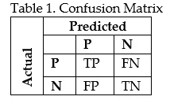
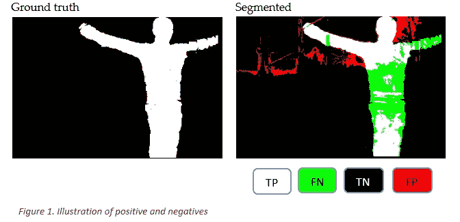
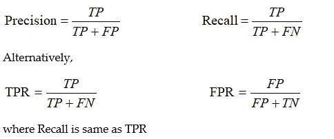
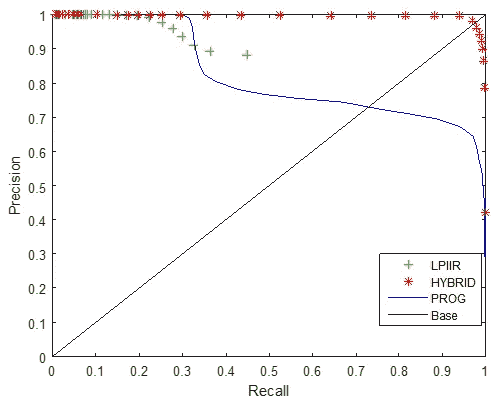
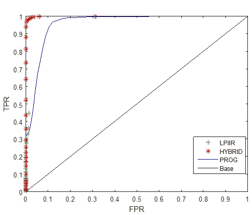

# 机器学习算法实例 ROC 分析

> 原文：<https://towardsdatascience.com/roc-analysis-with-practical-example-f899cd10dd47?source=collection_archive---------33----------------------->

## 用混淆矩阵逐步引导受试者工作曲线

米利安·耶西耶在 [Unsplash](https://unsplash.com?utm_source=medium&utm_medium=referral) 上拍摄的照片

在机器学习应用中，分类算法用于获得对数据流的预测，以便标记对象供进一步分析。在这种应用中，不仅分类算法的准确性很重要，而且算法的灵敏度或真阳性率(检测/识别率)也很重要。机器学习模型的训练阶段的数据不平衡的例子可以显示准确性和检测率的重要性。具有大量样本的任意类别(例如，汽车)将给出良好的准确性，因为分类器在训练期间已经看到该类别的许多示例，然而，分类器在具有少量样本的类别(人类)上将表现不佳。这意味着系统的整体识别率会更低。准确度、精确度和识别率可以用受试者工作特性(ROC)曲线来衡量。

ROC 最初用于第二次世界大战期间的雷达信号分析。目前，ROC 分析用于信号检测理论、机器学习、测量系统和医疗诊断应用。

在本文中，我们将讨论 ROC 分析如何用于计算机视觉算法的分类准确性。ROC 分析的基本概念可以通过混淆矩阵(也称为误差矩阵)很容易地理解。

## 混淆矩阵

混淆矩阵显示了分类模型相对于实际结果/基本事实做出的正确与不正确预测的数量。通用混淆矩阵有四个类别，如表 1 所示。我们用一个简单的例子来解释，如图 1 所示的黑色背景中人体的检测。

*   **TP** =真阳性，当物体的边界被正确分类(白色像素)为真时。预期结果。
*   **FP** =假阳性，当黑色背景被分类为人类时，这是错误的分类(红色像素)。不是预期的结果。
*   **TN** = True Negative，当背景没有被分类为人类时为真。预期结果。
*   **FN** =假阴性，当一个人被归类为假背景(绿色)的一部分时。不是预期的结果。

困惑矩阵(来源:作者)

给定混淆矩阵，很容易在 ROC 或精确回忆空间中构建一个点。在 ROC 空间中，**假阳性率** ( **FPR** )标绘在 x 轴上，**真阳性率** ( **TPR** )标绘在 y 轴上。

**FPR** 是误分类样本(假阳性)与总阴性样本(假阳性+真阴性)的比率。简单来说，当答案实际上是否定的时候，有多少次答案被报为是。它包括图 1 中的黑色背景区域。

**TPR** 是正确分类的样本(真阳性)与总阳性样本(真阳性+假阴性)的比率。简单来说，答案是肯定的时候，有多少次答案被报为肯定。它包括图 1 中的白色人体部分区域。

在 PR 空间中，**召回**绘制在 x 轴上，**精度**绘制在 y 轴上。**召回**与 TPR 相同，而**精度**是真正分类的样本(真阳性)与总阳性样本的比率。换句话说，精确度就是如果答案是肯定的，它被报告为肯定的频率[2]。

## 示例:作为二元分类问题的人体检测

嵌入式智能摄像机系统在许多现实世界的监控应用中越来越受欢迎。然而，当在户外环境中使用视觉算法时，仍然存在挑战，即照明、阴影、遮挡和天气条件的变化。为了应对这些挑战，为了减少背景噪声，创建了成像流水线。背景减除是成像流水线中提高信噪比的重要步骤。在这项工作中，将使用 ROC 曲线评估低复杂性背景建模和减法技术。三种背景减除算法的性能:将比较低通无限脉冲响应滤波器、渐进生成和混合技术。为简单起见，减影图像被分割，以便将研究限制为二元分类问题。

在图 1 中示出了参考分割图像相对于地面真实图片(手动计算/提取)的正片和底片。在图中，TP 代表被正确标记为阳性的像素，FP 代表被错误标记为阳性的像素，TN 代表被正确标记为阴性的像素，FN 代表被错误标记为阴性的像素。

图片来源:作者

通过使用 TP、FP、TN 和 FN 的四种组合，我们可以绘制 ROC 曲线，该曲线可以绘制为精确度对召回率或真阳性率(TPR)对假阳性率(FPR)。

**精确或召回:**被正确识别的实际阳性病例的属性。

(来源:作者)

根据定义，一个好的算法应该同时产生少量的误报和漏报。这意味着精确度和召回率都应该有很高的值。精度和召回产生具有一个阈值的单个值，因此我们使用一系列阈值来产生曲线。这也有助于确定合适的阈值[1]。

**三种背景减除算法的比较:**包括低通无限脉冲响应滤波器、渐进生成和混合技术的三种背景减除技术的 ROC 曲线如图 2 所示。很明显，与其他两种方法相比，混合技术具有高精度和高召回率。

图 3 显示了假阳性率(FPR)对真阳性率(TPR)的 ROC 曲线。在该曲线中，与其他两个公开的系统相比，对于我们提出的算法，TPR 高，FPR 低。

图二。LPIIR、混合和渐进背景减除算法的 ROC 曲线。(来源:作者)

图 3。LPIIR、混合和渐进背景减除算法的 ROC 曲线。(来源:作者)

## 结论:

在机器学习中，由于复杂性的降低，分类问题通常被简化为二元决策问题。评估分类算法的性能非常重要，因为整个系统的检测性能不仅取决于准确性，还取决于检测率。ROC 曲线显示了分类器在所有可能阈值上的性能，用户可以为算法选择合适的阈值。

ROC 曲线是通过沿 y 轴绘制真阳性率相对于沿 x 轴绘制假阳性率而生成的。给出的用 ROC 曲线比较三种背景扣除方法的性能的例子表明，通过观察三种算法的精度和召回率，很容易量化结果。

## 参考资料:

1- Yannick Benezeth，Pierre-Marc Jodoin，Bruno Emile，H_el_ene Laurent，Christophe Rosenberger。背景减除算法的比较研究。《电子成像杂志》，摄影光学仪器工程师学会(SPIE)，2010 年。

2- J .戴维斯和 m .戈德里奇。精确回忆与 roc 曲线的关系。1551 号技术报告，威斯康星大学麦迪逊分校，2006 年 1 月。

## 相关文章

要不要把 ROC 分析应用到实时检测分类系统中？请按照指南使用 Nvidia Jetson Nano 制作一个工作系统

 [## 入门:Nvidia Jetson Nano，对象检测和分类

### 边缘计算的未来

towardsdatascience.com](/getting-started-nvidia-jetson-nano-object-detection-and-classification-161ad566d594) 

你想用 OpenCV 和 QT 在 windows 电脑上创建一个计算机视觉设置吗？请按照教程

 [## 在 Windows 上使用 GStreamer 和 QT 的 OpenCV

### 使用 OpenCV 的 GStreamer 管道的分步指南和实例

towardsdatascience.com](/opencv-with-gstreamer-and-qt-on-windows-6f0fdb075993) 

**有用的链接**

[链接](https://www.dataschool.io/simple-guide-to-confusion-matrix-terminology/)中混淆矩阵的一个简单例子