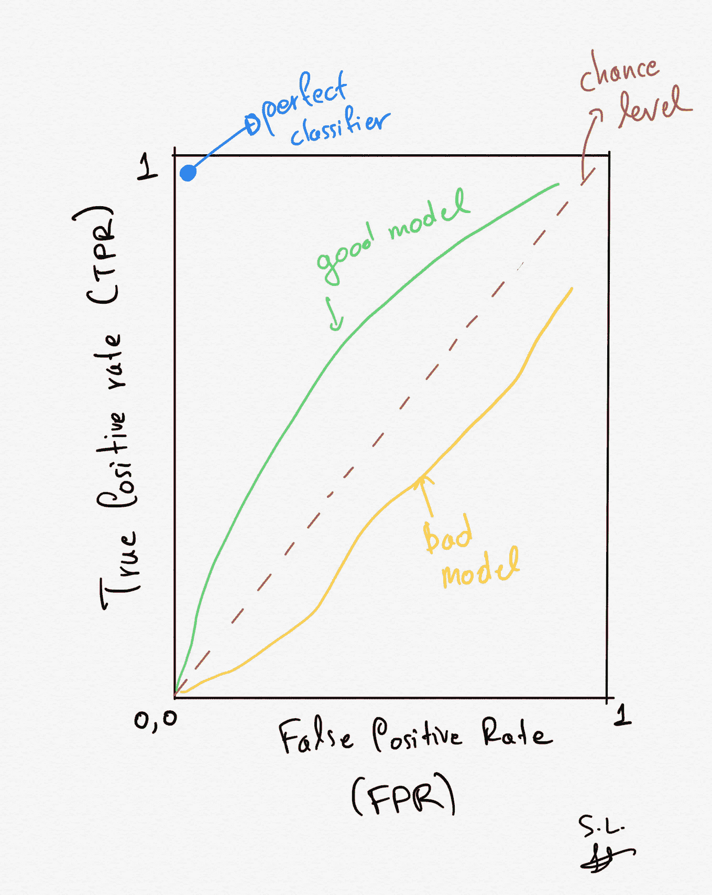
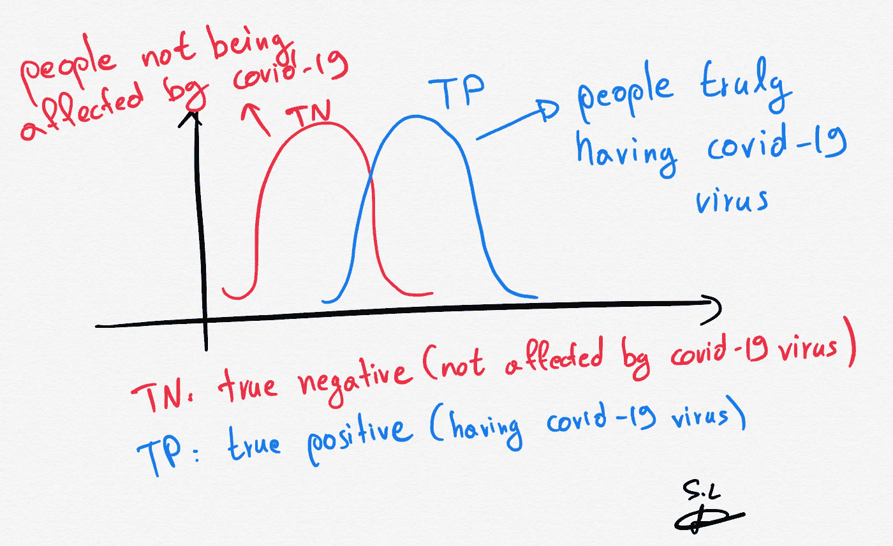
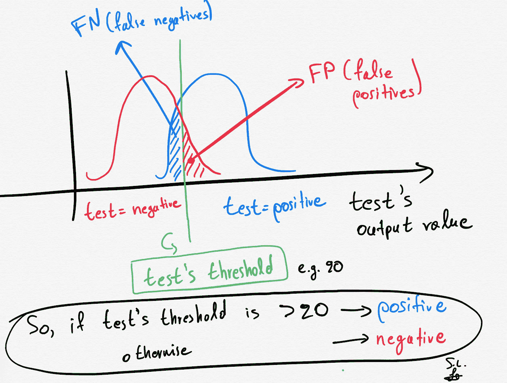
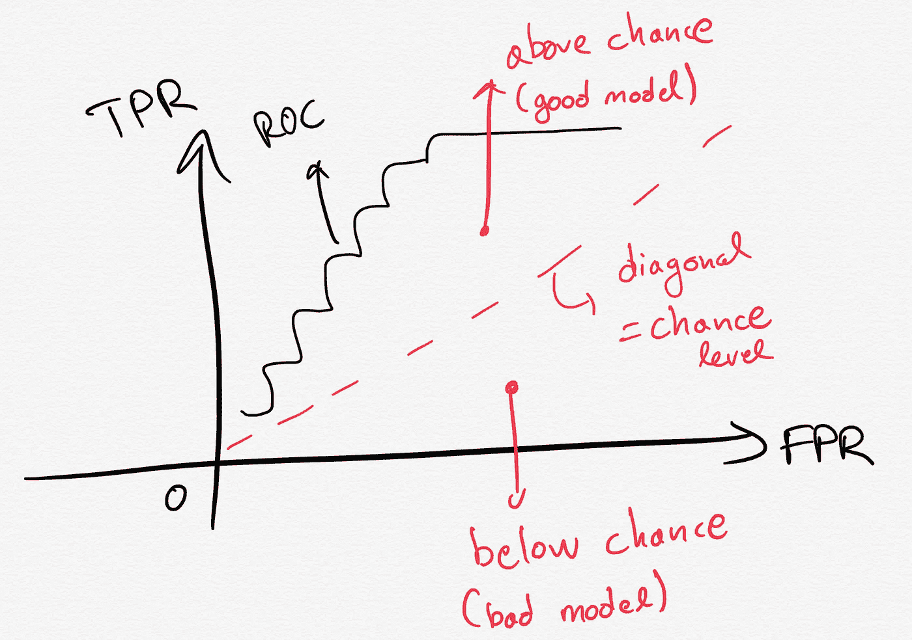
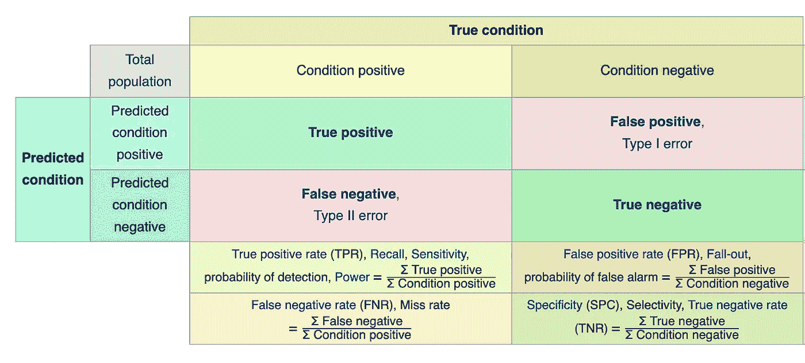
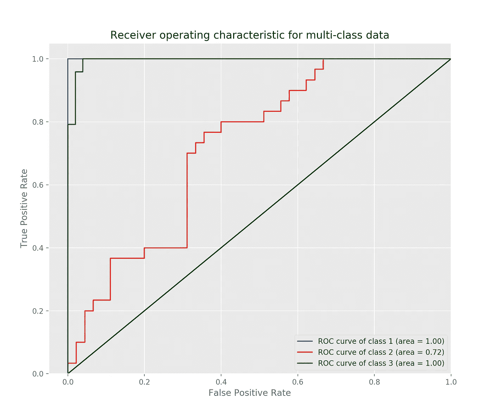
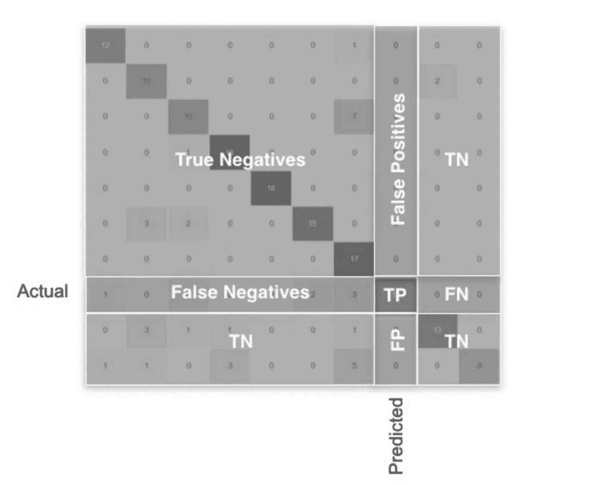

# 用新冠肺炎假设的例子解释 ROC 曲线:二元和多类分类教程

> 原文：<https://towardsdatascience.com/roc-curve-explained-using-a-covid-19-hypothetical-example-binary-multi-class-classification-bab188ea869c?source=collection_archive---------8----------------------->

## 在这篇文章中，我清楚地解释了什么是 ROC 曲线以及如何阅读它。我用一个新冠肺炎的例子来说明我的观点，我也谈到了混淆矩阵。最后，我提供了用于绘制多类分类案例的 ROC 和混淆矩阵的 Python 代码。



作者做的手工素描。

# 1.介绍

在使用机器学习**分类** **模型**的 99%的情况下，人们报告其 **ROC** 曲线图(以及 AUC:ROC 下面积)以及其他指标，如模型的准确性**混淆** **矩阵**。

但是**什么是 ROC 曲线**？**它告诉我们什么？**为什么大家都在用**？**它是如何连接到混淆矩阵的？继续阅读，你将能够回答所有这些问题。****

# 1.1.ROC 定义

**受试者工作特性曲线(ROC)曲线**是显示**二元** **分类器**在其**判别阈值**变化**时的诊断能力的曲线图。**

**在我深入研究细节之前，我们需要理解这个区分阈值**在不同的模型中并不相同，而是特定于模型的。例如，如果我们有一个支持向量机( **SVC** ，那么这个阈值只不过是**决策** **边界**方程的**偏差**项。通过改变 SVM 模型中的偏差，我们实际上只是改变了决策边界的位置。看看我之前发表的 SVM 的文章，了解更多关于 SVM 车型的细节。****

**通过在各种**阈值**设置下绘制[真阳性率](https://en.wikipedia.org/wiki/True_positive_rate) ( **TPR** )对[假阳性率](https://en.wikipedia.org/wiki/False_positive_rate) ( **FPR** )来创建 **ROC** 曲线。真阳性率也称为[敏感度](https://en.wikipedia.org/wiki/Sensitivity_(tests))、[回忆](https://en.wikipedia.org/wiki/Precision_and_recall#Definition_(classification_context))或机器学习中的检测概率。假阳性率也称为虚警概率，可以计算为(1[特异性](https://en.wikipedia.org/wiki/Specificity_(tests)))。它告诉我们，我们的模型能够很好地区分这些类别。**

***很多术语吧？*等一下，我将在下一节用一个例子解释所有这些术语，这个例子会让你永远记住所有这些术语。**

**如果你想在交互式路线图和活跃的学习社区的支持下自学数据科学，看看这个资源:[https://aigents.co/learn](https://aigents.co/learn)**

# **1.2.术语解释清楚(TP、TN、FP、FN)**

## **新冠肺炎测试示例**

**让我们想象一下，我们有一个**新冠肺炎测试**，它能够在几秒钟内告诉我们一个人是否被**病毒**或**感染**而不是**。所以测试**的**输出可以是**正**(受影响)或**负**(不受影响)——我们**有一个二进制分类情况。******

**让我们也**假设**我们知道**地** **真相**并且我们有两个种群:**

*   ****a)** 认为**确实受到影响的人** ( **TP:真阳性，蓝色**分布在下图中)以及**
*   ****b)** 人即**不受影响** ( **TN** : **真底片，下图中红色**分布)——**二元分类情况。****

****

**作者做的手工素描。假设我们真的知道真相，两个人群的例子，一个受新冠肺炎影响，另一个不受影响。**

**因此，如前所述，我们假设我们知道基本事实，即我们真的知道谁生病了，谁没生病。**

**接下来，我们**使用我们的 covid 测试**并定义一个**阈值**(假设为 20)。如果**测试值**如果**高于******阈值**，那么将此人表示为**受影响**(阳性，covid-受影响)。另一方面，如果**测试值**如果**低于******阈值**，那么我们将此人表示为**非** - **受影响**(阴性，无 covid)。因此，基于测试的**输出，我们可以将一个人表示为**受影响** ( **阳性**、**蓝色**人群)或**非**、**受影响** ( **阴性、红色**人群)。********

**要消化所有这些，请看下图。**

****

**作者做的手工素描。假设我们真的知道真相，两个人群的例子，一个受新冠肺炎影响，另一个不受影响。此外，基于测试的输出，我们可以将一个人表示为受影响的(蓝色人群)或不受影响的(红色人群)。**

> **但是有一个问题！我们的测试不可能完美！**

**有些人会**错误地将** *误归类*为**阳性** (covid-affected，我们称此为**假阳性** ( **FP** )或**阴性** (covid-free，我们称此为**假** **阴性** ( **FN** )。**

## **总结:**

*   ****真阳性** ( **TP** ，**蓝色**分布)是真正拥有新冠肺炎病毒的人**。****
*   ****真阴性(TN，红色**分布 **)** 是真正没有新冠肺炎病毒的人**。****
*   ****假阳性(FP)** 是指**确实没有患病**但**根据检测**，他们被**假** ( **假**)表示为**患病** ( **阳性**)。**
*   ****假阴性(FN)** 是指**真正患病**而**根据检测**，他们被**假** ( **假**)表示为**非** **患病** ( **阴性**)。**
*   **对于**完美** **情况**，我们会想要**高** **值** **TP** 和 **TN** 和**零** **FP** 和**FN——这将是具有完美 ROC 曲线的完美模型。****

# **1.3.ROC 曲线、AUC 和混淆矩阵**

## **中华民国**

**既然我们已经理解了术语 **TP、TN、FP、FN** 让我们再回头看看 ROC 曲线的定义。**

> **在不同的**阈值**设置下，绘制[真阳性率](https://en.wikipedia.org/wiki/True_positive_rate) ( **TPR** )相对于[假阳性率](https://en.wikipedia.org/wiki/False_positive_rate) ( **FPR** )的 **ROC** 曲线。换句话说，ROC 曲线显示了对于基础模型的**不同阈值设置**的**TPR 和 FPR** 的权衡。**

****

**作者做的手工素描。ROC 曲线显示了基础模型不同阈值设置的 TPR 和 FPR 之间的权衡。如果曲线在对角线之上，则模型是好的，并且高于概率(对于二元情况，概率是 50%)。如果曲线在对角线以下，模型就真的不好。**

*   **如果曲线在对角线上方**，则型号为**好**且**在**上方的几率(二进制情况下几率为 50%)。如果**曲线**在**对角线下方**，则**型号**为**不良**。****

## **联合自卫军**

**如果曲线在之上**或在**之下**对角线**(机会水平)，则 **AUC(曲线下面积)表示**。 **AUC 的值范围**从 **0 到 1** 。预测 100%错误的模型的 AUC 为 0.0，预测 100%正确的模型的 AUC 为 1.0。**

## **混乱矩阵**

**使用上述所有术语，我们还可以构建由这些指标组成的著名的**混淆矩阵**，然后我们可以计算出**真阳性率**和**假阳性率**，如下图所示为**二进制分类情况。****

****

**图来自[维基百科](https://en.wikipedia.org/wiki/Confusion_matrix)。**

**估计了**真阳性率**和**假阳性率**(使用上表中的公式)后，我们现在可以绘制 ROC 曲线。但是等一下！**

****真阳性率**和**假阳性率**只是 2 个**标量**。**如何才能在 ROC 剧情里真的有曲线？****

> **这是通过改变一些阈值设置来实现的。ROC 曲线显示了 TPR 和 FPR 对于不同阈值的权衡。**

**例如，在**支持** **矢量** **机器** ( **SVC** )的情况下，这个**阈值**只不过是**决策边界**等式中的**偏差**项。因此，我们**将改变这个偏差**(这将改变决策边界的位置)并且**为**偏差**的给定值估计****和 **TPR** 。****

****要了解关于支持向量机的一切，请看[这篇](/support-vector-machines-svm-clearly-explained-a-python-tutorial-for-classification-problems-29c539f3ad8?source=friends_link&sk=80f72ab272550d76a0cc3730d7c8af35)帖子。****

# ****1.4.多类分类问题的 ROC 曲线和混淆矩阵****

******ROC** 曲线仅**为**二元** **分类** **问题**定义。但是有一种方法可以整合到**多类分类问题**中。为此，如果我们有 N 个**类，那么我们将需要定义几个**模型。******

**例如，如果我们有 **N=3 个类别**，那么我们将需要定义以下案例:**类别 1 对类别 2 的**案例/模型 1** ，类别 1 对类别 2 的**案例/模型 2** ，以及类别 1 对类别 3 的**案例/模型 3** 。****

****记住**在我们的新冠肺炎测试例子中，我们有两种可能的结果，即受病毒影响(**阳性**)和不受影响(**阴性**)。类似地，在多类情况下，我们再次必须定义积极和消极的结果。**

**在多类情况下，对于每种情况，**正**类是第**第二**类:**

*   ***为* ***例*******1****:****1 类 vs 类*** *，* ***正*** *类为 2 类****
*   ****为* ***例*******2****:****类 2 vs*******正*** *类 3******
*   *****为* ***例****3:****类 1 vs*******正*** *类 3******

****换句话说，我们可以这样想:我们问分类器“这个样本是正的还是负的？”并且分类器将预测标签(**正**或**负**)。**将独立估计每种情况的 ROC，2，3。******

****这同样适用于混淆矩阵。对于每种情况，我们都有一个混淆矩阵**。******

# ******2。Python 工作示例******

****现在，你应该对 ROC 曲线和混淆矩阵了如指掌，也应该熟悉 TP、TN、FP、FN、TPR、FPR 等术语。现在让我们构建一个 **python** 工作**的例子**。****

## ****2.1 分类模型****

****在之前的[帖子](/support-vector-machines-svm-clearly-explained-a-python-tutorial-for-classification-problems-29c539f3ad8?source=friends_link&sk=80f72ab272550d76a0cc3730d7c8af35)中，我解释了什么是 **SVC** ，所以这里我们将使用这样一个模型。****

## ******2.2 数据集******

****在虹膜数据集中，我们有 3 类花和总共 4 个特征。所以分类问题不再是二元的了，因为我们有 3 个类。然而，下面的代码将为我们的**多类分类问题**估计和绘制 ROC 曲线。****

****为此，该模型将用于**1 级对 2 级、2 级对 3 级以及 1 级对 3 级**。因此，我们在末端有 **3 种情况**，在每种情况下有**，偏置将变化**，以便得到给定 **情况**下**的 **ROC** 曲线—因此，3 条 ROC 曲线作为输出。******

## ****2.3 使用 Iris 数据和 scikit-learn 的示例****

## ****ROC 曲线和 AUC 指标****

```
**import matplotlib.pyplot as plt
from sklearn import svm, datasets
from sklearn.model_selection import train_test_split
from sklearn.preprocessing import label_binarize
from sklearn.metrics import roc_curve, auc
from sklearn.multiclass import OneVsRestClassifier
from itertools import cycle
plt.style.use('ggplot')**
```

****让我们加载数据集，将标签二进制化，并将数据分成训练集和测试集(以避免过度拟合):****

```
**# Load the iris data
iris = datasets.load_iris()
X = iris.data
y = iris.target# Binarize the output
y_bin = label_binarize(y, classes=[0, 1, 2])
n_classes = y_bin.shape[1]# We split the data into training and test sets
X_train, X_test, y_train, y_test = train_test_split(X, y_bin, test_size= 0.5, random_state=0)**
```

****最后，我们建立我们的模型(SVC)并估计 3 种情况的 ROC 曲线:**1 类对 2 类、2 类对 3 类和 1 类对 3 类。******

****每次**正**类是**第二个** **一个**即*为* ***例*******1****:****类 1 vs*******正*********

```
**#We define the model as an SVC in OneVsRestClassifier setting.
#this means that the model will be used for class 1 vs class 2, #class 2vs class 3 and class 1 vs class 3\. So, we have 3 cases at #the end and within each case, the bias will be varied in order to #get the ROC curve of the given case - 3 ROC curves as output.
classifier = OneVsRestClassifier(svm.SVC(kernel='linear', probability=True, random_state=0))y_score = classifier.fit(X_train, y_train).decision_function(X_test)# Plotting and estimation of FPR, TPR
fpr = dict()
tpr = dict()
roc_auc = dict()
for i in range(n_classes):
    fpr[i], tpr[i], _ = roc_curve(y_test[:, i], y_score[:, i])
    roc_auc[i] = auc(fpr[i], tpr[i])
colors = cycle(['blue', 'red', 'green'])
for i, color in zip(range(n_classes), colors):
    plt.plot(fpr[i], tpr[i], color=color, lw=1.5, label='ROC curve of class {0} (area = {1:0.2f})' ''.format(i+1, roc_auc[i]))
plt.plot([0, 1], [0, 1], 'k-', lw=1.5)
plt.xlim([-0.05, 1.0])
plt.ylim([0.0, 1.05])
plt.xlabel('False Positive Rate')
plt.ylabel('True Positive Rate')
plt.title('Receiver operating characteristic for multi-class data')
plt.legend(loc="lower right")
plt.show()**
```

********

****输出图产生了我上面介绍的 python 代码。****

*******提醒***:ROC 曲线显示**交易** - **关**的 **TPR** 和 **FPR** 为**不同** **阈值** **设置**的底层模型。如果曲线**高于**对角线**对角线**，则模型为**好**且**高于**几率(二进制情况几率为 50%)。如果**曲线**低于对角线**对角线**，则**型号**为**不良**。****

****如果曲线高于的**或低于**的**对角线**(机会水平)，则 **AUC(曲线下面积)表示**。****

## ****混乱矩阵****

****现在我们也来估算一下**混淆矩阵。******

```
**from sklearn import svm, datasets
from sklearn.model_selection import train_test_split
from sklearn.metrics import confusion_matrix# Load the iris data
iris = datasets.load_iris()
X = iris.data
y = iris.target# We split the data into training and test sets
X_train, X_test, y_train, y_test = train_test_split(X, y, test_size= 0.5, random_state=0)# the model
classifier_svc = svm.SVC(kernel='linear',random_state=0)# fit the model using the training set
classifier_svc.fit(X_train, y_train)# predict the labels/classes of the test set
y_pred = classifier_svc.predict(X_test)**
```

****有了**预测** `y_pred`和**基础**真相**标签** `y_test`，估计混淆矩阵:****

```
**# build the confusion matrix
cnf_matrix = confusion_matrix(y_test, y_pred)print(cnf_matrix)
#[[21  0  0]
# [ 0 29  1]
# [ 0  1 23]]**
```

****我们可以看到，我们可以**真的** **预测****所有 3 组**的标签/类别(对角线上的值大多表示高**真的** **正的** ( **TP** )比率)。****

*******提醒*** :混淆矩阵给你看的是 TN，TP，FN，FP。对角线上的值是 TP 的计数，因此这些值越高，模型的预测能力越好。****

********

****那都是乡亲们！希望你喜欢这篇文章！****

# ****最新帖子****

****[](/time-series-forecasting-predicting-stock-prices-using-facebooks-prophet-model-9ee1657132b5) [## 时间序列预测:用脸书的先知模型预测股票价格

### 使用可从《先知脸书》公开获得的预测模型预测股票价格

towardsdatascience.com](/time-series-forecasting-predicting-stock-prices-using-facebooks-prophet-model-9ee1657132b5) [](/support-vector-machines-svm-clearly-explained-a-python-tutorial-for-classification-problems-29c539f3ad8) [## 支持向量机(SVM)解释清楚:分类问题的 python 教程…

### 在这篇文章中，我解释了支持向量机的核心，为什么以及如何使用它们。此外，我还展示了如何绘制支持…

towardsdatascience.com](/support-vector-machines-svm-clearly-explained-a-python-tutorial-for-classification-problems-29c539f3ad8) [](/pca-clearly-explained-how-when-why-to-use-it-and-feature-importance-a-guide-in-python-7c274582c37e) [## PCA 清楚地解释了——如何、何时、为什么使用它以及特性的重要性:Python 指南

### 在这篇文章中，我解释了什么是 PCA，何时以及为什么使用它，以及如何使用 scikit-learn 在 Python 中实现它。还有…

towardsdatascience.com](/pca-clearly-explained-how-when-why-to-use-it-and-feature-importance-a-guide-in-python-7c274582c37e) [](/everything-you-need-to-know-about-min-max-normalization-in-python-b79592732b79) [## 关于 Python 中的最小-最大规范化，您需要知道的一切

### 在这篇文章中，我将解释什么是最小-最大缩放，什么时候使用它，以及如何使用 scikit 在 Python 中实现它

towardsdatascience.com](/everything-you-need-to-know-about-min-max-normalization-in-python-b79592732b79) [](/how-and-why-to-standardize-your-data-996926c2c832) [## Scikit-Learn 的标准定标器如何工作

### 在这篇文章中，我将解释为什么以及如何使用 scikit-learn 应用标准化

towardsdatascience.com](/how-and-why-to-standardize-your-data-996926c2c832) 

# 敬请关注并支持这一努力

如果你喜欢并发现这篇文章有用，请关注我！

有问题吗？把它们作为评论贴出来，我会尽快回复。

# 参考

[1][https://en.wikipedia.org/wiki/Confusion_matrix](https://en.wikipedia.org/wiki/Confusion_matrix)

[https://en.wikipedia.org/wiki/Support_vector_machine](https://en.wikipedia.org/wiki/Support_vector_machine)

[3][https://en . Wikipedia . org/wiki/Receiver _ operating _ character istic](https://en.wikipedia.org/wiki/Receiver_operating_characteristic)

[4][https://sci kit-learn . org/stable/modules/generated/sk learn . SVM . SVC . html](https://scikit-learn.org/stable/modules/generated/sklearn.svm.SVC.html)

# 和我联系

*   **领英**:【https://www.linkedin.com/in/serafeim-loukas/】T4
*   **研究之门**:[https://www.researchgate.net/profile/Serafeim_Loukas](https://www.researchgate.net/profile/Serafeim_Loukas)
*   **https://people.epfl.ch/serafeim.loukas**EPFL**简介** : [美国](https://people.epfl.ch/serafeim.loukas)
*   **堆栈** **溢出**:[https://stackoverflow.com/users/5025009/seralouk](https://stackoverflow.com/users/5025009/seralouk)****