# ROC 与 TOC

> 原文：<https://towardsdatascience.com/roc-vs-toc-bccb7d70ef07?source=collection_archive---------36----------------------->

## 可视化分析二元分类器的两种方法

开始了。(来源:作者)

最近，在撰写一篇关于如何优化配置二元分类器的文章时，我遇到了一个很有前途的替代方法，称为 TOC 分析。在这篇文章中，我将向您介绍这两种可视化工具背后的概念，并讨论它们的相似之处和不同之处。

# 动机

当谈到评估二元预测器的性能时，*接收器操作特性* (ROC)曲线几十年来一直是一种主要形式，实际上早在机器学习时代之前就已经存在了(关于 20 世纪 50 年代的早期示例，请参见 Peterson 等人[1])。它允许我们评估和比较分类器的性能，因此是模型选择的有用工具。

一个分类器完全可以用一条在二维空间中画出的曲线来描述，也就是说，在你的监视器或一张纸上画出的曲线，这是基于这样一个事实:对于任何给定的测试集，2×2 混淆矩阵只有两个自由度。当且仅当你知道你的测试集的组成时，ROC 曲线上的每个点决定了相应的混淆矩阵，也就是说，你知道它包含多少阳性和阴性样本。然而，ROC 图本身*不*包含作为视觉信息的成分。

鉴于 ROC 分析的悠久历史，这一缺点最近通过 2014 年 Pontius 和 Si 引入的*(TOC)得以解决[2]。TOC 图包含完整的 ROC 信息，并允许您读取曲线上每个点的全部信息，即测试集的组成和混淆矩阵的所有四个条目。*

*在我们了解其工作原理之前，让我们快速回顾一下二进制分类的基本概念和符号。*

# *二元分类基础*

*在[二进制分类](https://en.wikipedia.org/wiki/Binary_classification)中，模型性能通常通过将其对来自测试集的数据点的预测与已知的正确结果进行比较来评估，即与测试集的标签进行比较。每个数据点的预测分为四类:真阳性(TP)、真阴性(TN)、假阳性(TP)或假阴性(FN ),每类中的样本数在 [*混淆矩阵*](https://en.wikipedia.org/wiki/Confusion_matrix) 中表示:*

*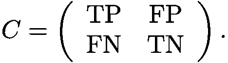*

*尽管混淆矩阵有 4 个分量，但实际上只有两个分量是独立的。这是因为每个实际测试集都有一定数量的 P 个实际为正的样本和一定数量的 N 个实际为负的样本。因此，不管特定分类器的性能如何，最终，我们总是得到 TP + FN = P 和 TN+FP = n。
这就产生了两个含有四个未知数的方程，并留给我们两个自由度。参数化这些自由度的一种常见方式(但不是唯一的方式)是借助于*真阳性率* (TPR)和*假阳性率* (FPR)。数学上，它们被定义为*

*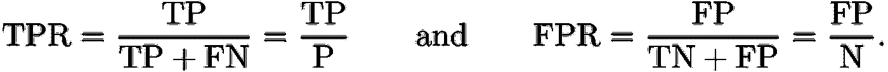*

*从这些定义出发，你可以很容易地用很少的代数说服自己，TPR 和 FPR 足以确定所有四个 TP、FP、FN 和 TN，注意*

*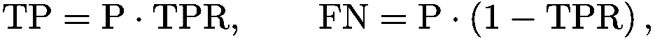***

*在许多情况下，分类器基于概率分类。这意味着他们根据数据点 x 的特征来计算每个类别的概率。在二元分类的情况下，这是两个概率 p(1|x)和 p(0|x)。由于样本必须属于这两类中的任何一类，即 p(1|x)+p(0|x)=1，所以只需查看两个概率中的一个，比如 p(1|x)。为了获得二元预测，使用判别阈值将连续概率 p(1|x)离散化为两类中的任一类:*

*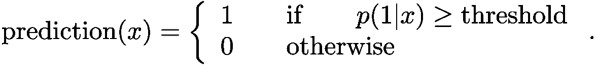*

*因此，TPR 和 FPR 以及混淆矩阵中的所有四个数字都依赖于阈值。这种依赖性就是 ROC 和 TOC 图的设计目的。*

# *ROC 和 TOC 图*

*ROC 图和 TOC 图都是在单个图中可视化所有可能阈值选择的分类器性能的工具。但是，它们基于两个不同的坐标系。*

*ROC 曲线被绘制到 FPR-TPR 坐标系中，也就是说，您为 0%和 100%之间的所有阈值绘制(FPR(阈值)，TPR(阈值))。另一方面，TOC 图绘制在(TP+FP)-TP 坐标系中，也就是说，您绘制每个阈值的点(TP(阈值)+FP(阈值)，TP(阈值))。*

*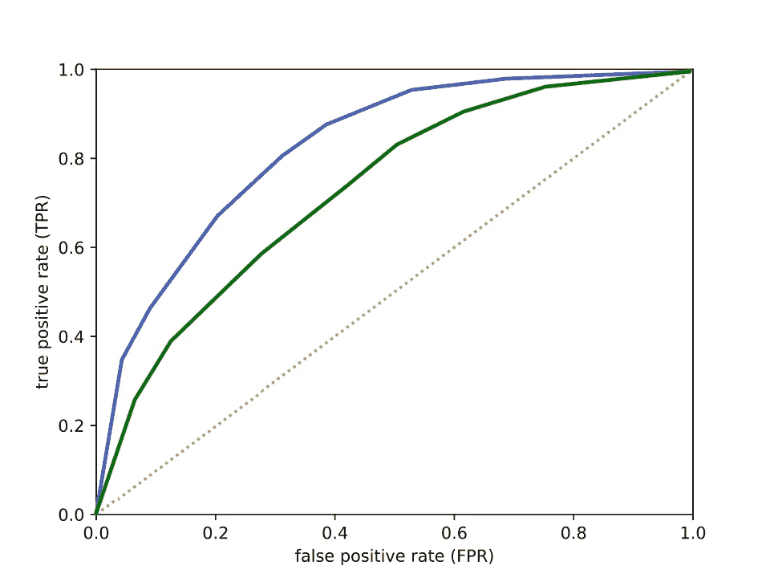*

***图 1:** 两个分类器的 ROC 曲线(蓝色和绿色线条)和代表不知情(随机)分类器的曲线(橙色圆点)。*

*TOC 图的主要吸引力在于，您可以读出 TOC 空间中每个点的完整混淆矩阵。这不仅可以通过绘制曲线来实现，还可以通过用角(0，0)、(N，0)、(N+P，P)、(P，P)来绘制周围的平行四边形框来实现。*

*我们将在下面更详细地讨论这个平行四边形的性质，但是现在，我们注意到从 TOC 曲线上的任何点到盒子左边界的距离对应于 FP，到右边界的距离对应于 TN，到顶部的距离对应于 FN，到底部的距离对应于 TP。*

*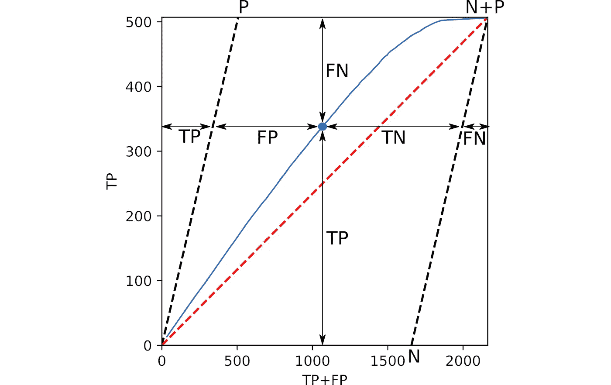*

***图 2:** 对于 TOC 曲线上的每个点，您都可以读出混淆矩阵的所有四个分量，TP、FP、FN 和 TN，同时还可以获得 ROC 图中的所有信息。(来源:作者)*

*与 ROC 图不同，ROC 图不允许在不知道 P 和 N 的情况下重建混淆矩阵，P 和 N 不包含在图本身中，TOC 图包含每个给定阈值选择的混淆矩阵*。此外，您可以轻松地读取测试集的大小和组成，例如，揭示数据中的偏斜度，这些偏斜度在 ROC 图中是“隐藏”的。**

# *ROC 空间与 TOC 空间*

*ROC 曲线被绑定到一个被称为 *ROC 空间*的正方形区域，其点对应于 TPR 和 FPR 在 0 和 1 之间的所有可能值【3】。这个正方形被从 TPR=FPR=0 到 TPR=FPR=1 的对角线切成两半。
这条对角线上的点代表所谓的*未知*分类器。
这种分类器只是对数据点进行随机分类，完全不顾其实际特征值。例如，在 TPR=FPR=0.7 时，不知情的分类器会将 10 个数据点中的 7 个数据点分类为阳性，将 10 个数据点中的 3 个数据点分类为阴性。*

*这条对角线的两端是两个非常特殊的决定者的家。
在左下方，当 TPR=FPR=0 时，我们有一个分类器，它简单地将每一个数据点归类为负面。ROC 空间右上角的分类器将每个数据点分类为阳性。*

*ROC 空间的另外两个角落同样有趣。在左上角，我们有完美的分类器。它将正确的类别分配给测试集的每个单个数据点，对应于一个对角混淆矩阵，其中 TP=P，TN=N，FP=FN=0，也就是说，*

*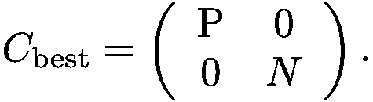*

*通过翻转它的每个响应，你可以使完美的分类器变得完全不完美。这种最差的分类器给每个数据点分配了错误的类别，导致混淆矩阵 TP=TN=0，FP=N，FN=P，即*

*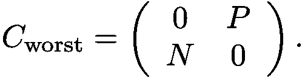*

*在 ROC 空间中，这对应于右下角，TPR=0，FPR=1。*

*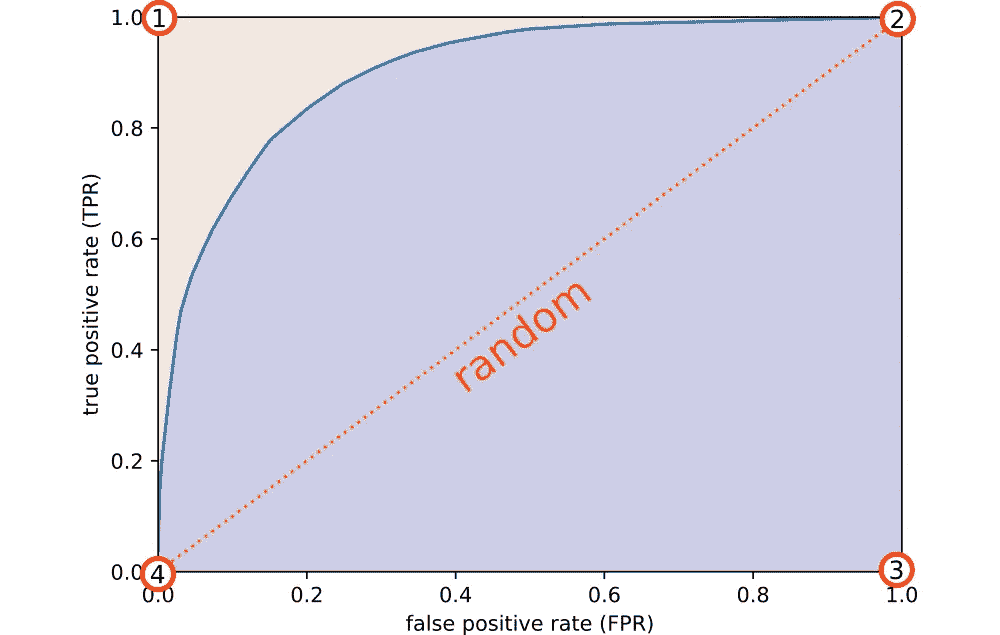*

***图 3:**ROC 曲线(蓝色)与无信息(随机)分类器性能的比较(橙色对角线)。ROC 空间的四个极端角是:(1)完美分类器，(2)全正分类器，(3)最差可能分类器，和(4)全负分类器。(来源:作者)*

*TOC 空间在两个基本方面不同于 ROC 空间。首先，它不是正方形而是平行四边形，其次，它的形状取决于测试集的组成。这是选择轴的直接结果，因为与速率 TPR 和 FPR 不同，绝对值 TP 和 FP 不包含在从 0 到 1 的范围内。为了理解平行四边形，选择 TP 的任意固定值。然后，您的选择自动成为 TP+FP 的下限，TP+FP 是 TOC 图的横坐标(也称为 x 轴)，因为 FP 是一个计数，因此永远不会为负。TP+FP 的上限也由您的选择决定。就是 TP+N，因为 FP 不能大于 N，TP+FP 的这些上下界形成了平行四边形的倾斜的左右边界。TP 本身也是一个计数，并且限制在从 0 到 P 的范围内，分别确定平行四边形的上下边界。因此，整个 TOC 空间可以嵌入一个 N+P 乘 P 的矩形中。*

*尽管有这些差异，TOC 空间只是 ROC 空间的一个(非均匀)[缩放](https://en.wikipedia.org/wiki/Scaling_(geometry))和[剪切](https://en.wikipedia.org/wiki/Shearing_(physics))版本。ROC 空间中的任何点都可以使用线性变换映射到 TOC 空间*

*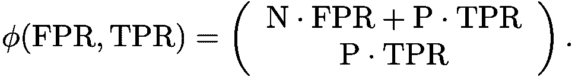*

*这种转换是缩放的组合*

*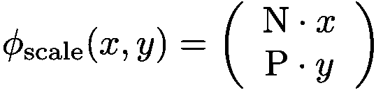*

*和剪切*

*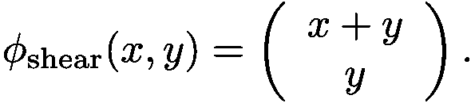*

*因此，我们可以通过使用*

*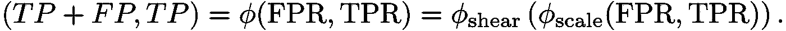*

*由于这种变换的简单性质，ROC 空间的基本几何结构被带到 TOC 空间。因此，就像 ROC 空间一样，TOC 空间也被表示无信息分类器的对角线减半。TOC 空间的角也保留了它们在 ROC 空间中的含义:左上角是完美的分类器，右下角是最差的分类器，右上角是全肯定的分类器，左下角是全否定的分类器(见图 4)。*

*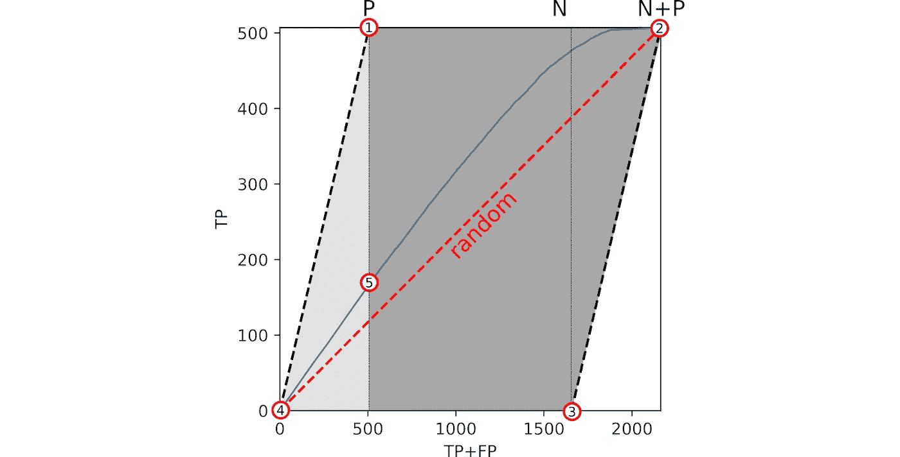*

***图 4:**TOC 空间的四个极端角分别是(1)完美分类器，(2)全正分类器，(3)最差可能分类器，(4)全负分类器。在第(5)点，患病率(阳性数)被正确估计。(5)(灰色区域)左边 TP+FP < P，这样患病率被低估，右边(5) TP+FP > FP，这样患病率被高估。(来源:作者)*

*其他派生属性在转换过程中也保持不变。例如，让我们考虑 ROC 曲线下的面积(AUROCC ),这是一个使用单个数字描述 ROC 曲线整体的典型指标。TOC 曲线下的面积(AUTOCC)与 ROC 曲线下的面积(AUROCC)成正比，可以用同样的方式解释。我们有*

*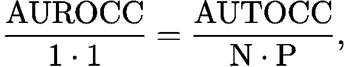*

*因此 ROC 曲线下的 ROC 空间部分(1 乘 1 的正方形)与 TOC 曲线下的 TOC 空间部分(N 乘 P 的平行四边形)相同。*

*在 Pontius 和 Si [2]的原始出版物中有这种关系的冗长证明，但我发现更直接的考虑是只有
ϕₛcₐₗₑ影响该区域(ϕₛₕₑₐᵣ是面积保持的)并且它的[雅可比矩阵](https://en.wikipedia.org/wiki/Jacobian_matrix_and_determinant)是 N⋅P，因此很明显，在变换下，AUROCC 被相应地放大。*

*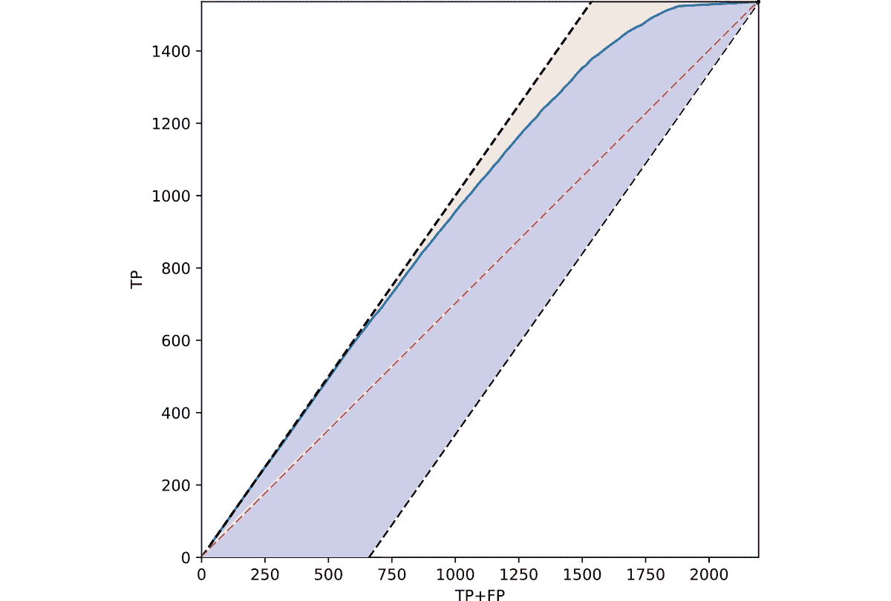*

***图 5:**TOC 曲线下的平行四边形(蓝色区域)相对于整个平行四边形面积(蓝色+橙色部分)的分数等于 ROC 曲线下的面积。比较图 3 所示 ROC 图中的彩色区域。(来源:作者)*

*TOC 空间有一个值得注意的点是 ROC 空间无法识别的。它是点(P，TP)，如图 4 中的点(5)所示。它是曲线上平行四边形左边界上端正下方的点。在这一点上操作的分类器产生与测试集中的阳性和阴性样本完全相同的阳性和阴性预测比率。这样的分类器可以说是正确地代表了实际的[流行度](https://en.wikipedia.org/wiki/Prevalence)。该点左侧的所有分类器都低估了阳性率，而其右侧的所有分类器都高估了阳性率。*

# *TOC 空间的形状*

*虽然 ROC 空间在测试集组成变化的情况下保持几何静态，但是 TOC 空间变化强烈。Pontius 和 Si 建议通过重新调整图形的比例来“提高视觉清晰度”，这样在纸上(或你的显示器上)，TP 轴和 TP+FP 轴具有相同的长度[2]。然而，用相同的比例绘制 TP 和 TP+FP 轴，并观察 TOC 空间如何随着测试集组成的变化而展开和折叠，有助于理解 TOC 空间的概念。*

*对于任何非空测试集，有五种可能的情况:*

*1.0=N*

*2。0 < N < P
3。0 < P=N
4。0 < P < N
5。0=P < N*

*为了说明，让我们考虑一个在“成人”数据集[4]上训练的玩具分类器，并用同样多的阳性和阴性样本编译一个主测试集。然后，我们可以通过控制这个集合的子集来创建所有五种可能的情况。具体来说，我们从 N=0，P=1552(情况 1)开始，增加 N(情况 2)，直到达到 N=P=1552(情况 3)。从那里，我们减少 P(情况 4)，直到我们最终达到 P=0，N=1552(情况 5)。图 6 说明了 TOC 空间如何由于测试集组成的这些变化而改变其形状。*

*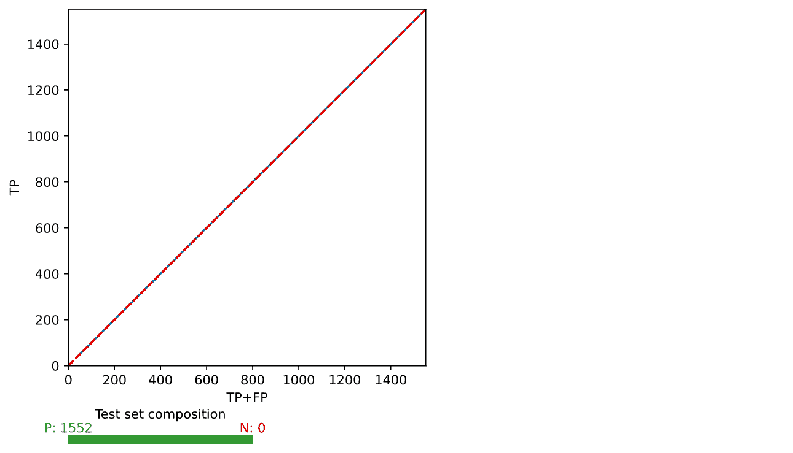*

***图 6:** 显示各种测试集构成的 TOC 空间形状的动画。请注意，在 N=0 和 P=0 这两种极端情况下，从二维坍缩到一维。(来源:作者)*

*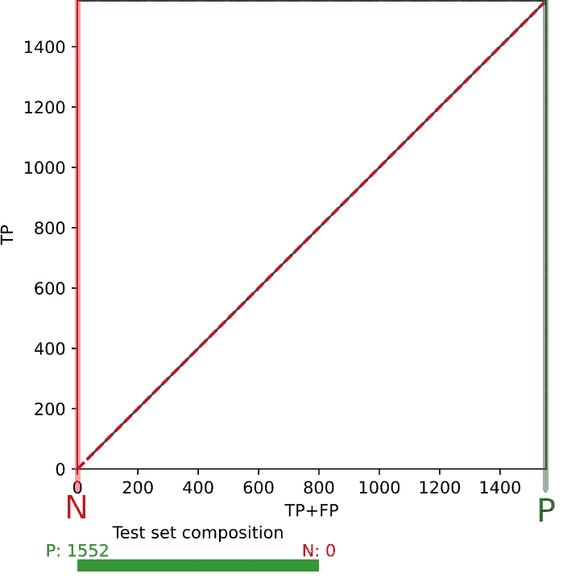*

***图 7:** 对于 0=N < P(情况 1)，TOC 空间是一维的。它对应于从(0，0)到(P，P)的对角线。(来源:作者)*

*让我们更详细地讨论情况 1 到 5。*

*对于 N=0 < P, TOC space is one-dimensional! Its left and right boundaries collapse into a single diagonal line from (0, 0) to (P, P) (see Figure 7).*

*Although this might seem strange at first glance, it is sensible, since in absence of negatives, the performance of a classifier is in fact one-dimensional, completely determined by a single parameter, its TPR.*

*Going away from this extreme situation, we increase the number of negatives in the test set.*

*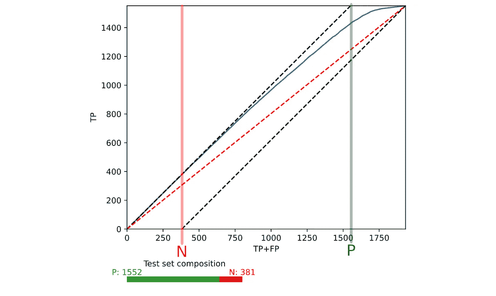*

***图 8** :对于 0 < N < P(情况 2)，TOC 空间是一个相当窄的对角线带。(来源:作者)*

*对角线分成左右边界，打开了一个有限的区域，即“正常的”二维 TOC 空间。*

*然而，TOC 空间保留了一个相当窄的对角线形状，因为它的右边界从 TP+FP=N 开始，在 TP+FP=P 的左边很远的地方，它的左边界在这里结束(见图 8)。*

*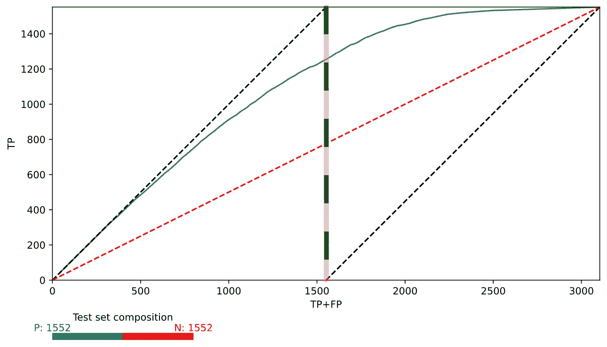*

***图 9:** 对于 0 < N=P 左边界在右边界起点的正上方结束。(来源:作者)*

*进一步增加否定的比例，然后我们接近 P=N 的情况，也就是说，在测试集中否定和肯定是完全平衡的。*

*现在，右边的 TOC 空间边界直接从左边界的端点下面开始(参见图 9)。*

*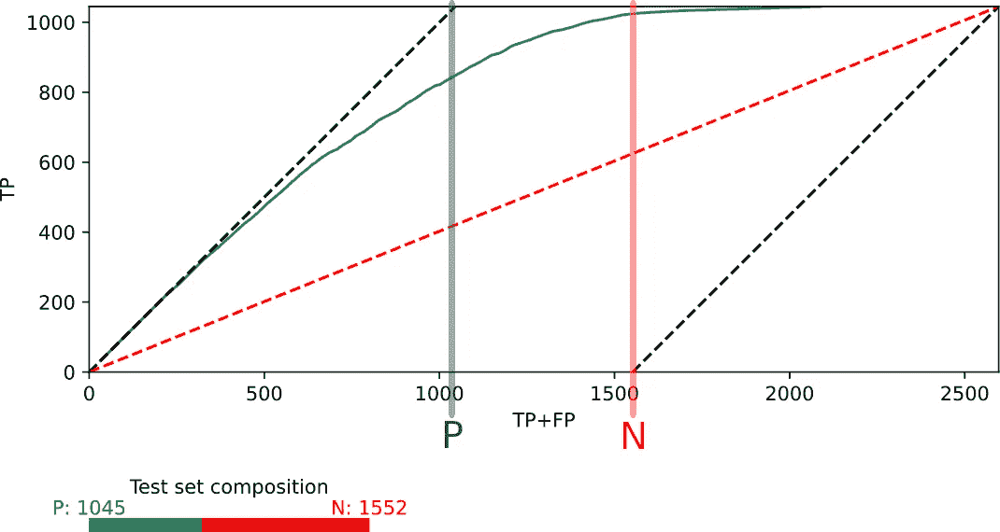*

***图 10:** 对于 0 < P < N，TOC 空间相当宽广。(来源:作者)*

*当我们增加负数的数量超过这一点时，我们会遇到这样一种情况，左边界和右边界的对角线不再在彼此之上，在(P，0)、(N，0)、(N，P)和(P，P)之间有一个矩形区域。*

*因此，TOC 空间现在显得相当大(参见图 10)。*

*最终，我们接近了另一个极端:整个测试集都充满了否定。同样，TOC 空间的两个边界将两个折叠成一条线。*

*这一次，是上限和下限，因此 TOC 空间变成了从 0 到 N 的水平线段(参见图 11)。*

*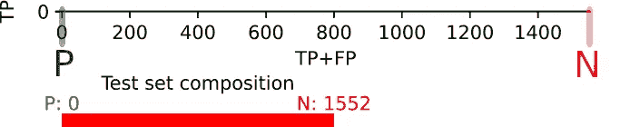*

***图 11:** A 0=P < N，TOC 空间是从 0 到 N 的一维线段(来源:作者)*

*同样，这种崩溃是合理的，因为分类器的结果现在完全由 TN 和 FP 组成，其性能完全由一个参数定义，即其 FPR。*

*我们通过注意到对于 N=P=0 的完全空的测试集的情况(实际上不相关，但是病理上有趣), TOC 空间将进一步折叠，成为单个点，来结束我们的 TOC 空间的往返行程。*

# *讨论*

*TOC 图是统计师工具箱的有用补充。习惯于 ROC 分析的读者可以很快学会解释 TOC 图，因为这两种表示共享许多属性。*

*TOC 曲线比 ROC 曲线包含更多的信息。然而，ROC 图的信息稀疏性也可以被看作是有利的。正如 Fawcett 在他的*ROC 分析简介*【3】:*ROC 图的一个优点是，它们能够可视化和组织分类器性能，而不用考虑类别分布或错误成本。当研究具有偏斜分布的学习或成本敏感学习时，这种能力变得非常重要。研究人员可以绘制一组分类器的性能图，并且该图相对于操作条件(类偏斜和错误成本)保持不变。随着这些条件的改变，感兴趣的区域可能会改变，但是图形本身不会改变。**

*因此，ROC 曲线在 TOC 不是合适替代品的某些情况下仍然适用。*

*当涉及到库支持时，ROC 曲线具有明显的优势。尽管在任何主要的机器学习或统计库中都有现成的用于 ROC 分析的库函数，但由于 TOC 出现的时间相对较短，对它的支持仍然相当有限。有一个由最初 TOC 出版物的作者策划的 [TOC R 包](https://cran.r-project.org/web/packages/TOC/)。然而，如果你愿意多做一点，一个根据概率绘制 TOC 图的函数可以很快用你最喜欢的编程语言实现。*

*最后，我们必须考虑到，图表最终是一种交流的手段。在统计学和机器学习社区，ROC 分析是一个众所周知的标准，ROC 图是直接理解的。相比之下，TOC 分析仍然相对年轻，可能仍然会困扰你的一部分听众。如果你在一个重要的会议上有 10 分钟的时间，你不会想花 5 分钟来解释一个不寻常的图表类型(TOC)，特别是当有一个可供选择的(ROC ),你的听众会马上得到。*

*尽管 TOC 分析还远未被广泛采用，但我希望这篇文章能让你相信，在分析分类器的性能时，这是一个值得尝试的工具。*

# *参考*

*[1] W. Peterson、T. Birdsall 和 W. Fox，信号可检测性理论(1954)，信息理论 IRE 专业组汇刊， **4** (4)，第 171–212 页。*

*[2] R. G. Pontius Jr 和 K. Si，[测量多阈值诊断能力的总操作特性](http://dx.doi.org/10.1080/13658816.2013.862623) (2014)，国际地理信息科学杂志 **28** (3)，第 570-583 页*

*[3] T. Fawcett，[ROC 分析介绍](https://doi.org/10.1016/j.patrec.2005.10.010) (2006)，模式识别字母 **27** ，861–874 页*

*[4] [成人数据集](http://archive.ics.uci.edu/ml/datasets/Adult) (1996)，通过 Dua，d .和 Graff，C. (2019)， [UCI 机器学习知识库](http://archive.ics.uci.edu/ml)提供*