# 建造一个人工智能机器人来玩石头、剪子、布

> 原文：<https://towardsdatascience.com/rock-paper-scissors-ai-bot-janken-ee2d3089b778?source=collection_archive---------43----------------------->

## 了解如何做同样的事情

**AI Bot 名称**:Janken
使用的技术 : TensorFlow、Keras、Numpy、SqueezeNet &打开 CV

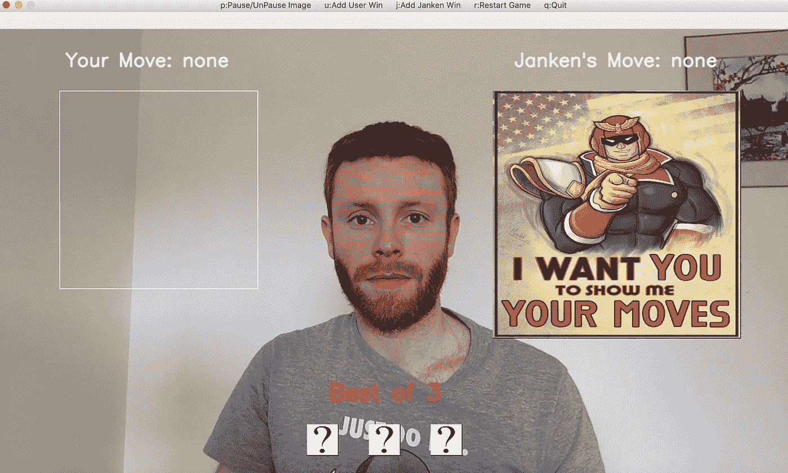

都是通过 python 脚本执行的。通过键盘敲击进行游戏设置。

**TL；博士**

如果你想开始运行，你可以直接到我的 GitHub 和克隆。
[https://github.com/DarrenBro/rock-paper-scissors-ai](https://github.com/DarrenBro/rock-paper-scissors-ai)
自述文件上有详细的说明你可以遵循。

在 Github 项目中，我包含了模型示例、项目的依赖项、SqueezeNet 模型(稍后会提到)和测试图像。

即使你以前从未使用过 ML 或 python，我也尽量使入门变得简单。

本文的其余部分将集中在成就 Janken 的 4 个步骤上；

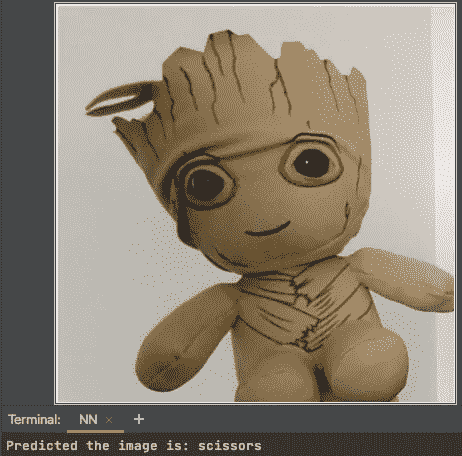

本地网络摄像头——Janken 并不总是做对

1.  **收集数据
    (什么看起来合适)**
2.  **挤压网络和训练神经网络**
3.  **测试模型**
4.  **玩游戏！**

> **收集数据——什么是合适的**

我们希望收集 4 种类型的图像(石头、布、剪刀和背景/噪声),并将它们映射为我们的输入标签。我们只需要将它们编入索引。

在机器学习中，当具有正确答案的数据集可用时，它可以被视为一种超级监督学习的形式。这种形式的训练是“图像分类”，我们知道正确的标签，Janken 属于**监督图像分类**。

因此，我们希望每个类别都有数百张图片，这需要我们做一些工作，但我们通过一个简单的开放 CV 脚本在几秒钟内收集所有这些图片，减少了繁重的工作。

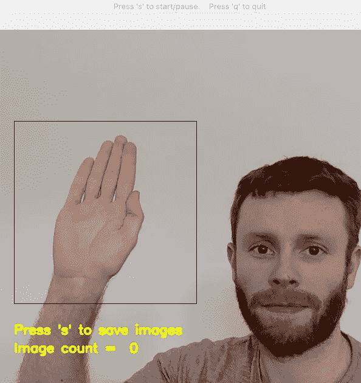

这在 Github 自述文件中有解释

需要注意的事项。

**保持所有输入图形一致** 如果数据不一致，你很容易陷入如下错误。形状。

*ValueError:检查时出错:预期 squeezenet_input 具有 shape (None，300，300，3)，但得到的数组具有 shape (1，227，227，3)。*

所以有了我上面的图，捕捉然后存储你的数据，你可以在几秒钟内自动收集 100 张图像。

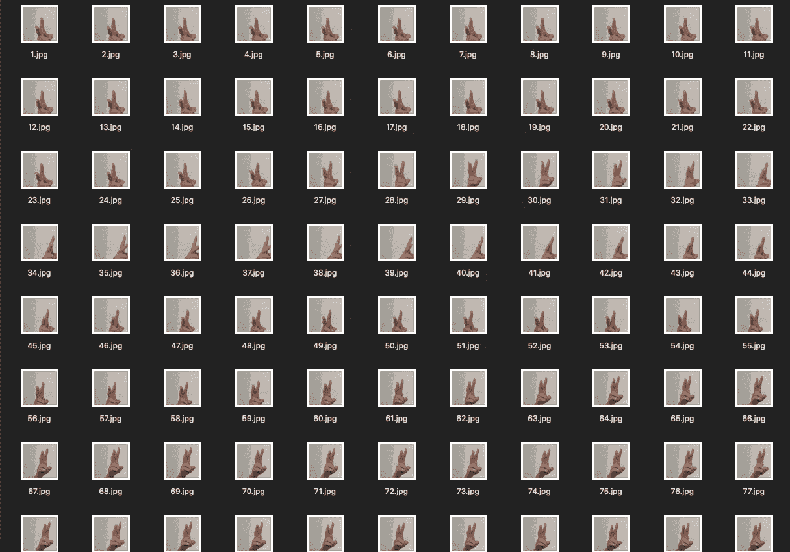

本地网络摄像头——尝试获得尽可能多的不同角度

**移除偏置**

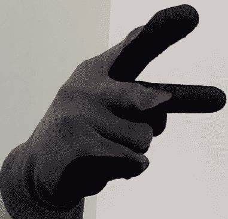

本地网络摄像头——我戴着手套的手扩大了数据范围

ML 中的一个巨大领域是拥有一个具有良好通用性的模型。

数据的多样性足以用来训练吗？100 多张我自己的手的图像可能很难识别除了我以外的任何东西。

我的临时解决方案是用一只戴着手套的手来鼓励 CNN 关注手势的特征。

然后我扩展了这一点，伸出手从量子单元收集图像，并训练进一步降低我的偏见。

*一个改进的想法* —保持所有训练图像为黑白，并将游戏图像也转换为 BW 彩色。

最后需要注意的一点是:当我在抓图时用手调整角度，一些照片在运动中变得模糊了。重要的是通过移除来清除它们，因为它们只会混淆模型来识别静态图像，就像在游戏中一样。

**噪音污染** **/灯光
‘**噪音’的意思是背景或者除了手势以外的任何东西。关于这一点的一点是，我有麻烦让 Janken 认识到还没有播放，它会在预测之间跳跃。所以在训练中保持一个稳定的背景不是最好的选择，我可以在数据中混合更多的对比、阴影、海报、门，只是更多的自然房屋和办公室物品。

> **挤压网络和训练神经网络**

这里有很多要说的，我在我的 GitHub 里给代码加了很多注释(上下链接)，这里要重点关注的文件叫做“train_model.py”。

**Keras** 

让我们的标签输入映射到索引值，因为这是神经网络识别它们的方式。

```
INPUT_LABELS = {
    "rock": 0,
    "paper": 1,
    "scissors": 2,
    "noise": 3
}
```

在那之后，我决定走“顺序模式”。

一种允许简单的 1-1 映射的设计，在 ML 术语中，它允许层接受 1 个输入张量并创建 1 个输出张量。例如，顺序允许神经网络(NN)将纸张图像识别为值 1。

```
model = Sequential([
    SqueezeNet(input_shape=(300, 300, 3), include_top=False),
    Dropout(0.2),
    Convolution2D(LABELS_COUNT, (1, 1), padding='valid'),
    Activation('relu'),
    GlobalAveragePooling2D(),
    Activation('softmax')
```

以上是我们的模型定义，Janken 的核心，这是我们需要做的所有架构设计，大部分工作是在我们编译和拟合模型之前收集、清理和整形数据。

我很快会谈到“挤压网”。下面的所有东西都被认为是一个层(keras.layers)，它们都很重要，所以让我们花一分钟来解释每一个。

**退出**添加以减少过拟合，0.2 = 20%，因此在整个训练过程中，退出结果的 1/5，以保持模型学习新方法，而不变得陈旧。这种高达 50%的情况并不少见。

**Convolution2D** 通过第一个参数 LABELS_COUNT 控制图层的大小，总共 4 个，(3 个手势+噪波)标签。它被附加到已经定义的神经网络‘SqueezeNet’上。

**激活(ReLU)** 整流线性单元将负值变为 0 并输出正值。
**为什么是**？激活函数负责获取输入并为输出节点分配权重，模型不能很好地与负值协调，它在我们期望模型如何执行的意义上变得不一致。

𝑓(𝑥) = max{0，𝑥} = > relu 单元的输出为非负。返回 x，如果小于零，则 max 返回 0。

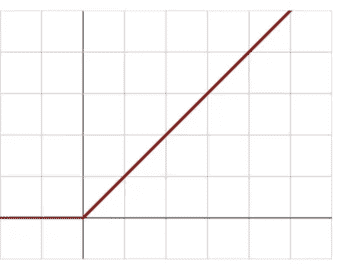

ReLU 在正端产生一条直线，负端是一个平坦的零点

ReLU 已经成为许多类型的神经网络的默认激活函数，因为使用 ReLU 的模型更容易训练，并且通常实现更好的性能和良好的模型收敛性。

这并不是所有的结束，它可能会导致一个问题，称为“死亡 ReLU”。如果你返回太多的负数，你不会希望它们都变成 0，而是以负的线性方式返回。如果您有兴趣了解更多信息，请搜索“ **Leaky ReLU** ”。

**globaveragepool2d**进行分类，计算上一层各特征地图的平均输出。
即数据简化层，为激活(“softmax”)准备模型。

**激活(softmax)** 给出每个手势的概率。
我们有一个 4 图像类(问题)，‘soft max’处理多类，任何超过 2 的。

**挤压网**

这是一个用于图像分类的预建神经网络，这意味着我们可以专注于它的扩展，以实现我们构建 Janken 的目的，这本身就足够了，而不是从头开始创建神经网络。光是训练时间就可能是几天。

你用 SqueezeNet 得到的奖金；

1.  较小的卷积神经网络(CNN)在分布式训练中需要**较少的跨服务器通信**。
2.  导出新型号所需的带宽更少。
3.  更小的 CNN 更适合部署并且使用更少的内存。

重新访问培训脚本中的代码行。

```
SqueezeNet(input_shape=(300, 300, 3), include_top=False)
```

# **input_shape** 是一张尺寸为 300 x 300 像素的图片。3 代表 RGB 颜色范围。

# **include_top** 让您选择是否需要最终的密集层。

# **密集层**能够解释发现的模式，以便对图像进行分类。这张图片包含了岩石。

#设置为**假**因为我们已经标记了岩石数据的样子。

卷积层作为**特征**提取器工作。他们识别图像中的一系列图案，每一层都可以通过看到图案的图案来识别更精细的图案。

**重量说明:**

*   卷积层中的权重是固定大小的。卷积层不关心输入图像的大小。它只是进行训练，并根据输入图像的相同大小呈现结果图像。
*   密集图层中的权重完全取决于输入大小。它是每个输入元素的一个权重。因此，这要求你的输入总是相同的大小，否则你不会有适当的学习权重。

因此，将最终密集图层设置为 false 可让您定义输入大小(300 x 300)。(并且输出大小会相应增加/减少)。

> 测试模型

在脚本“ **test_model** ”中，您可以在您已经处理过的图像或模型从未见过的新图像上看到模型预测。

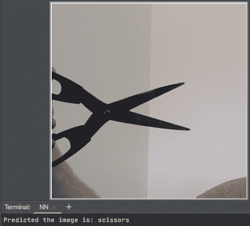

有时这是正确的

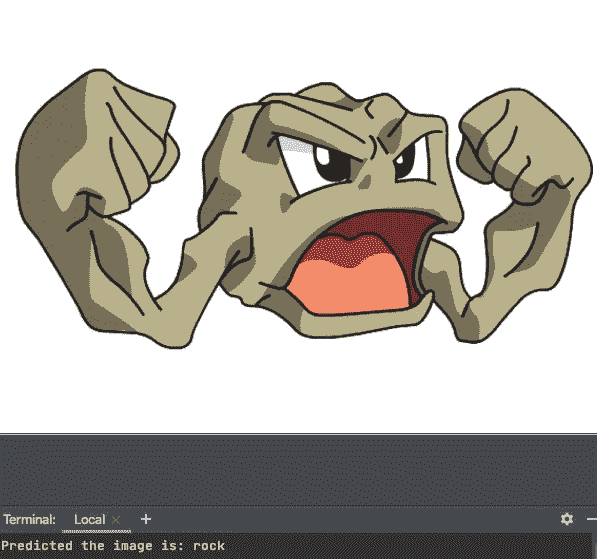

有时候你很幸运

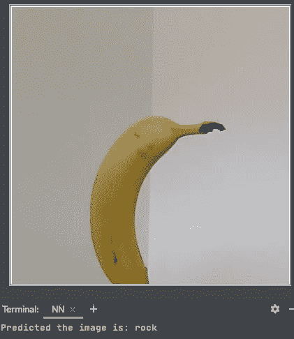

其余 90%的时间你只是叹息

该脚本处理您想要提供的任何新图像，因为它将使用 open CV 重新整形为 300x300。

> **玩游戏！**

*对 Janken 游戏结果的预测*
我想象 Janken 将做出的预测会“闪烁”很多，因为移动的摄像机图像将总是提供不同的输入来分析和运行模型。

照明将发挥很大的作用，所以我试图分割我的数据集，并在一天的不同时间收集图像。

静态背景或控件冻结图像将有助于做出更稳定的手势预测。

**结果如何？**

Janken 并没有考虑到锁定，所以一个“优雅”的解决方案是通过 mac 的网络摄像头将其他人播放到显示器上与另一个玩家共享的屏幕上。

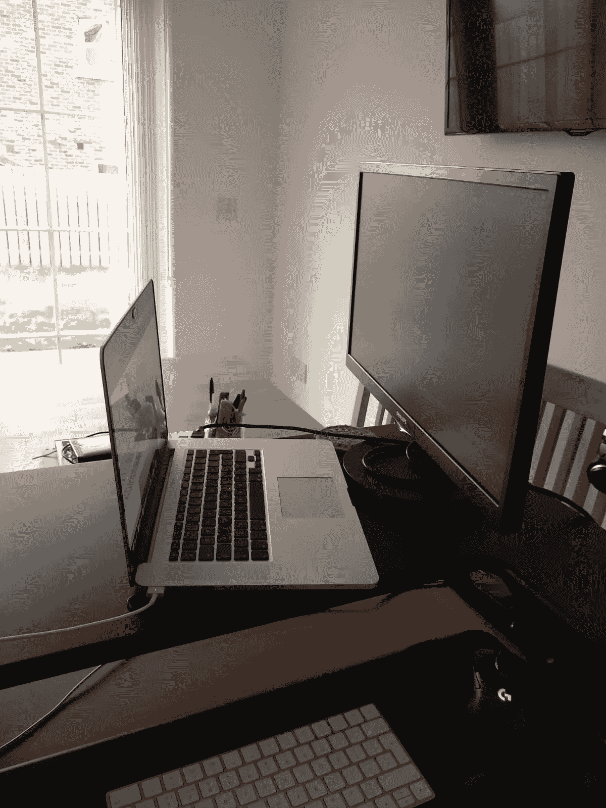

我知道你印象深刻

然而，Janken 只能不断地击败我，它能够通过显示器从其他玩家那里赢得 50%的手势，但我怀疑相机图像和处理的性质使 Janken 很难可能做出所有的手势。

为了改进模型，我应该通过我的网络摄像头收集来自用户的图像，给 Janken 更多的概括。

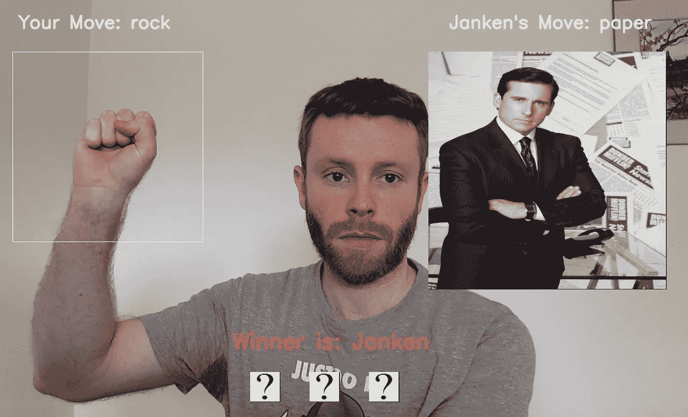

总的来说，我真的很喜欢我学到的一切，这个项目中没有一项技术是我熟悉的。把学习变成游戏是很棒的。

最后，我添加了一些用户控件，希望能增加三局两胜的游戏体验。
主要说明位于灰色标题上。

安静点。

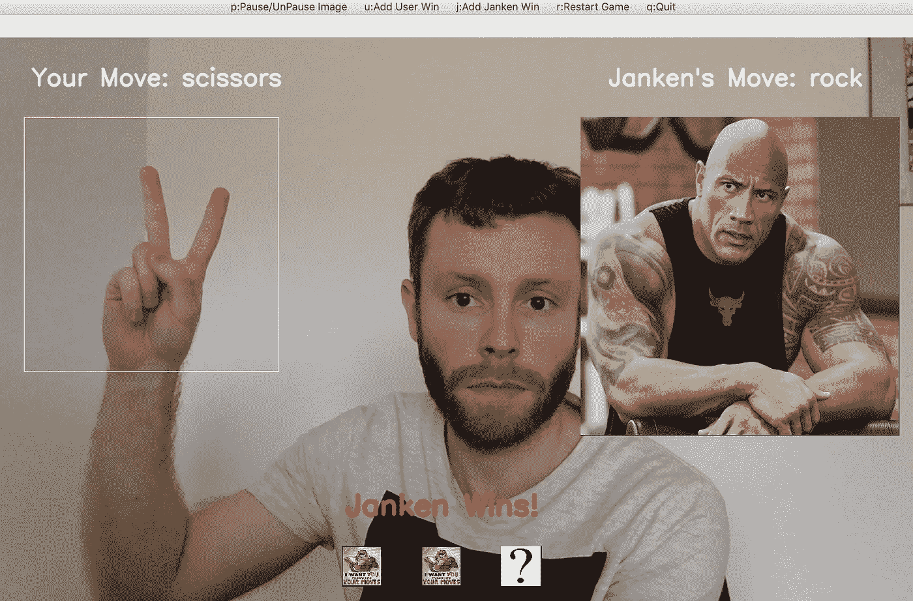

截图的时候总是忘记微笑:)

**资源**

**全代码 GitHub 链接**

[](https://github.com/DarrenBro/rock-paper-scissors-ai/blob/master/collect_image_data.py) [## 达伦布罗/石头剪子布人工智能

### 人工智能机器人和人类玩石头剪刀布

github.com](https://github.com/DarrenBro/rock-paper-scissors-ai/blob/master/collect_image_data.py) 

**Keras API**

[](https://keras.io/api/) [## Keras 文档:Keras API 参考

### Keras 文档

:Keras API 参考 Keras 文档 keras.io](https://keras.io/api/) 

**SqueezeNet 信息**

[](/review-squeezenet-image-classification-e7414825581a) [## 回顾:挤压网(图像分类)

### AlexNet 级精度，参数减少 50 倍

towardsdatascience.com](/review-squeezenet-image-classification-e7414825581a)  [## SqueezeNet: AlexNet 级别的精度，参数减少了 50 倍，并且<0.5MB model size

### Recent research on deep neural networks has focused primarily on improving accuracy. For a given accuracy level, it is…

arxiv.org](https://arxiv.org/abs/1602.07360) 

**O'Reilly (TensorFlow 和 Keras)**

[](https://www.oreilly.com/library/view/deep-learning-with/9781838823412/) [## 使用 TensorFlow 2 和 Keras 进行深度学习-第二版

### 使用最新发布的 TensorFlow 2 和 Keras 构建机器和深度学习系统，用于实验室、生产和…

www.oreilly.com](https://www.oreilly.com/library/view/deep-learning-with/9781838823412/)