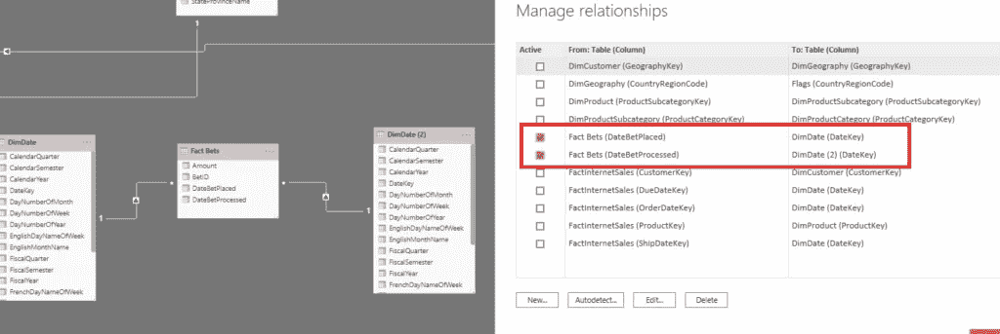
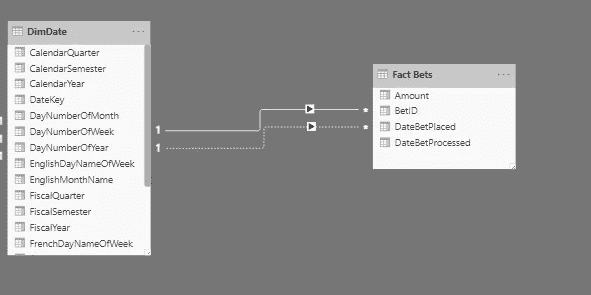
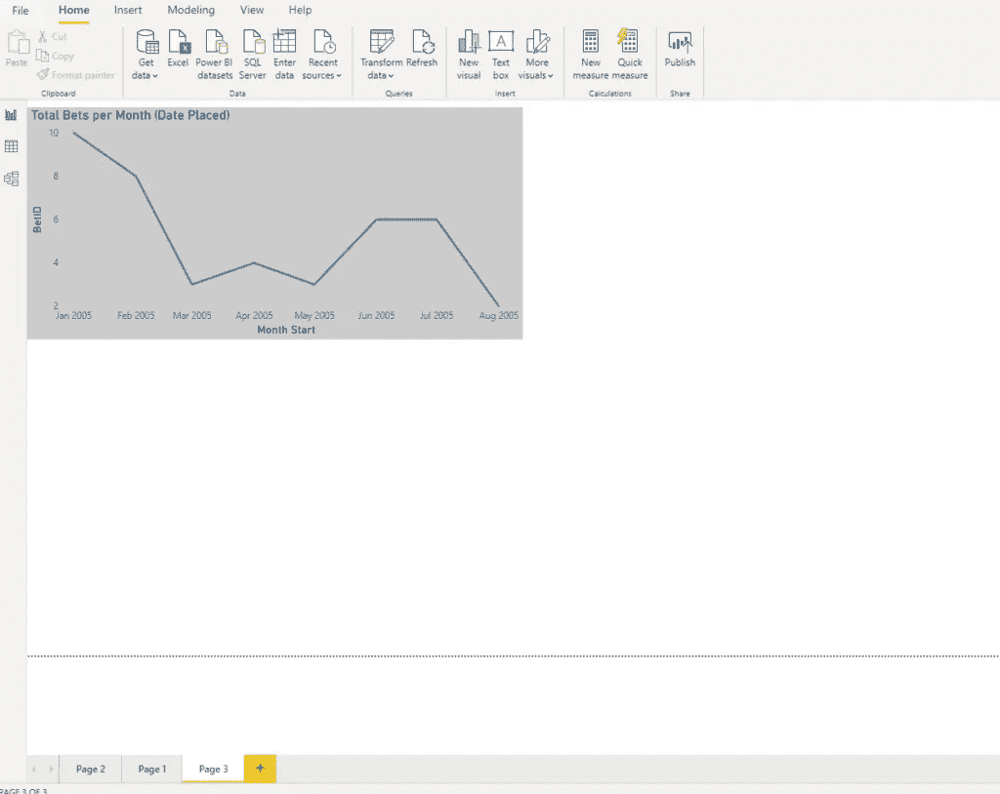
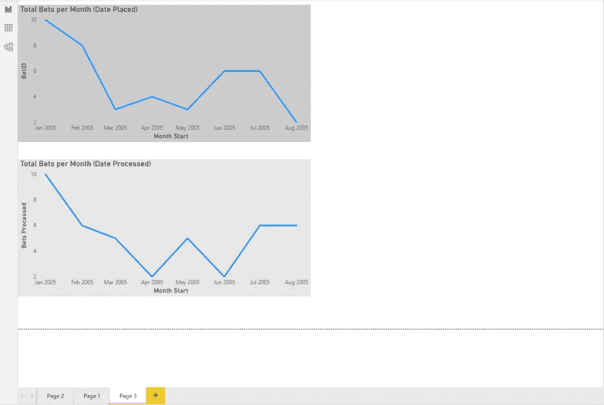

# 权力 BI 中的角色扮演维度

> 原文：<https://towardsdatascience.com/role-playing-dimensions-in-power-bi-185dc58f90f1?source=collection_archive---------17----------------------->

## 检查这个简单的建模技术，以避免数据模型冗余

在解释了如何通过简单地遵守一些简单的规则来[将 Power BI 数据模型的大小减少 90%](/how-to-reduce-your-power-bi-model-size-by-90-b2f834c9f12e) ，并理解了如何通过 VertiPaq 引擎在后台优化您的[数据模型之后，现在是学习维度建模的核心概念之一的最佳时机。](/inside-vertipaq-in-power-bi-compress-for-success-68b888d9d463)


Marko Blazevic 在 Pexels 上拍摄的照片

角色扮演维度并不是 Power BI 独有的概念。这是一种通用的数据建模技术，来自[金博尔的方法论](https://www.kimballgroup.com/data-warehouse-business-intelligence-resources/kimball-techniques/dimensional-modeling-techniques/role-playing-dimension/)。

简而言之，这就是当您使用一个相同的维度为您的事实表创建多个关系时的情况。角色扮演维度概念的典型用法是用[表示日期维度](/tiq-part-3-ultimate-guide-to-date-dimension-creation-98b951ffa68c)，因为在许多情况下，您的事实表将包含多个日期字段。例如，在博彩行业中，有 DateBetPlaced 和 DateBetProcessed 字段，它们不需要相同(在大多数情况下也不需要相同)。因此，假设业务请求是分析 DateBetPlaced 和 DateBetProcessed 上的数据。

## 一维多重引用的解决方案

第一种解决方案是创建两个完全相同的日期维度的副本，并在第一种情况下将 DateKey 关联到 DateBetPlaced，在第二种情况下关联到 DateBetProcessed。大概是这样的:



如您所见，事实表中的每个日期字段都与其自己的日期维度相关。我们说这些引用中的每一个都在模型中“扮演”它的角色。

当然，这种模型并不是最佳的，因为我们基本上是在没有有效理由的情况下使数据冗余。此外，为了获得有效的结果，我们需要为日期维度的每个引用使用单独的过滤器。

## 优化模型

我们可以将一个维度多次关联到一个事实表，而不是保留同一个维度的多个引用。这个概念在不同的工具中有不同的表现(例如，在 SSAS 多维数据库中，如果数据源视图有适当的外键，您可以在维度和事实表之间定义多个活动关系。但是，这超出了本文的范围)，所以我将重点讨论 Power BI。

因此，我将从我的数据模型中删除冗余的 Date 维度，并将 Date 维度中的 DateKey 连接到事实表中的 DateBetProcessed 字段。



这里发生了什么？Power BI 创建了一个关系，但是正如你注意到的，这个关系是用虚线标记的。这是因为 Power BI 只允许两个表之间有一个活动关系，在我的例子中，是在 DateKey 和 DateBetPlaced 之间。所以，当我把它放在报告画布上时，我会得到这样的结果:



我可以看到每月下注的总数，但是由于我的活动关系是在 DateKey 和 DateBetPlaced 之间，所以我看到的总数是基于下注日期的！

如果我想看，而不是下了多少注，每月有多少注**被处理**呢？这里涉及到 DAX 功能 [*用户关系*](https://dax.guide/userelationship/) 。此功能使我们能够定义对于特定计算哪个关系应该是活动的。

所以，当我写出下面的度量时:

```
Bets Processed = CALCULATE(
                    COUNT('Fact Bets'[BetID]),
                    USERELATIONSHIP(DimDate[DateKey],'Fact Bets'[DateBetProcessed])
)
```

我在明确的对 Power BI 说:在这里，我不希望你使用默认的主动关系(DateKey — DateBetPlaced)。相反，我希望您切换到使用另一个关系(DateKey — DateBetProcessed ),并使该关系仅对该计算有效！

结果如下:



您可能会注意到，根据计算中使用的关系，线条是不同的。

## 结论

使用这种技术，我们使我们的用户能够从不同的角度分割数据，并给予他们基于多种场景分析数据的灵活性，从而保持我们的数据模型整洁而不冗余。

成为会员，阅读媒体上的每一个故事！

订阅[这里](http://eepurl.com/gOH8iP)获取更多有见地的数据文章！