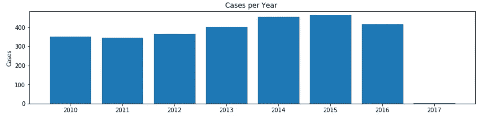
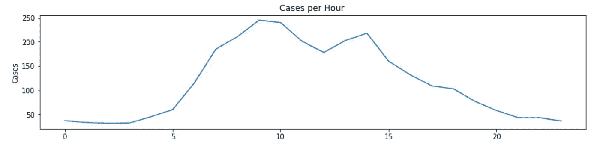
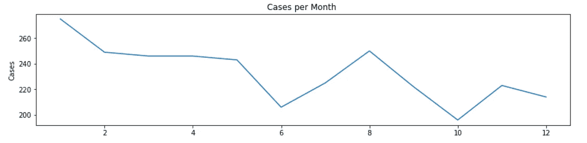
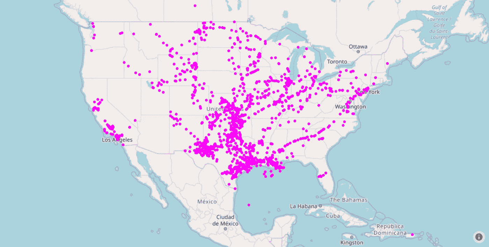
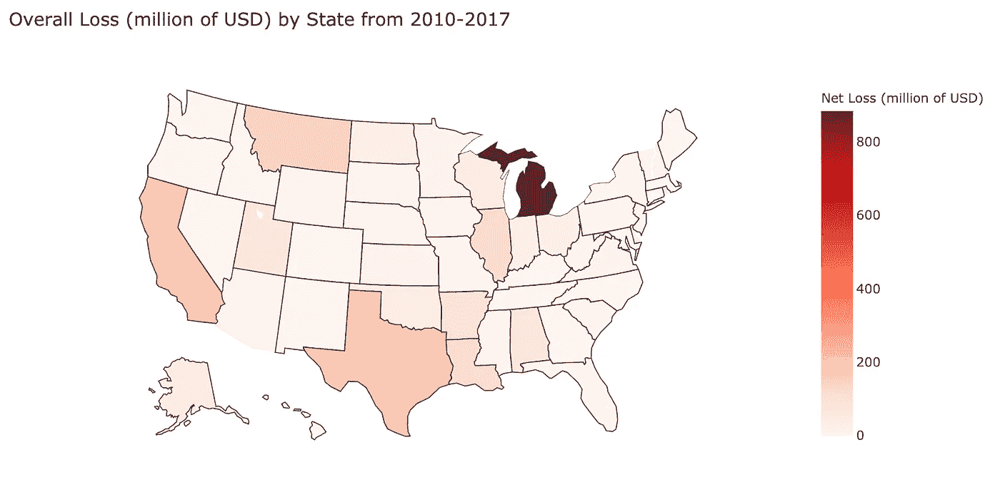
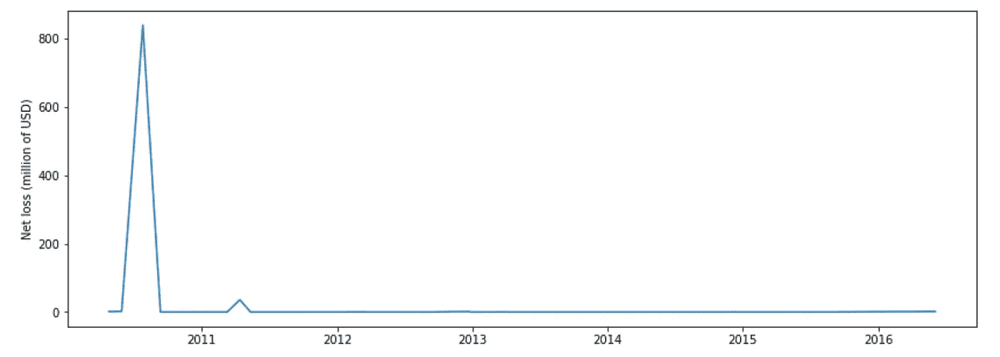
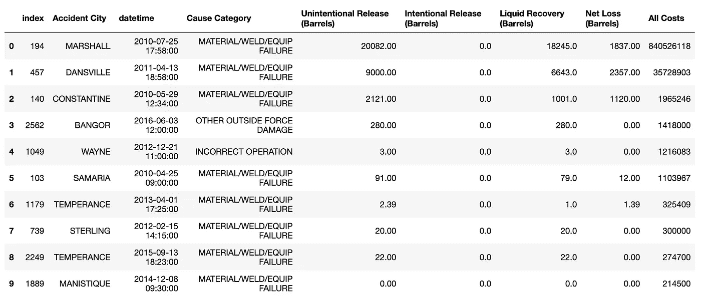
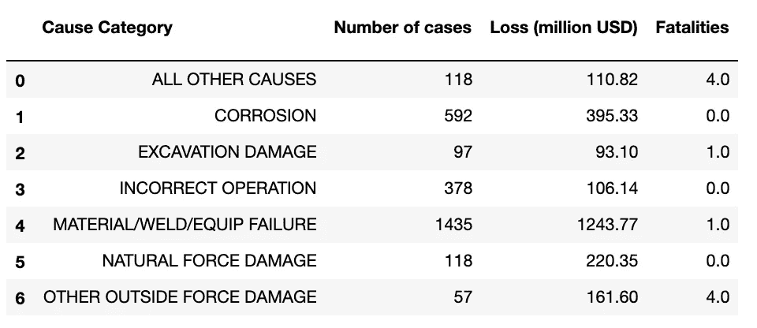
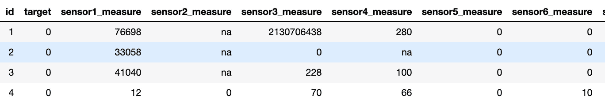
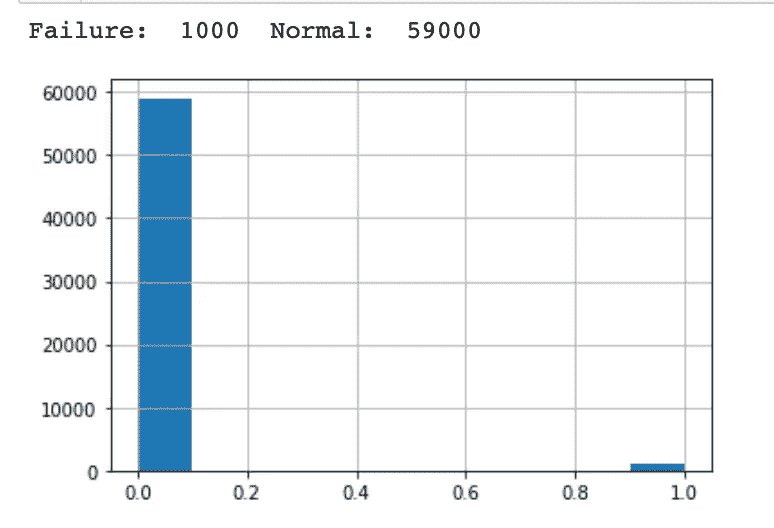

# 追踪石油泄漏

> 原文：<https://towardsdatascience.com/rolling-in-the-deep-589f3460960f?source=collection_archive---------20----------------------->

## 我从漏油到应用人工智能预测设备故障的旅程

# 一)动机

在求职过程中，我发现我所在地区的许多公司都在寻找具有石油和天然气知识的数据科学家。我的背景大部分是关于数学的，所以我决定沿着石油管道去冒险。

我注意到的一件事是，石油和天然气是一个庞大的行业，基础设施陈旧。2014 年，Inside Energy 报告称，美国 45%的原油管道已经超过 50 年。有些管道甚至在 20 世纪 20 年代以前就铺设好了，而至今仍在运行。这种古老、老化的基础设施可能会导致灾难，如漏油，从而影响公司收入、环境和周围地区的人们。

那么，所有这些石油泄漏的罪魁祸首是什么呢？让我们潜入油中！

# 二)2010-2017 年石油管道事故

[数据](https://www.kaggle.com/usdot/pipeline-accidents)包括从 2010 年到 2017 年向管道和危险材料安全管理局报告的每个石油管道泄漏或溢出的记录。在 7 年多的时间里，发生了 2795 次泄漏。有 46 个特征描述每个事件。其中值得注意的有:*事故日期和时间、操作者姓名、事故原因、危险液体类型、损失数量、伤亡人数以及相关成本*

数据丰富，描述性强。我选择了一些有趣的特性，并从这里开始

## 1)事件是如何按年、月和一天中的小时分布的？

每年的病例数。资料来源:Huy Bui

观察 2017 年有未完成的数据。最高峰是 2015 年的 462 例

按日期的小时数列出的案例数

这里没有调整时区，但是我可以有把握地假设大多数情况发生在营业时间。

每月病例数。资料来源:Huy Bui

有趣的是，12 月份只有几起案件(212 起)。但在 1 月份，它急剧增加(275)。我想知道，由于运营从旧的一年过渡到新的一年，这里是否有一种趋势，或者，这可能只是一月份发生的一系列随机泄漏？

## 2)这些事故发生在哪里？

2010-2017 年所有事故的位置。资料来源:Huy Bui

根据我由`plotly`创建的地理图，在我看来泄漏发生在管道沿线。德克萨斯州是所有州中事故最多的州(1004 起)。这并不奇怪，因为德克萨斯州是美国最大的国内石油生产商。我以为德州会损失最多的钱，但事实并非如此…

## 3)每个状态的净损失是多少？

各州净损失(2010–2017)。资料来源:Huy Bui

让我们来看看赔钱最多的三个州:

**第三名** **得克萨斯**发生 1004 起事故，损失 135580 桶，净亏损 18475 万桶

**第二名加州**，事故 153 起，损失 3390 桶，净亏损 192 桶。密耳

而**冠军**是…密歇根州 29 起事故，5355 桶损失，834 百万桶

我的假设是完全错误的，事故数量**与净损失**并不相关。此外，桶损失的数字没有考虑到钱去了哪里。

拼图中缺失的部分是**其他特征，**我天真地认为它们不重要。我应该考虑的其他特征是:

*   管道关闭
*   财产损失成本
*   商品成本损失
*   应急响应成本
*   环境补救费用

## 4)那么……密歇根到底发生了什么？

密歇根净亏损时间序列(百万美元)。资料来源:Huy Bui

你看到的 2010 年的高峰占了密歇根州总净亏损的 95%,占了 7 年间美国总净亏损的 36%!稍加研究表明，这一事件就是 7 月 25 日的**卡拉马祖河漏油事件**。当**安桥**(6B 线)运营的一条管道爆裂并流入**塔尔马奇溪**时，长达 18 个小时无人察觉。工作人员误解了异常压力数据，认为这是由管道中的气泡引起的。因此，他们重新启动了输油管两次，使得漏油速度大大加快。

密歇根十大事件列表将让你更好地了解卡拉马祖河漏油事件对该州造成了多大的损害。

密歇根十大事故(按净损失排名)。资料来源:Huy Bui

## 5)漏油的罪魁祸首是什么？

**设备故障**是这个问题的简答。当涉及到解释具有许多参数的数据时，人的能力是非常有限的。手动读取数据会导致忽略异常情况，并对业务造成严重损害。事实上，材料/焊接/设备故障占所有原因损失的 53%。

原因类别和不同特征之间的关联。资料来源:Huy Bui

幸运的是，随着机器学习的增长，许多大型石油公司已经开始将人工智能应用到他们的基础设施中，以帮助防止设备故障，并使他们的业务受益。

# III)预测性设备故障

回到 2019 年 10 月，我参加了德克萨斯 A&M 大学主办的数据马拉松。挑战之一是使用由康菲石油公司赞助的传感器 [**数据**](https://www.kaggle.com/c/equipfails/data) 预测井下设备故障。我没有做这个挑战，但是我对这个问题很感兴趣，并且仍然记得它。之前的分析给了我足够的动力，让我回头再看一遍这个数据集。

传感器数据的样本。资料来源:Huy Bui

训练集由 60000 个观察值和 170 个传感器值组成。这些传感器分为两种类型:

*   `measure:`传感器的单次测量。
*   `histogram bin:`一组 10 个柱，它们是传感器的不同柱，显示它们随时间的分布。

工作是对观察结果是**故障**还是**非故障**进行分类。下面的直方图显示了列车组分布:

列车组中“故障”和“未故障”的分布。资料来源:Huy Bui

数据包含许多空值。我必须创建一个函数，接受不同的阈值，逐个处理丢失的值，并超调这个函数以获得最佳结果。我用`xgboost`来做预测，用`f1-score`作为度量。

我将我的模型应用于测试集上的 16001 个不同的观察值。提交预测后，我在第一次尝试中获得了 0.99383。

# 四)结论

如果石油工业投资研究人工智能，他们会更快地发现有缺陷的设备，更有效地防止灾难，并节省大量资金。具体来说，Kalamazoo 河漏油事件本来可以用机器学习来避免。

我希望你喜欢阅读我的文章，并跟随我踏上这一旅程。感谢任何反馈。如果你想看看数据，玩玩`plotly`交互图，判断一下我的技术知识，这里是[链接](https://github.com/williamhuybui/Oil-Gas-Leakage-Analysis-and-Equipment-Failure-Detection)。