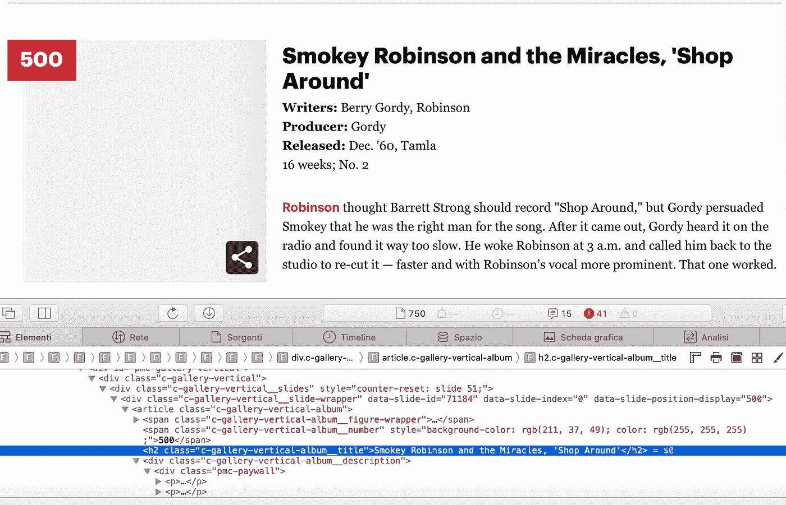
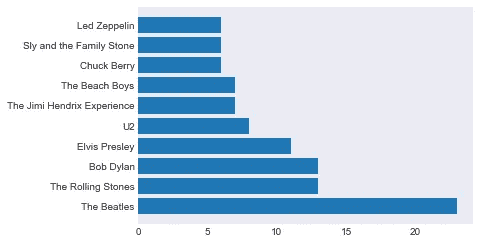

# 是什么让一首歌伟大？第一部分

> 原文：<https://towardsdatascience.com/rollingstone-for-medium-f1f638b9568e?source=collection_archive---------49----------------------->

## [什么让一首歌变得伟大](https://towardsdatascience.com/tagged/what-makes-a-song-great)

## 使用 Selenium 和 BeautifulSoup 在 Python 中动态抓取生成的内容


Natalie Cardona 在 [Unsplash](https://unsplash.com?utm_source=medium&utm_medium=referral) 上拍摄的照片

**【这是** [**系列三篇文章中的第一篇**](https://towardsdatascience.com/tagged/what-makes-a-song-great)

## **Web 抓取、可视化、列表理解、正则表达式、熊猫！这个项目拥有一切——包括泡菜！**

***【2020 年 9 月 1 日更新:自本文首次发表以来，《滚石》已将源代码改为其页面。因此，我已经更新了代码，允许检索动态生成的内容。】***

**一旦你学会了一些编码和基本的数据科学技能，标准的建议是去做项目，做很多项目。不幸的是，我们中的许多人很难找到这样的项目。**

**前几天我在翻*滚石*的 [*有史以来最伟大的 500 首歌*](https://www.rollingstone.com/music/music-lists/500-greatest-songs-of-all-time-151127/) 的榜单。我开始问自己:‘谁的歌在榜单上最多？或者:“会偏向于过去几十年，因为这些评论家可能还不到 20 多岁？”？。在我开始这个项目的第二天，我就一直在寻找一个能够让我将一些**网络搜集**技术与一些探索性数据分析( **EDA** )结合起来的项目。我从中获得了很多乐趣:我希望通过分享它，你也能学到一些东西并从中获得乐趣。**

**我将在这里展示的是许多库、工具和技能集:这是一个端到端的项目，从数据检索开始，到可视化结束，涉及解析、清理和分析数据。我们将涉及的一些内容:**

*   **网页抓取(使用`BeautifulSoup`和`Selenium`**
*   **正则表达式(使用 Python 的`re`模块)**
*   **API(即 Spotify 的)(使用`spotipy`)**
*   **数据分析和可视化(用`pandas`和`matplotlib`)。**

**我会认为这个项目适合高级初学者到中级程序员。它本身并不复杂:但它确实涉及许多不同的领域。注意，HTML 和 CSS 的一些非常基础的知识对于第一部分可能是有用的。**

## **网络搜集:获取数据并清理数据**

**首先，让我们导入我们需要的库。**

```
# webscraping libraries
import urllib # to retrieve web pages
from bs4 import BeautifulSoup # to parse web pages
from selenium import webdriver # to retrieve dynamically generated content
import time  # allows us to wait before scraping or interacting with web pages# data, cleaning, analysis and visualization
import pandas as pd # the goto python library for data cleaning and analysis
import matplotlib.pyplot as plt # the goto python library for data visualization
import seaborn as sns # data visualization (but nicer!)
import re # Python's library for regular expressions (see more below)# to interact with Spotify's API
import spotipy # to query Spotify's API
from spotipy.oauth2 import SpotifyClientCredentials # for API login # display charts in jupyter notebook
%matplotlib inline
```

## **第一步:用硒和美丽的汤刮动态生成的内容**

**打开浏览器，导航至[我们的列表](https://www.rollingstone.com/music/music-lists/500-greatest-songs-of-all-time-151127/)。首先，请注意，该列表是以 50 为一组进行“分批”的。这告诉我们，一旦我们开始抓取，我们可能需要迭代不同的地址来获取我们的数据——稍后将详细介绍。**

**向下滚动我们找到我们的歌曲。我们要检索五类数据:**

*   **艺术家**
*   **歌曲名称**
*   **作者**
*   **生产者**
*   **发布日期**

**如果你`ctrl-click`(在 Mac 上)点击页面的一个元素，并从弹出的菜单中选择**检查**，你会看到相应的 HTML 高亮显示。在这种情况下，要获得艺术家和歌曲的标题，我们需要查找标签为`<h2>`的元素，该元素属于类`c-gallery_vertical-album__title`。**

****

**检查 web 元素**

**通常，我们会使用`urllib`检索页面，并使用参数`html.parser`将结果传递给[beautiful soup](https://www.crummy.com/software/BeautifulSoup/bs4/doc/):BeatifulSoup 会解析我们检索到的 HTML，并允许我们找到使用`find_all`方法识别的元素。
然而，事实证明页面是动态生成的(如果你查看源代码，你不会发现任何这些元素)。因此，首先我们将使用`[Selenium](https://selenium-python.readthedocs.io)`来模拟浏览器打开页面，然后才检索内容。**

```
def get_page_source(url):
    """
    Input: a str (the target url)
    Returns: a Beautiful Soup object (the parsed page source)
    -----------------------------------------------------------------------
    Retrieves the target page's contents and passes them to Beautiful Soup.
    -----------------------------------------------------------------------
    """
    options = webdriver.ChromeOptions()
    options.add_argument('--ignore-certificate-errors')
    options.add_argument('--incognito')
    options.add_argument('--headless')
    driver = webdriver.Chrome(options=options)
    time.sleep(10) # sleep for 10s to allow the page to load
    target_page = url
    driver.get(target_page) 
    page_source = driver.page_source #get the contents
    soup =  BeautifulSoup(page_source)
    driver.quit() # close the driver
    return souptarget_url ="https://www.rollingstone.com/music/music-lists/500-greatest-songs-of-all-time-151127/smokey-robinson-and-the-miracles-shop-around-71184/"
soup = get_page_source(target_url) # pass the HTML contents to Beautiful Soup for parsing.
```

**现在使用 Beautiful Soup 的`find_all`方法，并传递适当的 CSS 标识符，我们就可以检索到我们定位的所有项目。**

```
song_all = soup.find_all('h2', {'class':'c-gallery-vertical-album__title'})
song_all[0]<h2 class="c-gallery-vertical-album__title">Smokey Robinson and the Miracles, 'Shop Around'</h2>
```

**好吧，我们有进展了。让我们进一步挖掘。**

## **第二步:用正则表达式清理**

**列表项不仅包含我们正在寻找的数据，还包含 HTML 标签。为了只获取数据，我们使用`get_text()`如下:**

```
song_all[0].get_text()"Smokey Robinson and the Miracles, 'Shop Around'"
```

**可恶。很多格式，空白，额外的引号。我选择通过`re`模块使用[正则表达式](https://en.wikipedia.org/wiki/Regular_expression)或 *Regex* 来清理数据。**

**RegEx 是一种功能强大的微编程语言，对于搜索字符串中的字符模式非常有价值。它有一个相当陡峭的学习曲线，所以我尽量经常使用它:正如他们所说:练习，练习，练习！(点击下面的正则表达式介绍)。**

**[](https://medium.com/better-programming/introduction-to-regex-8c18abdd4f70) [## 正则表达式简介

### 使用 Python 逐步介绍正则表达式

medium.com](https://medium.com/better-programming/introduction-to-regex-8c18abdd4f70)** 

```
def strip_extra_chars(line):
    """
    Strips non-alphanumerical, whitespace and newline characters away from string
    """
    line = line.get_text()
    line = re.sub("\A\S[^a-zA-z0-9]", "", line) # remove any non-whitespace non-alphanumeric character from the beginning of the line
    line = re.sub("[’‘]", "", line).strip() # get rid of extra quotes and remove whitespace with .strip()
    line = re.sub("\n", "", line) # get rid of newlines
    return line.strip()
```

**函数`strip_extra_chars`将从我们的数据中提取一行，去掉所有的垃圾，包括那些讨厌的引号。更多细节见函数中的注释，试试[这个](https://regex101.com)是测试和学习 RegEx 的好资源。**

## **步骤 3:遍历列表**

**我们差不多完成了。还记得一开始我们注意到我们的网页只包含 50 首歌曲，因此我们需要迭代内容吗？如果我们通过顶部导航菜单上的`ctrl-clicking`再次检查页面，我们会发现它指向我们需要的 URL。这里我们定义了一个`get_links`函数，它将 URL 存储在一个列表中。**

**然后，我们可以轻松地遍历列表并检索所有数据。**

```
def get_links(url):
    options = webdriver.ChromeOptions()
    options.add_argument('--ignore-certificate-errors')
    options.add_argument('--incognito')
    options.add_argument('--headless')
    options.add_argument("--start-maximized");
    driver = webdriver.Chrome(options=options)
    # note that in order to get all the urls we need to set the browser's window to max size
    driver.set_window_size(1024, 768) 
    time.sleep(10) # sleep for 10s to allow the page to load
    target_page = url
    driver.get(target_page) 
    header = driver.find_element_by_id('pmc-gallery-list-nav-bar-render')
    links = header.find_elements_by_tag_name('a')
    urls = [link.get_attribute("href") for link in links]
    driver.quit()
    return urlsurls = get_links(target_url)
```

**现在我们有了 URL，下一步是将数据存储在列表中。对于每个 URL，我们将启动我们的`get_page_source`功能，提取相关数据，并存储它。我们将每个页面的数据存储到两个列表中:`song_all`，其中包含艺术家和歌曲的标题，以及`other_all`，其中包含关于作者、制作人和发行日期的数据。通过对它们进行迭代，我们提取相关的文本，通过调用我们的`strip_extra_chars`函数去掉多余的字符和格式，并将结果附加到我们之前初始化的三个空列表中:一个用于艺术家，一个用于标题，一个用于其他信息(接下来我们将对其进行解析)。**

```
songs = []
artists = []
other_data = []for url in urls:
    print(f"retrieving data from {url}")
    soup = get_page_source(url)
    song_all = soup.find_all('h2', {'class':'c-gallery-vertical-album__title'})
    other_all = soup.find_all(attrs={'class': 'c-gallery-vertical-album__description'})
    for song in song_all:
        song = strip_extra_chars(song)
        title = song.split(',')[1]
        title_inner = title[2:len(title)-1]
        songs.append(title_inner)
        artists.append(song.split(',')[0])
    for other in other_all:
        other = strip_extra_chars(other)
        other_data.append(other)
driver.quit()
```

**借助正则表达式和一点字符串切片将清理和分割包含在`other`中的数据。我们在一个`split_others`函数中这样做，然后我们在一个循环中调用这个函数来产生三个作者、制作人和发布日期的列表。**

```
def split_others(line):
    x = "(Writers:|Writer:)"
    y = "(Producer:|Producers:)"
    z = "Released:"
    a = re.split(x, line)
    a = re.split(y, a[2])
    writers = a[0].strip()
    b = re.split(z, a[2])
    producers = b[0]
    released = b[1].split(',')[0]
    released
    return writers, producers, releasedwriters = []
producer = []
release_date = []
for item in other_data:
    w, p, r = split_others(item)
    writers.append(w.strip())
    producer.append(p.strip())
    release_date.append(r[-2:].strip())
```

## **第四步:把所有的东西放在一起！**

**就是这样！我们已经取回了我们的数据。我们现在可以使用字典并将我们的数据传递给熊猫，以便将其存储在数据帧中。**

```
d = {'Artist':artists, 'Song title': songs, 'Writers': writers, 'Producer': producer, 'Year': release_date} 
df = pd.DataFrame(data=d)
```

**(可选:因为抓取相当耗时，我将把我们检索到的数据存储在一个`pickle` — [中，这个](https://www.datacamp.com/community/tutorials/pickle-python-tutorial?utm_source=adwords_ppc&utm_campaignid=898687156&utm_adgroupid=48947256715&utm_device=c&utm_keyword=&utm_matchtype=b&utm_network=g&utm_adpostion=&utm_creative=332602034349&utm_targetid=dsa-429603003980&utm_loc_interest_ms=&utm_loc_physical_ms=1008463&gclid=EAIaIQobChMIo5LS7Yza6wIV1-vtCh1k1Aa9EAAYASAAEgIAW_D_BwE)是一个很好的教程。要将其加载回来，您需要用三重引号取消对该部分的注释。**

```
 import pickle

filename = 'ROLLING_STONE_DATA'
outfile = open(filename,'wb')
pickle.dump(d,outfile)
outfile.close()
'''
filename = 'ROLLING_STONE_DATA'
infile = open(filename,'rb')
d = pickle.load(infile)
infile.close()
'''df = pd.DataFrame(data=d)
```

**既然我们都是好奇的动物，那就稍微尝一尝，看看谁是唱歌最多的艺人，用`matplotlib`来剧情结果。**

```
top_10 = df['Artist'].value_counts()[:10]plt.barh(top_10.index, top_10)<BarContainer object of 10 artists>
```

****