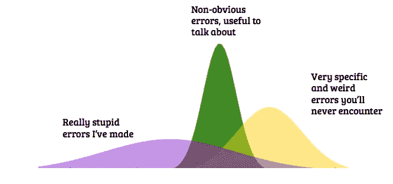
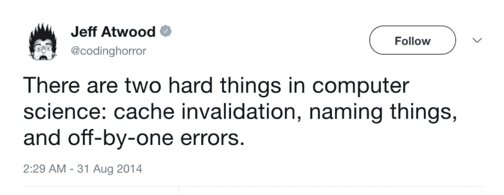
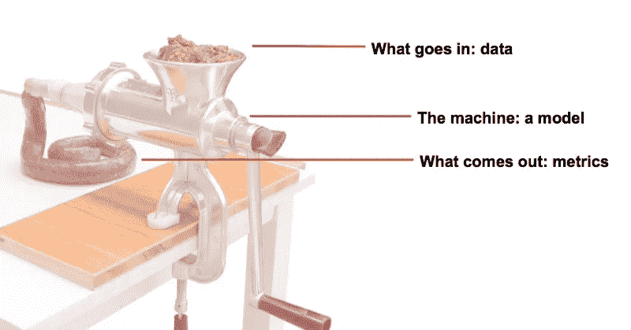
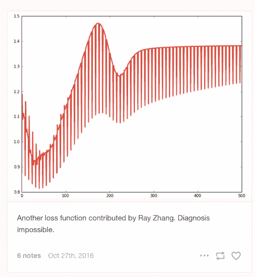
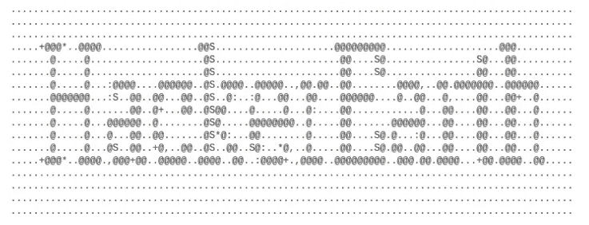
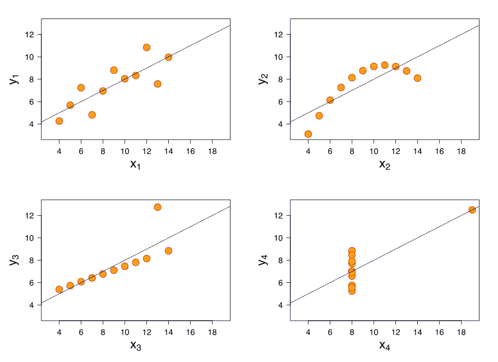
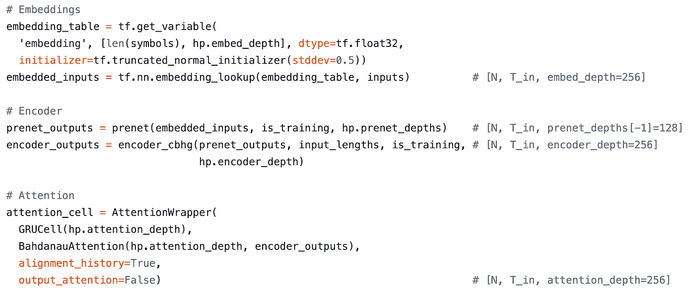
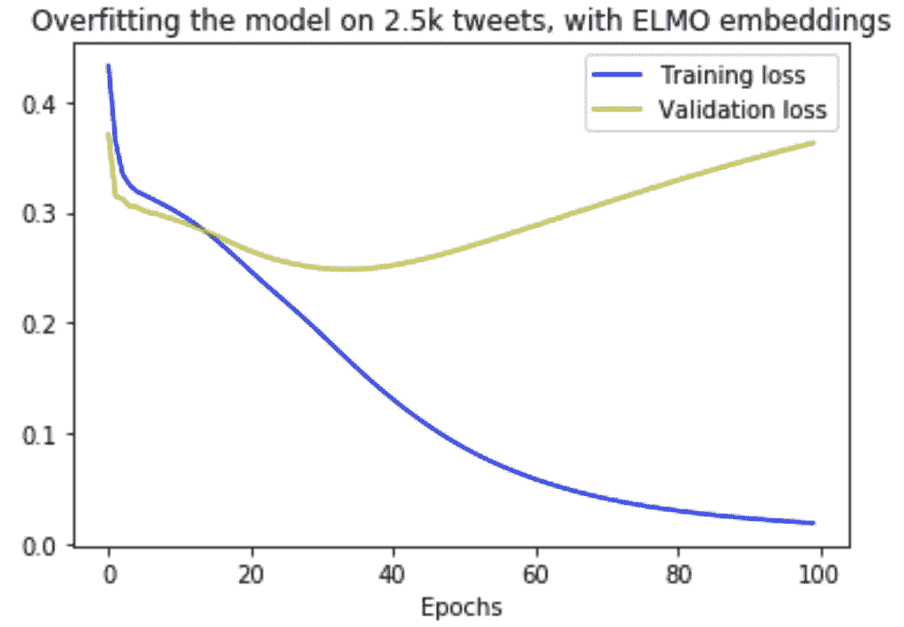
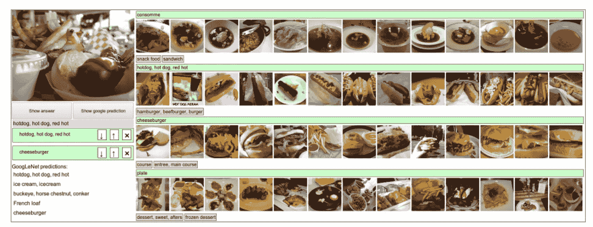

# 避免机器学习中的新手错误

> 原文：<https://towardsdatascience.com/rookie-errors-in-machine-learning-bc1c627f2789?source=collection_archive---------9----------------------->

## 或者，如何不搞砸


来源:约翰·T 在 Unsplash

*这是我 2019 年 1 月在麦吉尔大学演讲的书面版本。随后，安德烈·卡帕西写了一篇很好的帖子，更具技术性和深度学习的具体内容，但内容重叠——在这里查看* [*。*](http://karpathy.github.io/2019/04/25/recipe/)

你可以通过你所犯错误的质量和数量来跟踪你对某个主题的专业知识的加深。这篇文章列出了我和我周围的人在机器学习中犯的一些更重复的错误，希望能加速你走出不熟练的浅水区，进入犯真正有趣错误的黑暗深水区。这不是一篇介绍性的文章:你需要在 Pytorch 或 Tensorflow 中破坏一些模型才能跟上。



我将尝试从中间分布中提取，但一些黄色和紫色的样本也可能会出现在那里。[图片来源。](http://gnuplot.sourceforge.net/demo/transparent.html)

# 机器学习中常见的错误

我试图将我们在 ML 中看到的错误分为三大类，严重程度逐渐增加。

## 1.浪费你时间的错误



这种错误是令人遗憾的，但也是可以忍受的。在深度学习中，可怕的**形状错误**是最常见的，当你试图将大小不兼容的矩阵相乘时就会出现。

我不打算多谈这些错误，因为它们通常是显而易见的:程序失败了，你必须找出原因。你知道你犯了一个错误。你修复它，发现一个新的错误，然后循环重复。没人会受伤。

## 2.导致实验不准确的错误

这是一种代价更高的错误，因为你最终会做出糟糕的决定。

想想亚航飞行员的故事，他因为 GPS 不可靠而没有去马来西亚，而是去了墨尔本。如果你的导航有问题，你会很快到达你不想去的地方。

例如，如果您实现了一个添加了一堆参数的新特性，并将其与现有模型的性能进行比较，而没有重新进行超参数搜索，您可能会错误地认为您的新特性使事情变得更糟。事实上，您可能需要更加规范化，以揭示更具表现力的模型的好处。

随着时间的推移，导致实验不准确的错误会越来越多，因此尽早发现这些错误是非常有价值的。

## 3.让你相信你的结果比实际要好的错误

错误的大老板:**犯了一个导致你高估表现的错误**。这些很难发现，因为我们对看到它们抱有偏见*:当模型表现得令人惊讶地糟糕时，我们倾向于再看一眼，但当它表现得令人惊讶地好时，我们更有可能祝贺自己高超的直觉(本质上是一种形式的[确认偏见](https://www.verywellmind.com/what-is-a-confirmation-bias-2795024))。*

高估的常见原因是过度适应您的测试集，您的数据不代表真实世界，或者只是搞砸了您的度量。(下面将详细介绍这些内容)。

如果你从这篇文章中只学到一样东西，那应该是这个。没有什么比意识到你的模型比你想象的更糟糕更令人尴尬或沮丧的了。

# 机器学习生命周期



大多数机器学习都被上面的香肠制作图所捕获。你获取一些数据，通过一个模型，用一些指标量化输出。我们来看看每个阶段都存在哪些让自己看起来很傻的机会。

# 结果是什么:度量

机器学习可以归结为试图降低你的损失函数值。



更在[https://lossfunctions.tumblr.com](https://lossfunctions.tumblr.com)

然而，损失函数从来就不是你想要优化的:它只是一个近似值。在训练分类任务的普通情况下也是如此:你在为**训练或验证集交叉熵**进行优化，但你实际上关心的是**测试集准确性(或 F1/AUC)。**在实际目标是一些松散的、不可微的东西的情况下(比如“制造一个听起来像人类的聊天机器人”)，低保真度近似的问题甚至更加尖锐。

无论你的环境如何，如果你的损失函数不能代表模型的真实表现，你就有麻烦了。这里有一大堆搞乱这里的方法:

## 1.将一些训练集混合到测试集中


[来源](https://pbs.twimg.com/media/D3SwgeEWAAAaSEv.jpg)

将训练数据混合到您的验证或测试集中很容易做到，并且将产生极好的模型性能(由您的不可靠的测试集评估),以及在现实世界中糟糕的性能。

当然，你的 train/val/test 应该是**disjoint**——包含不同的例子。有时你需要仔细考虑不相交集合的确切构成。这可以决定通过测试集的性能来量化哪种类型的归纳。例如，如果我们试图从收据中提取总价值，显然测试集应该包含从未见过的收据。但它是否也应该包括从未见过的商家，以向我们保证我们不会过度适应特定的商店？

> 有时你需要仔细考虑不相交集合的确切构成。这可以决定通过测试集的性能来量化哪种类型的归纳。

一种好的做法是将您的数据一次分成训练集、验证集和测试集，然后将它们放在文件系统中的不同文件夹中。无论在哪里读入数据，都要使命名超显式:例如， **TrainDataLoader** 和 **TestDataLoader，**。

## 2.错误指定损失函数

这很难做到，因为大多数框架会为你处理损失函数规范。

然而，有很多方法可以滥用给你的坚如磐石的实现。我在这里看到的两个最常见的错误是混淆损失函数是否期望接收概率分布或对数(即，是否需要添加 softmax)，以及混淆回归和分类。

后者出奇的普遍，甚至在学术界也是如此。例如，亚马逊评论数据集包含评论和星级评定，经常被顶级实验室用作分类任务。这显然不太正确，因为 5 星评价更像 4 星评价，而不是 1 星评价(数据是有序的)。

**错误指定您的*测试*功能**

虽然深度学习的损失函数必须是可微的，但我们经常使用一套不同的不可微指标来表达测试时的性能。例如，在机器翻译和摘要中，我们分别使用 [BLEU](https://machinelearningmastery.com/calculate-bleu-score-for-text-python/) 或 [ROUGE](https://en.wikipedia.org/wiki/ROUGE_(metric)) ，对于其他任务，我们可能使用准确度、精确度或召回率。

通常，这些比你的损失函数值更容易理解，损失函数值可能很难理解(方便的提示:如果数据集是平衡的，当你开始训练时，交叉熵应该是 *-log[n_classes]* )。因此，**在培训期间尽可能多地记录测试集指标是个好主意**，而不是等到测试时才使用它们。这将让你更好地了解训练的进展情况，防止你在结束训练后*才发现问题。*

选择测试函数时要小心。例如，您不能通过计算匹配字符的数量来使用准确性来描述序列模型的性能，因为序列之间的任何不对齐都将产生零准确性。因此需要使用编辑距离**代替**。选择错误的指标来评估你的模型是一次痛苦而难忘的经历。

继续使用序列建模示例:确保您理解特殊字符—通常是序列开始(SOS)、序列结束(EOS)和填充。如果你忘记将它们从你的计算中排除，你可能最终得到看起来很好的模型——但只是真正擅长预测充满填充的长序列。

我曾经做过一些语义解析的工作，目的是将自然语言语句转换成数据库查询，这些查询可以被评估以回答诸如“明天从蒙特利尔到亚特兰大有多少趟航班？”。为了表征其准确性，我们将候选数据库查询发送到数据库，并检查返回的内容是否与我们发送的真实数据库查询相匹配。在我犯的一个更严重的错误中，我设置了这样一种情况:如果您向数据库发送无意义的查询，数据库会无声地失败，返回一个“错误”字符串——然后我会发送预测的和真实的数据库查询的损坏版本。这两个函数都返回了字符串“error”——然后被计算为 100%准确。

这就引出了一个指导原则，那就是尝试设置事情，这样你犯的任何错误**都只会使性能变得更差**，并且总是查看你的模型实际做出的预测，而不仅仅是指标。

## 使用指标避免错误

1.  **在步骤 1 中运行所有指标**

这就是 random 的样子。如果你的模特在没有任何训练的情况下表现得出奇的好，那你就搞砸了。

**2。记录一切**

ML 是一门定量学科，但统计学是骗人的。你的眼睛很少这样。是的，你应该记录你能想到的所有数字，但是你也应该以人类可读的方式记录模型的预测。

在 NLP 中，这通常意味着反转你的符号化，这可能会很痛苦——但 100%值得。它还能让你对模型训练的*定性*方面有宝贵的见解。例如，语言模型通常从学习输出像`eeeeeeeeee<PAD><PAD><PAD>,`这样的字符串开始，因为这些是数据中最常见的字符。

如果您处理图像，记录东西可能更麻烦，因为您不能只将图像输出到文本文件或终端。我的同事使用 ASCII art 来克服这一点，使他们能够在训练过程中可视化光学字符识别模型的输入:



在培训过程中，尽一切可能可视化模型输入和输出！[来源](https://www.hackerearth.com/practice/notes/beautiful-python-a-simple-ascii-art-generator-from-images/)

**3。研究您的验证集**

使用您的测试指标来识别集合中表现最好和最差的样本。去了解他们。它们是否符合你的直觉，即模型应该在哪里表现良好，何时应该挣扎？如果你有一些量化信心的方法，比如 softmax，你可以探索模型超级自信的情况——以及错误的情况。

回归中，学习残差是有好处的。请记住，平均值可能会产生误导，正如安斯科姆的四重奏所阐述的那样:



安斯科姆的四重奏:4 个都有相同的均值和方差，用同一条回归线拟合最好。不要过于依赖统计数据:要贴近数据。[来源](https://en.wikipedia.org/wiki/Anscombe's_quartet#/media/File:Anscombe%27s_quartet_3.svg)

如果你有一个多维的问题，试着画出误差和单个特征。输入空间中是否有你做得特别差的区域？如果是这样，您可能需要收集更多的数据或在该地区进行扩充。

考虑烧蚀或扰动某些特性，并检查它如何影响性能。像 [LIME](http://lime-ml.readthedocs.io/) 和 [Eli5](https://eli5.readthedocs.io) 这样的工具让机器学习模型变得简单明了。这篇[精彩文章](https://medium.com/@jrzech/what-are-radiological-deep-learning-models-actually-learning-f97a546c5b98)描述了扰动分析如何揭示 CNN 的 x 光分类使用 x 光机本身引入的标签来决定患者是否患有肺炎，因为使用的 x 光机类型与肺炎患病率之间存在相关性。

# 模型

你参加的大多数课程和面试都将关注机器学习的建模方面。事实上，作为一名机器学习实践者，你的职业生涯将主要花在担心数据和指标上，而不是关注机制的奇异实现。

绝大多数深度学习错误是形状错误，如上所述，这是一件好事:它们会导致相对容易修复的显式故障。

打破你的模型的更微妙的方法包括:

1.  **包括不可微运算**

在深度学习模型中，一切都必须是端到端可区分的，backprop 才能工作。因此，你可能会期望像 Tensorflow 这样的深度学习框架中的不可微操作有明确的路标。你错了。我已经看到了与 [Keras Lambda 层](https://www.tensorflow.org/api_docs/python/tf/keras/layers/Lambda)的特别混乱，它有一种打破背投的天赋。这种特殊毒药的解药是用`model.summary()`来验证你的大多数参数是可训练的——如果你看到具有不可训练参数的层，你可能已经破坏了自动分化。

> 如果你看到带有不可训练参数的层，你可能已经破坏了自动分化。

**2。测试时未能关闭漏失**

测试时需要关闭 Dropout，否则，你会得到随机的结果。这可能非常令人困惑，特别是对于部署您的模型并试图为它编写测试的人来说。

在大多数框架中，这是通过将模型模式设置为`eval`来处理的。还要注意，在培训期间，退出会产生一个令人惊讶的现象，你的**验证损失比你的培训损失**更好，因为当评估前者时，你已经退出了。当你第一次看到这一点时，它看起来像是过度拟合的反义词，并可能导致一些头部划痕。

**3。维度混乱**

不同的框架在安排诸如批量大小、序列长度和通道数量等公共维度方面提供了不同的约定。有些给你选择翻转的机会，而其他的如果你做错了就会默默的失败。

未能正确排序你的维度会产生奇怪和微妙的行为。例如，如果你混淆了批次大小和序列长度，你将会在你的批次中的例子之间丢失信息，并且不能随着时间的推移保存信息

## **避免模型错误**

1.  **模块化、可测试的代码**

建模错误主要可以通过结构良好的代码和单元测试来避免，这两者相辅相成。

通过将您的模型分解成具有明确定义的角色的离散块，您将能够有效地测试它们。您的测试应该集中在**验证维度**是否与您在不同批次和输入大小的条件下所预期的一样。我真的很喜欢【Chase Roberts 关于单元测试 ML 代码的这篇文章。

**2。对维度有自信**

我喜欢在我的 ML 代码中加入关于维度的断言。这让读者非常清楚哪些维度应该改变，哪些不应该改变——当然，如果发生意外，它会抛出一个错误。



漂亮的表达张量流代码，由 Keith Ito 提供。请注意模块化和形状注释。

至少，试着养成向代码中添加关于维度的注释的习惯，以限制读者的工作内存负荷。查看 Keith Ito 的这个[漂亮的 Tacotron 实现，这是一个超级注释 Tensorflow 代码的例子。](https://github.com/keithito/tacotron/blob/master/models/tacotron.py)

**3。用小数据过度拟合简单模型**



这是另一个 Karpathy 技巧，我很早就知道了它的价值。您应该确保您的模型只适合数据集的一小部分。

为了加分，通过配置文件使您的模型易于配置，并指定一个参数数量最少的测试配置。然后在 CI/CD 中添加一个步骤，检查这个小模型是否能够适应非常小的数据集，并自动运行它。这将有助于捕捉对代码库的任何更改，这些更改会破坏模型或培训管道。

# 输入什么:数据

## 首先，了解你的数据

在你开始建模之前，你应该已经厌倦了看数据。

我们做的大多数人工智能都试图复制人脑的一些模式识别能力。在开始写代码之前，通过练习这些能力，让你的生活变得简单！理解您的数据集将有助于您思考架构和指标，并迅速了解性能问题可能出现在哪里。

通常，它还会标记数据本身的问题:类别不平衡、文件类型问题或偏见。后者可能很难用算法来评估，因为要发现它们，你需要一个与你试图训练的模型一样聪明的模型。例如，您将需要查看您的数据来注意类似“我所有关于猫的照片都是在室内拍摄的，而我所有关于狗的照片都是在室外拍摄的，所以也许我正在训练一个室内/室外分类器，而不是一个猫/狗分类器？”。



Andrej Karpathy 为 ImageNet 构建了一个标签平台，以评估自己的表现，并加深对数据集的理解。[来源](http://karpathy.github.io/2014/09/02/what-i-learned-from-competing-against-a-convnet-on-imagenet/)

正如安德烈·卡帕西在这里讨论的一样，投入大量精力开发软件来帮助你查看、分割和切割数据是值得的。2018 年，当我在伦敦 KDD 听他演讲时，他强调优步的许多 ML 工程师并没有编写代码来优化模型；他们正在编写代码来优化数据标签。

为了理解您的数据，您需要获得关于三种分布的直觉:

*   **输入分布**，例如平均序列长度、平均像素值、音频持续时间
*   **输出的分配**——等级不平衡是一个大问题
*   **输出|输入的分布**(这通常是您正在建模的内容)

## 选择加载数据的方式

有效地加载和预处理数据是机器学习工程中比较痛苦的部分之一。我总的来说发现在效率和透明度之间有一个折衷。

一方面，像 [Tensorflow Records](https://www.tensorflow.org/tutorials/load_data/tfrecord) 这样的专用数据结构允许您将数据序列化为大数据包，并防止频繁读写磁盘。然而，你在效率上的收获是在透明度上的损失:这些结构很难询问，如果你决定要添加或删除文件，你必须重新序列化。

另一方面，简单地从磁盘直接读入一个列表并遍历它不会赢得任何速度上的奖励，但它完全清楚发生了什么。

现在我发现 Pytorch `Dataset`和`DatasetLoader`实用程序是控制和效率之间的一个很好的折衷。有专门用于处理文本( [torchtext](https://torchtext.readthedocs.io/en/latest/) )和图像( [torchvision](https://pytorch.org/docs/stable/torchvision/index.html) )数据集的包，它们提供了相对高效的方式来加载、填充和批量处理每个域中的数据。我也听说过 Pytorch Lightning 的好消息，但我还没有用过它。

## 加快数据加载的方法

这里有一些有趣的方法，是我过去曾经尝试过的。

1.  **没有装载你认为你正在装载的东西**

令人惊讶的是，很容易丢失数据，或者重复加载相同的数据。以下是我处理这件事的一些方法:

*   编写正则表达式从文件夹中加载某些文件，然后在添加新文件时没有更新这些正则表达式，这意味着我没有加载这些文件
*   误算一个历元中的步数，因此跳过了一些数据集
*   在一个文件夹中有递归符号链接(是的，真的),这样相同的数据被多次加载(在 Python 中达到 1000 的递归限制)
*   不完全遍历文件层次结构，因此无法加载子文件夹中的数据

**2。数据结构不正确**

不要把所有的数据放在一个目录中。

如果你有 1，000，000 个文本文件，并把它们都放在一个文件夹里，你的生活将会很痛苦，因为对那个文件夹的任何操作都要花费很长时间。很多时候，当你只想获取一些文件来查看或计算一些东西时，你会因为等待加载大量的文件夹而大大降低工作流程的速度。如果你的数据远程存储在一个数据中心，并且你已经使用`sshfs`安装了目录，这种情况会更加严重。

第二个陷阱是在应用昂贵的预处理步骤时，无法制作数据的副本。将耗时的预处理结果保存到磁盘是一个好主意，这样您就不必在每次运行模型时重做工作，但是重要的是不要覆盖原始数据，并且能够跟踪*哪个预处理代码在什么数据上运行*。

类似下面的内容通常很有效:

```
raw [your raw data lives here, in whatever format you received it] processed [any preprocessing results in a new folder here] 2018jun14_b9f0c41 [date & commit stamped for reproducibility]
      batch-1 [data split into manageable batches of ~1000]
      batch-2
      ... 2017jun18_c760c52 
      batch-1
      batch-2
      ...
```

**3。预处理不当**

特别是在 NLP 中，很容易在预处理中滥用数据。

对非 ASCII 字符的不正确处理可能是一个很大的问题，而且它们经常很少出现，很难被发现。

标记化带来了很多出错的可能性。如果您正在执行基于单词的标记化，很容易在一个数据集上形成您的词汇，然后在另一个数据集上使用它(或者在一些预处理之前或之后的同一个数据集)，从而导致大量的词汇外单词。这是一个致命的无声错误——你的模型不会崩溃，它只是不能很好地工作。

训练集和测试集之间在词汇上的巨大差异在这里会产生问题，因为对于测试集中的单词，而不是训练集中的单词，您将无法了解任何信息。同样，充分了解您的数据并尽早发现这些问题是非常值得的。

## 避免数据处理中的错误

1.  **记录一切**

确保每次转换数据时都在训练过程中记录示例。你不应该只是记录你的模型输出了什么，你应该记录输入了什么。

**2。了解你的数字**

您应该非常熟悉以下统计数据:

*   你有多少例子
*   对于给定的批量大小，对应于多少批
*   多少批次构成一个时期(即通过整个数据集)

同样，你可以也应该记录这些事情，或者你可以加入一些`assert`语句来确保每件事都有意义。

**3。预处理期间保存状态**

一些预处理步骤需要或创建工件，您需要努力保存这些工件。例如，如果您通过训练集的`mean` 和`variance`对数字数据进行规范化，那么您需要保存那个`mean`和`variance`，这样您就可以在测试时应用相同的转换。同样，如果你不保存你的训练词汇，你将无法在测试时以同样的方式进行标记——在测试中形成一个新的词汇并重新标记将产生无意义的结果，因为每个单词将获得完全不同的标记。

**4。如果可以的话向下采样**

当您拥有由大型文件(如图像和音频)组成的数据集时，很容易通过最少的预处理将它们输入到您的神经网络中，希望网络能够学习到预处理效果最好的方法。

如果你有无限的时间和计算，这可能是一个好办法，但在现实世界中，一些明智的下采样可以走很长的路。你可能不需要全高清图像来训练狗/猫分类器，尽管你可以使用扩张卷积来学习下采样器，但如果你在进行任何学习之前只是以传统方式进行下采样，那么你的时间和梯度下降会更好地利用。

向下采样允许您更快地完成模型拟合、模型评估和模型摆弄的循环，因此是一项很好的时间投资。

# 结论

总结一下，在你的机器学习冒险中要遵循的 5 条指导原则:

1.  从小处着手，这样你的实验会进行得很快。限制你的循环时间能让你更早发现问题，更快检验假设。
2.  **贴近数据。**如果你不理解数据，你就无法做好数据建模工作。不要被诱惑而把时间花在玩弄花哨的模型上，而不是做看数据的无聊工作。
3.  **记录比你认为需要的更多的信息。**你对学习过程的了解越多，就越容易发现异常并提出改进措施。
4.  比起效率，更喜欢简单和透明。少量的时间节省并不能证明代码或数据结构变得更复杂是合理的。浪费在试图理解不透明代码上的人力时间比浪费在低效算法上的计算时间要糟糕得多。
5.  如果事情好得令人难以置信，那就是真的。在机器学习中有很多方法可以愚弄自己:成为一名优秀的科学家意味着毫不留情地发现和消除这些机会。

## 请在下面的评论中分享你犯下的任何有趣或奇特的错误，如果你有任何你认为我应该记录的好习惯，请告诉我！