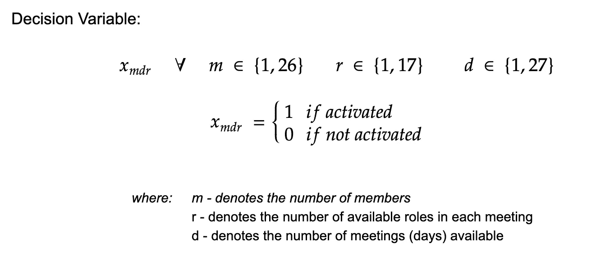
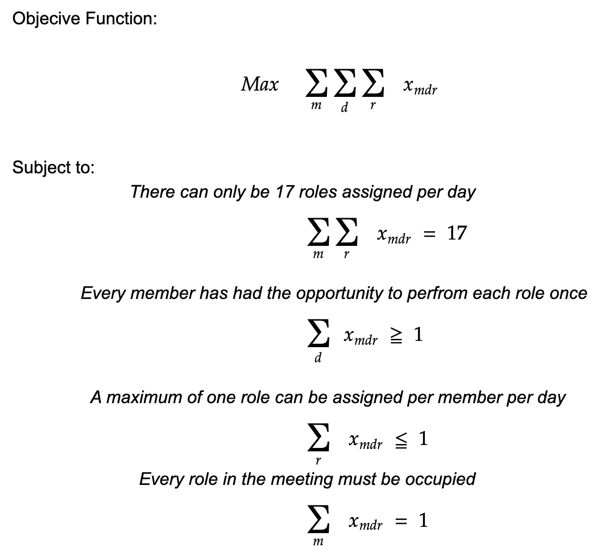
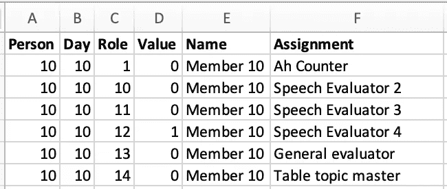
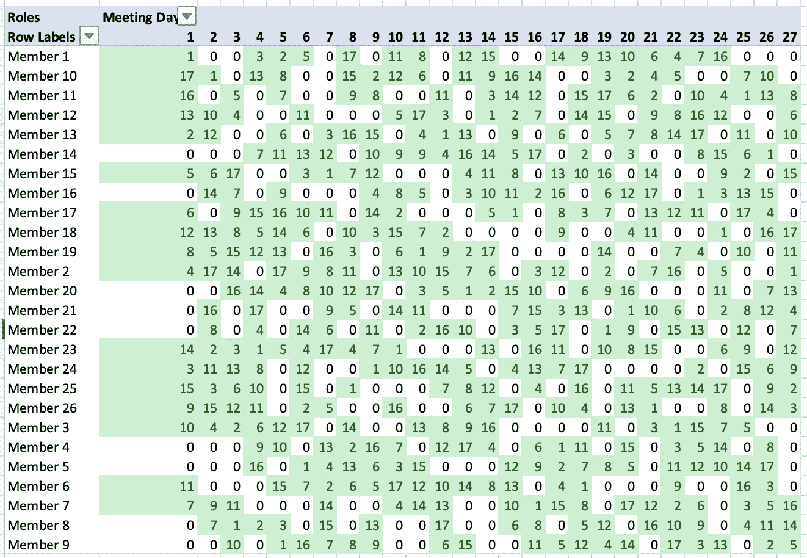

# 使用 Python 解决调度问题

> 原文：<https://towardsdatascience.com/roster-optimization-using-python-85b26d58e806?source=collection_archive---------7----------------------->

## [实践教程](https://towardsdatascience.com/tagged/hands-on-tutorials)

## 通过使用简单的 Python 编程应用混合整数模型来公式化和解决复杂的排班问题

由[扬·克朗斯](https://unsplash.com/@jankronies?utm_source=medium&utm_medium=referral)在 [Unsplash](https://unsplash.com?utm_source=medium&utm_medium=referral) 上拍摄的照片

这篇文章说服读者用定量的方法来做决策。它阐明了我是如何从优化的角度识别和思考问题的。最优化不仅仅是一个数学研究课题。如果运用得当，它可以用来解决不同学科的实际问题。

*使用正确的技术，可以对问题进行建模，以最大化/最小化某个结果。*

# 动机

管理科学是一种基于科学方法的决策方法。它大量使用定量分析。涉及定量决策方法的知识体系有各种各样的名称；除了管理科学，另外两个广为人知和接受的名称是 ***运筹学*** 和 ***决策科学*** 。

二战后的两个发展导致了管理科学在非军事领域的发展和应用。

1.  首先，持续的研究导致了许多方法上的发展。也许最重要的发展是乔治·丹齐格于 1947 年发现了求解线性规划问题的单纯形法。
2.  与此同时，这些方法的发展正在发生；数字计算机引发了计算能力的虚拟爆炸。计算机使从业者能够使用先进的方法来解决各种各样的问题。

解决问题是一个过程，它能识别实际情况和期望情况之间的差异，然后采取行动解决这种差异。决策是指构建问题，然后分析它以选择一个替代方案。当我们经历很多成功时，很难理解使用数据做决策的必要性。我们的直觉(理解为自我)实际上淡化了运气在你做出的产生有利结果的决定中的作用。

数据科学教会了我在决策过程中量化的重要性。添加数字或量化结果的概率有助于减少情况的模糊性，并增加决策的一致性。如果没有适当的数据驱动分析，作为决策者，你很容易受到各种偏见和一厢情愿的想法的影响。

分析领域正以指数级的速度增长；AI(人工智能)、ML(机器学习)和深度学习等术语在科技行业很常用。就个人而言，在所有这些实践领域中，有一个经常不被重视的学科— **优化**。我最近在研究一个优化问题，这是我们在计划一个活动或安排一个会议时经常遇到的问题。

# 排班问题

今年早些时候，我父亲被任命为我们地区一个本地演讲会的会长。[国际演讲会](https://www.toastmasters.org/)是一个非营利性的教育组织，在全球范围内运营俱乐部，以促进交流、公众演讲和领导力。他的任务之一是为俱乐部的每个成员分配未来会议的角色。

在他担任主席期间，他将主持 27 次会议，俱乐部目前有 26 个成员(包括他自己)。在每次会议中，成员可以扮演不同的角色，例如“发言评估员”、“发言人”或“桌面主题主管”。为了成功地召开会议，必须给与会的不同成员分配 17 个角色。

照片由 [NeONBRAND](https://unsplash.com/@neonbrand?utm_source=medium&utm_medium=referral) 在 [Unsplash](https://unsplash.com?utm_source=medium&utm_medium=referral) 上拍摄

我父亲创建了一个 excel 电子表格，在表格中，他尽自己最大的努力以符合逻辑的方式给每个成员分配角色。在几次令人沮丧的尝试后，他让我看看他正在进行的杰作。从计划的角度来看，这不是一个不可能完成的任务。通过多次反复试验，我们将能够解决这个问题。然而，我的基本问题是，如果有另一个成员在他的任期内加入或有人退出。这个耗时的过程不得不重复。

我告诉他，我将热衷于开发一个模型，以改善他的俱乐部的名册。数学模型是任何定量决策方法的关键部分。

> 例如，如果构建一个自定义表需要 10 个小时， ***10x*** 就是**数学模型**，它定义了构建 ***x*** 表所花费的总小时数。

## 模型

对我来说，这个练习的主要目的是开发一个公平的方法来分配每个人的角色，并最大限度地提高他们在赛季中的参与度。数学模型还必须遵循其他几个要求:

1.  每个会议在给定的一天只能分配 17 个角色。
2.  为了使这成为一个公平的模式，每个成员都必须有机会在赛季中至少扮演一次每个角色。
3.  每个成员在会议中只能扮演一个角色。
4.  会议中的每个角色都必须被分配。

> 下面给出的是制定**演讲会最高参与度花名册问题的公式化。**

陈述模型的决策变量

最优化问题的表述

## 用 Python 公式化模型

1.  **初始化决策变量** 从上面的符号可以看出，决策变量是二进制的(即只能保存 0 或 1 的值)。每个变量决定了成员、日期(会议)和角色的不同组合的值。

在 Python 中初始化决策变量

> 例如，如果 ***x_10_2_3*** 的值为 1，则意味着第二次会议中的 10 号成员将执行 3 号角色。

**2。定义目标函数** 如前所述，该模型试图最大化俱乐部中每个成员的参与度

在 Python 中定义目标函数

**3。设置约束** 与任何优化问题一样，模型的约束通常需要最多的分析推理。我更喜欢将问题分解成一个玩具例子，并测试模型在应用特定约束时的行为。

在 Python 中设置约束

# 报表生成

定量分析过程的一个重要部分是根据模型的解准备报告。决策者必须容易理解报告的结果。它应该包括建议的决定和其他可能对决策者有帮助的有关结果的相关信息。

在解决了上面的排班模型后，我决定创建一个 excel 报表，打印出每个决策变量的值。在这个模型中有**11934 个决策变量**，这再次加强了使用编程解决这个问题的论点。

为了编程，我给变量“角色”分配了一个数值，并使用下表对其进行了映射。

> 表格显示**角色 5** 对应于会议中的**第一个发言人**。

俱乐部中各种角色的映射表

打印模型的结果

从上面的 excel 报表快照中可以看到，值为 1 的**值**激活了决策变量。这意味着**成员 10** 已经被指派为**会议 10** 的**发言评估员 4** 的角色。

为了让决策者更容易理解，我在 Excel 中创建了一个简单的数据透视表。

在这个数据透视表中，

1.  **行**被映射到**成员。**
2.  **列**映射到**(会议)**
3.  **单元格值**映射到**角色。**

即将召开的会议的俱乐部名单

从上面的报告中可以看出，每个成员都有机会至少扮演一次每个角色。单元格值为 0 意味着该特定会议上的相应成员没有被分配角色。

# 结论

当我接近这篇文章的结尾时，下面给出了我在研究过程中获得的一些重要知识，我想总结一下，以供大家参考。

1.  从上面的公式可以看出，**类似的排班问题**可以通过**改变几个关键决策变量**来建模和轻松解决。我强烈建议你自己去修改/测试代码。
2.  我们可以添加**额外的约束**，比如由于一些个人原因，在特定的会议上给成员分配一个角色。或者，我们也可以将问题建模为没有成员在连续 3 次会议中处于空闲状态。
3.  一个数学模型只取决于你的专业水平。编程的真正力量在于分析的可重复性和可扩展性。对我来说，手动创建另一个花名册会非常耗时。我现在可以在未来的任何时候重用这些代码，节省我的时间、精力和精力。

# GitHub 链接，谢谢

谢谢你一直读到最后。我希望这篇文章能激励你用更定量的视角分析生活中的不同问题。

对于任何感兴趣的人，可以在我的 GitHub 资源库中找到代码。请随意下载并分析您的用例信息。

 [## 有线服务/数据科学

### 使用 Python 中的纸浆包来制定和解决一个简单的排班问题打开 jupyter 笔记本安装…

github.com](https://github.com/wiredtoserve/datascience/tree/master/Rostering) 

# 参考

[1]安德森、斯威尼、威廉姆斯、卡姆、科克伦、弗莱、奥尔曼。*管理科学导论:决策的定量方法*。2015 年第 14 版。Cengage 学习。第 2-8 页

在 [Unsplash](https://unsplash.com?utm_source=medium&utm_medium=referral) 上由[Courtney hedge](https://unsplash.com/@cmhedger?utm_source=medium&utm_medium=referral)拍摄的照片