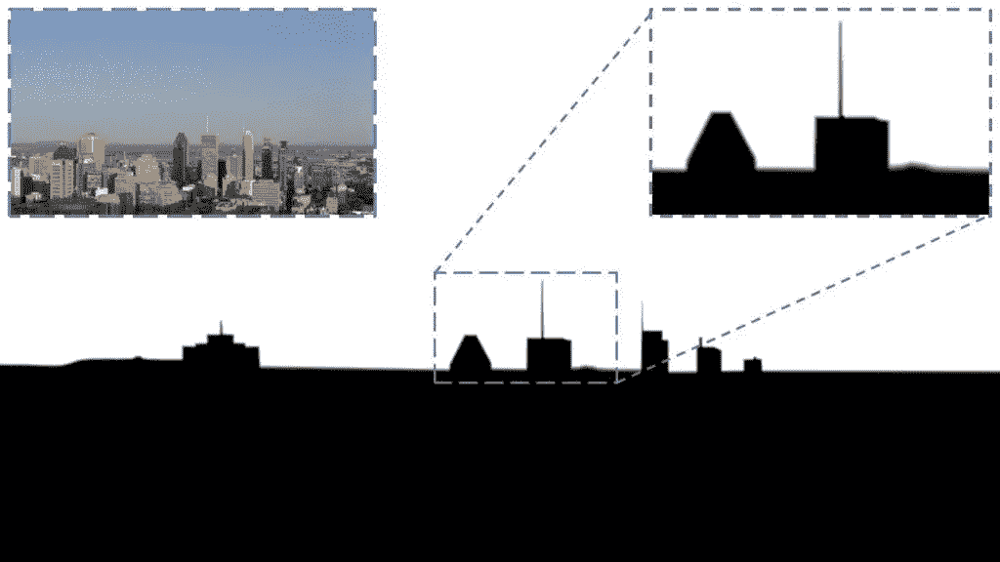
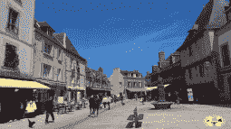
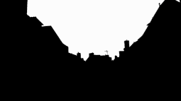
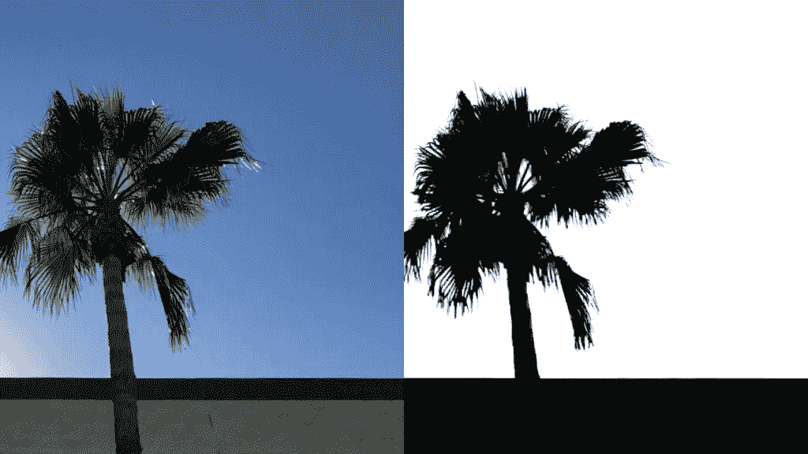
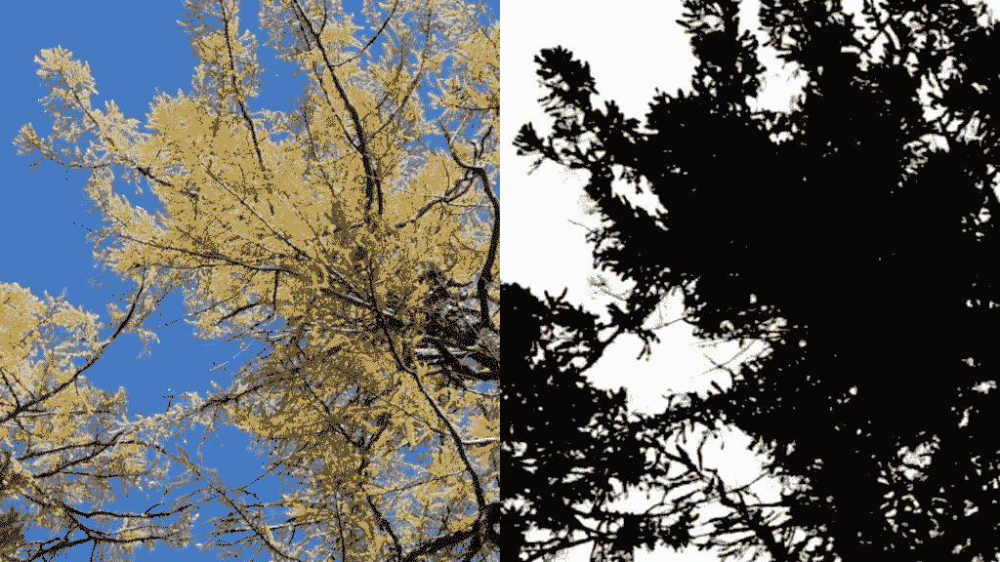
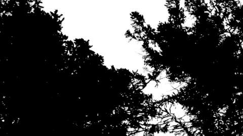

# Rotoscoping:好莱坞的视频数据分割？

> 原文：<https://towardsdatascience.com/rotoscoping-hollywoods-video-data-segmentation-7ca7c02b6ccc?source=collection_archive---------38----------------------->

**在好莱坞，视频数据分割已经做了几十年。简单的技巧，如绿色屏幕的颜色键控可以大大减少工作。**

2018 年末，我们开发了一个视频分割工具箱。视频剪辑中常见的一个问题是拍摄场景时，天空过饱和或太亮。电影中的大部分天空都被 VFX 专家取代了。这个任务叫做“天空替换”。我们认为这是引入自动分割来掩盖天空以进行进一步替换的完美起点。基于收集的经验，我将解释 VFX 和数据注释的相似之处。

您会发现我们构建的解决方案与当时被认为是最佳图像分割模型的 Deeplab v3+进行了比较。我们的方法(左)产生了更好的建筑物周围的细节，并大大减少了帧之间的闪烁。

我们的天空分割模型和 Deeplab v3+的比较

# 好莱坞的视频分割技术

在这一节中，我们将更仔细地看看彩色键控，例如绿色屏幕和旋转镜。

# 什么是色彩键控？

我很肯定你听说过彩色键控或绿色屏幕。也许你自己在使用 Adobe After Effects、Nuke、Final Cut 或任何其他软件编辑视频时也使用过这样的技巧。

我小时候自己做过很多视频剪辑。与朋友一起制作有趣的视频，并使用 after-effects 等工具添加酷炫的效果。没日没夜的看 videocopilot.com[和 creativecow.com](https://www.videocopilot.net/)[的教程。我记得我和一个朋友在我家后院玩木棍，只是为了几个小时后把它们换成光剑。](https://creativecow.com/)

如果你不知道绿色屏幕是如何工作的，你可以在下面找到一个视频，它会给你一个比我用文字更好的解释。

解释绿屏如何工作的视频

本质上，绿屏使用的是颜色键控。镜头中的“绿色”被屏蔽了。这个遮罩可以用来混合另一个背景。美妙的是，我们不需要烧你的 GPU 的花哨的图像分割模型，而是一个相当简单的算法，寻找具有所需颜色的相邻像素进行遮罩。

# 什么是 rotoscoping？

你可以想象在许多好莱坞电影中，特效需要更复杂的场景，而不是简单地使用彩色背景来掩盖元素。想象一个场景，动物可能不喜欢强烈的颜色，或者有很多头发在风中飘动。简单的颜色键控方法是不够的。

但也是针对这个问题，好莱坞在多年前就找到了一种技术: **Rotoscoping** 。
为了让你更好地了解什么是 rotoscoping，我在下面嵌入了一个视频。该视频是一个关于如何使用 after effects 进行旋转观测的教程。使用一个特殊的工具箱，你可以在整个视频中的物体周围绘制样条线和多边形。工具箱允许帧之间的自动插值，为您节省大量时间。

旋转观测的后效教程

这项技术于 2003 年在 After Effects 中推出，已经问世近 20 年，并被许多 VFX 专家和自由职业者使用。

**剪影**与 After Effects one 工具完全专注于旋转观测形成对比。在这个视频中，你可以了解他们最新的产品更新[。](https://www.youtube.com/watch?v=NwbbHFO8Rl0)

我为你挑选了一个例子来展示 rotoscoping 的结果有多详细。MPC Academy 的以下视频中的三个元素让我大吃一惊:运动模糊(T7)、头发的精细细节(T9)、帧一致性(T11)。当我们为 VFX 编辑开发一个产品时，我们了解到这个行业的质量要求超出了我们在图像分割方面的要求。在计算机视觉中，既没有数据集，也没有符合好莱坞标准的模型。

MPC 学院的旋转观测演示卷

在 YouTube 上搜索“roto showreel”，你会发现更多的例子。

> *VFX 的工具和工作流程以及数据标注惊人地相似。*

# 质量检验比较

# 我们如何训练我们的天空分割模型

此外，我们在简单的背景前使用了公开的和无许可证的树、人和其他移动元素的视频。为了获得地面真实信息，我们简单地使用彩色键控。它非常有效，我们在几个小时内就完成了 5 分钟镜头的像素级精确分割。为了增加样本的多样性，我们使用了视频编辑工具，在移动摄像机的同时，裁剪掉部分视频。4k 原始视频有一个平滑移动的全高清帧。对于一些镜头，我们甚至打破了典型的二进制分类，使用平滑的边缘，在全黑和全白之间插入，作为我们的遮罩。通常，分割总是二进制的，黑色或白色。当场景模糊时，中间有 255 种颜色。

颜色键控允许我们获得复杂场景的地面真实数据，如树叶或头发。下面的棕榈树图片已经使用简单的颜色键控进行了遮罩/标记。

这适用于所有种类的树。甚至帮助我们获得了整个视频的良好效果。我们能够在剪辑过程中简单地调整颜色键控参数。

为了让你对我们的色彩键控实验的时间结果有一个概念，请看下面的 gif。注意有一点苦涩。我们特意添加了这个来“模拟”用你手中的相机进行录制。摄像机本身的移动是整个场景上作物的简单线性插值。所以你在下面看到的只是全景的一部分。

# 训练模型

# 时间一致性的对抗性训练

因此，对于您的下一个视频数据分割项目，您可能想看看是否可以使用这些技巧来收集数据并节省大量时间。在我的其他帖子中，你会发现一个数据注释工具列表。如果你不想在手工注释上花费时间，这里还有一个数据注释公司的[列表](https://data-annotation.com/list-of-data-annotation-companies/)。

*我要感谢和我一起做这个项目的莫莫和黑基。另外感谢所有 VFX 艺术家和工作室的反馈和富有成效的讨论。*

*原载于 2020 年 4 月 23 日 https://data-annotation.com**[*。*](https://data-annotation.com/rotoscoping-hollywoods-video-data-segmentation/)*