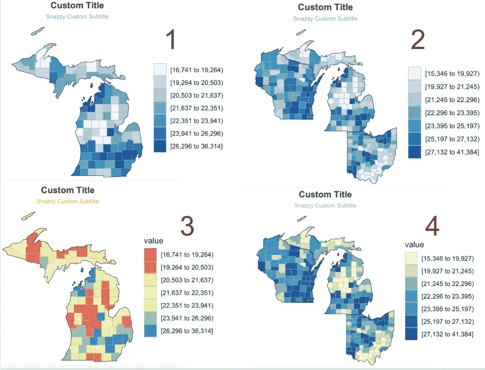

# 在 R 中映射地理空间数据的 3 个简单步骤

> 原文：<https://towardsdatascience.com/route-66-revisited-mapping-geospatial-data-in-r-371dd406cde0?source=collection_archive---------56----------------------->

## 1)获取 API 2)安装库 3)图表

我总是想知道人们是如何用 r 语言创建漂亮的地理空间可视化的。我会瞪大眼睛看着完美的渐变，这些渐变可以让仪表板或演示文稿流行起来，我只是想知道*人们到底是如何用我与 p 值和回归线相关联的编程语言来做到这一点的。*

令人惊讶的是，您实际上只用几行代码就可以完成这一点——今天我将向您展示如何做到这一点。

## **第一步:访问美国社区调查(ACS)API**

首先，你需要访问人口普查局的 API。前往[此链接](https://api.census.gov/data/key_signup.html)请求 API 密钥。大约 10 秒钟后，你应该会收到一封电子邮件，里面有你的密钥和一个链接，可以确认你确实是人类。把你的 API 密匙藏在某个地方——你每次重新打开 r 时都需要调用它。

为了正确读取 API，我们需要安装 3 个库:“acs”、“choroplethr”和“choroplethrMaps”。我们还将安装“RColorBrewer”和“ggplot2”用于稍后的绘图。

> **choropleth** 地图(源自希腊语χῶρος的“区域/地区”和πλῆθος的“大众”)是一种专题地图，其中区域按照统计变量的比例进行阴影化或图案化，该统计变量表示每个区域内地理特征的汇总，如人口密度或人均收入。— *维基百科*

下面是您需要输入到 R 中以使 API 工作的代码:

## **第二步:选择表 ID**

一旦你安装了 API 密匙，你就可以在[data.census.gov](https://data.census.gov/cedsci/table?q=list%20of%20all%20ACS%20surveys&url=https%3A%2F%2Ffactfinder2.census.gov%2F&tid=ECNBASIC2012.EC1200A1&hidePreview=false&vintage=2012)找到可用的数据集进行实验(我在教程中使用的是表格 B19301，各县的人均收入)。当您找到想要使用的数据时，记下表 ID。创建一个漂亮的 choropleth 图只需要表 ID。

确定数据集后，让我们开始绘图吧！

## 步骤 3:映射地理空间数据

下面我有按县绘制美国人均收入图表的代码。这只是可以切换的一瞥；如果你有一个我没有举例说明的修改，关于 [county_choropleth_acs](https://www.rdocumentation.org/packages/choroplethr/versions/3.6.3/topics/county_choropleth_acs) 和 [ggplot2 Colors](http://www.cookbook-r.com/Graphs/Colors_(ggplot2)/) 的 R 文档将带你完成剩下的部分。

*   一些 ACS 数据集包含空值；最丰富多彩的图表将是那些他们的大部分观察呈现！

**……以及相关图表:**

\\ 1:默认值\\ 2:自定义标题\\ 3:渐变+自定义标题\\ 4:颜色变化+自定义标题\\

## **奖金:州&地区仅限**

改变我们的图表来关注一个州或地区就像添加一个额外的输入一样简单，即`state_zoom()`函数。为了一次绘制多个州(而不是整个国家)的图表，我们将把我们想要一起查看的所有州连接起来。

对于最后两张图，我使用了 ggplot2 提供的一些有趣的调色板。这个库的`scale_fill_brewer()`函数包含了一组预定的调色板，你可以在这里找到。

**…。这里有四个相关的图表:**

## **结论**

现在您已经知道如何在 r 中创建简单的地理空间可视化。)你想调查。您可以按国家、州或部分州来绘制图表。最后，您可以更改调色板、渐变和图形标题。

这只是地理空间的冰山一角，但我希望它可以让你开始。感谢您的阅读，祝您工作愉快！❤️

GIF 来自 [GIPHY](https://giphy.com/gifs/memecandy-LmNwrBhejkK9EFP504/links)