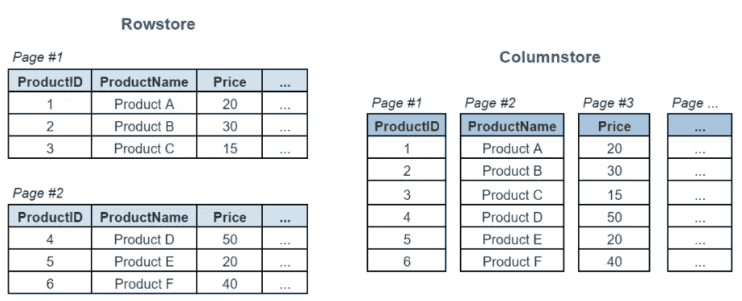
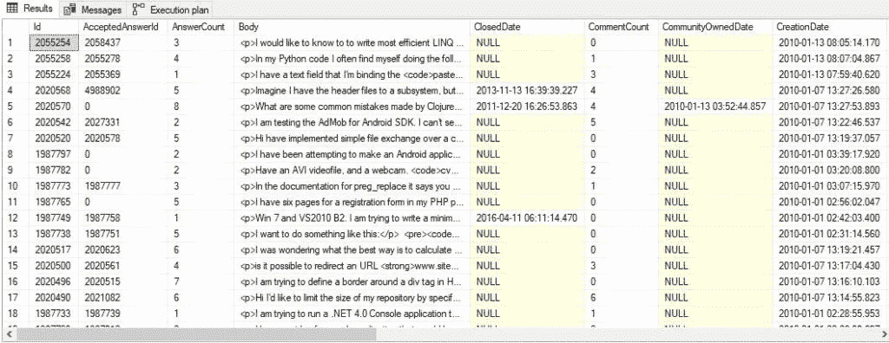
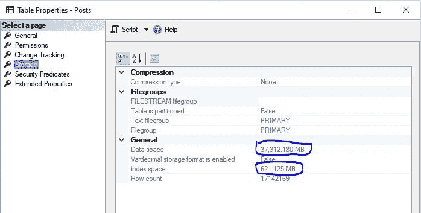
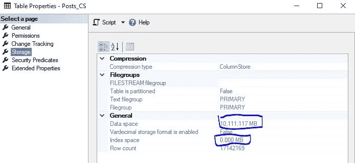
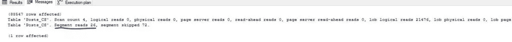
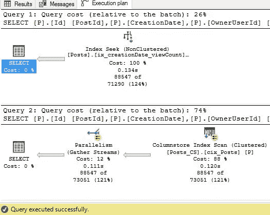
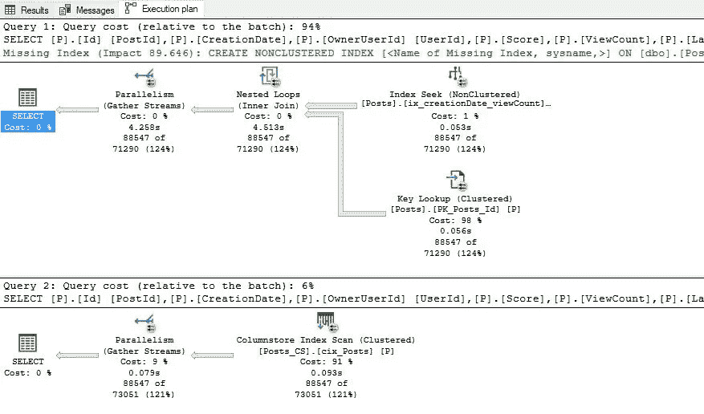
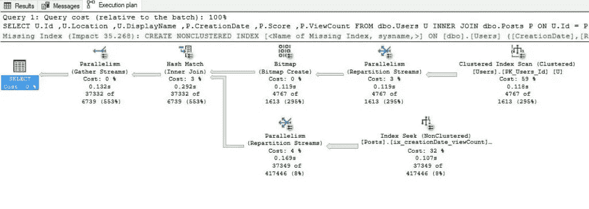
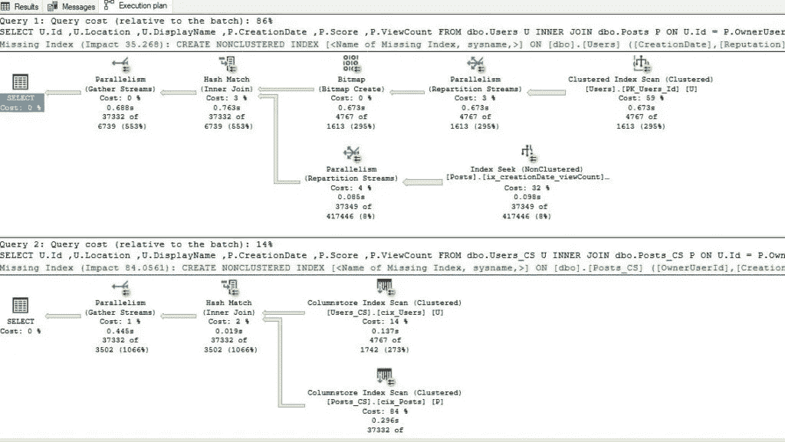
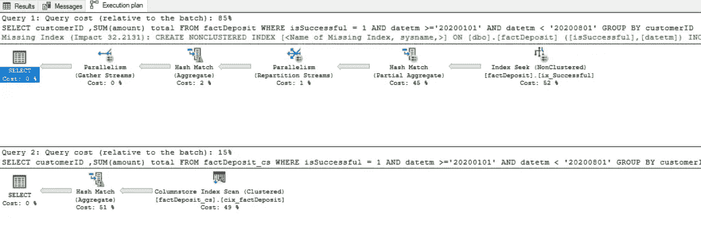

# 行或列—我应该将索引放在哪里？

> 原文：<https://towardsdatascience.com/rows-or-columns-where-should-i-put-my-index-on-65d429692dee?source=collection_archive---------12----------------------->

## 为 SQL Server 工作负载选择最佳索引策略是最具挑战性的任务之一。了解与传统的 B 树结构相比，在哪些场景中使用列存储索引会使您受益


照片由 Nick Fewings 在 Unsplash 上拍摄

为 SQL Server 工作负载选择最佳索引策略是最具挑战性的任务之一。您可能知道，索引可以极大地提高查询的性能，但同时，当涉及到维护时，它们会导致额外的开销。

老实说，我永远不会称自己为索引专家。然而，我想分享我从最近的项目中获得的经验，因为它为我打开了一个全新的视角，我认为它也可以对其他人有益。

首先，直到几个月前，我还从未使用过列存储索引，因为我公司的工作环境是基于 SQL Server 2008R2 的。我有关于列存储索引的理论知识，也知道它们和传统 B 树索引的区别，但我从未在现实中尝试过。

但是，首先要做的是…

## 什么是列存储索引？

与 rowstore 类型的数据存储相反，columnstore 在表的列级别上操作，rowstore 类型的数据存储在物理上以行的格式存储数据。它最初是在 SQL Server 2012 中引入的，后来在 SQL Server 的每个新版本中都得到了改进。传统的行存储索引(我将它们称为 B 树索引)存储每一行的键值，以便 SQL Server 引擎可以使用这个键来检索行数据，而列存储索引则分别存储每个表列！



使用 Columnstore 索引的主要原因是它的高压缩率！这在内存占用方面带来了显著的好处，因此，如果使用得当，性能会更好。

网上确实有很多很棒的资源供[学习关于列存储索引](https://www.red-gate.com/simple-talk/sql/sql-development/hands-on-with-columnstore-indexes-part-1-architecture/)的架构，并且[微软的文档](https://docs.microsoft.com/en-us/sql/relational-databases/indexes/columnstore-indexes-overview?view=sql-server-ver15)在这个主题上也相当全面，但是我想展示一些使用列存储索引有意义的真实例子。

只是强调一下，我将专门使用聚集列存储索引(非聚集列存储索引不在本文讨论范围之内)。

对于所有的例子，我都使用堆栈溢出数据库。

## 爬上一棵 B 树

让我们首先在 Posts 表上运行几个简单的查询，这个表有 1700 多万条记录，只是为了对数据有一个感觉。一开始，我在这个表上没有任何索引，除了主键列上的聚集索引。

我的目标是找到 2010 年上半年所有浏览量超过 3000 的帖子:

```
SELECT * 
FROM dbo.Posts P
WHERE CreationDate >= '20100101'
    AND CreationDate < '20100701'
    AND ViewCount > 3000
```

这个查询返回了 88.547 行，执行起来花了一分多钟！



由于该表上不存在索引，SQL Server 必须扫描整个表来满足我们的请求，执行大约 420 万次逻辑读取。让我们稍微帮助一下我们可怜的 SQL Server，在 *CreationDate* 列上创建一个非聚集索引:

```
CREATE NONCLUSTERED INDEX [ix_creationDate] ON [dbo].[Posts]
(
    [CreationDate] ASC
)
```

现在，当我再次运行完全相同的查询时，我在 9 秒钟内得到了我的结果，但是逻辑读取的数量(560 万)表明这个查询还远远不够好。SQL Server 感谢我们的新索引，因为它用于缩小初始搜索的范围。但是，选择所有列显然不是一个好主意，因为 SQL Server 必须从聚集索引中选取所有其他列，执行大量的随机读取。

现在，我会问自己的第一个问题是:我真正需要什么数据？我需要*正文、关闭日期、最后编辑日期、*等吗？？好了，我将重写查询，只包含必要的列:

```
SELECT P.Id AS PostId
    ,P.CreationDate
    ,P.OwnerUserId AS UserId
    ,P.Score
    ,P.ViewCount
FROM dbo.Posts P
WHERE P.CreationDate >= '20100101'
    AND P.CreationDate < '20100701'
    AND P.ViewCount > 3000
```

我们得到了完全相同的执行计划，逻辑读取次数减少了(400 万次)，因为返回的数据量减少了。

SQL Server 建议在我们的谓词列(WHERE 子句中的列)上创建索引，并在索引中包含其余的列。让我们遵从 SQL Server 的意愿，修改我们的索引:

```
CREATE NONCLUSTERED INDEX [ix_creationDate_viewCount] ON [dbo].[Posts]
(
    [CreationDate],
    [ViewCount]
)
INCLUDE ([OwnerUserId],[Score])
```

现在，当我运行我的查询时，它在不到一秒的时间内执行，仅执行 3626 次逻辑读取！哇！因此，我们创建了一个很好的“覆盖”索引，它非常适合这个查询**。我特意将“针对此查询”部分加粗，因为我们无法为针对数据库运行的每个查询创建覆盖索引。在这里，它可以用于演示目的。**

## 列存储索引开始发挥作用

好了，我们不能再优化之前的查询了。现在让我们看看 columnstore index 将如何执行。

第一步是创建 dbo 的副本。Posts 表，但是我将在这个新表(dbo)上创建一个聚集列存储索引，而不是使用 B 树索引。Posts_CS)。

```
CREATE CLUSTERED COLUMNSTORE INDEX cix_Posts
ON dbo.Posts_CS
```

您可能注意到的第一件事是这两个相同的表在内存占用方面的巨大差异:



dbo 的内存占用。帖子表



dbo 的内存占用。帖子 _CS 表

因此，一个包含聚集列存储索引的表比一个包含 B 树索引的表消耗的内存要少 4 倍！如果我们也考虑非聚集索引，这种差异只会变得更大。正如我已经提到的，数据在列级别上压缩要好得多。

现在，让我们在新创建的 columnstore 索引表上运行完全相同的查询。

```
SELECT P.Id AS PostId
    ,P.CreationDate
    ,P.OwnerUserId AS UserId
    ,P.Score
    ,P.ViewCount
FROM dbo.Posts_CS P
WHERE P.CreationDate >= '20100101'
    AND P.CreationDate < '20100701'
    AND P.ViewCount > 3000
```

列存储索引中的数据存储在段中。因此，根据表中的数据分布，SQL Server 必须读取更多或更少的数据段才能检索到请求的数据。



如上图所示，为了返回 88.547 条记录，SQL Server 遍历了 26 个数据段，跳过了 72 个数据段。这是因为我们的列存储索引中的数据没有按照任何特定的顺序排序。比方说，我们可以按 *CreationDate* 对其进行排序(假设我们的大多数查询将使用 *CreationDate* 作为谓词)，在这种情况下，性能应该会更好，因为 SQL Server 将确切地知道在哪些数据段中查找数据，哪些数据段可以被跳过。

现在，让我们一起运行这两个查询，并比较查询成本:



传统的 B 树索引查找成本为 3.7，而列存储扫描成本为 10.7。很明显，因为我们有一个完美匹配的非聚集索引，它覆盖了我们需要的所有列。还是那句话，差别没那么大。

## 添加更多配料…

但是，假设过了一段时间后，我们需要扩展我们的输出列表，并为 *LastActivityDate* 检索数据。让我们看看会发生什么:



哎呀！！！通过只添加一列，结果完全变得有利于 columnstore 索引。现在，B 树非聚集索引没有所有必要的数据，它需要从聚集索引中提取*last activity date*——这使得这个查询的成本上升到 236！另一方面，columnstore index 变得稍微贵了一点，现在要 14！

当然，正如您可以在上面的图片中注意到的，SQL Server 要求另一个索引(或扩展现有的索引)，但这就是我在上面强调的——您不应该盲目地服从 SQL Server 的所有愿望，否则您将完成“过度索引”的表！

## 运行分析查询

根据定义，在运行分析查询时，列存储索引应该处于领先地位。因此，让我们在下面的场景中检查一下:我想检索在 2010 年上半年注册、在 2010 年和 2011 年发帖的用户，并且用户的总体声誉大于 3000，各个帖子的浏览量超过 3000……我还需要查看用户的*位置*和*显示名称*。听起来很复杂，但实际上并不复杂:)

以下是查询:

```
SELECT U.Id
    ,U.Location
    ,U.DisplayName
    ,P.CreationDate
    ,P.Score
    ,P.ViewCount
FROM dbo.Users U
    INNER JOIN dbo.Posts P ON U.Id = P.OwnerUserId 
WHERE U.CreationDate >= '20100101'
    AND U.CreationDate < '20100701'
    AND U.Reputation > 3000
    AND P.ViewCount > 3000
    AND P.CreationDate >= '20100101'
    AND P.CreationDate < '20120101'
```

该查询返回 37.332 行，我们希望对 SQL Server 有所帮助，在 Users 表的 *CreationDate* 列上创建一个非聚集索引。

```
CREATE NONCLUSTERED INDEX [ix_creationDate] ON [dbo].[Users]
(
    [CreationDate]
)
```

当我运行查询时，SQL Server 附带了以下执行计划:



因为我们的索引没有覆盖所有必要的列，所以 SQL Server 认为对 Users 表执行扫描比执行索引搜索和昂贵的键查找更便宜。这个查询花费 58.4。

现在，我将创建一个 Users 表(Users_CS)的副本，并在其上创建一个聚集列存储索引:

```
CREATE CLUSTERED COLUMNSTORE INDEX cix_Users
ON dbo.Users_CS
```

现在让我们同时运行我们的查询的 bot，并比较性能:



同样，带有 columnstore 索引的表很容易胜过带有 B 树索引的原始表。第二次查询的费用是 9.2！请记住，我们甚至没有优化 columnstore 索引本身(在插入过程中，我们没有对数据进行排序)！

最后一个例子来自我的真实项目，我们在实际工作负载上比较了 columnstore 和 B 树索引的性能。查询本身非常简单:我想汇总今年 1 月 1 日到 7 月底每个客户的存款总额:

```
SELECT customerID
    ,SUM(amount) total
FROM factDeposit
WHERE isSuccessful = 1
    AND datetm >='20200101'
    AND datetm < '20200801'
GROUP BY customerID

SELECT customerID
    ,SUM(amount) total
FROM factDeposit_cs
WHERE isSuccessful = 1
    AND datetm >='20200101'
    AND datetm < '20200801'
GROUP BY customerID
```

结果如下:



同样，columnstore 索引以 4.6 比 26 的查询开销令人信服地“胜出”！

## 那么，我为什么要使用 B 树索引呢？？！！

在你陷入不再需要传统的 B 树索引的陷阱之前，你应该问自己:陷阱在哪里？很明显，问题就在这里，因为 B 树索引在大多数数据库中仍然被大量使用。

列存储索引的最大缺点是*更新/删除*操作。被删除的记录并没有真正被删除，它们只是被标记为已删除，但是它们仍然是列存储索引的一部分，直到索引被重建。更新的性能甚至更差，因为它们是作为两个连续的操作执行的:删除，然后插入…插入“本身”不是问题，因为 SQL Server 将它们保存在名为 Deltastore 的结构中(顺便说一下，该结构具有 B 树结构)，并对列存储索引执行大容量加载。

因此，如果您经常执行更新和/或删除，请注意您不会从列存储索引中获得最大的好处。

所以，正确的问题应该是:

## 什么时候应该使用 B 树索引，什么时候应该使用列存储索引？

答案是，正如 SQL Server 内部 99%的争论一样——**这要看情况！**

## 寻找合适的工作负载

关键的挑战是确定最适合使用列存储和行存储索引的场景，或者更好地说是**工作负载**。

以下是针对每种索引类型的最佳实践用法的一些建议:

*   对不经常更新/删除的大型表(至少有几百万条记录)使用列存储索引
*   列存储索引在静态数据上表现最好，例如在 OLAP 工作负载中，有许多查询只是从表中读取数据，或者定期大容量加载新数据
*   列存储索引在扫描和执行大数据范围的聚合(执行求和、AVG、计数等)方面表现出色，因为它们能够一次处理大约 900 行，而传统的 B 树索引是逐个处理的(直到 SQL Server 2019，它为基于行的工作负载添加了批处理模式)
*   当表被频繁修改(更新、删除、插入)时，在高事务性工作负载上使用 B 树索引
*   b 树索引通常在具有高选择性的查询中性能更好，例如，当您返回单个值或少量值时，或者如果您查询小范围的值( *SEEK* ing for a value)

如果说应该在 OLAP 工作负载中使用列存储索引，而在 OLTP 环境中使用 B 树索引，这未免过于简单化了。为了得到这个问题的正确答案，你应该问自己: ***什么样的查询最常用于特定的表？*** 只要你得到这个问题的答案，你就能为自己的工作量定义合适的索引策略。

最后，如果你想知道是否可以从两个世界中取长补短:答案是——可以！从 SQL Server 2016 开始，可以在同一个表上结合 columnstore 和传统的 B 树索引！

然而，这是一个独立而复杂的主题，需要认真的规划和各种考虑，超出了本文的范围。

感谢阅读！